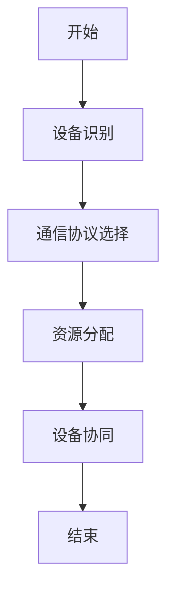
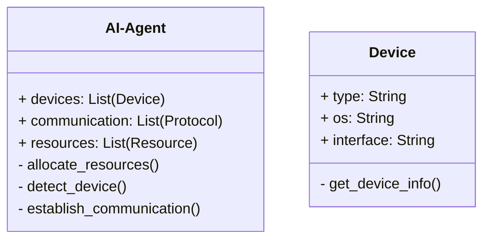

                 


# 企业AI Agent的多设备支持策略：PC到IoT的全覆盖

> 关键词：AI Agent，多设备支持，PC，移动设备，IoT，跨平台

> 摘要：随着企业数字化转型的深入，AI Agent（人工智能代理）在多设备环境中的应用日益广泛。本文深入探讨了企业在PC端、移动端及IoT设备端实现AI Agent多设备支持的策略，从核心概念、算法原理、系统架构到项目实战，为企业构建全覆盖的AI Agent多设备支持体系提供详细指导。

---

# 第1章 企业AI Agent与多设备支持背景

## 1.1 企业AI Agent的概念与特点

### 1.1.1 AI Agent的基本定义

AI Agent（人工智能代理）是一种能够感知环境、自主决策并执行任务的智能实体。在企业场景中，AI Agent通常表现为软件程序或智能系统，能够通过数据输入、环境交互和用户反馈完成特定任务。

**特点：**

1. **自主性**：AI Agent能够在没有人工干预的情况下自主完成任务。
2. **反应性**：能够实时感知环境变化并做出响应。
3. **目标导向**：所有行为均以实现特定目标为导向。
4. **学习能力**：通过数据和反馈不断优化自身的行为模式。

### 1.1.2 企业AI Agent的核心特点

在企业环境中，AI Agent需要具备以下核心特点：

- **高效性**：能够在短时间内处理大量数据并做出决策。
- **可靠性**：在复杂环境中稳定运行，确保任务执行的准确性。
- **可扩展性**：能够适应企业规模的扩展，支持更多设备和场景。
- **安全性**：在多设备环境中确保数据和系统的安全性。

### 1.1.3 多设备支持的必要性

随着企业数字化转型的深入，AI Agent需要支持多种设备，包括PC、移动端和IoT设备。多设备支持不仅能够提高企业的灵活性，还能够提升用户体验和工作效率。

---

## 1.2 多设备环境下的AI Agent挑战

### 1.2.1 设备异构性问题

不同设备的硬件性能、操作系统和接口存在差异，导致AI Agent在不同设备上的实现方式有所不同。例如，PC端的AI Agent需要处理复杂的图形界面和高性能计算，而IoT设备则需要在低功耗环境下运行。

### 1.2.2 跨平台兼容性挑战

AI Agent需要在多种平台上运行，包括Windows、Linux、iOS和Android等。跨平台兼容性问题主要体现在通信协议、API接口和系统架构的设计上。

### 1.2.3 资源受限环境下的优化

IoT设备通常资源有限，AI Agent需要在低功耗和低资源环境下高效运行。这要求AI Agent的设计需要考虑资源分配和优化策略。

---

## 1.3 企业AI Agent的应用场景

### 1.3.1 PC端应用

PC端是企业AI Agent的主要应用环境之一。常见的应用场景包括：

- **智能助手**：帮助用户管理日程、处理邮件和安排会议。
- **数据分析**：在PC端运行复杂的数据分析任务，提供决策支持。
- **自动化工具**：自动化处理重复性任务，如文件整理和数据录入。

### 1.3.2 移动端应用

随着移动办公的普及，AI Agent在移动端的应用越来越重要。常见的应用场景包括：

- **移动办公助手**：在移动端提供日程管理、邮件处理和会议安排功能。
- **移动数据分析**：在移动端实时分析数据，提供决策支持。
- **智能通知**：通过移动端推送通知，提醒用户重要信息。

### 1.3.3 IoT设备应用

IoT设备为企业AI Agent提供了全新的应用场景。常见的应用场景包括：

- **智能监控**：通过IoT设备实时监控环境数据，提供预警和决策支持。
- **智能控制**：通过IoT设备实现远程控制，如智能家电和工业设备。
- **数据采集与分析**：通过IoT设备采集数据，进行实时分析和预测。

---

## 1.4 本章小结

本章主要介绍了企业AI Agent的基本概念、特点及其在多设备环境下的应用。通过分析设备异构性、跨平台兼容性和资源受限环境下的优化问题，为后续章节的设计奠定了基础。

---

# 第2章 多设备支持的核心概念与联系

## 2.1 核心概念原理

### 2.1.1 设备识别与分类

AI Agent需要能够识别不同的设备，并根据设备类型选择合适的处理策略。设备识别主要基于硬件性能、操作系统和接口类型。

### 2.1.2 跨设备通信协议

在多设备环境下，AI Agent需要支持多种通信协议，包括HTTP、WebSocket和MQTT等。通信协议的选择取决于设备类型和应用场景。

### 2.1.3 资源动态分配机制

AI Agent需要根据设备的资源情况动态分配计算资源。例如，在IoT设备上运行轻量级任务，而在PC端运行复杂的计算任务。

---

## 2.2 概念属性特征对比表格

以下是设备类型、通信协议和资源分配策略的核心属性对比：

| 概念       | 属性特征                     |
|------------|------------------------------|
| 设备类型    | 硬件性能、操作系统、接口     |
| 通信协议    | 数据格式、传输方式、安全性   |
| 资源分配    | CPU、内存、存储分配策略     |

---

## 2.3 ER实体关系图

以下是设备与AI Agent的关系图：

```mermaid
er
   actor: 企业AI Agent
    device: 设备
    relation: 支持
    actor -[支持]-> device
```

---

## 2.4 本章小结

本章详细分析了多设备支持的核心概念，包括设备识别、通信协议和资源分配。通过对比表格和ER关系图，进一步明确了设备与AI Agent之间的关系。

---

# 第3章 多设备支持的算法原理

## 3.1 算法原理概述

### 3.1.1 跨设备通信算法

跨设备通信算法主要解决设备之间数据传输的问题。常用的算法包括HTTP轮询和WebSocket长连接。

### 3.1.2 资源动态分配算法

资源动态分配算法根据设备的资源情况动态分配计算任务。常用算法包括负载均衡和资源预留。

### 3.1.3 设备协同算法

设备协同算法通过协调不同设备的行为，实现任务的高效完成。常用算法包括分布式协同和集中式协同。

---

## 3.2 算法流程图

以下是跨设备通信算法的流程图：



---

## 3.3 核心算法实现

以下是跨设备通信算法的Python实现：

```python
def cross_device_communication():
    devices = detect_devices()  # 检测设备
    for device in devices:
        if device.type == 'PC':
            use_HTTP(device)
        elif device.type == 'Mobile':
            use_webSocket(device)
        elif device.type == 'IoT':
            use_MQTT(device)
    return True
```

---

## 3.4 本章小结

本章详细分析了多设备支持的算法原理，包括通信协议选择和资源动态分配。通过流程图和代码实现，进一步明确了算法的设计和实现过程。

---

# 第4章 系统架构与接口设计

## 4.1 系统架构设计

以下是AI Agent的多设备支持系统架构图：


---

## 4.2 系统功能设计

以下是系统的功能模块图：



---

## 4.3 系统接口设计

以下是系统接口设计的示例：

```plaintext
+ 操作：设备识别
- 输入：设备类型
- 输出：设备信息

+ 操作：通信协议选择
- 输入：设备类型
- 输出：通信协议
```

---

## 4.4 本章小结

本章详细分析了系统的架构设计和接口设计，为后续的项目实现奠定了基础。

---

# 第5章 项目实战

## 5.1 环境搭建

以下是项目环境搭建的步骤：

1. **安装Python**：建议使用Python 3.8及以上版本。
2. **安装依赖库**：使用pip安装必要的库，如`paho-mqtt`和`websockets`。
3. **配置设备环境**：确保设备能够连接到服务器。

---

## 5.2 核心实现

以下是AI Agent的核心实现代码：

```python
import paho.mqtt.client as mqtt

def on_connect(client, userdata, flags, rc):
    print("连接到MQTT Broker结果: "+str(rc))
    client.subscribe("iot/devices/#")

def on_message(client, userdata, msg):
    print("收到消息：")
    print(msg.payload.decode())

client = mqtt.Client()
client.on_connect = on_connect
client.on_message = on_message

client.connect("localhost", 1883, 60)
client.loop_start()
```

---

## 5.3 代码应用解读

以上代码实现了MQTT协议的连接和消息订阅功能。通过`on_connect`回调函数，AI Agent能够连接到MQTT Broker并订阅设备主题。`on_message`回调函数用于处理接收到的消息。

---

## 5.4 实际案例分析

以下是AI Agent在IoT设备上的实际案例：

- **设备类型**：智能温控器
- **应用场景**：实时监控室内温度，自动调节空调。
- **实现步骤**：
  1. 设备识别：检测到智能温控器。
  2. 通信协议选择：选择MQTT协议。
  3. 资源分配：分配轻量级计算任务。

---

## 5.5 本章小结

本章通过实际项目案例，详细展示了AI Agent的实现过程。通过环境搭建、代码实现和案例分析，为读者提供了实用的指导。

---

# 第6章 最佳实践与小结

## 6.1 最佳实践 tips

1. **设备识别**：确保设备识别的准确性，避免误识别。
2. **通信协议选择**：根据设备类型选择合适的通信协议。
3. **资源分配**：在资源受限环境中优化资源分配策略。

## 6.2 注意事项

1. **安全性**：确保设备之间的通信安全，防止数据泄露。
2. **兼容性**：在跨平台环境下，确保代码的兼容性。
3. **可扩展性**：设计时考虑未来的设备扩展。

## 6.3 拓展阅读

1. **《设计模式》**：深入理解设计模式在系统架构中的应用。
2. **《RESTful API设计》**：学习RESTful API的设计原则。
3. **《MQTT协议》**：深入理解MQTT协议的工作原理。

---

# 作者：AI天才研究院/AI Genius Institute & 禅与计算机程序设计艺术 /Zen And The Art of Computer Programming

---

以上是《企业AI Agent的多设备支持策略：PC到IoT的全覆盖》的完整目录和内容概览。通过系统化的分析和详细的技术实现，为企业构建多设备支持的AI Agent系统提供了全面的指导。

