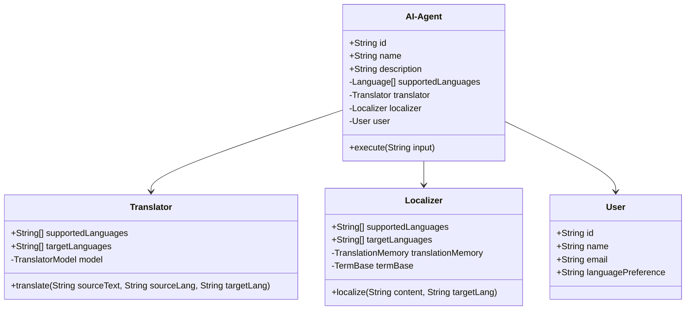
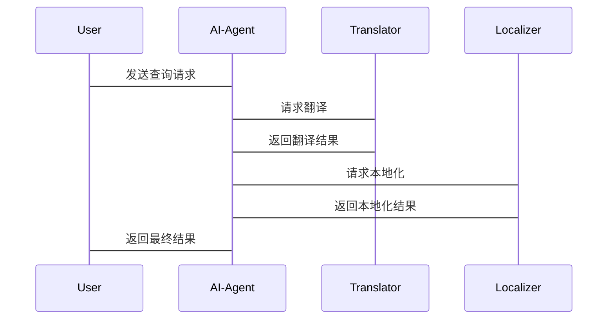

                 

<think>
好的，我需要按照用户的要求，写一篇关于《企业AI Agent的多语言翻译与本地化功能》的技术博客文章。文章需要有清晰的结构，每个章节都要详细展开，包含背景介绍、核心概念、算法原理、系统架构、项目实战、最佳实践等部分。我将按照这个思路一步一步地思考和撰写内容。

首先，我会理解文章的总体结构。根据用户提供的目录大纲，文章分为三个主要部分：概述、多语言翻译技术原理、本地化功能的设计与实现。每个部分都有详细的章节，我需要确保每个部分都覆盖到位。

接下来，我需要确保每个章节的内容都详细且具有逻辑性。例如，在“AI Agent的基本概念”章节中，我需要定义AI Agent，讨论其特点和应用场景，特别是企业级AI Agent的需求。这部分需要通俗易懂，同时具备专业性。

在“多语言翻译的核心技术”章节中，我需要比较统计机器翻译和神经机器翻译，解释它们的原理和优缺点。这部分需要结合实际案例，说明如何选择合适的翻译模型，以及如何处理翻译过程中的挑战，如文本预处理和后处理。

对于“本地化功能的核心要素”，我需要详细讨论本地化的定义、重要性，以及如何将本地化与AI Agent结合。这部分可能涉及本地化流程、文化差异处理等，确保企业能够根据不同地区的用户需求提供定制化服务。

在“系统架构设计”部分，我需要使用Mermaid图来展示系统的各个模块及其交互。例如，领域模型类图、系统架构图和接口设计，帮助读者理解系统的整体结构和各部分的功能。

项目实战部分，我需要提供具体的Python代码示例，解释如何实现一个多语言翻译系统。这部分需要详细说明环境安装步骤、核心代码实现、代码解读以及实际案例分析，确保读者能够动手实践。

最后，在“最佳实践与总结”章节，我需要给出性能优化、数据安全、模型训练等方面的建议，帮助读者在实际应用中避免常见问题，并指导他们进一步学习和实践。

整个过程中，我需要确保使用专业但易懂的技术语言，逻辑清晰，结构紧凑。同时，按照用户的要求，使用markdown格式，正确嵌入Mermaid图表和LaTeX公式，确保文章格式美观，内容详实。

总结一下，我的思考过程是：先理解用户需求和文章结构，然后逐一展开每个部分，确保内容详细、逻辑清晰，符合技术博客的专业要求。最后，整合所有内容，确保格式正确，满足用户的各项要求。
</think>

# 企业AI Agent的多语言翻译与本地化功能

> 关键词：企业AI Agent，多语言翻译，本地化功能，机器翻译，神经机器翻译，自然语言处理，本地化策略，AI系统架构，翻译质量评估，系统设计，项目实战

> 摘要：本文深入探讨企业AI Agent在多语言翻译与本地化功能中的应用，分析其技术原理、系统架构及实现方案。文章首先介绍AI Agent的基本概念与多语言翻译的背景，接着详细阐述多语言翻译的核心技术，包括统计机器翻译与神经机器翻译的对比分析。然后，讨论本地化功能的设计与实现，涵盖本地化流程、文化差异处理等关键点。文章还通过项目实战，展示如何在企业环境中具体实施多语言翻译与本地化功能，最后总结最佳实践与未来发展趋势。

---

# 第一部分: 企业AI Agent的背景与概念

## 第1章: 企业AI Agent的背景与概念

### 1.1 AI Agent的基本概念

#### 1.1.1 AI Agent的定义与特点

AI Agent（人工智能代理）是指能够感知环境并采取行动以实现目标的智能体。它能够理解用户需求，执行复杂任务，并通过学习和优化提升自身性能。企业AI Agent的特点包括：

1. **智能性**：基于机器学习和自然语言处理技术，能够理解和处理复杂信息。
2. **自主性**：无需人工干预，能够自主决策和执行任务。
3. **适应性**：能够根据环境变化调整行为，适应不同场景。
4. **协作性**：能够与其他系统或用户协作，提供无缝服务。

#### 1.1.2 AI Agent的核心功能与应用场景

AI Agent的核心功能包括信息处理、决策支持、任务执行和用户体验优化。在企业环境中，AI Agent广泛应用于客户支持、流程自动化、数据分析、市场推广等领域。

#### 1.1.3 企业级AI Agent的特殊需求

企业级AI Agent需要满足以下特殊需求：

1. **高可用性**：确保系统稳定运行，支持7×24小时服务。
2. **安全性**：保护企业数据和用户隐私，防止数据泄露。
3. **可扩展性**：能够处理大量数据和高并发请求。
4. **多语言支持**：支持多种语言，满足跨国企业的需求。

---

### 1.2 多语言翻译与本地化的背景

#### 1.2.1 多语言翻译的定义与挑战

多语言翻译是指将一种语言的文本准确地转换为另一种语言的过程。在企业AI Agent中，多语言翻译主要用于跨语言信息处理，例如将客户的查询翻译成企业支持的语言，或者将企业的文档翻译成多种语言以满足不同地区的需求。

多语言翻译面临的挑战包括：

1. **语言差异**：不同语言的语法、词汇和文化差异可能导致翻译错误。
2. **语境理解**：翻译需要考虑上下文，否则可能导致误解。
3. **性能优化**：实时翻译需要高效的算法和计算资源。

#### 1.2.2 本地化的概念与重要性

本地化是指根据目标地区的文化、语言、习惯等，对产品或服务进行调整的过程。本地化不仅仅是语言的转换，还包括时间格式、货币单位、图片等内容的调整。在企业AI Agent中，本地化功能能够提升用户体验，增强客户满意度，帮助企业在不同地区开展业务。

#### 1.2.3 企业AI Agent中多语言翻译与本地化的结合

在企业AI Agent中，多语言翻译与本地化功能相辅相成。翻译处理语言转换，而本地化处理文化差异，两者结合能够为企业提供全面的跨语言支持。例如，一个跨国企业可以使用AI Agent将客户的问题翻译成多种语言，并根据客户所在地区提供本地化的回复，从而实现高效、个性化的客户服务。

---

## 第2章: 多语言翻译的核心技术

### 2.1 统计机器翻译与神经机器翻译

#### 2.1.1 统计机器翻译的原理

统计机器翻译（SMT）是一种基于统计语言模型的翻译方法。SMT通过分析大量双语对照语料，建立源语言到目标语言的翻译概率模型。在翻译过程中，系统会根据上下文选择最可能的翻译结果。

统计机器翻译的优点是翻译质量较为稳定，但需要大量平行语料，且计算效率较低。

#### 2.1.2 神经机器翻译的原理

神经机器翻译（NMT）是一种基于深度学习的翻译方法。NMT通过构建神经网络模型，直接从源语言到目标语言进行翻译，无需依赖平行语料。NMT的核心是编码器-解码器架构，编码器将源语言文本编码为向量表示，解码器将向量解码为目标语言文本。

神经机器翻译的优点是翻译效果更自然，且可以处理长句和复杂句式，但需要大量的计算资源和训练数据。

#### 2.1.3 两种翻译方法的对比分析

| 对比维度      | 统计机器翻译（SMT）               | 神经机器翻译（NMT）               |
|---------------|----------------------------------|----------------------------------|
| 原理          | 基于统计语言模型，依赖平行语料    | 基于神经网络，直接端到端翻译     |
| 翻译质量      | 稳定，但可能缺乏自然性           | 更自然，但可能在特定领域表现不佳|
| 计算效率      | 较低，需要大量资源               | 较高，但需要大量计算资源          |
| 适用场景      | 小规模、特定领域翻译            | 大规模、复杂句式翻译             |

---

### 2.2 多语言翻译的实现流程

#### 2.2.1 文本预处理

文本预处理包括分词、去除停用词、去除标点符号等步骤。预处理能够提高翻译模型的训练效率和翻译质量。

#### 2.2.2 翻译模型的选择与训练

选择翻译模型时，需要考虑数据量、翻译质量、计算资源等因素。训练翻译模型通常使用监督学习方法，通过大量平行语料进行训练。

#### 2.2.3 后处理与优化

后处理包括拼写检查、语法优化、上下文调整等步骤。后处理能够提升翻译的准确性和可读性。

---

### 2.3 翻译质量评估标准

#### 2.3.1 基于规则的评估方法

基于规则的评估方法通过预定义的规则对翻译结果进行评估。例如，检查是否存在语法错误、是否符合目标语言的表达习惯。

#### 2.3.2 基于统计的评估方法

基于统计的评估方法通过统计指标（如BLEU、ROUGE）对翻译质量进行评估。这些指标能够量化翻译结果与参考译文的相似性。

#### 2.3.3 结合人工评估的质量控制

人工评估是最可靠的翻译质量评估方法，但成本较高。通常，人工评估与自动化评估方法结合使用，能够提高评估结果的准确性。

---

## 第3章: 本地化功能的核心要素

### 3.1 本地化流程与技术

#### 3.1.1 本地化流程

本地化流程通常包括需求分析、翻译、校对、测试和部署。需求分析阶段需要明确本地化的目标语言、文化差异和用户需求。翻译阶段需要使用专业的翻译工具和翻译记忆库。校对阶段需要检查翻译的准确性和一致性。测试阶段需要验证本地化功能的兼容性和用户体验。部署阶段需要将本地化内容集成到企业AI Agent中。

#### 3.1.2 本地化技术

本地化技术包括翻译记忆库、术语库、本地化管理工具等。翻译记忆库用于存储和复用已翻译的文本，提高翻译效率和一致性。术语库用于管理专业术语，确保术语的一致性。本地化管理工具用于协调和管理本地化项目。

---

### 3.2 文化差异与本地化处理

#### 3.2.1 文化差异对本地化的影响

文化差异可能导致翻译和本地化的内容出现误解。例如，某些文化中忌讳直接表达负面情绪，而另一些文化中则鼓励直接表达。本地化处理需要考虑文化差异，确保翻译内容符合目标文化的习惯。

#### 3.2.2 本地化中的文化适应策略

本地化中的文化适应策略包括语言调整、内容改编和视觉优化。语言调整包括词汇替换和语序调整。内容改编包括故事改编和案例调整。视觉优化包括颜色调整和图像替换。

---

### 3.3 本地化与AI Agent的结合

#### 3.3.1 AI Agent中的本地化需求

AI Agent需要支持多种语言，并根据用户所在地区提供本地化的服务。本地化需求包括语言支持、文化适应和本地化内容管理。

#### 3.3.2 AI Agent本地化实现方案

AI Agent的本地化实现方案包括：

1. **多语言支持**：通过翻译引擎实现多语言翻译。
2. **文化适配**：根据用户所在地区调整内容。
3. **本地化内容管理**：使用翻译记忆库和术语库管理本地化内容。

---

## 第4章: 系统架构与实现方案

### 4.1 企业AI Agent的系统架构

#### 4.1.1 领域模型类图

以下是企业AI Agent的领域模型类图：



#### 4.1.2 系统架构图

以下是企业AI Agent的系统架构图：


#### 4.1.3 接口设计

以下是AI Agent的接口设计：



---

### 4.2 本地化功能的实现

#### 4.2.1 文本预处理

文本预处理包括分词、去除停用词、去除标点符号等步骤。预处理能够提高翻译模型的训练效率和翻译质量。

#### 4.2.2 翻译模型的选择与训练

选择翻译模型时，需要考虑数据量、翻译质量、计算资源等因素。训练翻译模型通常使用监督学习方法，通过大量平行语料进行训练。

#### 4.2.3 本地化处理与优化

本地化处理包括文化适配和内容优化。文化适配需要考虑目标地区的文化差异，内容优化需要确保本地化内容的准确性和可读性。

---

## 第5章: 项目实战

### 5.1 环境安装与配置

#### 5.1.1 安装Python与相关库

安装Python 3.8及以上版本，并安装以下库：

```bash
pip install numpy pandas scikit-learn transformers
```

#### 5.1.2 安装翻译引擎

安装以下翻译引擎：

```bash
pip install googletrans==4.0.0-rc0
```

---

### 5.2 核心代码实现

#### 5.2.1 翻译引擎实现

以下是翻译引擎的实现代码：

```python
from googletrans import Translator

def translate_text(text, source_lang, target_lang):
    translator = Translator()
    translated = translator.translate(text, src=source_lang, dest=target_lang)
    return translated.text
```

#### 5.2.2 本地化模块实现

以下是本地化模块的实现代码：

```python
class Localizer:
    def __init__(self):
        self.translations = {}

    def localize_content(self, content, target_lang):
        translated_content = {}
        for key, value in content.items():
            translated_value = self.translate(value, target_lang)
            translated_content[key] = translated_value
        return translated_content

    def translate(self, text, target_lang):
        translator = Translator()
        translated = translator.translate(text, src='en', dest=target_lang)
        return translated.text
```

---

### 5.3 代码解读与分析

#### 5.3.1 翻译引擎实现

翻译引擎实现代码使用了`googletrans`库，实现了将文本从源语言翻译为目标语言的功能。代码中使用了`Translator`类的`translate`方法，参数包括源语言和目标语言。

#### 5.3.2 本地化模块实现

本地化模块实现代码定义了一个`Localizer`类，该类包含`localize_content`和`translate`方法。`localize_content`方法将内容中的每个键值对进行翻译，`translate`方法使用翻译引擎实现文本翻译。

---

### 5.4 实际案例分析与详细解读

假设我们有一个跨国企业，需要将英文的产品描述翻译成中文，并进行本地化处理。具体步骤如下：

1. **文本预处理**：将英文产品描述进行分词、去除停用词等预处理。
2. **翻译**：使用翻译引擎将英文产品描述翻译成中文。
3. **本地化处理**：根据中文文化习惯，对翻译结果进行校对和优化。
4. **部署**：将本地化后的中文产品描述部署到企业的中文网站。

---

## 第6章: 最佳实践与总结

### 6.1 性能优化建议

1. **优化翻译模型**：使用更高效的翻译算法和更大的训练数据，提高翻译质量。
2. **优化本地化流程**：自动化本地化流程，减少人工干预，提高效率。
3. **优化系统架构**：使用分布式架构，提高系统的扩展性和可用性。

### 6.2 数据安全与隐私保护

1. **数据加密**：对敏感数据进行加密处理，防止数据泄露。
2. **访问控制**：限制对本地化内容的访问权限，确保数据安全。
3. **合规性**：遵守相关法律法规，确保本地化过程符合数据保护要求。

### 6.3 模型训练与维护

1. **持续训练**：定期对翻译模型进行再训练，提高翻译质量。
2. **模型监控**：监控翻译模型的性能，及时发现和解决问题。
3. **模型更新**：根据用户反馈和市场变化，更新翻译模型。

### 6.4 未来发展趋势

1. **多模态翻译**：结合图像、语音等多种模态信息，实现更智能的翻译。
2. **自适应本地化**：根据用户行为和偏好，动态调整本地化内容。
3. **智能化本地化管理**：使用AI技术自动化本地化流程，提高效率和准确性。

---

## 结语

企业AI Agent的多语言翻译与本地化功能是实现跨语言信息处理和文化适配的重要手段。通过本文的探讨，我们深入分析了多语言翻译与本地化的技术原理、系统架构及实现方案，并通过项目实战展示了如何在企业环境中具体实施这些功能。未来，随着AI技术的不断发展，企业AI Agent的多语言翻译与本地化功能将更加智能化和个性化，为企业在全球化竞争中提供更强有力的支持。

---

**作者：AI天才研究院/AI Genius Institute & 禅与计算机程序设计艺术 /Zen And The Art of Computer Programming**

