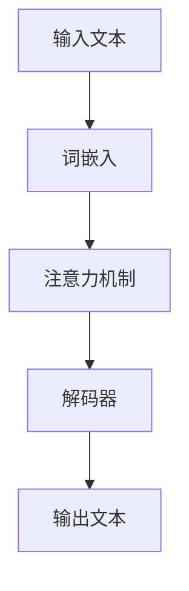

                 


```markdown
# 企业AI Agent的多语言翻译与本地化功能实现

> 关键词：AI Agent，多语言翻译，本地化，自然语言处理，系统架构

> 摘要：本文详细探讨了企业AI Agent实现多语言翻译与本地化功能的核心概念、算法原理、系统架构设计及项目实战。通过对多语言翻译与本地化的必要性、实现原理、系统架构的分析，结合实际案例，为读者提供全面的技术指导。

---

## 第一部分：背景介绍

### 第1章：问题背景与需求分析

#### 1.1 多语言翻译的必要性

##### 1.1.1 全球化背景下的语言障碍
在现代企业中，全球化是不可忽视的趋势。企业需要与来自不同国家和地区的客户、合作伙伴进行交流。语言障碍可能导致信息传递不准确，影响业务开展。因此，多语言翻译成为企业级应用的必备功能。

##### 1.1.2 企业级应用中的多语言需求
企业级应用通常需要支持多种语言，以满足不同用户的使用习惯。例如，跨国企业的内部系统可能需要支持英语、中文、西班牙语等多种语言。

##### 1.1.3 AI Agent在多语言翻译中的角色
AI Agent作为智能化的交互界面，能够自动识别用户语言并提供相应的翻译服务。这不仅提升了用户体验，还降低了人工成本。

#### 1.2 本地化功能的核心价值

##### 1.2.1 本地化的定义与目标
本地化不仅仅是语言的转换，还包括文化、日期、货币等的适配。目标是让用户在使用系统时，感受到与母语相同的体验。

##### 1.2.2 本地化在企业中的应用场景
例如，跨国企业的CRM系统需要根据用户的地区显示相应的日期格式和货币单位。

##### 1.2.3 本地化与多语言翻译的关系
本地化是多语言翻译的延伸，确保翻译后的文本不仅语法正确，还符合目标文化的习惯。

#### 1.3 问题解决与边界定义

##### 1.3.1 多语言翻译的主要挑战
- 不同语言的语法结构差异。
- 翻译模型的训练数据质量。
- 翻译性能的优化。

##### 1.3.2 本地化实现的关键问题
- 文化差异的处理。
- 本地化数据的动态更新。
- 多线程环境下的高效处理。

##### 1.3.3 功能边界与外延
明确多语言翻译与本地化的功能边界，例如翻译功能仅处理文本，本地化功能处理文化适配。

### 第2章：核心概念与系统架构

#### 2.1 AI Agent的定义与特征

##### 2.1.1 AI Agent的基本概念
AI Agent是一种智能体，能够感知环境并采取行动以实现目标。例如，智能助手、聊天机器人等。

##### 2.1.2 AI Agent的核心属性
- 自主性：能够自主决策。
- 反应性：能实时感知并响应环境变化。
- 社交能力：能与其他系统或用户交互。

##### 2.1.3 AI Agent的分类与应用场景
- 软件Agent：如聊天机器人。
- 硬件Agent：如智能家居设备。

#### 2.2 多语言翻译与本地化的概念对比

##### 2.2.1 多语言翻译的实现原理
基于自然语言处理技术，将源语言文本转换为目标语言文本。

##### 2.2.2 本地化的实现方法
根据目标地区的文化、习惯调整内容，例如日期格式、货币符号。

##### 2.2.3 两者在企业中的协同作用
翻译解决语言障碍，本地化提升用户体验，两者结合使企业在全球化市场更具竞争力。

#### 2.3 系统架构的ER实体关系图

```mermaid
erDiagram
    actor 用户 {
        <属性> 用户ID
        <属性> 语言偏好
        <属性> 地区设置
    }
    class 翻译模块 {
        <属性> 源语言
        <属性> 目标语言
        <属性> 翻译内容
    }
    class 本地化模块 {
        <属性> 地区代码
        <属性> 文化格式
        <属性> 本地化内容
    }
    用户 --> 翻译模块 : 请求翻译
    用户 --> 本地化模块 : 请求本地化
```

---

## 第二部分：算法原理

### 第3章：多语言翻译与本地化的算法原理

#### 3.1 翻译算法的数学模型

##### 3.1.1 模型的选择
基于Transformer的模型，如BERT、GPT等，具有优秀的翻译性能。

##### 3.1.2 注意力机制


##### 3.1.3 解码器
解码器负责将编码器的输出转换为目标语言的文本。

#### 3.2 本地化算法的实现

##### 3.2.1 文化敏感性处理
根据用户所在地区的文化习惯，调整显示内容。

##### 3.2.2 NLP技术应用
利用自然语言处理技术优化本地化效果，例如情感分析、实体识别。

##### 3.2.3 机器学习模型
使用机器学习模型进行本地化的预测和优化。

---

## 第三部分：系统架构设计

### 第4章：系统架构与接口设计

#### 4.1 系统功能模块设计

##### 4.1.1 翻译模块
负责接收输入文本，选择源语言和目标语言，调用翻译API。

##### 4.1.2 本地化模块
根据用户的地区和语言偏好，调整内容的文化格式。

##### 4.1.3 管理模块
管理用户偏好、语言对支持情况等。

#### 4.2 系统架构图

```mermaid
graph TD
    用户 --> 翻译模块 : 请求翻译
    翻译模块 --> 翻译API : 调用翻译服务
    用户 --> 本地化模块 : 请求本地化
    本地化模块 --> 本地化数据 : 获取文化数据
```

---

## 第四部分：项目实战

### 第5章：项目实战与案例分析

#### 5.1 环境安装与配置

##### 5.1.1 安装Python和库
```bash
pip install tensorflow keras transformers
```

##### 5.1.2 安装翻译API
使用Google Cloud Translation API或百度翻译API。

#### 5.2 核心代码实现

##### 5.2.1 加载模型
```python
import tensorflow as tf
from transformers import *
```

##### 5.2.2 翻译函数
```python
def translate(text, src_lang, tgt_lang):
    # 具体实现
```

#### 5.3 案例分析
具体案例展示系统的运行过程。

---

## 第五部分：最佳实践

### 第6章：最佳实践与小结

#### 6.1 小结
总结文章内容，强调关键点。

#### 6.2 注意事项
提醒读者在实际应用中需要注意的问题。

#### 6.3 拓展阅读
推荐相关的书籍和资源。

---

作者：AI天才研究院/AI Genius Institute & 禅与计算机程序设计艺术 /Zen And The Art of Computer Programming
```

