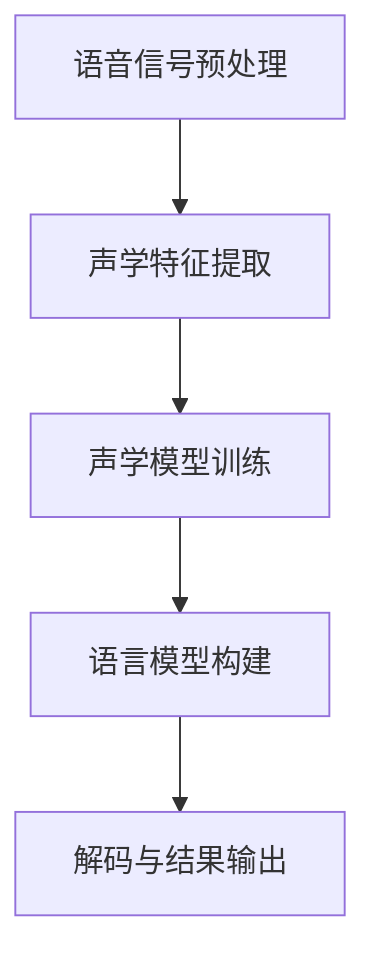
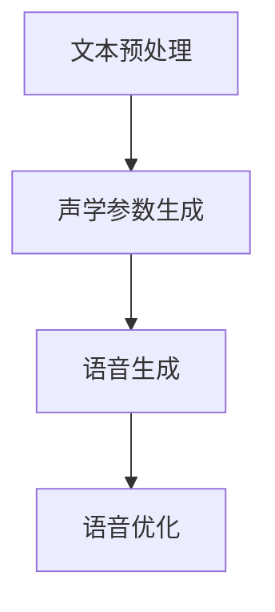
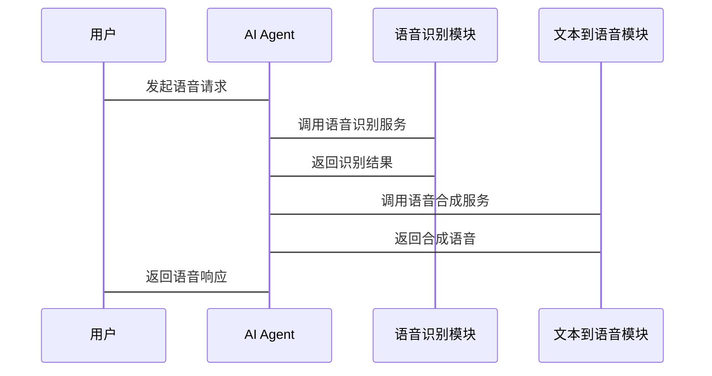

                 


# 企业AI Agent的多语言语音识别与合成技术

> 关键词：企业AI Agent，多语言语音识别，语音合成，自然语言处理，机器学习

> 摘要：随着全球化进程的加速，多语言支持在企业AI Agent中的重要性日益凸显。本文详细探讨了多语言语音识别与合成技术的核心概念、算法原理、系统架构及实际应用，为企业开发者和技术人员提供了理论与实践相结合的深度解析。

---

## 第1章: AI Agent与多语言语音技术的背景介绍

### 1.1 AI Agent的基本概念与特点
AI Agent是一种智能体，能够感知环境、自主决策并执行任务。企业AI Agent广泛应用于客服、智能助手、内部管理等领域，其核心特点包括：

- **自主性**：无需人工干预，自动执行任务。
- **反应性**：实时感知环境并做出反应。
- **社交能力**：与用户或其他系统进行交互。
- **学习能力**：通过数据优化自身性能。

### 1.2 多语言语音技术的重要性
在全球化背景下，支持多种语言的语音技术对企业AI Agent至关重要：

- **用户体验提升**：满足不同语言背景用户的需求。
- **市场拓展**：帮助企业服务全球客户。
- **效率优化**：通过多语言支持减少沟通障碍。

### 1.3 企业AI Agent的多语言语音技术背景
企业AI Agent在多语言语音技术中的应用面临诸多挑战，如语音信号处理、模型训练和语言理解的复杂性。本文将从背景、原理、算法、系统架构等多个维度展开分析。

---

## 第2章: 多语言语音识别与合成的核心概念与联系

### 2.1 多语言语音识别技术原理
语音识别涉及将语音信号转换为文本，关键步骤包括：

- **语音信号预处理**：降噪、分割、特征提取。
- **声学模型训练**：基于深度学习模型（如循环神经网络）训练声学特征。
- **语言模型构建**：利用语言模型（如n-gram模型或Transformer）提升识别准确率。

### 2.2 多语言语音合成技术原理
语音合成是将文本转换为语音的过程，主要步骤包括：

- **文本预处理**：分词、语法分析、情感识别。
- **声学参数生成**：基于文本生成声学参数（如音调、音速）。
- **语音生成**：使用生成模型（如Wavenet、Tacotron）生成语音。

### 2.3 核心概念对比与ER实体关系图
通过对比分析，可以清晰理解多语言语音识别与合成的异同：

| **特性**       | **语音识别**               | **语音合成**               |
|----------------|----------------------------|----------------------------|
| **输入**       | 语音信号                   | 文本                       |
| **输出**       | 文本                       | 语音信号                   |
| **核心技术**    | 声学模型、语言模型         | 文本到语音模型             |
| **挑战**       | 多语种适应、噪声处理       | 多语种语音生成、自然流畅   |

ER实体关系图展示了数据流与组件之间的关系，帮助理解系统的整体架构。

```mermaid
er
    %% 企业AI Agent多语言语音识别与合成技术 ER 图
    client_user [客户用户] 
    --[发起语音请求]--> agent
    agent [AI Agent]
    --[接收语音信号]--> voice_recognition [语音识别模块]
    --[接收文本]--> text_to_speech [文本到语音模块]
    voice_recognition --[输出文本]--> language_model [语言模型]
    text_to_speech --[输出语音信号]--> voice_synthesis [语音合成模块]
```

---

## 第3章: 多语言语音识别与合成的算法原理

### 3.1 语音识别算法流程
语音识别的流程可以分为以下几个步骤：



- **语音信号预处理**：降噪处理，确保语音质量。
- **声学特征提取**：提取梅尔频率倒谱系数（MFCC）。
- **声学模型训练**：使用深度学习模型（如Transformer）训练声学特征。
- **语言模型构建**：构建语言模型以提高识别准确率。
- **解码与结果输出**：将声学结果与语言模型结合，输出最终文本。

### 3.2 语音合成算法流程
语音合成的过程可以分为以下几个步骤：



- **文本预处理**：分词、句法分析、情感分析。
- **声学参数生成**：生成音调、音速等参数。
- **语音生成**：使用生成模型（如Wavenet）生成语音。
- **语音优化**：优化生成语音的流畅性和自然度。

### 3.3 算法原理的数学模型与公式
#### 语音信号处理的数学模型
语音信号可以用以下数学模型表示：
$$x(t) = \sum_{n=-\infty}^{\infty} x[n] \delta(t-nT)$$

其中，$x[n]$是离散信号，$\delta(t-nT)$是狄拉克函数。

#### 声学模型的训练公式
声学模型的训练目标是最小化预测值与真实值的误差，公式如下：
$$L = -\sum_{i=1}^{N} \log P(x_i| \theta)$$

其中，$x_i$是输入样本，$\theta$是模型参数。

#### 语言模型的概率计算
语言模型计算文本的概率，公式如下：
$$P(s) = \prod_{i=1}^{n} P(s_i|s_{i-1})$$

其中，$s_i$是第i个词，$s_{i-1}$是前一个词。

---

## 第4章: 系统分析与架构设计

### 4.1 问题场景介绍
企业AI Agent需要支持多语言语音交互，应用场景包括客服系统、智能助手、内部协作工具等。典型场景包括：

- **多语言客服支持**：支持多种语言的语音查询和反馈。
- **跨团队协作**：支持内部员工使用不同语言进行交流。
- **智能助手功能**：支持多语言语音指令和对话。

### 4.2 系统功能设计
系统功能模块包括：

- **语音识别模块**：实现多语言语音识别。
- **文本到语音模块**：实现多语言语音合成。
- **语言模型模块**：提供多语言支持的语言模型。
- **交互界面模块**：提供用户与AI Agent交互的界面。

### 4.3 系统架构设计
系统架构采用分层设计，主要包括数据层、业务逻辑层和表现层。

```mermaid
classDiagram
    class 数据层 {
        +数据库连接
        +数据模型
        -数据操作接口
    }
    class 业务逻辑层 {
        +语音识别服务
        +文本到语音服务
        -服务接口
    }
    class 表现层 {
        +HTTP接口
        +API文档
    }
    数据层 <--| 业务逻辑层 |--> 表现层
```

### 4.4 系统接口设计
系统接口设计包括：

- **语音识别接口**：提供REST API，支持多种语言的语音识别。
- **语音合成接口**：提供REST API，支持多种语言的语音合成。
- **语言模型接口**：提供语言模型的训练和调用接口。

### 4.5 系统交互流程
系统交互流程可以分为以下几个步骤：



---

## 第5章: 项目实战

### 5.1 环境安装
项目实战需要以下环境：

- **Python 3.8+**
- **TensorFlow 2.0+**
- **PyTorch 1.9+**
- **Librosa**
- **pydub**

### 5.2 核心代码实现

#### 5.2.1 语音识别代码示例
```python
import librosa
import numpy as np

def extract_features(audio_path):
    audio, sr = librosa.load(audio_path, sr=None)
    features = librosa.feature.mfcc(y=audio, sr=sr, n_mfcc=13)
    return features.T

# 示例用法
features = extract_features("audio.wav")
print(features.shape)
```

#### 5.2.2 语音合成代码示例
```python
import torch
import torchaudio

def synthesize_speech(text, language='zh'):
    model = torch.hub.load('pytorch/fairseq', 'wav2vec2')
    inputs = text
    features = model.feature_extractor(inputs)
    logits = model.decoder(features)
    outputs = model.lm_head(logits)
    return outputs
```

### 5.3 案例分析与实现解读
以中文和英文语音合成为例，展示如何训练一个多语言语音合成模型。代码示例如下：

```python
def train_model(train_loader, val_loader, num_epochs=10):
    model.train()
    for epoch in range(num_epochs):
        for batch_idx, (inputs, targets) in enumerate(train_loader):
            optimizer.zero_grad()
            outputs = model(inputs)
            loss = criterion(outputs, targets)
            loss.backward()
            optimizer.step()
        # 验证阶段
        val_loss = 0
        for batch_idx, (inputs, targets) in enumerate(val_loader):
            outputs = model(inputs)
            loss = criterion(outputs, targets)
            val_loss += loss.item()
        avg_val_loss = val_loss / len(val_loader)
        print(f"Epoch {epoch+1}, Val Loss: {avg_val_loss}")
```

### 5.4 项目小结
通过项目实战，我们掌握了多语言语音识别与合成技术的实现方法，理解了实际应用中的注意事项和优化技巧。

---

## 第6章: 最佳实践与小结

### 6.1 最佳实践 tips
- **数据多样性**：确保训练数据涵盖多种语言和场景。
- **模型优化**：使用数据增强和模型调优提升性能。
- **性能监控**：实时监控系统性能，及时发现和解决问题。

### 6.2 小结
本文从背景、原理、算法、系统架构和项目实战等多个维度，详细探讨了企业AI Agent的多语言语音识别与合成技术。通过理论与实践的结合，读者可以掌握核心技术并应用于实际场景。

### 6.3 注意事项
- **数据隐私**：确保数据处理符合隐私保护法规。
- **模型泛化能力**：避免过拟合，提升模型的泛化能力。
- **系统稳定性**：确保系统在高并发场景下的稳定性。

### 6.4 拓展阅读
- 推荐阅读《Deep Learning》（Ian Goodfellow著）了解深度学习基础知识。
- 关注GitHub上的开源项目，如[OpenAI Whisper](https://github.com/openai/whisper)。

---

## 作者：AI天才研究院 & 禅与计算机程序设计艺术

感谢您的阅读！如需进一步了解，请关注我们的官方网站或联系技术支持。

