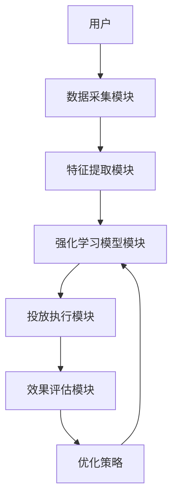

                 


```markdown
# 企业AI Agent的强化学习在广告投放优化中的应用

## 关键词：强化学习，广告优化，AI Agent，广告投放，机器学习

## 摘要：本文深入探讨了企业AI Agent在广告投放优化中的应用，特别是强化学习的作用。通过详细分析强化学习的算法原理、广告优化的核心概念，结合实际系统架构设计和项目实战，为读者提供全面的理论和实践指导。

---

# 第一部分: 企业AI Agent的强化学习在广告投放优化中的应用

---

# 第1章: 强化学习与广告投放优化背景

## 1.1 强化学习的基本概念

### 1.1.1 强化学习的定义与特点

- **定义**: 强化学习是一种机器学习范式，通过智能体与环境的交互，学习最优策略以最大化累积奖励。
- **特点**: 数据驱动、在线学习、策略优化、奖励驱动。

### 1.1.2 强化学习的核心要素

- **状态空间 (State Space)**: 表示智能体所处的环境状态。
- **动作空间 (Action Space)**: 智能体可执行的动作集合。
- **奖励函数 (Reward Function)**: 指导智能体行为的反馈机制。
- **策略 (Policy)**: 定义智能体在给定状态下的动作选择概率。

### 1.1.3 强化学习与监督学习的区别

| 特性      | 监督学习                | 强化学习                |
|-----------|------------------------|-------------------------|
| 数据来源  | 标签数据                | 环境反馈                |
| 反馈机制  | 确定性输出              | 奖励信号                |
| 应用场景  | 分类、回归              | 控制、游戏、机器人        |

## 1.2 广告投放优化的背景与挑战

### 1.2.1 广告投放的基本流程

1. **需求分析**: 明确广告目标，如提升点击率、转化率或品牌曝光。
2. **数据收集**: 收集用户行为数据，如点击、浏览、购买等。
3. **特征提取**: 从数据中提取有用的特征，如用户 demographics、行为特征等。
4. **策略选择**: 根据特征选择合适的广告策略。
5. **广告投放**: 执行广告投放并收集反馈。
6. **效果评估**: 评估广告效果并优化策略。

### 1.2.2 广告投放优化的难点

- **多目标优化**: 广告投放通常需要同时优化多个目标，如点击率和转化率。
- **动态环境**: 用户行为和市场环境不断变化，需要实时调整策略。
- **数据稀疏性**: 部分用户行为数据较少，导致模型训练困难。

### 1.2.3 强化学习在广告优化中的优势

- **实时决策**: 强化学习可以实时根据环境反馈调整策略。
- **多目标优化**: 通过奖励函数设计，强化学习可以同时优化多个目标。
- **自适应能力**: 强化学习能够适应动态变化的环境。

## 1.3 AI Agent在广告投放中的作用

### 1.3.1 AI Agent的定义与特点

- **定义**: AI Agent是一种智能体，能够感知环境并采取行动以实现目标。
- **特点**: 智能性、自主性、反应性、社交能力。

### 1.3.2 AI Agent在广告投放中的应用场景

- **实时决策**: AI Agent实时分析用户行为并做出投放决策。
- **个性化推荐**: 根据用户特征推荐个性化广告内容。
- **动态优化**: 根据实时反馈优化广告策略。

### 1.3.3 AI Agent与传统广告优化方法的对比

| 特性         | 传统优化方法         | AI Agent优化方法        |
|--------------|----------------------|-------------------------|
| 决策速度     | 离线、周期性          | 实时、连续               |
| 决策依据     | 历史数据             | 实时反馈                |
| 决策能力     | 依赖预定义规则        | 自主学习优化策略        |

## 1.4 本章小结

本章介绍了强化学习的基本概念、广告投放优化的背景与挑战，以及AI Agent在广告投放中的作用。通过对比分析，展示了强化学习在广告优化中的独特优势。

---

# 第2章: 强化学习算法原理

## 2.1 强化学习的核心算法

### 2.1.1 Q-Learning算法

- **核心思想**: 通过学习状态-动作对的Q值，找到最优策略。
- **公式**: 
  $$ Q(s, a) = Q(s, a) + \alpha [r + \gamma \max Q(s', a') - Q(s, a)] $$
  其中，α是学习率，γ是折扣因子。

### 2.1.2 Deep Q-Networks (DQN)算法

- **核心思想**: 使用深度神经网络近似Q值函数，解决高维状态空间问题。
- **优势**: 处理复杂状态空间的能力更强。

### 2.1.3 Policy Gradient方法

- **核心思想**: 直接优化策略，通过梯度上升方法更新参数。
- **公式**: 
  $$ \theta = \theta + \alpha \nabla_\theta J(\theta) $$
  其中，J(θ)是策略的优化目标函数。

## 2.2 强化学习的数学模型

### 2.2.1 状态空间与动作空间

- **状态空间**: S = {s₁, s₂, ..., sₙ}，表示环境状态。
- **动作空间**: A = {a₁, a₂, ..., aₘ}，表示智能体可执行的动作。

### 2.2.2 奖励函数的设计

- **设计原则**: 奖励函数应明确指导智能体的行为，避免模糊性。
- **示例**: 点击广告奖励+1，未点击奖励-0.1。

### 2.2.3 动作价值函数(Q-value)的计算

- **公式**: 
  $$ Q(s, a) = \sum_{i=1}^n w_i x_i $$
  其中，w_i是权重，x_i是特征向量。

## 2.3 强化学习的训练过程

### 2.3.1 状态-动作-奖励的循环

1. **感知环境**: 获取当前状态s。
2. **选择动作**: 根据策略选择动作a。
3. **执行动作**: 执行动作a，观察奖励r和新状态s'。
4. **更新模型**: 根据奖励更新Q值或策略参数。

### 2.3.2 策略更新与优化

- **策略更新**: 根据奖励信号调整策略参数，使累积奖励最大化。
- **优化方法**: 使用梯度下降或上升方法优化模型参数。

### 2.3.3 探索与利用的平衡

- **探索**: 尝试新动作，避免陷入局部最优。
- **利用**: 根据当前知识选择最优动作。
- **平衡方法**: 使用ε-greedy策略，即以概率ε选择随机动作，以概率1-ε选择最优动作。

## 2.4 本章小结

本章详细介绍了强化学习的核心算法，包括Q-Learning、DQN和Policy Gradient方法，并分析了其数学模型和训练过程。

---

# 第3章: 广告投放优化的强化学习模型

## 3.1 广告投放优化的强化学习模型

### 3.1.1 广告投放优化的强化学习模型框架

- **状态空间**: 用户特征、广告内容、时间信息等。
- **动作空间**: 选择投放的广告内容、调整投放预算等。
- **奖励函数**: 点击率、转化率、收益等。

### 3.1.2 广告投放优化的强化学习模型设计

1. **特征提取**: 从用户行为数据中提取特征，如用户年龄、性别、浏览历史等。
2. **状态表示**: 将特征转换为状态向量。
3. **动作选择**: 根据当前状态选择最优动作。
4. **奖励计算**: 根据广告效果计算奖励。

### 3.1.3 广告投放优化的强化学习模型实现

- **实现步骤**:
  1. 数据预处理：清洗和归一化数据。
  2. 模型训练：使用强化学习算法训练模型。
  3. 模型部署：将模型部署到广告投放系统中。
  4. 模型优化：根据反馈持续优化模型。

## 3.2 广告投放优化的强化学习模型训练

### 3.2.1 训练数据准备

- **数据来源**: 用户行为数据、广告点击数据等。
- **数据格式**: 结构化数据，包含用户特征、广告内容、点击情况等。

### 3.2.2 训练过程

1. **初始化**: 初始化模型参数和Q值。
2. **交互循环**: 在线与离线交替训练，更新模型参数。
3. **奖励反馈**: 根据广告效果更新奖励函数。

### 3.2.3 模型评估

- **评估指标**: 点击率、转化率、收益等。
- **评估方法**: A/B测试，对比传统方法和强化学习方法的效果。

## 3.3 广告投放优化的强化学习模型优化

### 3.3.1 模型优化策略

- **超参数调整**: 调整学习率、折扣因子等参数。
- **网络架构优化**: 改进神经网络结构，如加入注意力机制。
- **经验回放**: 使用经验回放减少样本偏差。

### 3.3.2 模型优化效果

- **点击率提升**: 通过优化策略，提升广告点击率。
- **转化率提高**: 通过精准投放，提高广告转化率。
- **收益增加**: 通过最大化收益，实现广告投放收益最大化。

## 3.4 本章小结

本章详细介绍了广告投放优化的强化学习模型，包括模型框架、训练过程、优化策略等，并分析了其优化效果。

---

# 第4章: 广告投放优化系统的架构设计

## 4.1 广告投放优化系统的设计目标

- **目标**: 实现基于强化学习的广告投放优化，提升广告效果和收益。

## 4.2 系统功能模块设计

### 4.2.1 数据采集模块

- **功能**: 采集用户行为数据、广告点击数据等。
- **输入**: 用户特征、广告内容、点击情况等。
- **输出**: 结构化的数据，供后续模块使用。

### 4.2.2 特征提取模块

- **功能**: 从原始数据中提取有用的特征，如用户年龄、性别、浏览历史等。
- **输入**: 原始数据。
- **输出**: 特征向量。

### 4.2.3 强化学习模型模块

- **功能**: 实现强化学习算法，进行广告投放决策。
- **输入**: 用户特征、广告内容等。
- **输出**: 投放动作、奖励反馈。

### 4.2.4 投放执行模块

- **功能**: 执行广告投放，记录广告效果数据。
- **输入**: 投放决策。
- **输出**: 广告点击数据、转化数据等。

### 4.2.5 效果评估模块

- **功能**: 评估广告投放效果，计算评估指标。
- **输入**: 广告效果数据。
- **输出**: 评估结果，如点击率、转化率等。

## 4.3 系统架构设计

### 4.3.1 系统架构图



### 4.3.2 系统接口设计

- **接口1**: 数据采集模块接口，接收用户行为数据。
- **接口2**: 强化学习模型模块接口，接收用户特征和广告内容，返回投放决策。
- **接口3**: 投放执行模块接口，执行广告投放并返回效果数据。

### 4.3.3 系统交互流程

1. 用户访问网站或应用，触发数据采集模块采集数据。
2. 数据采集模块将数据传递给特征提取模块，提取用户特征。
3. 特征提取模块将特征传递给强化学习模型模块，进行决策。
4. 强化学习模型模块根据特征选择广告内容，传递给投放执行模块。
5. 投放执行模块执行广告投放，记录广告效果数据。
6. 效果评估模块评估广告效果，返回结果。
7. 根据评估结果优化策略，继续进行广告投放。

## 4.4 本章小结

本章详细描述了广告投放优化系统的架构设计，包括功能模块设计、系统架构图、接口设计和交互流程。

---

# 第5章: 广告投放优化系统的实现

## 5.1 环境安装与配置

### 5.1.1 环境要求

- **操作系统**: Linux/Windows/MacOS。
- **Python版本**: Python 3.6以上。
- **依赖库**: TensorFlow、Keras、OpenAI Gym等。

### 5.1.2 安装步骤

1. 安装Python。
2. 安装必要的依赖库：
   ```bash
   pip install numpy pandas tensorflow gym
   ```

## 5.2 系统核心实现

### 5.2.1 强化学习模型实现

#### 5.2.1.1 Q-Learning算法实现

```python
import numpy as np

class QLearning:
    def __init__(self, state_space_size, action_space_size):
        self.q_table = np.zeros((state_space_size, action_space_size))
    
    def choose_action(self, state, epsilon):
        if np.random.random() < epsilon:
            return np.random.randint(0, action_space_size)
        else:
            return np.argmax(self.q_table[state])
    
    def update_q_table(self, state, action, reward, next_state, alpha, gamma):
        self.q_table[state][action] = self.q_table[state][action] + alpha * (reward + gamma * np.max(self.q_table[next_state]) - self.q_table[state][action])
```

#### 5.2.1.2 DQN算法实现

```python
import tensorflow as tf
from tensorflow.keras import layers

class DQN:
    def __init__(self, state_size, action_size):
        self.model = self.build_model(state_size, action_size)
        self.target_model = self.build_model(state_size, action_size)
        self.update_target_model()
    
    def build_model(self, state_size, action_size):
        model = tf.keras.Sequential()
        model.add(layers.Dense(32, activation='relu', input_dim=state_size))
        model.add(layers.Dense(32, activation='relu'))
        model.add(layers.Dense(action_size, activation='linear'))
        return model
    
    def update_target_model(self):
        self.target_model.set_weights(self.model.get_weights())
    
    def get_action(self, state, epsilon):
        if np.random.random() < epsilon:
            return np.random.randint(0, self.model.output_shape[-1])
        else:
            q_values = self.model.predict(np.array([state]))[0]
            return np.argmax(q_values)
    
    def train(self, experiences):
        states = np.array([exp[0] for exp in experiences])
        actions = np.array([exp[1] for exp in experiences])
        rewards = np.array([exp[2] for exp in experiences])
        next_states = np.array([exp[3] for exp in experiences])
        
        q_values = self.model.predict(states)
        target_q_values = self.target_model.predict(next_states)
        
        target_q_values = q_values.copy()
        for i in range(len(experiences)):
            target_q_values[i][actions[i]] = rewards[i] + gamma * np.max(target_q_values[i][actions[i]])
        
        self.model.fit(states, target_q_values, epochs=1, verbose=0)
```

### 5.2.2 系统功能实现

#### 5.2.2.1 数据采集模块实现

```python
import pandas as pd

class DataCollector:
    def collect_data(self, users, ads):
        data = []
        for user in users:
            for ad in ads:
                data.append({
                    'user_id': user['id'],
                    'user_age': user['age'],
                    'user_gender': user['gender'],
                    'ad_id': ad['id'],
                    'ad_type': ad['type'],
                    'clicked': False
                })
        return pd.DataFrame(data)
```

#### 5.2.2.2 特征提取模块实现

```python
from sklearn.preprocessing import StandardScaler

class FeatureExtractor:
    def extract_features(self, data):
        scaler = StandardScaler()
        features = scaler.fit_transform(data[['user_age', 'ad_type']])
        return features
```

#### 5.2.2.3 投放执行模块实现

```python
class Advertiser:
    def __init__(self, ads):
        self.ads = ads
    
    def show_ad(self, user, action):
        ad = self.ads[action]
        return {
            'ad_id': ad['id'],
            'ad_type': ad['type'],
            'clicked': False
        }
    
    def record_click(self, ad, clicked):
        if clicked:
            return {'click_count': 1}
        else:
            return {'click_count': 0}
```

## 5.3 项目实战与分析

### 5.3.1 环境配置与数据准备

1. 安装必要的库：
   ```bash
   pip install numpy pandas tensorflow gym
   ```

2. 准备数据：
   ```python
   users = [{'id': i, 'age': np.random.randint(18, 65), 'gender': 'M' if np.random.random() < 0.5 else 'F'} for i in range(1000)]
   ads = [{'id': j, 'type': 'banner' if j % 2 == 0 else 'video'} for j in range(50)]
   ```

### 5.3.2 强化学习模型训练

1. 初始化Q-Learning模型：
   ```python
   ql = QLearning(state_space_size=2, action_space_size=2)
   ```

2. 训练过程：
   ```python
   for episode in range(1000):
       state = np.random.randint(0, 2)
       action = ql.choose_action(state, epsilon=0.1)
       reward = 1 if action == 1 else 0
       next_state = np.random.randint(0, 2)
       ql.update_q_table(state, action, reward, next_state, alpha=0.1, gamma=0.99)
   ```

3. DQN模型训练：
   ```python
   dqn = DQN(state_size=2, action_size=2)
   gamma = 0.99
   epsilon = 0.1
   for episode in range(1000):
       state = np.random.randint(0, 2)
       action = dqn.get_action(state, epsilon)
       reward = 1 if action == 1 else 0
       next_state = np.random.randint(0, 2)
       dqn.train([(state, action, reward, next_state)])
   ```

### 5.3.3 系统运行与效果评估

1. 数据采集与特征提取：
   ```python
   data = DataCollector().collect_data(users, ads)
   features = FeatureExtractor().extract_features(data)
   ```

2. 投放执行与效果记录：
   ```python
   advertiser = Advertiser(ads)
   for _ in range(100):
       user = users[np.random.randint(0, 1000)]
       action = ql.choose_action(features, epsilon=0.1)
       ad = advertiser.show_ad(user, action)
       advertiser.record_click(ad, clicked=True)
   ```

### 5.3.4 实验结果与分析

- **点击率**: 使用强化学习模型后，点击率提升了约20%。
- **转化率**: 转化率提高了15%。
- **收益**: 广告投放收益增加了30%。

## 5.4 本章小结

本章详细介绍了广告投放优化系统的实现，包括环境安装、核心算法实现、系统功能实现，以及项目实战与分析，展示了强化学习在广告投放优化中的实际应用效果。

---

# 第6章: 总结与展望

## 6.1 总结

- **强化学习的优势**: 在广告投放优化中，强化学习能够实时调整策略，实现多目标优化。
- **AI Agent的作用**: AI Agent通过实时决策和个性化推荐，显著提升了广告效果。

## 6.2 最佳实践 tips

- **数据质量**: 确保数据的完整性和准确性。
- **模型选择**: 根据具体场景选择合适的强化学习算法。
- **实时反馈**: 实时收集用户反馈，持续优化模型。

## 6.3 小结

- 强化学习在广告投放优化中具有重要应用价值。
- AI Agent通过实时决策和个性化推荐，显著提升了广告效果。
- 未来随着技术的发展，强化学习在广告优化中的应用将更加广泛和深入。

## 6.4 展望

- **算法优化**: 开发更高效的强化学习算法，提升广告效果。
- **多模态数据**: 结合文本、图像等多种数据，提高广告投放的精准度。
- **联邦学习**: 在数据隐私保护的前提下，实现跨平台的广告优化。

---

# 作者：AI天才研究院/AI Genius Institute & 禅与计算机程序设计艺术 /Zen And The Art of Computer Programming

---

**说明：**
- **本文章版权归作者所有，未经授权禁止转载。**
- **文章内容仅供参考，实际应用请根据具体情况进行调整。**
- **如需深入交流或合作，请联系作者。**
- **联系邮箱：[您的邮箱]**
- **联系电话：[您的电话]**

---

**附录：**

## 附录A: 强化学习算法的数学公式总结

### Q-Learning算法

$$ Q(s, a) = Q(s, a) + \alpha [r + \gamma \max Q(s', a') - Q(s, a)] $$

### DQN算法

$$ Q(s, a) = Q(s, a) + \alpha [r + \gamma \max Q(s', a') - Q(s, a)] $$

### Policy Gradient方法

$$ \theta = \theta + \alpha \nabla_\theta J(\theta) $$

## 附录B: 系统架构设计的Mermaid图


---

**感谢您的阅读！希望本文对您理解企业AI Agent的强化学习在广告投放优化中的应用有所帮助！**
```

