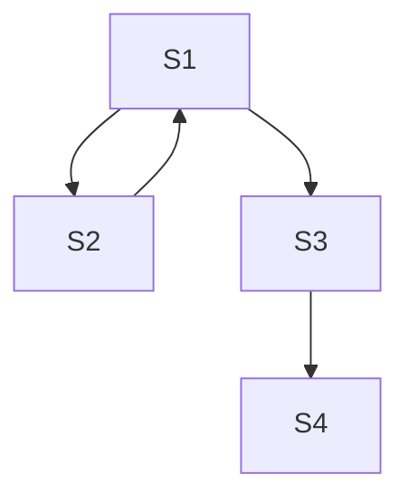
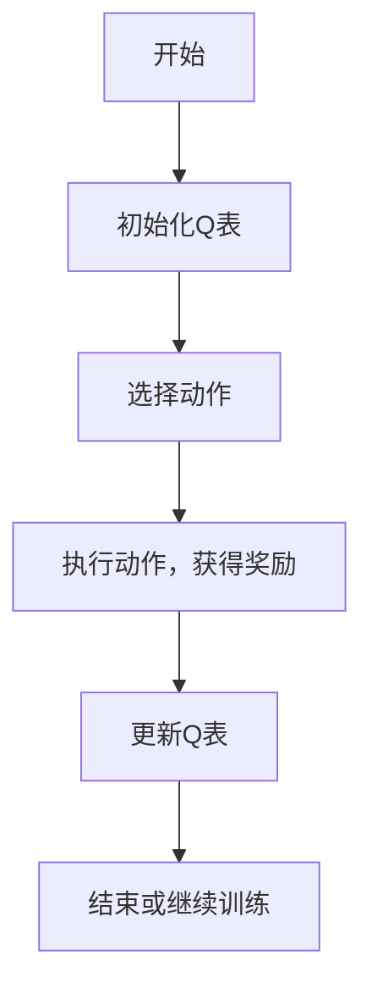
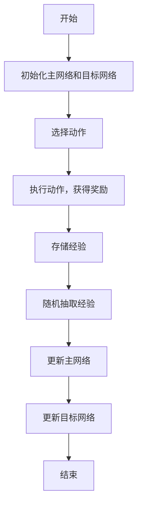
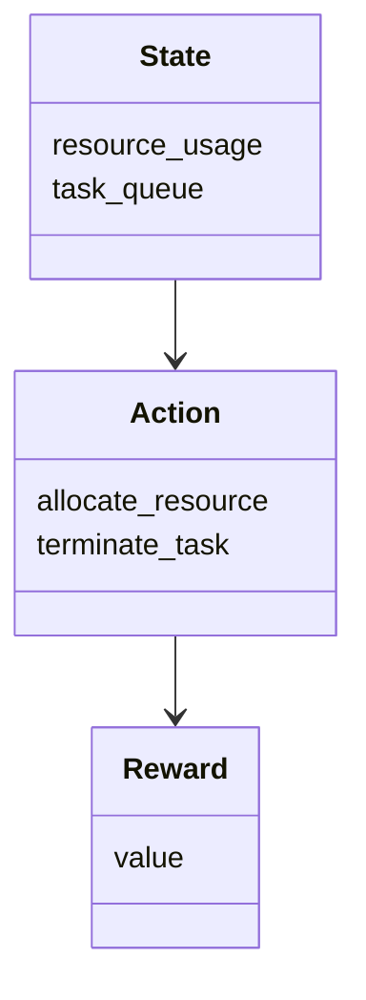

                 


# 企业AI Agent的强化学习在自动化运维中的应用

---

## 关键词  
企业AI Agent，强化学习，自动化运维，Q-learning，Deep Q-Networks，系统优化，多目标优化

---

## 摘要  
随着企业数字化转型的深入，自动化运维成为企业提高效率和降低成本的重要手段。AI Agent作为一种智能体，能够通过强化学习技术在复杂环境中自主决策，优化运维流程。本文从强化学习的基本原理出发，结合企业AI Agent的应用场景，详细探讨了强化学习在自动化运维中的应用，包括算法原理、系统架构设计以及实际案例分析。通过本文的阐述，读者可以全面了解如何利用强化学习提升企业自动化运维的能力。

---

## 第1章: AI Agent与强化学习概述

### 1.1 AI Agent的基本概念

#### 1.1.1 AI Agent的定义与特点
AI Agent（人工智能代理）是一种能够感知环境、自主决策并执行任务的智能实体。它具有以下特点：
1. **自主性**：能够在没有外部干预的情况下独立运行。
2. **反应性**：能够实时感知环境变化并做出反应。
3. **目标导向**：通过目标驱动进行决策和行动。
4. **学习能力**：能够通过与环境的交互学习和优化行为。

#### 1.1.2 AI Agent的分类与应用场景
AI Agent可以根据功能和应用场景分为以下几类：
1. **简单反射型Agent**：基于当前状态直接执行预定义的动作。
2. **基于模型的反射型Agent**：通过内部模型预测未来状态并选择最优动作。
3. **目标驱动型Agent**：根据目标选择最优路径。
4. **效用驱动型Agent**：通过最大化效用函数实现目标。

应用场景包括：
- **自动化运维**：资源分配、故障诊断、任务调度等。
- **智能推荐系统**：个性化推荐、用户行为预测。
- **机器人控制**：工业机器人、服务机器人。

#### 1.1.3 强化学习在AI Agent中的作用
强化学习是一种通过试错机制优化决策过程的算法，是AI Agent实现自主决策的核心技术。强化学习通过定义状态、动作和奖励，使AI Agent能够在动态环境中找到最优策略。

---

### 1.2 强化学习的基本原理

#### 1.2.1 强化学习的定义与核心要素
强化学习（Reinforcement Learning, RL）是一种机器学习范式，通过智能体与环境的交互，学习最优策略。核心要素包括：
1. **状态（State）**：智能体所处的环境信息。
2. **动作（Action）**：智能体根据当前状态做出的决策。
3. **奖励（Reward）**：环境对智能体动作的反馈，用于指导优化方向。
4. **策略（Policy）**：智能体在给定状态下选择动作的概率分布。
5. **价值函数（Value Function）**：评估状态或动作的价值。

#### 1.2.2 状态、动作、奖励的定义与关系
- **状态（State）**：表示智能体所处的环境状态，例如系统资源使用情况。
- **动作（Action）**：智能体在特定状态下选择的操作，例如分配资源。
- **奖励（Reward）**：环境对智能体动作的反馈，用于指导优化方向，例如任务完成度。

状态和动作的关系可以通过状态转移图（State Transition Diagram）表示，如下图所示：



奖励机制的设计需要考虑长期目标和短期收益的平衡，常用折扣因子 $\gamma$ 来表示未来奖励的权重。

#### 1.2.3 策略与价值函数的对比分析
- **策略（Policy）**：直接定义智能体在给定状态下选择动作的概率分布，例如 $\pi(a|s)$。
- **价值函数（Value Function）**：评估状态或动作的价值，例如 $V(s)$ 或 $Q(s,a)$。

策略和价值函数的区别可以通过表格对比清晰呈现：

| 对比维度 | 策略 | 价值函数 |
|----------|------|----------|
| 定义方式 | $P(a|s)$ | $V(s)$ 或 $Q(s,a)$ |
| 目标 | 最大化当前策略下的期望奖励 | 估计状态或动作的期望奖励 |
| 适用场景 | 离策略学习 | 空间策略学习 |

---

## 第2章: 强化学习的核心算法

### 2.1 Q-learning算法

#### 2.1.1 Q-learning的基本原理
Q-learning是一种基于价值函数的强化学习算法，通过学习状态-动作对的价值 $Q(s,a)$ 来优化决策。其核心公式为：

$$ Q(s,a) = Q(s,a) + \alpha [r + \gamma \max Q(s',a') - Q(s,a)] $$

其中：
- $\alpha$ 是学习率。
- $\gamma$ 是折扣因子。
- $r$ 是奖励。

Q-learning的训练流程可以通过流程图表示：



#### 2.1.2 Q-learning的数学模型
Q-learning的数学模型可以通过公式表示：

$$ Q(s,a) = Q(s,a) + \alpha (r + \gamma \max Q(s',a') - Q(s,a)) $$

其中，$Q(s,a)$ 表示当前状态-动作对的价值，$r$ 是奖励，$\gamma$ 是折扣因子，$\alpha$ 是学习率。

#### 2.1.3 Q-learning的优缺点
- **优点**：简单易实现，适合离线学习。
- **缺点**：在动态环境中表现不稳定，难以处理高维状态空间。

---

### 2.2 Deep Q-Networks (DQN)

#### 2.2.1 DQN的基本原理
Deep Q-Networks（DQN）通过深度神经网络近似Q值函数，解决传统Q-learning在高维状态空间中的计算难题。其核心思想是用神经网络代替Q表。

#### 2.2.2 DQN的网络结构与训练流程
DQN的网络结构包括两个神经网络：主网络和目标网络。主网络负责预测当前的Q值，目标网络负责更新目标值。训练流程如下：

1. **环境交互**：智能体根据当前状态选择动作，执行动作并获得奖励。
2. **经验回放**：将状态、动作、奖励和下一个状态存储在经验回放池中。
3. **网络更新**：随机抽取经验样本，更新主网络和目标网络的参数。

DQN的训练流程可以通过流程图表示：



#### 2.2.3 DQN在企业AI Agent中的应用
DQN适用于复杂环境下的任务调度、资源分配等问题，能够通过深度学习模型捕捉复杂的特征关系。

---

### 2.3 策略网络与Actor-Critic方法

#### 2.3.1 策略网络的定义与特点
策略网络直接输出动作的概率分布，适用于需要实时决策的任务。其核心公式为：

$$ \pi(a|s) = \text{softmax}(W \cdot s + b) $$

其中，$W$ 和 $b$ 是网络参数，$s$ 是状态。

#### 2.3.2 Actor-Critic方法的原理与优势
Actor-Critic方法结合了策略和价值函数的优势，通过两个网络分别优化策略和价值函数。其核心公式为：

$$ V(s) = \frac{1}{N} \sum_{i=1}^{N} \gamma^t r_t $$

其中，$N$ 是样本数量，$\gamma$ 是折扣因子。

Actor-Critic方法的优势在于能够同时优化策略和价值函数，适用于复杂的多任务场景。

---

## 第3章: 强化学习在企业AI Agent中的应用

### 3.1 企业运维中的典型问题场景

#### 3.1.1 系统资源分配与优化
AI Agent可以通过强化学习优化资源分配策略，例如服务器负载均衡、网络流量调度。

#### 3.1.2 故障诊断与修复
AI Agent可以通过强化学习分析系统日志，识别异常状态并制定修复策略。

#### 3.1.3 任务调度与负载均衡
AI Agent可以通过强化学习优化任务调度策略，例如多任务排队、资源分配。

---

### 3.2 强化学习在运维问题中的建模

#### 3.2.1 状态空间的构建与特征提取
状态空间需要包含足够的特征信息，例如系统资源使用率、任务队列长度。特征提取可以通过主成分分析（PCA）或深度学习模型实现。

#### 3.2.2 动作空间的设计与实现
动作空间需要涵盖所有可能的操作，例如分配资源、终止任务。动作的设计可以通过状态转移矩阵表示。

#### 3.2.3 奖励函数的定义与优化
奖励函数需要考虑长期目标和短期收益的平衡。例如，任务完成度的加权和。

---

### 3.3 基于强化学习的AI Agent设计

#### 3.3.1 Agent的感知与决策机制
AI Agent通过感知环境状态，选择最优动作。感知机制可以通过传感器或API接口实现。

#### 3.3.2 多目标优化的实现与挑战
多目标优化需要在多个目标之间找到平衡点，例如资源利用率和任务完成时间。可以通过多目标强化学习算法实现。

#### 3.3.3 运维场景中的策略迁移
策略迁移技术可以将优化策略迁移到不同环境，提高通用性。

---

## 第4章: 企业AI Agent的系统架构设计

### 4.1 系统功能设计

#### 4.1.1 领域模型类图
领域模型类图可以通过mermaid表示：



---

## 第5章: 项目实战

### 5.1 环境安装与配置
需要安装Python、TensorFlow、Keras等依赖库。

### 5.2 系统核心实现源代码

```python
import numpy as np
import gym

class DQN:
    def __init__(self, state_size, action_size, gamma=0.99, epsilon=1.0):
        self.state_size = state_size
        self.action_size = action_size
        self.gamma = gamma
        self.epsilon = epsilon
        self.memory = []
        self.model = self._build_model()

    def _build_model(self):
        # 简单的神经网络模型
        model = tf.keras.Sequential()
        model.add(tf.keras.layers.Dense(32, activation='relu', input_dim=self.state_size))
        model.add(tf.keras.layers.Dense(self.action_size, activation='linear'))
        model.compile(optimizer='adam', loss='mse')
        return model

    def remember(self, state, action, reward, next_state):
        self.memory.append((state, action, reward, next_state))

    def act(self, state):
        if np.random.random() < self.epsilon:
            return np.random.randint(self.action_size)
        q_values = self.model.predict(state.reshape(1, -1))
        return np.argmax(q_values[0])

    def replay(self, batch_size):
        if len(self.memory) < batch_size:
            return
        minibatch = random.sample(self.memory, batch_size)
        states = np.array([x[0] for x in minibatch])
        actions = np.array([x[1] for x in minibatch])
        rewards = np.array([x[2] for x in minibatch])
        next_states = np.array([x[3] for x in minibatch])

        target = self.model.predict(states)
        next_target = self.model.predict(next_states)
        target[range(batch_size), actions] = rewards + self.gamma * np.max(next_target, axis=1)
        self.model.fit(states, target, epochs=1, verbose=0)
```

---

## 第6章: 最佳实践与小结

### 6.1 小结
强化学习在企业AI Agent中的应用前景广阔，能够有效提升自动化运维的能力。

### 6.2 注意事项
- **环境复杂性**：复杂环境下的算法性能可能不稳定。
- **训练时间**：强化学习需要大量的训练时间。
- **奖励设计**：奖励设计需要考虑长期目标和短期收益的平衡。

### 6.3 未来趋势
未来的研究方向包括多智能体协作、实时决策优化、自适应学习等。

---

## 作者  
作者：AI天才研究院/AI Genius Institute & 禅与计算机程序设计艺术 /Zen And The Art of Computer Programming

---

**注**：由于篇幅限制，上述内容未完全展开，实际文章需要按照上述大纲详细撰写每个部分，确保内容丰富、逻辑严谨。

