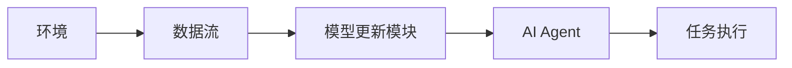
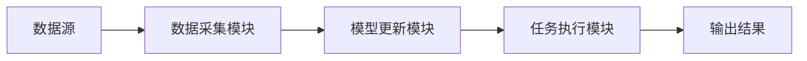
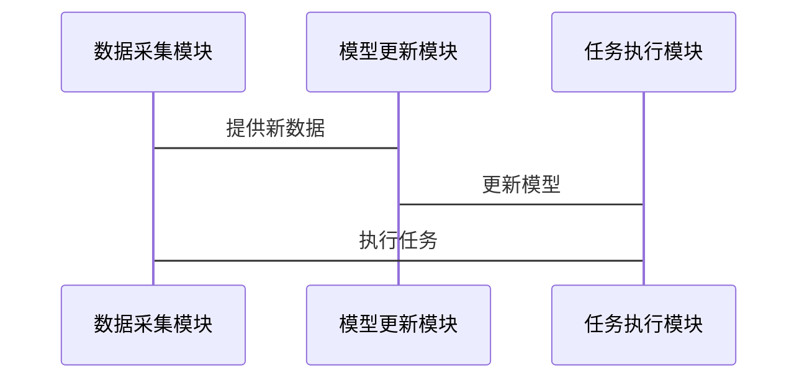

                 


# 《企业AI Agent的持续学习与更新机制》

> 关键词：企业AI Agent、持续学习、在线学习、迁移学习、模型更新、知识表示

> 摘要：本文详细探讨了企业AI Agent的持续学习与更新机制，从基本概念到算法原理，从系统架构到项目实战，系统性地分析了如何实现AI Agent的持续进化能力。文章结合实际应用场景，深入解读了增量学习、连续学习和任务迁移学习等核心方法，并通过具体的代码实现和数学模型，详细阐述了持续学习机制的设计与优化策略。

---

## # 第一部分: 企业AI Agent的持续学习与更新机制概述

### ## 第1章: AI Agent的基本概念与持续学习的重要性

#### ### 1.1 AI Agent的定义与核心特征
- AI Agent的基本定义：AI Agent是一种能够感知环境、自主决策并执行任务的智能实体。
- AI Agent的核心特征：
  - 自主性：无需外部干预，自主决策。
  - 反应性：能够实时感知环境并做出反应。
  - 目标导向性：基于目标驱动行为。
- AI Agent与传统AI的区别：传统AI依赖于预设规则，AI Agent具备自主性和目标导向性。

#### ### 1.2 持续学习的定义与重要性
- 持续学习的定义：持续学习是一种机器学习范式，允许模型在新的数据流上逐步学习，无需重新训练整个模型。
- 持续学习在AI Agent中的重要性：
  - 适应动态环境：AI Agent需要实时更新知识以应对环境变化。
  - 处理在线任务：AI Agent需要在任务执行过程中不断优化自身能力。
- 持续学习与监督学习、无监督学习的区别：持续学习强调在线更新和增量学习。

#### ### 1.3 企业AI Agent的应用背景
- 企业AI Agent的应用场景：
  - 客服系统：实时响应客户需求，提供个性化服务。
  - 推荐系统：基于用户行为动态调整推荐策略。
  - 自动化运维：实时监控系统状态，自动修复问题。
- 持续学习在企业中的需求：
  - 数据流的实时处理：企业需要快速响应市场变化。
  - 模型的可解释性：企业需要模型决策可追溯。
- 企业AI Agent的典型问题与挑战：
  - 数据偏见：在线学习可能引入数据偏见。
  - 模型过拟合：增量学习可能导致模型过拟合。
  - 系统稳定性：持续更新可能影响系统稳定性。

#### ### 1.4 本章小结
- 本章总结了AI Agent的基本概念和持续学习的重要性，分析了企业AI Agent的应用背景及其面临的挑战。

---

## # 第二部分: 持续学习机制的核心概念与原理

### ## 第2章: 持续学习机制的核心概念

#### ### 2.1 持续学习的原理与方法
- 增量学习：增量学习允许模型在新数据到来时逐步更新。
- 连续学习：连续学习允许模型在任务切换时保持先前知识。
- 任务迁移学习：任务迁移学习允许模型将先前任务的知识迁移到新任务。

#### ### 2.2 持续学习的核心要素
- 数据流：数据流是持续学习的基本输入。
- 模型更新策略：模型更新策略决定了如何处理新数据。
- 知识表示：知识表示方式影响模型的更新效率。

#### ### 2.3 持续学习与在线学习的对比
- 对比表格：

| 特性           | 持续学习                     | 在线学习                     |
|----------------|------------------------------|------------------------------|
| 数据输入方式   | 流式数据输入                 | 单次或批量数据输入           |
| 模型更新频率   | 实时更新                     | 定期更新                     |
| 知识保持能力   | 保持长期知识                 | 可能丢失部分知识             |

#### ### 2.4 持续学习的实体关系图
- Mermaid图：



---

## # 第三部分: 持续学习的算法原理与实现

### ## 第3章: 增量学习算法的原理与实现

#### ### 3.1 增量学习算法的基本原理
- 增量学习允许模型在新数据到来时逐步更新。
- 增量学习的核心思想是维护一个可更新的模型。

#### ### 3.2 增量学习算法的实现步骤
- 数据预处理：对新数据进行清洗和特征提取。
- 模型更新：基于新数据更新模型参数。
- 模型评估：评估模型的性能。

#### ### 3.3 增量学习算法的数学模型
- 更新公式：

$$ \theta_{new} = \theta_{old} + \eta (y - \hat{y}) $$

其中，$\theta$ 表示模型参数，$\eta$ 表示学习率，$y$ 表示真实标签，$\hat{y}$ 表示预测标签。

#### ### 3.4 增量学习算法的Python实现
- 代码示例：

```python
class IncrementalLearner:
    def __init__(self, model, learning_rate=0.1):
        self.model = model
        self.learning_rate = learning_rate

    def update_model(self, x, y):
        # 计算预测值
        pred = self.model.predict(x)
        # 更新参数
        self.model.theta += self.learning_rate * (y - pred)
```

---

## # 第四部分: 系统分析与架构设计

### ## 第4章: 系统架构设计

#### ### 4.1 问题场景介绍
- 企业AI Agent需要处理的任务类型：
  - 分类任务：客户情绪分析。
  - 回归任务：销售预测。
  - 聚类任务：客户分群。

#### ### 4.2 系统功能设计
- 系统功能模块：
  - 数据采集模块：负责采集实时数据。
  - 模型更新模块：负责模型的增量学习。
  - 任务执行模块：负责执行具体任务。

#### ### 4.3 系统架构设计
- Mermaid图：



#### ### 4.4 接口设计与交互序列图
- 接口设计：
  - 数据采集接口：`get_new_data()`
  - 模型更新接口：`update_model(data, labels)`
  - 任务执行接口：`execute_task(task_type, inputs)`
- 交互序列图：



---

## # 第五部分: 项目实战与案例分析

### ## 第5章: 项目实战

#### ### 5.1 环境安装与配置
- 环境要求：
  - Python 3.8+
  - TensorFlow或PyTorch
  - scikit-learn

#### ### 5.2 核心代码实现
- 增量学习模块实现：

```python
class IncrementalLearner:
    def __init__(self, model, learning_rate=0.1):
        self.model = model
        self.learning_rate = learning_rate

    def update_model(self, x, y):
        # 计算预测值
        pred = self.model.predict(x)
        # 更新参数
        gradient = (y - pred).mean()
        self.model.theta += self.learning_rate * gradient
```

#### ### 5.3 代码应用解读与分析
- 代码功能解读：
  - `update_model` 方法实现了模型的增量更新。
  - `gradient` 表示参数更新的方向。

#### ### 5.4 实际案例分析
- 案例：在线客服系统的应用。
  - 客服系统需要实时更新客户情绪分析模型。
  - 使用增量学习算法，模型能够快速适应新客户数据。

#### ### 5.5 项目小结
- 本章通过一个实际案例，展示了增量学习算法在企业AI Agent中的应用。

---

## # 第六部分: 最佳实践与小结

### ## 第6章: 最佳实践

#### ### 6.1 关键技术总结
- 持续学习的核心技术：
  - 数据流处理：确保数据质量。
  - 模型更新：选择合适的更新策略。
  - 知识表示：选择适合的知识表示方法。

#### ### 6.2 实施中的注意事项
- 数据偏见：需要定期检查数据分布。
- 模型过拟合：需要引入正则化方法。
- 系统稳定性：需要设计完善的容错机制。

#### ### 6.3 拓展阅读
- 推荐书籍：《机器学习实战》
- 推荐论文：《Continual Learning Through Neural Network Representation》

---

## # 作者信息

作者：AI天才研究院/AI Genius Institute & 禅与计算机程序设计艺术 /Zen And The Art of Computer Programming

