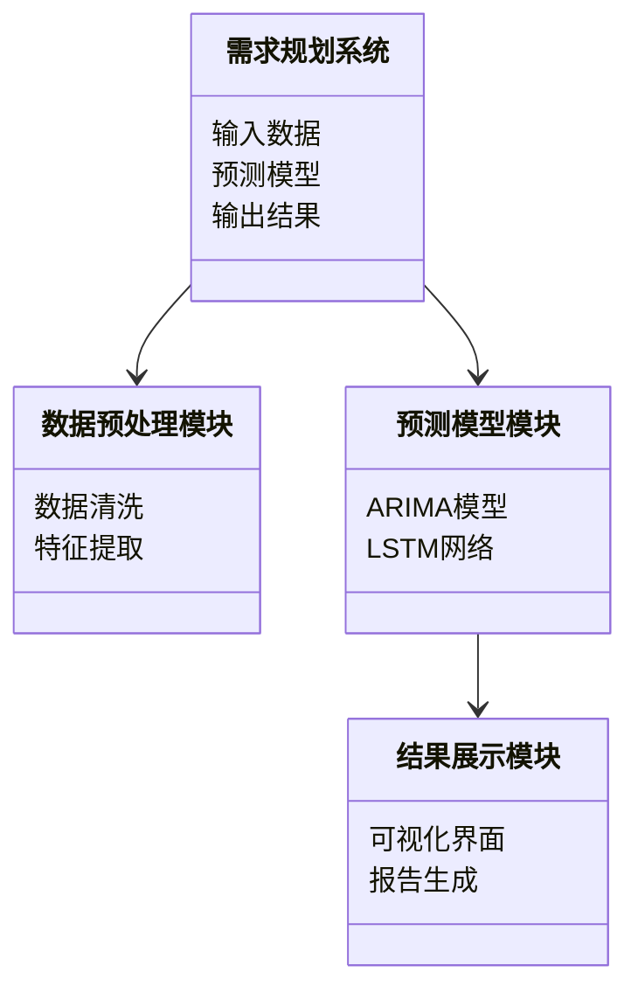

                 


# 企业AI Agent的时间序列预测在需求规划中的应用

> 关键词：AI Agent，时间序列预测，需求规划，企业资源管理，预测模型，算法原理

> 摘要：本文详细探讨了AI Agent在企业需求规划中的时间序列预测应用，通过分析时间序列预测的算法原理、系统架构设计、项目实战案例，结合实际应用场景，为企业需求规划提供了一套基于AI Agent的时间序列预测解决方案。本文不仅深入浅出地解释了时间序列预测的核心概念，还通过具体的代码实现和系统架构设计，展示了如何将AI Agent应用于实际的企业需求规划场景中，为企业资源优化配置和业务决策智能化提供了有力支持。

---

## 第1章: 问题背景与需求规划概述

### 1.1 问题背景介绍

#### 1.1.1 需求规划的定义与重要性
需求规划是企业在生产和运营过程中，为了满足客户需求、优化资源配置、提高生产效率而进行的重要管理活动。它涉及到对企业未来一段时间内的市场需求、生产计划、库存管理、供应链协调等多个方面的预测和规划。

#### 1.1.2 传统需求规划的挑战
传统的需求规划方法通常依赖于历史数据和经验判断，存在以下主要挑战：
- 数据量大且复杂：企业需要处理大量的历史销售数据、市场趋势、季节性波动等信息。
- 预测准确性低：传统方法通常基于简单的线性回归或统计模型，难以捕捉数据中的非线性关系和复杂模式。
- 人工干预多：需求规划过程中需要大量人工调整和优化，效率低下且容易出错。
- 响应速度慢：面对市场变化和突发事件，传统需求规划方法难以快速调整预测结果。

#### 1.1.3 时间序列预测的解决方案
时间序列预测是一种基于历史数据预测未来趋势的统计方法，它通过分析数据的周期性、趋势性、随机性等特征，帮助企业更准确地预测未来的需求。AI Agent（人工智能代理）通过集成先进的时间序列预测算法，能够显著提升需求规划的准确性和效率。

---

### 1.2 企业AI Agent的核心概念

#### 1.2.1 AI Agent的基本定义
AI Agent（人工智能代理）是一种能够感知环境、自主决策并执行任务的智能系统。它通过收集数据、分析信息、学习优化，为企业提供自动化、智能化的解决方案。

#### 1.2.2 时间序列预测的特点与优势
时间序列预测是一种基于历史数据预测未来值的方法，具有以下特点：
- **数据依赖性**：需要大量的历史数据作为输入。
- **趋势性**：能够捕捉数据中的趋势性变化。
- **周期性**：能够识别数据中的周期性波动。
- **复杂性**：需要处理数据中的噪声、异常值等复杂因素。

#### 1.2.3 需求规划中的AI Agent与时间序列预测的关系
AI Agent通过集成时间序列预测算法，能够实时分析历史销售数据、市场趋势、季节性因素等信息，生成高精度的需求预测结果，并根据预测结果优化企业的资源分配和生产计划。

---

### 1.3 时间序列预测在需求规划中的应用价值

#### 1.3.1 提高预测准确性
时间序列预测能够通过建模数据中的趋势、周期性和随机性，显著提高需求预测的准确性。

#### 1.3.2 优化资源配置
基于高精度的需求预测，企业可以更好地优化库存管理、生产计划和供应链协调，降低运营成本。

#### 1.3.3 提升决策效率
AI Agent能够快速处理大量数据并生成预测结果，大大提高了需求规划的决策效率。

---

## 第2章: AI Agent与时间序列预测的核心概念

### 2.1 AI Agent的原理与工作流程

#### 2.1.1 数据采集与处理
AI Agent通过企业信息系统（如ERP、CRM）采集历史销售数据、市场趋势、客户反馈等信息，并进行数据清洗和特征提取。

#### 2.1.2 模型训练与预测
AI Agent集成时间序列预测算法（如ARIMA、LSTM等），对历史数据进行建模训练，并生成未来的需求预测结果。

#### 2.1.3 预测结果的应用
AI Agent将预测结果应用于企业的资源分配、生产计划、库存管理和供应链协调等环节，优化企业的运营效率。

---

### 2.2 时间序列预测的核心模型与方法

#### 2.2.1 ARIMA模型
ARIMA（自回归积分滑动平均模型）是一种经典的线性时间序列预测模型，适用于具有趋势性和周期性的数据。

##### ARIMA模型的数学公式
$$ ARIMA(p, d, q) $$
其中，p为自回归阶数，d为差分阶数，q为移动平均阶数。

#### 2.2.2 LSTM网络
LSTM（长短期记忆网络）是一种基于深度学习的时间序列预测模型，能够捕捉数据中的复杂模式和长期依赖关系。

##### LSTM网络的结构
LSTM网络由输入门、遗忘门和输出门组成，能够有效解决传统RNN模型中存在的梯度消失问题。

#### 2.2.3 Prophet模型
Prophet模型是由Facebook开源的一种时间序列预测模型，适用于具有较强周期性或趋势性的数据。

---

### 2.3 AI Agent中的时间序列预测实现

#### 2.3.1 数据预处理与特征提取
- 数据清洗：去除异常值、填补缺失值。
- 特征提取：提取时间特征（如星期、月份）、滞后特征（如过去一周的销售数据）。

#### 2.3.2 模型训练与优化
- 模型训练：使用历史数据训练时间序列预测模型。
- 模型优化：通过网格搜索、交叉验证等方法优化模型参数。

#### 2.3.3 模型评估与调优
- 模型评估：使用均方误差（MSE）、平均绝对误差（MAE）等指标评估模型性能。
- 模型调优：根据评估结果调整模型参数，提高预测准确性。

---

## 第3章: 企业需求规划系统的需求分析与架构设计

### 3.1 需求规划系统的项目介绍

#### 3.1.1 项目目标
本项目旨在通过AI Agent的时间序列预测技术，优化企业的需求规划流程，提高预测准确性和效率。

#### 3.1.2 项目需求分析
- 数据需求：需要企业的历史销售数据、市场趋势、客户反馈等信息。
- 功能需求：需求预测、资源分配、生产计划优化、库存管理等。

### 3.2 系统功能设计

#### 3.2.1 领域模型设计（Mermaid类图）


---

## 第4章: 时间序列预测算法的实现与优化

### 4.1 ARIMA模型的实现

#### 4.1.1 ARIMA模型的代码实现
```python
from statsmodels.tsa.arima.model import ARIMA

# 数据准备
data = [...]  # 历史销售数据

# 模型训练
model = ARIMA(data, order=(5, 1, 0))
model_fit = model.fit()

# 预测未来值
forecast = model_fit.forecast(steps=10)
print(forecast)
```

#### 4.1.2 ARIMA模型的优缺点
- 优点：简单易用，适合线性趋势和周期性数据。
- 缺点：对非线性数据表现不佳，对异常值敏感。

---

## 第5章: 项目实战与案例分析

### 5.1 项目实战：超市销售预测

#### 5.1.1 环境安装
```bash
pip install statsmodels numpy pandas
```

#### 5.1.2 数据准备与清洗
```python
import pandas as pd
import numpy as np

# 读取数据
data = pd.read_csv('sales.csv')

# 数据清洗
data.dropna(inplace=True)
data['date'] = pd.to_datetime(data['date'])
data.set_index('date', inplace=True)
```

#### 5.1.3 模型训练与预测
```python
from statsmodels.tsa.arima.model import ARIMA

# 训练模型
model = ARIMA(data['sales'], order=(5, 1, 0))
model_fit = model.fit()

# 预测未来10天的销售量
forecast = model_fit.forecast(steps=10)
print(forecast)
```

---

## 第6章: 总结与展望

### 6.1 总结
本文详细探讨了AI Agent在企业需求规划中的时间序列预测应用，通过理论分析和实际案例，展示了如何利用时间序列预测技术优化企业的资源分配和生产计划。

### 6.2 展望
未来，随着深度学习技术的不断发展，时间序列预测算法将更加精准和高效。AI Agent在需求规划中的应用也将更加广泛，为企业创造更大的价值。

---

## 作者：AI天才研究院/AI Genius Institute & 禅与计算机程序设计艺术 /Zen And The Art of Computer Programming

