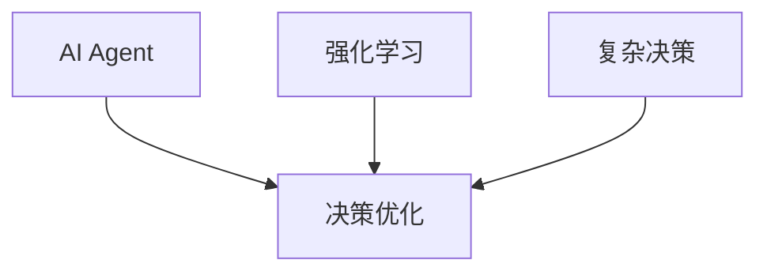
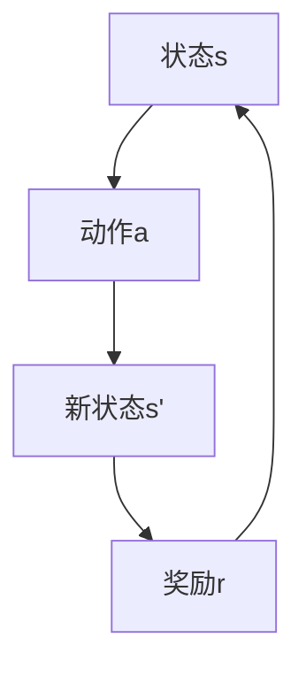
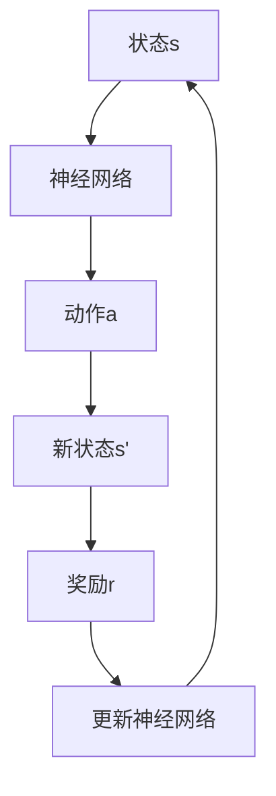
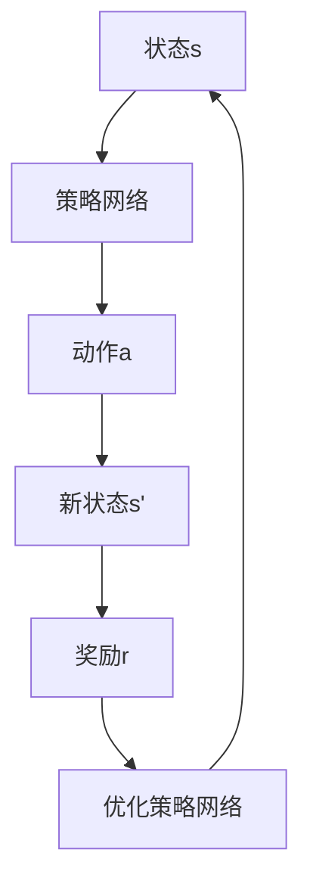
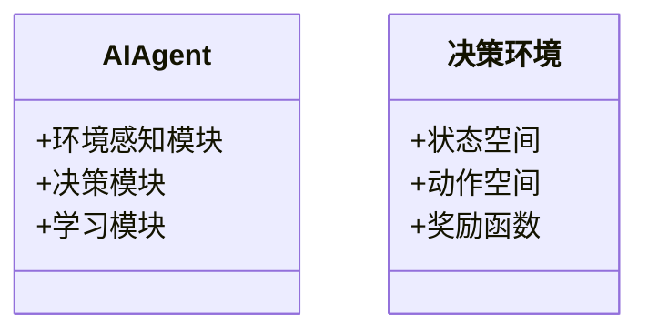
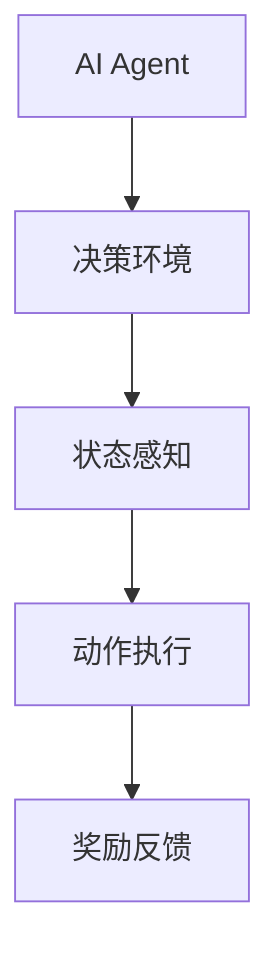
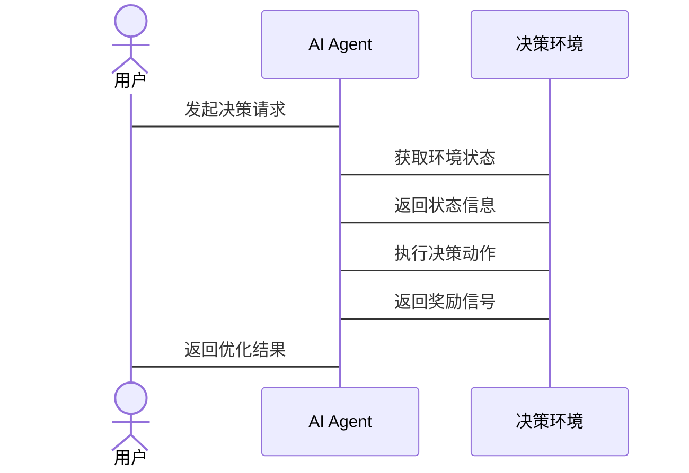

                 


# 企业AI Agent的深度强化学习应用：复杂决策优化

---

## 关键词：
企业AI Agent、深度强化学习、复杂决策优化、系统架构设计、项目实战、数学模型、强化学习算法

---

## 摘要：
企业AI Agent通过深度强化学习技术，能够在复杂决策场景中实现高效的优化与决策。本文从企业AI Agent的核心概念出发，详细分析了深度强化学习在复杂决策优化中的应用原理、算法实现、系统架构设计以及实际项目案例。通过理论与实践相结合的方式，本文为读者提供了一套系统化的知识框架，帮助他们在企业环境中更好地应用深度强化学习技术来解决复杂决策问题。

---

# 第1章: 企业AI Agent的背景与核心概念

## 1.1 问题背景

### 1.1.1 企业决策优化的挑战
企业在运营过程中面临诸多复杂决策问题，例如供应链优化、资源分配、市场策略选择等。这些问题往往涉及多目标、多约束条件和动态变化的环境，传统的基于规则的决策方法难以应对。

### 1.1.2 AI Agent在企业决策中的作用
AI Agent作为一种能够感知环境、自主决策的智能体，能够帮助企业实现实时优化和动态调整。通过深度强化学习技术，AI Agent能够在复杂环境中找到最优决策策略。

### 1.1.3 复杂决策优化的定义与特点
复杂决策优化是指在多变量、多目标和动态变化的环境中，通过优化算法找到最优决策方案的过程。其特点包括：非线性、动态性、多目标性和不确定性。

## 1.2 问题描述

### 1.2.1 企业复杂决策的典型场景
供应链管理、库存优化、生产调度、市场营销、风险管理等。

### 1.2.2 传统决策优化方法的局限性
基于规则的决策方法难以应对复杂动态环境，基于统计的方法在处理多目标优化时效果有限。

### 1.2.3 强化学习在复杂决策中的优势
强化学习能够处理多目标、动态变化的环境，适合复杂决策场景。

## 1.3 问题解决

### 1.3.1 AI Agent的核心解决方案
通过强化学习训练AI Agent，在复杂环境中实现最优决策。

### 1.3.2 强化学习在AI Agent中的应用
将强化学习应用于AI Agent的决策过程，通过试错和经验积累优化决策策略。

### 1.3.3 复杂决策优化的实现路径
通过深度强化学习算法训练AI Agent，实现复杂环境下的最优决策。

## 1.4 边界与外延

### 1.4.1 AI Agent的边界条件
决策范围、决策频次、决策环境的复杂性等。

### 1.4.2 复杂决策优化的适用范围
适用于多目标、动态变化的复杂环境。

### 1.4.3 强化学习的局限性与替代方案
强化学习需要大量数据和计算资源，适用于在线优化场景。

## 1.5 概念结构与核心要素

### 1.5.1 AI Agent的组成要素
感知模块、决策模块、执行模块、学习模块。

### 1.5.2 复杂决策优化的模型结构
状态空间、动作空间、奖励函数、策略函数。

### 1.5.3 强化学习在AI Agent中的角色
通过强化学习算法优化AI Agent的决策策略。

## 1.6 本章小结
本章从企业AI Agent的背景出发，分析了复杂决策优化的挑战和解决方法，明确了AI Agent在企业决策中的作用，并界定了相关概念和核心要素。

---

# 第2章: 核心概念与联系

## 2.1 AI Agent与强化学习的关系

### 2.1.1 AI Agent的核心原理
AI Agent通过感知环境、生成动作、获得反馈，不断优化决策策略。

### 2.1.2 强化学习在AI Agent中的应用
强化学习为AI Agent提供了一种有效的决策优化方法。

### 2.1.3 两者的相互作用与依赖
AI Agent为强化学习提供决策场景，强化学习为AI Agent提供优化策略。

## 2.2 核心概念对比

### 2.2.1 AI Agent与传统决策优化方法的对比
| 对比维度 | AI Agent | 传统决策优化 |
|----------|-----------|--------------|
| 决策方式 | 自主学习   | 基于规则     |
| 环境适应 | 动态适应   | 静态适应     |
| 决策效果 | 优化       | 一般         |

### 2.2.2 强化学习与其他机器学习方法的对比
| 对比维度 | 强化学习   | 监督学习     | 无监督学习 |
|----------|-----------|-------------|------------|
| 数据来源 | 环境反馈   | 标签数据     | 无标签数据 |
| 目标函数 | 最大化奖励 | 分类/回归    | 聚类/降维   |

### 2.2.3 复杂决策优化与简单决策优化的对比
| 对比维度 | 复杂决策优化 | 简单决策优化 |
|----------|--------------|---------------|
| 决策复杂性 | 高           | 低             |
| 决策环境 | 动态变化     | 静态或简单     |
| 决策目标 | 多目标       | 单目标或简单   |

## 2.3 ER实体关系图


## 2.4 本章小结
本章通过对比分析，明确了AI Agent与强化学习的关系，以及复杂决策优化与其他决策优化方法的区别，为后续的算法实现和系统设计奠定了基础。

---

# 第3章: 深度强化学习算法原理

## 3.1 算法原理概述

### 3.1.1 强化学习的基本原理
通过试错学习，AI Agent在环境中不断探索和利用，最终找到最优策略。

### 3.1.2 深度强化学习的核心思想
利用深度神经网络近似状态值函数或策略函数，实现复杂环境下的决策优化。

## 3.2 算法实现

### 3.2.1 Q-learning算法


### 3.2.2 Deep Q-Network (DQN)算法


### 3.2.3 Proximal Policy Optimization (PPO)算法


## 3.3 数学模型与公式

### 3.3.1 Q-learning的数学模型
状态值函数更新公式：
$$ Q(s, a) = Q(s, a) + \alpha [r + \gamma \max Q(s', a) - Q(s, a)] $$

### 3.3.2 DQN的数学模型
目标网络更新公式：
$$ \theta_{target} = \theta_{main} $$

### 3.3.3 PPO的数学模型
策略更新目标：
$$ \min_{\theta} \left[ \mathbb{E}[ \text{clip}(\rho(\theta), 1-\epsilon, 1+\epsilon) \cdot \text{surrogate}(r, \theta) ] \right] $$

## 3.4 本章小结
本章详细介绍了深度强化学习的核心算法及其数学模型，为后续的系统设计和项目实现提供了理论基础。

---

# 第4章: 系统分析与架构设计

## 4.1 问题场景介绍
以企业供应链管理为例，分析复杂决策优化的实际场景。

## 4.2 系统功能设计

### 4.2.1 领域模型设计


### 4.2.2 系统架构设计


### 4.2.3 接口设计
- 输入接口：接收环境状态信息
- 输出接口：输出决策动作
- 反馈接口：接收奖励信号

### 4.2.4 交互流程


## 4.3 本章小结
本章从系统设计的角度，详细分析了企业AI Agent的架构和交互流程，为后续的项目实现提供了指导。

---

# 第5章: 项目实战与案例分析

## 5.1 项目介绍
以企业供应链优化为例，设计一个基于深度强化学习的AI Agent系统。

## 5.2 核心代码实现

### 5.2.1 环境安装
```bash
pip install gym stable-baselines3
```

### 5.2.2 核心代码
```python
import gym
from stable_baselines3 import PPO, DQN

env = gym.make('CustomEnv-v0')
model = PPO('MlpPolicy', env, verbose=1)
model.learn(total_timesteps=10000)
```

### 5.2.3 代码解读
- 环境定义：自定义决策环境`CustomEnv-v0`
- 算法选择：使用PPO算法训练AI Agent
- 训练过程：通过`model.learn`方法进行强化学习训练

## 5.3 实际案例分析

### 5.3.1 供应链优化案例
通过训练AI Agent优化供应链库存，减少成本和提高效率。

### 5.3.2 案例分析与结果展示
分析训练过程中的奖励曲线和最终优化结果。

## 5.4 本章小结
本章通过实际项目案例，展示了如何将深度强化学习应用于企业AI Agent的复杂决策优化中。

---

# 第6章: 总结与展望

## 6.1 本章小结
总结本文的核心内容，强调企业AI Agent在复杂决策优化中的重要作用。

## 6.2 未来展望
探讨深度强化学习在企业决策优化中的未来发展方向，例如多智能体协同决策、在线学习等。

## 6.3 最佳实践 Tips
- 选择合适的强化学习算法
- 合理设计奖励函数
- 确保环境的动态适应性

## 6.4 注意事项
- 强化学习需要大量计算资源
- 确保数据质量和多样性
- 定期监控和优化模型

## 6.5 拓展阅读
推荐相关书籍和论文，供读者进一步学习。

## 6.6 作者信息
作者：AI天才研究院/AI Genius Institute & 禅与计算机程序设计艺术/Zen And The Art of Computer Programming

---

# 附录

## 附录A: 深度强化学习算法对比表
| 算法名称 | 核心思想 | 适用场景 | 优缺点 |
|----------|----------|----------|--------|
| Q-learning | 状态-动作值函数 | 离散环境 | 简单但收敛慢 |
| DQN | 使用神经网络近似值函数 | 连续环境 | 收敛快但不稳定 |
| PPO | 增量式策略优化 | 复杂动态环境 | 稳定且高效 |

## 附录B: 系统架构设计示意图


---

希望这个大纲能为您提供清晰的写作思路！如果需要进一步修改或补充，请随时告诉我。

