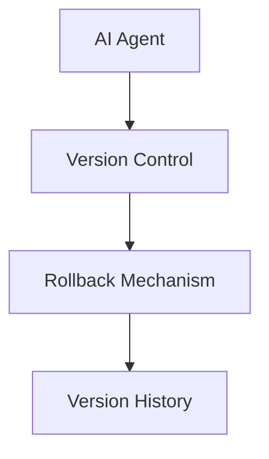
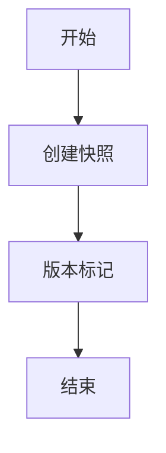

                 


# 企业AI Agent的版本控制与回滚机制

> 关键词：企业AI Agent，版本控制，回滚机制，快照，日志

> 摘要：本文详细探讨了企业AI Agent的版本控制与回滚机制，从核心概念、算法原理、系统设计到项目实战，全面解析如何管理和恢复AI Agent的不同版本，确保系统的稳定性和可靠性。

---

## 第一部分：企业AI Agent的版本控制与回滚机制概述

### 第1章：AI Agent与版本控制的背景介绍

#### 1.1 AI Agent的基本概念

- **1.1.1 AI Agent的定义与特点**

  AI Agent（人工智能代理）是能够感知环境、自主决策并执行任务的智能体。其特点包括自主性、反应性、目标导向和学习能力。

- **1.1.2 企业级AI Agent的应用场景**

  在企业中，AI Agent常用于自动化决策、智能客服、供应链优化等领域。例如，智能客服AI Agent能够根据用户问题生成回答，优化客户体验。

- **1.1.3 企业AI Agent的发展现状**

  随着深度学习和自然语言处理技术的进步，企业AI Agent的应用日益广泛，但版本管理和回滚机制仍面临挑战。

#### 1.2 版本控制在AI Agent中的重要性

- **1.2.1 版本控制的基本概念**

  版本控制是对文件或代码的修改历史进行管理，确保在出现问题时能够回滚到稳定版本。其核心功能包括分支管理、快照生成和版本标记。

- **1.2.2 AI Agent版本控制的挑战与需求**

  AI Agent的版本控制不仅涉及代码，还包括模型权重和策略变化。复杂性高、数据量大、版本依赖性强是主要挑战。

- **1.2.3 企业AI Agent版本控制的意义**

  版本控制确保了AI Agent的稳定性和可追溯性，便于问题排查和优化迭代。

#### 1.3 本章小结

本章介绍了AI Agent的基本概念及其在企业中的应用场景，强调了版本控制的重要性，并提出了版本控制的核心需求。

---

## 第二部分：企业AI Agent版本控制的核心概念与联系

### 第2章：企业AI Agent版本控制的核心概念

#### 2.1 版本控制的原理与实现

- **2.1.1 版本控制的基本原理**

  版本控制通过记录每个版本的状态变化，允许在不同版本间切换。常用工具如Git提供分支、合并和标签功能。

- **2.1.2 AI Agent版本控制的特殊性**

  AI Agent的版本控制需考虑模型权重、策略文件和数据版本，复杂性高于传统代码版本控制。

#### 2.2 回滚机制的实现原理

- **2.2.1 回滚机制的基本概念**

  回滚机制利用版本控制系统中的快照或检查点，将系统恢复到之前的状态。它依赖于版本控制提供的快照和日志信息。

- **2.2.2 回滚机制在AI Agent中的应用**

  当AI Agent出现错误或性能下降时，回滚机制可以快速恢复到最近的稳定版本，减少停机时间和损失。

#### 2.3 企业AI Agent版本控制与回滚机制的关系

- **2.3.1 版本控制与回滚机制的相互作用**

  版本控制提供了快照，回滚机制利用这些快照进行恢复。两者相辅相成，共同确保系统的稳定性和可恢复性。

- **2.3.2 回滚机制对版本控制的依赖性**

  回滚机制依赖版本控制的日志和快照。没有有效的版本控制，回滚机制将无法正常工作。

#### 2.4 核心概念对比分析

| 比较维度 | 版本控制 | 回滚机制 |
|----------|----------|----------|
| 目标     | 管理不同版本 | 恢复到特定版本 |
| 实现方式 | 版本号、分支 | 回滚点、快照 |
| 依赖性   | 独立于回滚机制 | 依赖于版本控制 |

#### 2.5 ER实体关系图



#### 2.6 本章小结

本章详细讲解了版本控制和回滚机制的核心概念，并通过对比分析和ER图展示了它们之间的关系。

---

## 第三部分：企业AI Agent版本控制的算法原理

### 第3章：版本控制算法的实现原理

#### 3.1 基于分支的版本控制算法

- **3.1.1 分支的创建与合并**

  分支允许并行开发，合并时需解决冲突。常用工具如Git提供分支与合并功能。

- **3.1.2 分支冲突的解决**

  冲突解决主要依赖人工判断，选择保留哪个版本的代码或数据。

#### 3.2 基于标签的版本控制算法

- **3.2.1 标签的创建与管理**

  标签用于标记重要的版本，如发布版本。帮助用户快速定位到特定版本。

- **3.2.2 标签与版本控制的关系**

  标签是版本控制中的元数据，帮助用户更好地组织和管理版本。

#### 3.3 基于快照的版本控制算法

- **3.3.1 快照的生成与存储**

  快照记录系统在某一时间点的状态，包括模型权重和配置参数。

- **3.3.2 快照的恢复与回滚**

  快照恢复是将系统状态还原到快照记录的时间点，确保数据一致性和系统稳定性。

#### 3.4 算法流程图



#### 3.5 Python实现示例

```python
def create_snapshot(version):
    # 生成快照并保存
    snapshot = {
        'version': version,
        'weights': model.get_weights(),
        'config': model.get_config()
    }
    save_snapshot(snapshot)
```

---

## 第四部分：企业AI Agent版本控制的系统分析与架构设计

### 第4章：系统分析与架构设计方案

#### 4.1 问题场景介绍

- AI Agent在运行中可能出现模型过时或错误，导致性能下降或服务中断。

#### 4.2 项目介绍

- 本项目旨在设计一个支持版本控制和回滚的AI Agent系统，确保在出现问题时能够快速恢复。

#### 4.3 系统功能设计

- **领域模型**

  ```mermaid
  classDiagram
      class AI-Agent {
          state;
          model_weights;
          config;
      }
      class Version-Control {
          version_history;
          snapshots;
      }
      class Rollback-Mechanism {
          rollback_points;
          recovery_function;
      }
      AI-Agent --> Version-Control
      Version-Control --> Rollback-Mechanism
  ```

- **系统架构设计**

  ```mermaid
  graph TD
      A[AI Agent] --> B[Version Control]
      B --> C[Rollback Mechanism]
      C --> D[Snapshot Storage]
  ```

- **系统接口设计**

  - 接口1：获取当前版本
  - 接口2：创建新版本
  - 接口3：触发回滚
  - 接口4：恢复到指定版本

- **系统交互**

  ```mermaid
  sequenceDiagram
      client ->> AI-Agent: 请求处理
      AI-Agent ->> Version-Control: 获取当前版本
      Version-Control -->> AI-Agent: 返回版本信息
      AI-Agent ->> client: 处理请求
      client ->> AI-Agent: 出现错误
      AI-Agent ->> Rollback-Mechanism: 触发回滚
      Rollback-Mechanism ->> Version-Control: 获取快照
      Version-Control -->> Rollback-Mechanism: 返回快照
      Rollback-Mechanism ->> AI-Agent: 恢复到指定版本
  ```

#### 4.4 本章小结

本章分析了问题场景，设计了系统的功能、架构和接口，展示了系统的整体结构和交互流程。

---

## 第五部分：企业AI Agent版本控制的项目实战

### 第5章：项目实战

#### 5.1 环境安装

- 需要安装的库包括：TensorFlow/PyTorch、版本控制库（如Git）、AI框架（如Keras）。

#### 5.2 系统核心实现源代码

```python
class VersionControl:
    def __init__(self):
        self.snapshots = {}

    def create_snapshot(self, version, state):
        self.snapshots[version] = state.copy()

    def rollback(self, version):
        if version in self.snapshots:
            return self.snapshots[version]
        else:
            return None

class AIAgent:
    def __init__(self, version_control):
        self.version_control = version_control
        self.current_version = '0.1'

    def save_snapshot(self):
        self.version_control.create_snapshot(self.current_version, self.get_state())

    def rollback(self, version):
        state = self.version_control.rollback(version)
        if state:
            self.current_version = version
            self.set_state(state)
            return True
        return False

    def get_state(self):
        return {
            'weights': self.model.get_weights(),
            'config': self.model.get_config()
        }

    def set_state(self, state):
        self.model.set_weights(state['weights'])
        self.model.set_config(state['config'])
```

#### 5.3 代码应用解读与分析

- `VersionControl`类负责管理快照，支持创建和回滚。
- `AIAgent`类整合版本控制功能，提供保存快照和回滚方法。
- 回滚机制确保在出现问题时，能够快速恢复到指定版本。

#### 5.4 实际案例分析

- **案例背景**

  假设AI Agent在运行中出现模型性能下降，用户反馈体验变差。

- **问题排查**

  通过版本控制日志，发现最近的快照版本为1.2，回滚到版本1.1后，性能恢复正常。

- **详细步骤**

  1. AI Agent检测到性能异常，触发回滚机制。
  2. 回滚机制向版本控制请求快照。
  3. 版本控制返回版本1.1的快照。
  4. AI Agent恢复到版本1.1，问题解决。

#### 5.5 项目小结

本章通过实际案例展示了如何使用版本控制和回滚机制解决AI Agent的问题，验证了设计的可行性和有效性。

---

## 第六部分：最佳实践与总结

### 第6章：总结与展望

#### 6.1 本章总结

本文全面探讨了企业AI Agent的版本控制与回滚机制，从核心概念到系统设计，再到项目实战，详细解析了如何实现和应用这些机制。

#### 6.2 最佳实践 tips

- 定期备份：确保重要快照的保存，防止数据丢失。
- 测试回滚：定期测试回滚机制，确保其可用性。
- 监控系统：实时监控AI Agent的运行状态，及时发现和解决问题。

#### 6.3 展望

随着AI技术的不断发展，版本控制和回滚机制将更加智能化，可能结合区块链技术实现不可篡改的日志，或利用机器学习优化回滚策略。

---

## 作者：AI天才研究院/AI Genius Institute & 禅与计算机程序设计艺术 /Zen And The Art of Computer Programming

---

本文系统地探讨了企业AI Agent的版本控制与回滚机制，从理论到实践，为读者提供了全面的指导和深入的分析。

