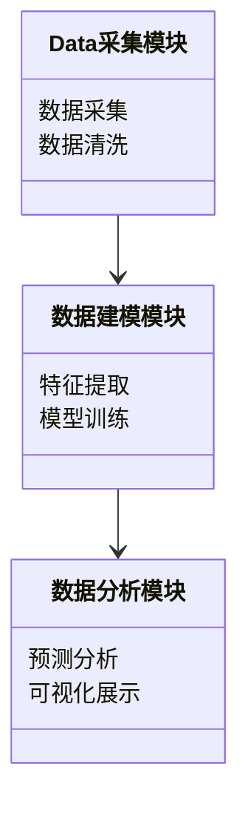
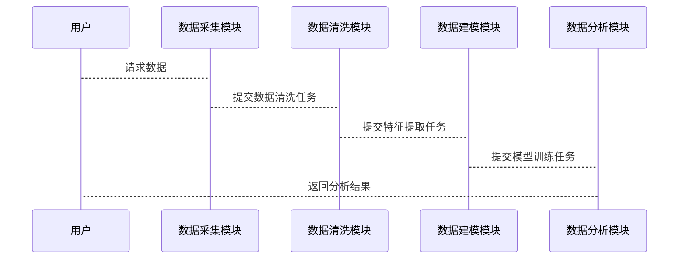

                 


# 企业AI Agent的物联网数据分析与应用

## 关键词：
企业AI Agent, 物联网, 数据分析, 人工智能, 应用实践

## 摘要：
本文详细探讨了企业AI Agent在物联网数据分析与应用中的关键作用。首先，我们介绍了企业AI Agent和物联网的基本概念及其结合的意义。接着，深入分析了物联网数据的特点和AI Agent的核心功能，包括数据采集、处理、建模与分析。然后，详细讲解了相关的数据分析算法原理，如数据预处理、特征提取、机器学习与深度学习算法，并通过Python代码示例进行实现。随后，我们设计了一个企业级的物联网数据分析系统架构，包括功能设计、系统架构图、接口设计和交互流程图。最后，通过项目实战，从环境安装到代码实现，详细指导读者完成项目，并总结了最佳实践和未来发展趋势。

---

# 第一部分: 企业AI Agent的物联网数据分析与应用概述

## 第1章: 企业AI Agent与物联网概述

### 1.1 企业AI Agent的基本概念

#### 1.1.1 AI Agent的定义与特点
- **定义**：AI Agent（人工智能代理）是指能够感知环境、自主决策并执行任务的智能实体。
- **特点**：
  - 智能性：能够理解和处理复杂信息。
  - 自主性：无需人工干预，自主完成任务。
  - 反应性：能够实时感知环境变化并做出反应。
  - 学习能力：通过数据和经验不断优化自身性能。

#### 1.1.2 企业AI Agent的核心功能
- 数据采集与处理：从多种数据源获取数据并进行预处理。
- 数据建模与分析：利用机器学习和深度学习算法对数据进行建模和分析。
- 决策支持：基于分析结果提供优化建议和决策支持。

#### 1.1.3 物联网(IoT)的基本概念
- **定义**：物联网是指通过各种信息传感设备，如传感器、射频识别（RFID）、全球定位系统（GPS）、红外感应器等，按约定的协议，把任何物品与互联网连接起来，进行信息交换和通信，以实现智能化识别、定位、跟踪、监控和管理。
- **特点**：
  - 连接性：设备之间通过网络互联。
  - 实时性：能够实时采集和传输数据。
  - 分布性：数据源分散且多样化。

---

### 1.2 企业AI Agent与物联网的结合

#### 1.2.1 物联网数据的特点
- **多样性**：数据类型多样，包括结构化数据（如数值型）和非结构化数据（如文本、图像）。
- **实时性**：数据产生速度快，需要实时处理。
- **海量性**：数据量大，对存储和计算能力要求高。

#### 1.2.2 AI Agent在物联网中的作用
- 数据采集与预处理：AI Agent能够从物联网设备中采集数据，并进行清洗和标准化。
- 数据建模与分析：利用机器学习和深度学习算法对物联网数据进行建模和分析，提取有价值的信息。
- 决策支持：基于分析结果，AI Agent可以提供实时的决策支持，优化企业运营。

#### 1.2.3 企业级物联网应用的场景
- 智慧城市：交通管理、环境监测等。
- 智能制造：生产设备监控、生产优化等。
- 智慧医疗：患者监测、医疗设备管理等。

---

### 1.3 本章小结
本章介绍了企业AI Agent和物联网的基本概念，分析了AI Agent在物联网中的作用，并探讨了企业级物联网应用的主要场景。

---

## 第2章: 企业AI Agent的物联网数据分析核心概念

### 2.1 数据分析的基本原理

#### 2.1.1 数据分析的定义
数据分析是指通过统计、机器学习等方法，对数据进行处理、建模和分析，以提取有用信息的过程。

#### 2.1.2 数据分析的流程
- 数据采集
- 数据清洗
- 数据建模
- 数据分析
- 结果可视化

#### 2.1.3 数据分析的关键技术
- 数据挖掘：从数据中提取模式和知识。
- 机器学习：基于数据训练模型，进行预测和分类。
- 数据可视化：通过图表等方式展示数据分析结果。

---

### 2.2 企业AI Agent的数据分析能力

#### 2.2.1 数据采集与处理
- 数据采集：通过传感器、数据库等获取数据。
- 数据清洗：去除噪声数据，处理缺失值。
- 数据标准化：将数据转换为统一格式。

#### 2.2.2 数据建模与分析
- 数据特征提取：通过PCA等方法降低数据维度。
- 数据建模：使用回归、分类等算法构建模型。
- 数据分析：利用模型进行预测和分类。

#### 2.2.3 数据可视化与决策支持
- 数据可视化：使用图表展示数据分析结果。
- 决策支持：基于分析结果，提供优化建议。

---

### 2.3 物联网数据的特征与挑战

#### 2.3.1 物联网数据的多样性
- 数据类型多样，包括数值、文本、图像等。
- 数据来源分散，设备种类多。

#### 2.3.2 数据量与实时性要求
- 数据量大，需要高效处理。
- 实时性要求高，需要快速响应。

#### 2.3.3 数据安全与隐私保护
- 数据安全性：防止数据被未经授权的访问。
- 隐私保护：保护用户隐私，符合相关法律法规。

---

### 2.4 本章小结
本章分析了企业AI Agent的数据分析能力，探讨了物联网数据的特征与挑战，为后续的算法实现和系统设计奠定了基础。

---

## 第3章: 企业AI Agent的物联网数据分析算法原理

### 3.1 数据预处理算法

#### 3.1.1 数据清洗与标准化
- 数据清洗：去除噪声数据，处理异常值。
- 数据标准化：将数据归一化，使其具有相同的量纲。

#### 3.1.2 数据特征提取
- 主成分分析（PCA）：通过降维技术提取主要特征。

#### 3.1.3 数据降维方法
- PCA：一种常用的数据降维方法，通过线性变换将数据投影到低维空间。

---

### 3.2 数据建模与分析算法

#### 3.2.1 机器学习算法
- 线性回归：用于预测连续型变量。
- 支持向量机（SVM）：用于分类和回归任务。
- 随机森林：用于分类和回归任务，基于树模型的集成方法。

#### 3.2.2 深度学习算法
- 卷积神经网络（CNN）：用于图像识别任务。
- 循环神经网络（RNN）：用于处理序列数据，如时间序列分析。

#### 3.2.3 时间序列分析算法
- ARIMA：用于时间序列预测，基于历史数据建立模型。

---

### 3.3 算法实现与优化

#### 3.3.1 算法实现流程
- 数据预处理
- 模型训练
- 模型评估
- 模型优化

#### 3.3.2 算法优化策略
- 参数调整：如学习率、批量大小等。
- 模型选择：选择合适的模型架构。
- 正则化：防止过拟合，如L1/L2正则化。

#### 3.3.3 算法评估指标
- 准确率
- 召回率
- F1分数

---

### 3.4 本章小结
本章详细讲解了企业AI Agent的物联网数据分析中的算法原理，包括数据预处理、特征提取、机器学习和深度学习算法的实现与优化。

---

## 第4章: 企业AI Agent的物联网数据分析系统架构设计

### 4.1 系统功能设计

#### 4.1.1 领域模型设计
- 使用Mermaid类图描述系统功能模块之间的关系。



---

#### 4.1.2 系统架构设计
- 使用Mermaid架构图描述系统的分层架构。


---

### 4.2 系统接口设计

#### 4.2.1 接口设计
- 使用RESTful API设计系统接口，如：
  - GET /data：获取实时数据。
  - POST /model：提交模型训练任务。

#### 4.2.2 交互流程图
- 使用Mermaid序列图描述系统交互流程。



---

### 4.3 本章小结
本章设计了企业AI Agent的物联网数据分析系统的功能模块、架构和接口，为后续的项目实现奠定了基础。

---

## 第5章: 企业AI Agent的物联网数据分析项目实战

### 5.1 环境安装与配置

#### 5.1.1 环境要求
- 操作系统：Linux或Windows。
- Python版本：3.6以上。
- 安装依赖：如numpy、pandas、scikit-learn、tensorflow等。

---

### 5.2 系统核心实现

#### 5.2.1 数据采集与处理
- 使用Python代码实现数据采集和清洗。

```python
import pandas as pd
import numpy as np

# 数据采集
data = pd.read_csv('data.csv')

# 数据清洗
data = data.dropna()
data = data.drop_duplicates()
```

---

#### 5.2.2 数据建模与分析
- 使用机器学习算法实现模型训练和预测。

```python
from sklearn.model import SVC
from sklearn.metrics import accuracy_score

# 数据特征提取
X = data.drop('target', axis=1)
y = data['target']

# 模型训练
model = SVC()
model.fit(X, y)

# 模型预测
y_pred = model.predict(X)
print(accuracy_score(y, y_pred))
```

---

#### 5.2.3 系统实现与部署
- 使用Flask框架部署Web接口。

```python
from flask import Flask
from sklearn.model import SVC

app = Flask(__name__)
model = SVC()
model.fit(X, y)

@app.route('/predict', methods=['POST'])
def predict():
    # 获取输入数据
    data = request.json['data']
    # 模型预测
    result = model.predict(data)
    return jsonify({'result': result.tolist()})
```

---

### 5.3 项目小结
本章通过一个实际项目，详细讲解了企业AI Agent的物联网数据分析系统的实现过程，包括环境配置、数据采集与处理、模型训练与部署。

---

## 第6章: 总结与展望

### 6.1 本章总结
本文详细探讨了企业AI Agent在物联网数据分析与应用中的关键作用，从核心概念、算法原理到系统设计和项目实战，全面分析了企业AI Agent在物联网中的应用。

---

### 6.2 未来展望
- **技术进步**：随着AI技术的不断发展，企业AI Agent在物联网中的应用将更加广泛。
- **数据安全**：数据安全和隐私保护将成为未来的重要研究方向。
- **边缘计算**：结合边缘计算，提升数据处理的实时性和安全性。

---

## 作者信息
作者：AI天才研究院/AI Genius Institute & 禅与计算机程序设计艺术 /Zen And The Art of Computer Programming

---

# 结束语
通过本文的详细讲解，读者可以全面了解企业AI Agent在物联网数据分析与应用中的核心内容和技术实现。希望本文能为相关领域的研究和实践提供有价值的参考和启发。

