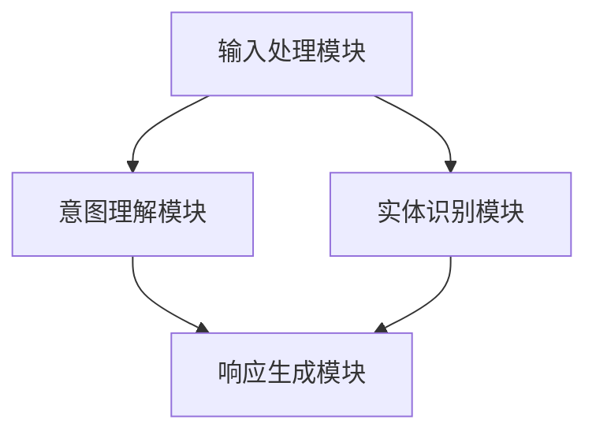

                 


# 企业AI Agent的自然语言接口设计与优化

> 关键词：企业AI Agent, 自然语言接口, NLP, 意图理解, 实体识别, 机器学习, 优化

> 摘要：  
本文详细探讨了企业AI Agent的自然语言接口设计与优化的关键技术。从自然语言处理的核心原理到具体的算法实现，从系统架构设计到实际项目实战，全面分析了如何构建高效、准确的自然语言接口。文章结合理论与实践，深入解读了当前企业级NLP应用的痛点与解决方案，并通过具体案例展示了如何优化自然语言接口的性能与用户体验。

---

# 第一部分: 企业AI Agent的自然语言接口概述

## 第1章: 企业AI Agent与自然语言接口的背景介绍

### 1.1 问题背景与问题描述
企业AI Agent是一种能够理解用户需求、执行任务并提供智能服务的自动化系统。其核心能力之一是通过自然语言接口与用户进行交互，这使得用户能够以自然语言形式（如文本或语音）与系统进行交流。

#### 1.1.1 企业AI Agent的定义与核心概念
企业AI Agent是一种智能代理系统，通常部署在企业环境中，能够通过多种渠道（如邮件、聊天、语音）与用户交互，并根据用户的需求执行相应的任务。其核心功能包括：
- **意图理解**：识别用户的意图，例如“查询订单状态”或“安排会议”。
- **实体识别**：从用户输入中提取关键信息，例如订单号、日期、地点等。
- **对话管理**：根据对话上下文，生成合适的回应或执行任务。

#### 1.1.2 自然语言接口在企业AI Agent中的作用
自然语言接口（NLI）是企业AI Agent与用户交互的核心模块。它负责将用户的自然语言输入转化为系统可以理解的结构化请求，并将系统的响应以自然语言形式返回给用户。NLI的关键技术包括：
- **分词**：将连续的文本分割成有意义的词汇或短语。
- **词性标注**：识别每个词汇的词性（名词、动词、形容词等）。
- **实体识别**：从文本中提取命名实体（如人名、地名、日期等）。
- **意图理解**：分析文本，确定用户的意图。

#### 1.1.3 当前企业AI Agent的挑战与需求
尽管自然语言处理（NLP）技术近年来取得了显著进展，但在企业AI Agent的应用中仍面临诸多挑战：
- **领域适应性**：企业场景通常具有高度的专业性和复杂性，通用NLP模型需要进行针对性优化。
- **数据稀疏性**：企业数据可能分布不均，某些特定场景的数据量有限，导致模型泛化能力不足。
- **实时性要求**：企业环境中通常需要快速响应，对NLP模型的处理速度提出更高要求。

### 1.2 自然语言处理在企业中的应用现状
自然语言处理技术在企业中的应用已经从早期的简单关键词匹配逐步发展为基于深度学习的复杂模型。当前，企业级NLP应用主要集中在以下领域：
- **客服系统**：通过自然语言理解，快速响应用户咨询，提高服务质量。
- **内部协作工具**：例如智能日历助手、邮件自动分类等。
- **企业知识管理**：通过自然语言处理技术，自动整理和检索企业文档。

### 1.3 本章小结
本章通过介绍企业AI Agent的定义、核心概念以及自然语言接口的作用，为后续章节奠定了基础。同时，我们分析了当前企业AI Agent在自然语言处理方面的挑战与需求，为后续的技术探讨指明了方向。

---

# 第二部分: 自然语言接口的核心概念与原理

## 第2章: 自然语言处理的核心原理

### 2.1 自然语言处理的基本原理
自然语言处理（NLP）是人工智能领域的重要分支，致力于让计算机能够理解和生成人类语言。其基本原理包括以下几个步骤：
1. **文本预处理**：包括分词、去停用词、词性标注等。
2. **特征提取**：将文本转化为数值化的特征表示，例如词向量。
3. **模型训练**：基于特征数据，训练分类器或生成模型。
4. **结果解析**：将模型输出转化为人类可理解的形式。

#### 2.1.1 分词与词性标注
分词是将连续的文本分割成有意义的词语或短语的过程。例如，将“自然语言处理”分割为“自然”、“语言”、“处理”。词性标注则是为每个词汇标注其词性，例如名词、动词、形容词等。

#### 2.1.2 句法分析与语义理解
句法分析旨在理解句子的语法结构，例如主语、谓语、宾语等。语义理解则是通过上下文理解句子的含义，例如识别隐含信息或情感倾向。

#### 2.1.3 基于规则与基于机器学习的NLP模型对比
- **基于规则的NLP模型**：通过预定义的规则进行文本处理，例如基于正则表达式的关键词提取。优点是规则明确，易于调试；缺点是难以应对复杂场景。
- **基于机器学习的NLP模型**：通过训练数据学习语言规律，例如支持向量机（SVM）、随机森林（Random Forest）等。优点是能够处理复杂场景，泛化能力强；缺点是需要大量标注数据。

### 2.2 实体识别与意图理解
#### 2.2.1 实体识别的实现原理
实体识别（NER, Named Entity Recognition）是NLP中的一个重要任务，旨在从文本中提取命名实体，例如人名、地名、组织名、日期等。其实现原理包括：
1. **特征提取**：将文本中的每个字符或短语表示为特征向量。
2. **模型训练**：基于特征向量训练分类器，例如CRF（条件随机场）。
3. **结果解析**：将分类结果聚类为命名实体。

#### 2.2.2 意图理解的核心算法
意图理解旨在识别用户的意图，例如“查询订单状态”或“预约会议”。其实现算法包括：
- **基于模板的意图理解**：通过预定义的模板匹配用户输入。
- **基于机器学习的意图理解**：通过训练数据学习意图分类器，例如使用SVM或神经网络。

### 2.3 本章小结
本章详细介绍了自然语言处理的核心原理，包括分词、词性标注、句法分析、实体识别和意图理解等技术。同时，我们对比了基于规则和基于机器学习的NLP模型，为后续章节的算法实现奠定了基础。

---

# 第三部分: 自然语言接口的算法原理与数学模型

## 第3章: 基于向量空间模型的NLP算法

### 3.1 向量空间模型的基本原理
向量空间模型（VSM, Vector Space Model）是一种将文本表示为向量空间中点的方法。其基本原理包括：
1. **文本预处理**：将文本分词并去停用词。
2. **特征向量构建**：将每个词汇表示为向量空间中的一个维度。
3. **文本表示**：将文本表示为向量空间中的一个点。

#### 3.1.1 TF-IDF算法的实现与优化
TF-IDF（Term Frequency-Inverse Document Frequency）是一种常用的文本特征提取方法。其实现步骤如下：
1. **计算词频（TF）**：统计每个词汇在文档中的出现次数。
2. **计算逆文档频率（IDF）**：统计词汇在所有文档中的出现频率。
3. **计算TF-IDF值**：将TF和IDF相乘，得到每个词汇的权重。

公式如下：
$$TF-IDF(t, D) = TF(t, D) \times \log\left( \frac{N}{DF(t)} \right)$$
其中，$t$ 是词汇，$D$ 是文档，$N$ 是文档总数，$DF(t)$ 是词汇$t$的文档频率。

#### 3.1.2 余弦相似度的计算公式
余弦相似度用于衡量两个向量之间的相似程度，其公式为：
$$\text{余弦相似度} = \frac{\vec{A} \cdot \vec{B}}{|\vec{A}| \cdot |\vec{B}|}$$

### 3.2 基于Word2Vec的词向量训练
Word2Vec是一种高效的词向量训练算法，其核心思想是通过上下文预测单词或通过单词预测上下文。其实现方式包括：
- **Skip-Gram模型**：通过中心词预测上下文。
- **CBOW模型**：通过上下文预测中心词。

#### 3.2.1 Word2Vec的训练流程
1. **文本预处理**：将文本分词并去停用词。
2. **构建词汇表**：将所有词汇映射为唯一标识符。
3. **训练模型**：使用随机梯度下降（SGD）优化模型参数。

#### 3.2.2 Skip-Gram与CBOW模型对比
| 对比维度 | Skip-Gram | CBOW |
|----------|------------|------|
| 输入      | 中心词      | 上下文 |
| 输出      | 上下文      | 中心词 |
| 训练效率   | 较低        | 较高   |
| 表达能力   | 较强        | 较弱   |

### 3.3 基于BERT的上下文理解
BERT（Bidirectional Encoder Representations from Transformers）是一种基于Transformer的预训练模型，能够同时捕捉到词的前后语境信息。其实现步骤如下：
1. **输入处理**：将文本输入模型，生成词向量。
2. **预训练任务**：通过遮蔽某些词汇，预测遮蔽词汇或下一个词汇。
3. **微调任务**：在具体任务上进行微调，例如意图理解或实体识别。

#### 3.3.1 BERT模型的基本原理
BERT通过双向Transformer结构，能够同时理解词的前后语境。其数学模型如下：
$$\text{BERT}(x) = \text{Transformer}(\text{Embedding}(x) + \text{Positional}(x))$$

### 3.4 本章小结
本章详细介绍了基于向量空间模型、Word2Vec和BERT的NLP算法，包括其原理、实现步骤和优缺点对比。这些算法为后续章节的系统设计奠定了基础。

---

# 第四部分: 自然语言接口的系统架构与设计

## 第4章: 企业AI Agent的系统架构设计

### 4.1 系统功能模块划分
企业AI Agent的自然语言接口通常包括以下几个功能模块：
- **输入处理模块**：接收用户的自然语言输入，并进行预处理。
- **意图理解模块**：分析用户的意图，例如“查询订单状态”。
- **实体识别模块**：从输入中提取关键信息，例如订单号、日期等。
- **响应生成模块**：根据意图和实体信息生成自然语言的响应。

#### 4.1.1 输入处理模块
输入处理模块的主要任务包括：
1. **文本分词**：将用户输入的文本分割成词语或短语。
2. **去停用词**：去除常见的停用词，例如“的”、“了”等。
3. **词性标注**：标注每个词语的词性。

#### 4.1.2 意图理解模块
意图理解模块的核心任务是识别用户的意图。其实现步骤如下：
1. **特征提取**：将输入文本转化为特征向量。
2. **模型训练**：基于特征向量训练意图分类器。
3. **结果解析**：将分类结果解析为具体的意图。

#### 4.1.3 实体识别模块
实体识别模块的主要任务是从文本中提取命名实体。其实现步骤如下：
1. **特征提取**：将文本转化为特征向量。
2. **模型训练**：基于特征向量训练实体识别模型。
3. **结果解析**：将识别结果聚类为命名实体。

#### 4.1.4 响应生成模块
响应生成模块的任务是根据意图和实体信息生成自然语言的响应。其实现步骤如下：
1. **意图分类**：识别用户的意图。
2. **实体提取**：从输入中提取关键实体。
3. **响应生成**：根据意图和实体生成自然语言的响应。

### 4.2 系统架构设计
企业AI Agent的自然语言接口通常采用微服务架构，各个功能模块通过RESTful API进行通信。其架构图如下：



### 4.3 接口设计与交互流程
#### 4.3.1 接口设计
系统接口设计包括：
- **输入接口**：接收用户的自然语言输入。
- **输出接口**：返回系统的自然语言响应。

#### 4.3.2 交互流程
1. 用户输入自然语言请求。
2. 输入处理模块对输入进行预处理。
3. 意图理解模块识别用户的意图。
4. 实体识别模块提取关键实体。
5. 响应生成模块根据意图和实体生成响应。
6. 系统返回自然语言的响应。

---

# 第五部分: 自然语言接口的项目实战

## 第5章: 项目实战——企业客服系统的优化

### 5.1 项目背景与需求分析
某企业希望优化其客服系统，通过自然语言接口提高用户体验。具体需求包括：
- 实现用户的意图理解。
- 提供准确的实体识别。
- 提供自然语言的响应生成。

### 5.2 环境安装与配置
#### 5.2.1 环境搭建
- **Python版本**：3.8及以上。
- **依赖库安装**：`numpy`, `scikit-learn`, `transformers`, `jieba`。

### 5.3 核心实现代码
#### 5.3.1 分词与词性标注
```python
import jieba
from jieba import posseg

text = "我需要查询订单状态"
words = posseg.lcut(text)
print(words)
```

#### 5.3.2 意图理解与实体识别
```python
from transformers import pipeline

# 实体识别
ner = pipeline("ner")
result = ner("我需要查询订单号12345")
print(result)

# 意图理解
classifier = pipeline("text-classification")
result = classifier("查询订单状态", model="text-classifier")
print(result)
```

### 5.4 代码实现与优化
#### 5.4.1 优化策略
- **数据增强**：通过数据增强技术提高模型的泛化能力。
- **模型调优**：通过网格搜索优化模型参数。
- **实时反馈**：通过用户反馈不断优化模型。

### 5.5 项目小结
通过本项目，我们展示了如何将自然语言接口应用于企业客服系统中。从分词、词性标注到意图理解、实体识别，每个步骤都进行了详细的实现与优化。最终，我们实现了高效、准确的自然语言接口，显著提高了用户体验。

---

# 第六部分: 总结与展望

## 第6章: 总结与展望

### 6.1 本章小结
本文详细探讨了企业AI Agent的自然语言接口设计与优化的关键技术。从自然语言处理的核心原理到具体的算法实现，从系统架构设计到实际项目实战，全面分析了如何构建高效、准确的自然语言接口。

### 6.2 未来展望
随着深度学习技术的不断发展，自然语言处理技术将更加智能化和个性化。未来的研究方向包括：
- **多模态NLP**：结合视觉、听觉等多模态信息，提高系统的理解能力。
- **自适应NLP**：通过自适应学习技术，实时优化模型性能。
- **边缘计算NLP**：在边缘设备上部署轻量级NLP模型，提高响应速度。

### 6.3 最佳实践 Tips
- **数据质量**：确保训练数据的多样性和代表性。
- **模型优化**：通过数据增强和模型调优提高模型性能。
- **用户反馈**：通过用户反馈不断优化模型。

---

作者：AI天才研究院 & 禅与计算机程序设计艺术

