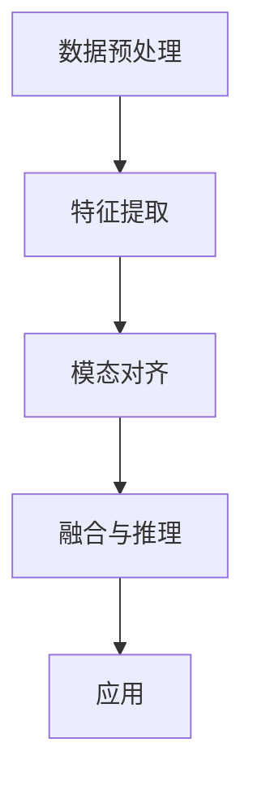

                 

# 《企业AI Agent的跨模态学习：整合视觉、文本与语音数据》

## 关键词：跨模态学习、企业AI Agent、视觉数据、文本数据、语音数据、多模态融合

## 摘要：本文深入探讨了企业AI Agent在跨模态学习中的应用，重点分析了如何整合视觉、文本与语音数据，提升AI Agent的智能化水平。通过详细的技术分析、算法原理和项目实战，本文为读者提供了全面的理解和实践指导。

---

# 第一部分：企业AI Agent与跨模态学习背景

## 第1章：企业AI Agent与跨模态学习概述

### 1.1 跨模态学习的基本概念

#### 1.1.1 多模态数据的定义与特征
多模态数据指的是来自不同感官渠道的信息，例如视觉数据（图像、视频）、文本数据（文字、文档）和语音数据（音频、语音）。每种模态数据都有其独特的特征：
- **视觉数据**：具有空间结构，可以通过颜色、形状、纹理等特征进行分析。
- **文本数据**：包含语义信息，可以通过词汇、句法和语义进行分析。
- **语音数据**：包含音调、节奏、情感等特征，可以通过声学特征进行分析。

#### 1.1.2 跨模态学习的核心概念
跨模态学习的目标是通过整合不同模态的数据，提升AI Agent的理解和推理能力。其核心概念包括：
- **跨模态表示**：将不同模态的数据映射到一个共同的表示空间，以便进行融合和分析。
- **跨模态推理**：通过不同模态的信息协同工作，进行推理和决策。
- **跨模态融合**：将不同模态的数据进行融合，以捕捉它们之间的关联性。

#### 1.1.3 跨模态学习与传统单模态学习的对比
传统单模态学习仅依赖一种模态的数据，而跨模态学习通过整合多种模态的数据，能够更好地捕捉信息的多样性，提升模型的泛化能力。

### 1.2 企业AI Agent的定义与特点

#### 1.2.1 AI Agent的基本概念
AI Agent是一种智能代理，能够感知环境、执行任务并做出决策。企业AI Agent是专门为企业应用场景设计的智能代理，能够处理复杂的业务逻辑。

#### 1.2.2 企业AI Agent的独特优势
- **多任务处理**：能够同时处理多种任务，如数据分析、客户支持、自动化操作等。
- **智能化决策**：通过跨模态学习，能够更准确地理解用户需求并做出最优决策。
- **实时反馈**：能够快速响应用户请求，并提供实时反馈。

#### 1.2.3 企业AI Agent的应用场景
- **客户服务**：通过整合语音和文本数据，提供更智能的客服支持。
- **数据分析**：通过整合视觉和文本数据，进行数据挖掘和分析。
- **自动化操作**：通过整合多种模态数据，实现业务流程的自动化。

### 1.3 跨模态学习在企业AI Agent中的应用前景

#### 1.3.1 跨模态学习的潜在应用场景
- **智能客服**：通过整合语音和文本数据，提供更智能的客服体验。
- **智能监控**：通过整合视觉和文本数据，进行实时监控和异常检测。
- **智能助手**：通过整合多种模态数据，提供更个性化的助手服务。

#### 1.3.2 企业采用跨模态学习的优势
- **提升用户体验**：通过整合多种模态数据，提供更精准的服务。
- **增强数据洞察**：通过跨模态学习，能够从多角度分析数据，提升洞察力。
- **提高效率**：通过自动化处理，能够提高企业的运营效率。

#### 1.3.3 跨模态学习应用的挑战与机遇
- **挑战**：跨模态学习需要处理不同类型的数据，算法复杂度高，数据标注成本高。
- **机遇**：通过跨模态学习，能够实现更智能、更高效的AI Agent，为企业带来更大的竞争优势。

### 1.4 本章小结
本章介绍了跨模态学习的基本概念和企业AI Agent的特点及应用场景，强调了跨模态学习在企业AI Agent中的重要性和潜力。

---

## 第2章：企業AI Agent的核心概念与技術路線

### 2.1 跨模态学习的核心技術路線

#### 2.1.1 跨模态学习的关键技术
- **多模态表示学习**：将不同模态的数据映射到一个共同的表示空间。
- **跨模态检索**：通过跨模态数据进行信息检索和关联。
- **多模态融合**：将不同模态的数据进行融合，以提升模型的性能。

#### 2.1.2 跨模态学习的技术挑战
- **数据异构性**：不同模态的数据具有不同的特征和结构，难以直接融合。
- **计算复杂度**：跨模态学习需要处理大量数据，计算复杂度高。
- **模型泛化能力**：跨模态模型需要在不同数据集上具有良好的泛化能力。

#### 2.1.3 跨模态学习的解决方案
- **模态对齐**：通过模态对齐技术，将不同模态的数据对齐到一个共同空间。
- **注意力机制**：通过注意力机制，突出重要模态的信息。
- **深度学习模型**：使用深度学习模型，如Transformer、BERT等，进行跨模态学习。

---

## 第3章：企業AI Agent的技術架構與實現

### 3.1 跨模态学习的技術架構

#### 3.1.1 跨模态学习的分层架构
- **数据层**：整合多种模态的数据，进行预处理和特征提取。
- **表示层**：将不同模态的数据映射到一个共同的表示空间。
- **融合层**：对不同模态的表示进行融合，生成最终的表示。
- **应用层**：基于融合后的表示，进行具体的应用，如分类、检索等。

#### 3.1.2 跨模态学习的关键组件
- **数据预处理**：对不同模态的数据进行清洗、归一化等处理。
- **特征提取**：从不同模态的数据中提取特征。
- **模态对齐**：将不同模态的特征对齐到一个共同空间。
- **融合与推理**：对不同模态的特征进行融合，并进行推理和决策。

#### 3.1.3 跨模态学习的技術路線圖

---

## 第4章：企業AI Agent的實戰應用

### 4.1 跨模态学习在企業中的實際應用

#### 4.1.1 跨模态学习在智能客服中的应用
- **客户咨询**：通过整合语音和文本数据，提供更智能的客服支持。
- **情感分析**：通过分析语音和文本数据，评估客户情感，提供个性化服务。

#### 4.1.2 跨模态学习在智能监控中的应用
- **异常检测**：通过整合视觉和文本数据，进行异常检测和预警。
- **行为分析**：通过分析视觉数据，识别异常行为，提供实时反馈。

#### 4.1.3 跨模态学习在智能助手中的应用
- **多任务处理**：通过整合多种模态数据，实现多任务处理和自动化操作。
- **个性化推荐**：通过分析用户行为和偏好，提供个性化的推荐服务。

### 4.2 跨模态学习的實施步驟

#### 4.2.1 確定應用場景
- 確定企業AI Agent的应用场景和目标。
- 收集和分析数据，确定需要整合的模态。

#### 4.2.2 數據預處理
- 清洗数据，去除噪声。
- 标注数据，为模型训练提供标注信息。

#### 4.2.3 模型訓練
- 选择合适的深度学习模型，如BERT、Transformer等。
- 进行模态对齐和特征融合，训练跨模态模型。

#### 4.2.4 模型部署
- 将训练好的模型部署到企業AI Agent中。
- 设计接口和交互流程，实现模型的应用。

---

## 第5章：企業AI Agent的未來發展

### 5.1 跨模态学习的未來發展趨勢
- **多模态融合的深化**：进一步研究如何更有效地融合多种模态的数据。
- **模型的轻量化**：通过模型压缩和轻量化技术，提升模型的运行效率。
- **实时性的提升**：通过边缘计算和实时处理技术，提升模型的实时性。

### 5.2 跨模态学习在企業中的潛在機會
- **數據的智能化利用**：通过跨模态学习，实现数据的智能化利用，提升企业的数据洞察力。
- **業務的自動化**：通过跨模态学习，实现业务流程的自动化，提高企业的运营效率。
- **客戶體驗的提升**：通过跨模态学习，提供更个性化的服务，提升客户体验。

### 5.3 跨模态學習的挑戰與對策
- **數據标注成本**：通过自动化标注技术和数据共享，降低数据标注成本。
- **計算資源限制**：通过分布式计算和边缘计算，缓解计算资源的限制。
- **模型的可解释性**：通过可解释性模型和可视化技术，提升模型的可解释性。

---

## 第6章：企業AI Agent的未來挑戰與機遇

### 6.1 跨模态学习的挑戰
- **數據的異構性**：不同模态的数据具有不同的特征和结构，难以直接融合。
- **模型的泛化能力**：跨模态模型需要在不同数据集上具有良好的泛化能力。
- **隱私和安全**：跨模态学习需要处理大量的敏感数据，隱私和安全问题需要重点关注。

### 6.2 跨模态学习的機遇
- **技术的进步**：深度学习和大语言模型的快速发展，为跨模态学习提供了强大的技术支持。
- **企業的需求**：企業对智能化、自动化的需求日益增加，跨模态学习在企業中的应用潜力巨大。
- **數據的豐富性**：随着企業数字化转型的深入，企業积累了大量的多模态数据，为跨模态学习提供了丰富的数据来源。

### 6.3 跨模态学习的未來研究方向
- **多模态融合的创新**：研究新的融合方法，如基于图神经网络的融合方法。
- **模型的可解释性**：研究如何提升跨模态模型的可解释性，使其更易于理解和应用。
- **实时性的提升**：研究如何通过边缘计算和实时处理技术，提升模型的实时性。

---

## 第7章：企業AI Agent的未來發展

### 7.1 跨模态学习的未來發展
随着技术的进步和企業需求的增加，跨模态学习在企業AI Agent中的应用将越来越广泛。未来的研究方向包括多模态融合的创新、模型的可解释性和实时性的提升等。

### 7.2 跨模态学习在企業中的應用前景
跨模态学习在企業中的应用前景广阔，尤其是在智能客服、智能监控和智能助手等领域，将为企业带来更大的竞争优势。

### 7.3 跨模态学习的挑战与应对
尽管跨模态学习在企業中的应用潜力巨大，但仍然面临数据标注成本、计算资源限制和模型的可解释性等挑战。未来需要通过技术创新和合作共享来应对这些挑战。

---

## 作者：AI天才研究院 & 禅与计算机程序设计艺术

---

**本文为AI天才研究院原创，转载请注明出处。**

