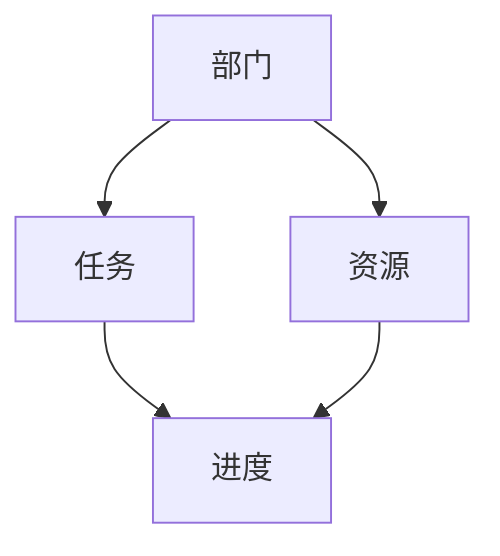
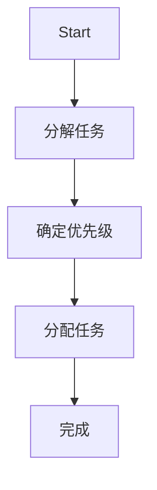
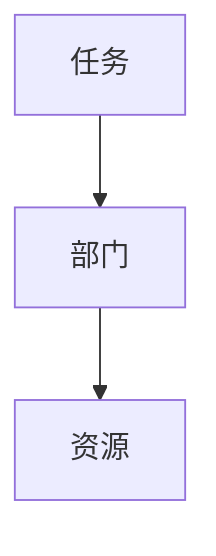
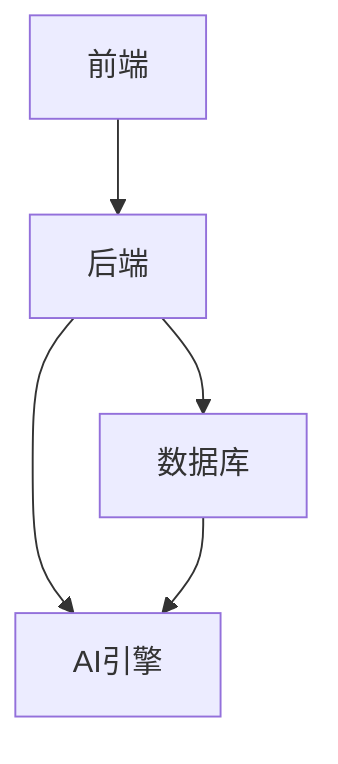

                 


# 企业AI Agent的跨部门协作功能设计与实现

## 关键词：AI Agent, 跨部门协作, 企业数字化转型, 系统架构设计, 项目实战

## 摘要：  
随着企业数字化转型的深入推进，AI Agent（人工智能代理）在跨部门协作中的应用越来越广泛。本文从AI Agent的基本概念出发，详细探讨其在跨部门协作中的核心功能、算法原理、系统架构设计、项目实现及最佳实践。通过对AI Agent在企业中的实际应用场景分析，结合具体案例，为读者提供一套完整的跨部门协作功能设计与实现方案，助力企业提升协作效率和智能化水平。

---

# 第一部分：企业AI Agent的背景与概念

## 第1章：AI Agent的基本概念与背景

### 1.1 什么是AI Agent
#### 1.1.1 AI Agent的定义
AI Agent（人工智能代理）是指能够感知环境、自主决策并执行任务的智能实体。它能够通过数据输入、模型推理和任务执行，帮助企业在复杂场景中实现自动化和智能化。

#### 1.1.2 AI Agent的核心特征
- **自主性**：能够在没有外部干预的情况下独立运行。
- **反应性**：能够实时感知环境变化并做出响应。
- **目标导向性**：基于预设目标或用户需求，执行特定任务。
- **协作性**：能够与其他系统、部门或人员协同工作。

#### 1.1.3 AI Agent与传统软件的区别
| 特性         | 传统软件           | AI Agent             |
|--------------|--------------------|-----------------------|
| 智能性       | 无或有限           | 高度智能化             |
| 自主性       | 依赖人工干预       | 自主决策和执行         |
| 适应性       | 固定功能           | 能够适应环境变化       |

---

### 1.2 跨部门协作的重要性
#### 1.2.1 跨部门协作的定义
跨部门协作是指不同部门之间通过共享信息、资源和任务分工，共同完成企业目标的过程。

#### 1.2.2 跨部门协作在企业中的价值
- **提升效率**：通过任务分工和资源共享，减少重复劳动，提高整体效率。
- **优化决策**：跨部门协作能够整合不同领域的信息，提供更全面的决策支持。
- **增强灵活性**：面对复杂问题时，跨部门协作能够快速响应，灵活调整策略。

#### 1.2.3 跨部门协作的挑战
- **信息孤岛**：各部门之间数据不共享，导致信息碎片化。
- **沟通不畅**：部门间缺乏有效沟通，导致任务执行偏差。
- **目标不一致**：各部门目标不同，难以达成一致。

---

### 1.3 企业AI Agent的背景与趋势
#### 1.3.1 数字化转型的背景
随着企业数字化转型的推进，AI技术逐渐成为企业提升竞争力的核心驱动力。

#### 1.3.2 AI技术在企业中的应用现状
- **客服领域**：智能客服机器人通过自然语言处理技术解决客户问题。
- **销售领域**：AI Agent协助销售团队进行客户筛选和精准营销。
- **研发领域**：AI Agent辅助工程师进行数据分析和模型优化。

#### 1.3.3 跨部门协作中的AI Agent趋势
- **智能化**：AI Agent通过深度学习和自然语言处理技术，实现更智能的协作。
- **实时化**：AI Agent能够实时感知环境变化，快速响应协作需求。
- **平台化**：AI Agent平台化发展，支持多部门协同工作。

---

## 第2章：企業AI Agent的核心概念

### 2.1 跨部门协作的核心要素
#### 2.1.1 任务分解
任务分解是指将复杂的任务分解为多个子任务，由不同部门或人员完成。

#### 2.1.2 资源分配
资源分配是指根据任务需求，合理分配人、财、物等资源。

#### 2.1.3 进度跟踪
进度跟踪是指实时监控任务执行情况，确保任务按时完成。

### 2.2 AI Agent在协作中的角色
#### 2.2.1 信息整合者
AI Agent能够整合各部门的信息，形成统一的数据源。

#### 2.2.2 任务分配者
AI Agent根据任务优先级和部门能力，自动分配任务。

#### 2.2.3 进度监控者
AI Agent实时跟踪任务进度，及时发现和解决问题。

### 2.3 跨部门协作的ER实体关系图


---

## 第3章：AI Agent的算法原理与实现

### 3.1 任务分解算法
#### 3.1.1 基于优先级的任务分解


#### 3.1.2 数学模型
$$p_i = \frac{1}{1 + e^{-k_i}}$$
其中，$k_i$ 是任务的关键性指标。

---

### 3.2 知识表示与推理
#### 3.2.1 知识图谱构建


#### 3.2.2 推理算法
基于规则的推理和基于概率的推理。

---

### 3.3 系统架构设计
#### 3.3.1 功能模块划分
- 任务管理模块
- 资源分配模块
- 进度监控模块

#### 3.3.2 系统架构图


---

## 第4章：项目实战与实现

### 4.1 项目背景与需求分析
- **项目背景**：企业需要实现跨部门协作的智能化。
- **需求分析**：识别关键需求，如任务分配、进度跟踪等。

### 4.2 核心代码实现
#### 4.2.1 任务分配算法
```python
def assign_task(department, task):
    priority = calculate_priority(department, task)
    return priority

def calculate_priority(department, task):
    # 假设部门和任务的权重已预设
    return department.weight * task.priority
```

#### 4.2.2 任务执行与反馈
```python
def execute_task(task):
    if task.completed:
        return "Task completed"
    else:
        return "Task failed"
```

---

## 第5章：最佳实践与总结

### 5.1 最佳实践
- **模块化设计**：将系统功能模块化，便于维护和扩展。
- **日志监控**：实时监控系统运行状态，及时发现和解决问题。
- **版本控制**：使用版本控制工具管理代码和配置。

### 5.2 项目总结
通过本项目，我们实现了AI Agent在跨部门协作中的核心功能，验证了其在企业中的应用价值。

---

## 第6章：注意事项与扩展阅读

### 6.1 注意事项
- **数据安全**：确保数据在传输和存储过程中的安全性。
- **用户体验**：优化用户界面，提升用户体验。

### 6.2 扩展阅读
- 推荐书籍：《人工智能：一种现代的方法》
- 推荐博客：AI Agent技术博客

---

## 作者：AI天才研究院 & 禅与计算机程序设计艺术

