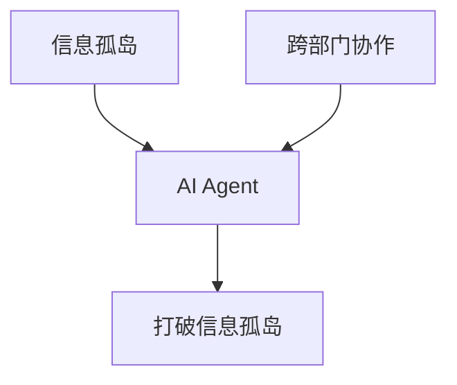
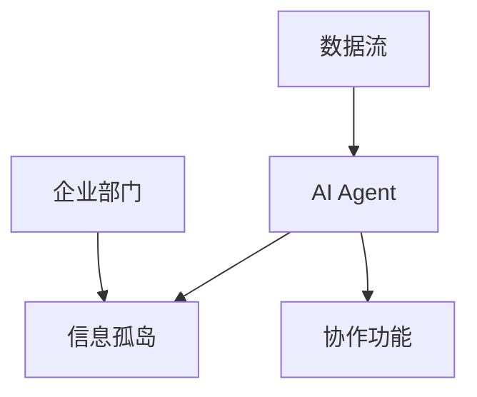
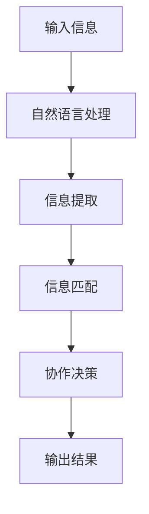
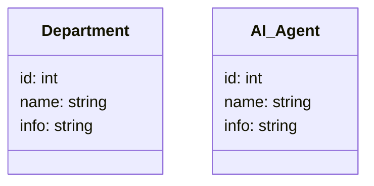
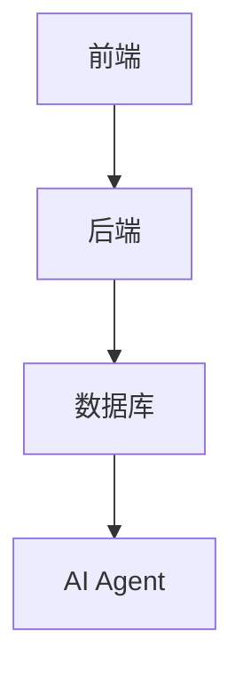

                 

<think>
好的，现在我要帮用户撰写一篇关于《企业AI Agent的跨部门协作功能：打破信息孤岛》的技术博客文章。用户的要求非常详细，包括目录结构、内容深度和格式。我需要仔细分析用户的需求，确保每个部分都覆盖到位。

首先，我注意到用户希望文章有逻辑清晰的结构，包括摘要、关键词和目录大纲。我需要先确定这些部分的内容，确保它们符合用户的指导。

用户希望文章分为七个章节，每个章节下还有多个小节，甚至三级目录。这意味着我需要详细规划每个部分的内容，确保覆盖背景、核心概念、算法、系统架构、项目实战和总结。

接下来，我注意到用户强调使用技术语言，但又要简单易懂。这意味着我需要在专业术语和通俗解释之间找到平衡，确保读者能够理解。

在算法部分，用户要求使用Mermaid流程图和Python代码示例。我需要准备这些图表和代码，确保它们准确无误，并附上详细的解释。

系统架构部分需要ER实体关系图和领域模型类图，这需要我绘制相应的Mermaid图表，并解释每个部分的功能和交互关系。

项目实战部分需要分步骤指导读者如何安装环境、实现核心功能，并通过案例分析来巩固理解。这要求我提供具体的代码示例和详细的操作步骤。

最后，用户要求在文章末尾添加作者信息和扩展资源。我需要确保这些部分不遗漏，并且格式正确。

总结一下，我需要：

1. 撰写文章标题、关键词和摘要，确保符合用户要求。
2. 按照目录大纲撰写每个章节，确保内容详细且逻辑清晰。
3. 使用技术术语，但保持语言简单易懂。
4. 包括Mermaid图表、Python代码示例和数学公式，确保格式正确。
5. 确保文章结构完整，每个部分都有足够的细节和解释。

现在，我需要开始撰写每个部分，确保每一步都符合用户的要求，并且内容丰富，能够帮助读者深入理解企业AI Agent的跨部门协作功能如何打破信息孤岛。
</think>

# 企业AI Agent的跨部门协作功能：打破信息孤岛

## 关键词：企业AI Agent，跨部门协作，信息孤岛，自然语言处理，图论，信息流优化，协作决策

## 摘要：  
企业AI Agent是一种能够实现跨部门协作、打破信息孤岛的智能化工具。本文详细探讨了企业AI Agent的核心概念、算法原理、系统架构及其在实际应用中的功能设计。通过自然语言处理和图论等技术，AI Agent能够有效提取、匹配和优化信息流，从而实现高效协作。文章最后结合实际案例，展示了如何通过AI Agent实现跨部门协作，打破信息孤岛，并总结了最佳实践和注意事项。

---

# 第1章：企业AI Agent的背景与问题背景

## 1.1 问题背景

### 1.1.1 企业信息孤岛的现状
企业在运营过程中，常常存在信息孤岛问题。例如，财务部门可能无法及时获取销售数据，而销售部门又无法了解库存情况。这种信息孤岛导致效率低下，甚至影响企业决策。

### 1.1.2 跨部门协作中的效率瓶颈
信息孤岛直接导致跨部门协作效率低下。例如，项目管理团队需要协调研发、市场和客服部门，但由于信息不透明，往往需要多次沟通才能解决问题。

### 1.1.3 信息孤岛对企业发展的潜在风险
信息孤岛不仅影响效率，还可能导致决策失误。例如，市场部门可能因为无法获取最新的研发进展，错失市场机会。

## 1.2 问题描述

### 1.2.1 跨部门协作中的信息传递问题
信息传递不畅是跨部门协作的主要问题。例如，研发部门的进展信息可能无法及时传递给市场部门，导致市场策略滞后。

### 1.2.2 信息孤岛对企业决策的影响
信息孤岛会导致决策者无法获得全面信息，从而做出错误决策。例如，管理层可能因为无法获取财务和销售数据，错误地制定预算计划。

### 1.2.3 跨部门协作中的沟通障碍
沟通障碍是信息孤岛的直接结果。例如，技术部门和市场部门可能因为术语不同，无法有效沟通。

## 1.3 问题解决

### 1.3.1 引入AI Agent的必要性
AI Agent可以通过自动化信息处理和协调，打破信息孤岛。例如，AI Agent可以自动整合各部门数据，生成统一的报告。

### 1.3.2 AI Agent如何解决信息孤岛问题
AI Agent通过自然语言处理和知识图谱技术，能够自动提取、匹配和整合信息。例如，AI Agent可以从邮件、文档和数据库中提取相关信息，生成统一的视图。

### 1.3.3 跨部门协作中的AI Agent功能设计
AI Agent需要具备以下功能：信息抽取、信息匹配、协作决策和结果输出。例如，AI Agent可以抽取销售部门的订单数据，并将其与库存数据匹配，生成采购建议。

## 1.4 问题的边界与外延

### 1.4.1 信息孤岛的边界定义
信息孤岛是指各部门之间信息不共享、不流通的状态。例如，财务部门和销售部门之间的信息不共享，就是信息孤岛。

### 1.4.2 跨部门协作的外延范围
跨部门协作不仅包括信息共享，还包括任务分配和进度跟踪。例如，AI Agent可以自动分配任务，并跟踪各部门的进度。

### 1.4.3 AI Agent在企业中的应用边界
AI Agent的应用范围包括企业内部协作、外部协作和混合协作。例如，AI Agent可以用于企业内部的项目管理和跨企业供应链协作。

## 1.5 核心概念与结构

### 1.5.1 企业AI Agent的核心要素
企业AI Agent的核心要素包括：自然语言处理能力、知识图谱构建能力、协作决策能力和自动化执行能力。例如，AI Agent需要能够理解各部门的文档和邮件。

### 1.5.2 跨部门协作功能的结构化分析
跨部门协作功能可以分为信息抽取、信息匹配、协作决策和结果输出四个阶段。例如，AI Agent需要从各部门提取信息，并将其匹配到统一的格式。

### 1.5.3 信息孤岛与AI Agent的关系图


---

# 第2章：企业AI Agent的核心概念与联系

## 2.1 核心概念原理

### 2.1.1 AI Agent的基本原理
AI Agent通过自然语言处理和知识图谱技术，能够理解、推理和决策。例如，AI Agent可以理解邮件中的请求，并根据知识图谱中的信息做出响应。

### 2.1.2 跨部门协作的核心机制
跨部门协作的核心机制包括信息抽取、信息匹配和协作决策。例如，AI Agent需要从各部门的信息中抽取关键数据，并将其匹配到统一的格式。

### 2.1.3 信息孤岛的形成与消除原理
信息孤岛的形成主要是因为各部门之间的信息不共享。AI Agent通过自动化信息整合和协调，可以消除信息孤岛。

## 2.2 核心概念属性特征对比

### 2.2.1 跨部门协作功能的属性对比表
| 属性 | 跨部门协作 | AI Agent |
|------|------------|----------|
| 输入 | 各部门数据 | 自然语言 |
| 输出 | 协作结果 | 决策建议 |
| 核心技术 | 信息匹配 | 自然语言处理 |

### 2.2.2 AI Agent的核心功能对比表
| 功能 | 信息抽取 | 信息匹配 | 协作决策 |
|------|----------|----------|----------|
| 输入 | 文档数据 | 匹配规则 | 决策模型 |
| 输出 | 结构化数据 | 匹配结果 | 最优方案 |

### 2.2.3 信息孤岛与AI Agent的对比分析
信息孤岛是AI Agent的目标，AI Agent通过自动化协作打破信息孤岛。例如，AI Agent可以通过知识图谱将各部门的信息整合到一个统一的平台中。

## 2.3 ER实体关系图



---

# 第3章：企业AI Agent的算法原理

## 3.1 算法原理概述

### 3.1.1 基于自然语言处理的协作机制
自然语言处理（NLP）是AI Agent的核心技术之一。例如，AI Agent需要理解各部门的邮件和文档，提取关键信息。

### 3.1.2 基于图论的信息流优化算法
图论中的最短路径算法可以用于优化信息流。例如，AI Agent可以通过构建信息流图，找到信息传递的最短路径。

### 3.1.3 基于强化学习的决策优化
强化学习（Reinforcement Learning）可以用于协作决策。例如，AI Agent可以通过强化学习优化决策策略。

## 3.2 算法流程图



## 3.3 算法实现代码

```python
def process_information(input_text):
    # 自然语言处理模块
    processed_text = nlp(input_text)
    # 信息提取模块
    extracted_info = extract(processed_text)
    # 信息匹配模块
    matched_info = match(extracted_info)
    # 协作决策模块
    decision = decide(matched_info)
    return decision
```

---

# 第4章：企业AI Agent的系统架构与设计

## 4.1 问题场景介绍

### 4.1.1 项目背景
例如，某企业需要协调研发、市场和客服部门，优化项目管理流程。

### 4.1.2 项目目标
通过AI Agent实现跨部门协作，打破信息孤岛，提高效率。

## 4.2 系统功能设计

### 4.2.1 领域模型


### 4.2.2 系统架构


### 4.2.3 系统交互
```mermaid
sequenceDiagram
actor User
User ->> A[发送请求]
A ->> B[处理请求]
B ->> C[查询数据库]
C ->> D[调用AI Agent]
D ->> B[返回结果]
B ->> User[显示结果]
```

## 4.3 系统接口设计

### 4.3.1 API接口
例如，AI Agent提供以下API接口：
- `extract(text)`：从文本中提取信息。
- `match(info)`：匹配信息。
- `decide(info)`：做出决策。

### 4.3.2 接口文档
API接口文档需要详细描述输入、输出和使用方法。

---

# 第5章：企业AI Agent的项目实战

## 5.1 环境安装

### 5.1.1 安装Python
安装Python 3.x版本。

### 5.1.2 安装NLP库
安装`spaCy`和`transformers`库。

## 5.2 系统核心实现

### 5.2.1 信息抽取模块
代码示例：
```python
import spacy

nlp = spacy.load("en_core_web_sm")
def extract_info(text):
    doc = nlp(text)
    extracted = []
    for token in doc:
        if token.pos_ in ["NOUN", "VERB"]:
            extracted.append(token.text)
    return extracted
```

### 5.2.2 信息匹配模块
代码示例：
```python
from transformers import *

tokenizer = AutoTokenizer.from_pretrained("bert-base-uncased")
model = AutoModel.from_pretrained("bert-base-uncased")
def match_info(text1, text2):
    inputs = tokenizer.encode_plus(text1 + " " + text2, return_tensors="pt", padding=True, truncation=True)
    outputs = model(**inputs)
    return outputs
```

## 5.3 实际案例分析

### 5.3.1 案例背景
例如，某企业需要协调研发和市场部门，优化产品发布流程。

### 5.3.2 实施过程
AI Agent从各部门提取信息，匹配信息，并生成协作决策。

### 5.3.3 实施效果
通过AI Agent，企业实现了信息共享和高效协作，显著提高了效率。

## 5.4 项目小结

### 5.4.1 项目总结
AI Agent在跨部门协作中的应用效果显著。

### 5.4.2 经验与教训
需要注意信息质量和模型优化。

---

# 第6章：企业AI Agent的总结与展望

## 6.1 最佳实践

### 6.1.1 实施建议
逐步实施，从小范围开始。

### 6.1.2 注意事项
确保数据质量和模型优化。

## 6.2 小结

### 6.2.1 核心总结
AI Agent能够有效打破信息孤岛，实现跨部门协作。

### 6.2.2 未来展望
随着AI技术的进步，AI Agent将在企业协作中发挥更大作用。

---

作者：AI天才研究院/AI Genius Institute & 禅与计算机程序设计艺术 /Zen And The Art of Computer Programming

