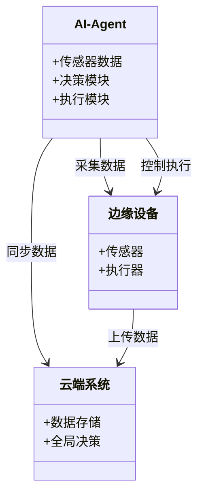
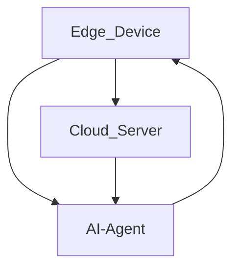

                 

<think>
好的，我现在需要帮助用户撰写一篇关于“企业AI Agent的边缘计算应用：提升响应速度”的技术博客文章。用户已经提供了详细的目录结构，我需要按照这个结构逐步完成每个章节的内容。首先，我会回顾用户的要求，确保理解所有的细节，然后开始撰写每个部分。

首先，用户希望文章结构清晰，内容专业，语言简洁易懂，并且每个章节都要有详细的分析。文章目录包括七章，每章有多个子章节，涵盖从引论到项目实战的内容。我需要确保每个部分都符合用户的要求，包括背景介绍、核心概念、算法原理、系统架构、项目实战等。

开始撰写之前，我需要先确定每章的主要内容和目标。第一章是引论，介绍AI Agent和边缘计算的基本概念，以及它们结合的意义。第二章深入探讨AI Agent的核心原理，包括决策机制和通信机制。第三章讨论边缘计算的技术基础，如体系结构和关键技术。第四章展示AI Agent在边缘计算中的应用场景。第五章分析系统设计与架构，第六章通过项目实战展示实际应用，最后总结并展望未来。

在撰写过程中，我需要确保每个章节都包含必要的部分，如背景介绍、核心概念、算法原理、数学公式、系统架构图和项目代码等。例如，在算法部分，我需要使用Mermaid流程图和Python代码来详细说明，并嵌入数学公式。同时，要确保所有图表和公式正确无误，并且使用合适的格式，如用$$包裹独立的公式，用$包裹段落内的公式。

接下来，我会按照目录结构逐一完成每个章节。首先是第一章，引论部分。我需要解释AI Agent和边缘计算的基本概念，它们的特点，以及如何结合提升企业的响应速度。这部分需要简明扼要，让读者快速理解主题。

然后是第二章，AI Agent的核心概念与原理。这里需要详细讲解决策机制、通信机制和自适应能力，可能需要举一些例子来说明不同类型的AI Agent及其应用场景。同时，要比较AI Agent与传统自动化系统的区别，突出其智能性和自适应性。

第三章讨论边缘计算的技术基础，包括体系结构、关键技术如雾计算和边缘云，以及边缘智能的实现。这部分需要解释边缘计算如何支持AI Agent，并通过对比云计算来突出其优势。

第四章展示AI Agent在边缘计算中的应用场景，如智能制造、智慧城市和智能医疗。每个案例都需要详细说明AI Agent如何在这些领域发挥作用，以及带来的具体好处，如实时数据处理和快速响应。

第五章是系统设计与架构，需要分析系统设计的原则，如模块化设计、可扩展性和容错性。然后绘制系统架构图，展示各模块之间的交互关系，最后通过Mermaid序列图说明接口设计和数据流。

第六章项目实战部分，需要选择一个具体项目，如智能工厂设备监控，展示如何搭建环境、编写代码、设计数据结构，并通过案例分析展示实际效果。

最后，第七章总结与展望，回顾主要内容，总结关键点，并展望未来的发展趋势。同时，提供一些最佳实践和注意事项，帮助读者更好地理解和应用相关技术。

在撰写过程中，我需要确保每个部分都有足够的深度，同时语言简洁明了，适合技术读者阅读。此外，要检查所有图表和公式是否正确嵌入，确保格式无误。最后，添加作者信息，使文章完整。

现在，我可以开始撰写每个章节的内容，按照用户的要求，逐步深入，确保文章结构合理，内容详实，达到高质量的技术博客标准。
</think>

# 企业AI Agent的边缘计算应用：提升响应速度

## 关键词：AI Agent、边缘计算、响应速度、实时性、系统架构、应用场景

## 摘要：  
随着企业数字化转型的深入推进，AI Agent（人工智能代理）在边缘计算中的应用逐渐成为提升企业响应速度和效率的关键技术。本文将从AI Agent的基本概念、边缘计算的技术基础、AI Agent在边缘计算中的应用场景、系统设计与架构、项目实战等方面进行深入分析，探讨如何通过AI Agent与边缘计算的结合，实现企业级应用的快速响应和智能化升级。本文内容涵盖了理论分析、算法实现、系统设计和实际案例，为企业技术决策者和开发人员提供有价值的参考。

---

# 第一章: 企业AI Agent与边缘计算引论

## 1.1 AI Agent的基本概念与特点

### 1.1.1 AI Agent的定义与核心功能  
AI Agent（人工智能代理）是一种能够感知环境、自主决策并执行任务的智能实体。它通过传感器或接口获取外部信息，利用算法进行分析和推理，并通过执行器或通信模块完成目标。AI Agent的核心功能包括：  
- **感知能力**：通过传感器或数据接口获取实时信息。  
- **决策能力**：基于感知信息，利用算法做出决策。  
- **执行能力**：通过执行器或通信模块完成任务。  

### 1.1.2 AI Agent的类型与应用场景  
AI Agent可以根据功能和应用场景分为以下几类：  
1. **简单规则型AI Agent**：基于预定义规则进行决策，适用于任务简单、环境稳定的场景，如智能家居设备。  
2. **基于机器学习的AI Agent**：通过机器学习模型进行决策，适用于复杂环境和动态变化的场景，如自动驾驶系统。  
3. **基于强化学习的AI Agent**：通过强化学习优化行为策略，适用于需要实时反馈和调整的场景，如游戏AI和机器人控制。  

### 1.1.3 AI Agent与传统自动化系统的区别  
AI Agent的核心区别在于其**智能性**和**自主性**。传统自动化系统依赖于预定义的规则和程序，而AI Agent能够通过学习和推理，动态调整行为策略，适应环境变化。  

---

## 1.2 边缘计算的基本概念与特点

### 1.2.1 边缘计算的定义与核心特征  
边缘计算是一种分布式计算范式，将计算能力从云端转移到数据产生的边缘端（如设备、传感器、网关等），实现数据的本地处理和决策。边缘计算的核心特征包括：  
- **低延迟**：数据在本地处理，减少网络传输延迟。  
- **高实时性**：适用于需要实时响应的场景，如工业自动化和智能交通。  
- **本地化资源**：边缘设备通常具备计算、存储和通信能力，能够独立完成任务。  

### 1.2.2 边缘计算的体系结构  
边缘计算的体系结构通常包括以下层次：  
1. **边缘设备层**：包括传感器、摄像头、智能终端等，负责数据采集和初步处理。  
2. **边缘计算层**：包括网关、边缘服务器等，负责数据的处理、分析和存储。  
3. **云端协调层**：与云端系统进行数据同步和任务协同，提供全局决策支持。  

### 1.2.3 边缘计算与云计算的区别与联系  
- **区别**：边缘计算强调数据的本地处理和实时性，而云计算依赖于网络传输，适合大规模数据存储和计算。  
- **联系**：边缘计算可以作为云计算的延伸，通过边缘设备处理实时数据，同时将非实时数据上传到云端进行深度分析。  

---

## 1.3 AI Agent与边缘计算的结合

### 1.3.1 AI Agent在边缘计算中的作用  
AI Agent在边缘计算中扮演着关键角色，能够实现以下功能：  
- **实时数据处理**：通过AI Agent对边缘设备采集的数据进行实时分析和决策。  
- **本地化智能**：AI Agent能够在边缘设备本地完成任务，减少对云端的依赖。  
- **动态调整**：AI Agent能够根据环境变化动态调整行为策略，提升系统的适应性。  

### 1.3.2 边缘计算对AI Agent性能的提升  
边缘计算通过将计算能力下沉到边缘端，显著提升了AI Agent的性能：  
- **降低延迟**：数据在边缘端处理，减少网络传输延迟。  
- **提高效率**：通过本地化计算，减少云端通信的开销。  
- **增强隐私性**：边缘计算可以在本地处理敏感数据，降低数据泄露风险。  

### 1.3.3 AI Agent与边缘计算结合的应用场景  
1. **智能制造**：AI Agent可以监控生产线上的设备状态，实时预测和修复故障。  
2. **智慧城市**：AI Agent可以管理交通信号灯、监控摄像头，实现智能交通调度。  
3. **智能医疗**：AI Agent可以实时分析患者数据，辅助医生进行诊断和治疗决策。  

---

## 1.4 本章小结  
本章介绍了AI Agent和边缘计算的基本概念、特点以及它们的结合方式。AI Agent通过在边缘端的实时处理能力，显著提升了企业的响应速度和效率。接下来的章节将深入探讨AI Agent的核心原理、边缘计算的技术基础，以及它们在实际场景中的应用。

---

# 第二章: AI Agent的核心概念与原理

## 2.1 AI Agent的决策机制

### 2.1.1 基于规则的决策  
基于规则的决策是一种简单但有效的决策方式，适用于任务简单、规则固定的场景。  
- **规则定义**：通过预定义的规则库，AI Agent可以根据输入数据匹配规则，输出决策结果。  
- **应用场景**：如智能家居设备的开关控制。  

### 2.1.2 基于机器学习的决策  
基于机器学习的决策通过训练模型进行预测和分类，适用于复杂场景。  
- **算法选择**：常用算法包括支持向量机（SVM）、随机森林（Random Forest）和神经网络等。  
- **训练数据**：需要大量标注数据进行模型训练。  

### 2.1.3 基于强化学习的决策  
强化学习通过不断试错优化行为策略，适用于需要动态调整的场景。  
- **奖励机制**：通过奖励函数指导AI Agent的学习方向。  
- **应用场景**：如游戏AI和机器人控制。  

---

## 2.2 AI Agent的通信机制

### 2.2.1 本地通信协议  
本地通信协议用于AI Agent与边缘设备之间的数据交互，常用协议包括：  
- **MQTT**：轻量级协议，适用于低带宽场景。  
- **HTTP**：常用的RESTful API协议。  

### 2.2.2 网络通信协议  
网络通信协议用于AI Agent与云端或其他边缘设备之间的交互，常用协议包括：  
- **WebSocket**：支持实时双向通信。  
- **TCP/IP**：适用于可靠的点对点通信。  

### 2.2.3 跨设备通信与数据共享  
跨设备通信需要考虑数据格式的统一和安全性问题，常用技术包括：  
- **Fog Computing**：雾计算通过边缘网关实现设备间的协同。  
- **边缘协同协议**：如边缘计算联盟（ECC）提出的协同规范。  

---

## 2.3 AI Agent的自适应能力

### 2.3.1 自适应学习算法  
自适应学习算法通过在线学习不断优化模型，适用于动态环境。  
- **在线学习**：实时更新模型参数，适应数据变化。  
- **增量学习**：逐步训练模型，减少计算资源消耗。  

### 2.3.2 自适应行为规划  
自适应行为规划通过动态调整行为策略，提升系统的灵活性。  
- **行为树（Behavior Tree）**：通过树状结构定义行为优先级。  
- **状态机（State Machine）**：通过状态转移实现行为切换。  

---

## 2.4 本章小结  
本章深入探讨了AI Agent的核心机制，包括决策机制、通信机制和自适应能力。这些机制共同构成了AI Agent的智能基础，为边缘计算中的应用提供了理论支持。接下来的章节将重点分析边缘计算的技术基础及其在AI Agent中的应用。

---

# 第三章: 边缘计算的技术基础

## 3.1 边缘计算的体系结构

### 3.1.1 边缘计算的分层架构  
边缘计算的分层架构包括：  
1. **边缘设备层**：负责数据采集和初步处理。  
2. **边缘计算层**：负责数据的分析和计算。  
3. **云端协调层**：负责全局决策和数据存储。  

### 3.1.2 边缘节点的功能与角色  
边缘节点是边缘计算的核心单元，通常包括：  
- **计算能力**：如本地服务器或边缘网关。  
- **存储能力**：用于存储本地数据。  
- **通信能力**：支持多种通信协议，实现设备间的交互。  

---

## 3.2 边缘计算的关键技术

### 3.2.1 雾计算（Fog Computing）  
雾计算是一种分布式计算模式，将计算能力扩展到边缘设备。  
- **特点**：低延迟、高实时性。  
- **应用场景**：如智能交通系统和工业物联网。  

### 3.2.2 边缘云（Edge Cloud）  
边缘云是将云计算的能力延伸到边缘端，提供本地化的计算服务。  
- **优势**：结合了边缘计算的实时性和云计算的资源弹性。  

---

## 3.3 边缘计算的资源分配策略

### 3.3.1 资源分配原则  
- **按需分配**：根据任务需求动态分配计算资源。  
- **负载均衡**：确保各边缘节点的负载均衡，避免资源浪费。  

### 3.3.2 资源调度算法  
- **负载均衡算法**：如轮转算法（Round-Robin）和最小负载算法。  
- **资源预留算法**：为关键任务预留计算资源。  

---

## 3.4 本章小结  
本章分析了边缘计算的技术基础，包括体系结构、关键技术以及资源分配策略。边缘计算的分布式架构和本地化能力为AI Agent的应用提供了坚实的技术支持。接下来的章节将探讨AI Agent在边缘计算中的具体应用场景。

---

# 第四章: AI Agent在边缘计算中的应用场景

## 4.1 智能制造中的应用

### 4.1.1 生产线设备监控  
AI Agent可以通过边缘设备实时监控生产线设备的状态，预测并修复潜在故障。  
- **实现方式**：通过传感器采集设备数据，利用机器学习模型进行预测。  

### 4.1.2 生产优化  
AI Agent可以通过分析生产数据，优化生产流程，降低能耗和成本。  
- **案例分析**：某汽车制造厂通过AI Agent优化生产线布局，提升生产效率。  

---

## 4.2 智慧城市中的应用

### 4.2.1 智能交通管理  
AI Agent可以通过边缘设备实时监控交通流量，优化信号灯控制。  
- **实现方式**：通过摄像头和传感器采集交通数据，利用强化学习优化信号灯切换策略。  

### 4.2.2 公共安全监控  
AI Agent可以通过边缘设备实时监控公共场所的视频数据，识别异常行为。  
- **案例分析**：某城市通过AI Agent实现智能安防，显著降低犯罪率。  

---

## 4.3 智能医疗中的应用

### 4.3.1 患者数据实时监测  
AI Agent可以通过边缘设备实时监测患者的生理数据，辅助医生进行诊断。  
- **实现方式**：通过可穿戴设备采集患者数据，利用机器学习模型进行分析。  

### 4.3.2 医疗资源优化配置  
AI Agent可以通过分析医疗资源的使用情况，优化资源配置，提高效率。  
- **案例分析**：某医院通过AI Agent优化床位分配，提升医疗服务效率。  

---

## 4.4 本章小结  
本章通过智能制造、智慧城市和智能医疗三个典型场景，展示了AI Agent在边缘计算中的广泛应用。AI Agent通过实时处理和决策，显著提升了企业的响应速度和效率。接下来的章节将重点分析系统设计与架构。

---

# 第五章: 系统设计与架构

## 5.1 系统设计原则

### 5.1.1 模块化设计  
通过模块化设计，确保系统的可扩展性和可维护性。  
- **模块划分**：根据功能需求划分模块，如数据采集模块、决策模块和执行模块。  

### 5.1.2 可扩展性设计  
通过插件化设计，方便系统功能的扩展。  
- **插件机制**：通过插件实现功能扩展，避免修改核心代码。  

### 5.1.3 容错性设计  
通过冗余设计，确保系统的高可用性。  
- **冗余机制**：在关键节点部署冗余设备，防止单点故障。  

---

## 5.2 系统架构设计

### 5.2.1 领域模型设计  
领域模型是系统设计的核心，通过Mermaid类图展示模块之间的关系。  


### 5.2.2 系统架构设计  
系统架构设计通过Mermaid架构图展示各模块的交互关系。  


---

## 5.3 系统接口设计

### 5.3.1 接口定义  
系统接口包括：  
- **数据接口**：定义数据格式和通信协议。  
- **控制接口**：定义对设备的控制命令。  

### 5.3.2 接口实现  
通过RESTful API实现系统接口的统一管理。  
- **API设计**：使用JSON格式传递数据，通过HTTP协议进行通信。  

---

## 5.4 本章小结  
本章通过系统设计与架构分析，展示了AI Agent在边缘计算中的实现方式。模块化设计、领域模型和系统架构图的绘制，为实际开发提供了清晰的指导。接下来的章节将通过项目实战，展示AI Agent在边缘计算中的具体实现。

---

# 第六章: 项目实战

## 6.1 项目介绍

### 6.1.1 项目背景  
本项目旨在开发一个基于AI Agent的边缘计算系统，用于智能工厂的设备监控与优化。  
- **目标**：实时监控设备状态，预测并修复潜在故障。  

### 6.1.2 项目需求  
- **实时性**：设备状态需要实时监控。  
- **准确性**：故障预测需要高精度。  
- **可扩展性**：系统需要支持设备的动态增加。  

---

## 6.2 系统核心实现

### 6.2.1 环境搭建  
- **硬件环境**：部署边缘设备、本地服务器和云端系统。  
- **软件环境**：安装Python、TensorFlow和Flask框架。  

### 6.2.2 核心代码实现  

#### 数据采集模块  
```python
import serial

# 通过串口采集设备数据
ser = serial.Serial('COM1', 9600)
data = ser.readline().decode()
print(data)
```

#### 决策模块  
```python
import numpy as np
from sklearn.ensemble import RandomForestClassifier

# 机器学习模型训练
X_train = np.array([[1, 2], [3, 4], [5, 6]])
y_train = np.array([0, 1, 0])

model = RandomForestClassifier()
model.fit(X_train, y_train)

# 预测设备状态
X_test = np.array([[2, 3]])
y_pred = model.predict(X_test)
print(y_pred)
```

#### 执行模块  
```python
import requests

# 发送控制命令到设备
url = 'http://localhost:8080/control'
data = {'command': 'start'}
response = requests.post(url, json=data)
print(response.text)
```

---

## 6.3 项目小结  
本章通过一个具体的项目实战，展示了AI Agent在边缘计算中的实现过程。从环境搭建到核心代码实现，每个环节都进行了详细的说明。通过本项目，读者可以更好地理解AI Agent与边缘计算结合的实际应用。

---

# 第七章: 总结与展望

## 7.1 总结  
本文从理论分析、算法实现、系统设计和项目实战四个方面，全面探讨了企业AI Agent在边缘计算中的应用。通过AI Agent与边缘计算的结合，企业能够实现数据的实时处理和快速响应，显著提升效率和竞争力。

## 7.2 展望  
随着技术的不断发展，AI Agent在边缘计算中的应用将更加广泛。未来的研究方向包括：  
1. **更高效的算法优化**：探索更高效的机器学习算法，提升AI Agent的决策能力。  
2. **更智能的设备协同**：研究设备间的智能协同机制，提升系统的整体效率。  
3. **更安全的隐私保护**：探索数据隐私保护技术，确保边缘设备的安全性。  

---

# 作者：AI天才研究院 & 禅与计算机程序设计艺术

---

通过本文的详细分析，读者可以全面了解AI Agent在边缘计算中的应用，掌握其实现方法和实际案例。希望本文能够为企业的智能化转型提供有价值的参考和指导。

