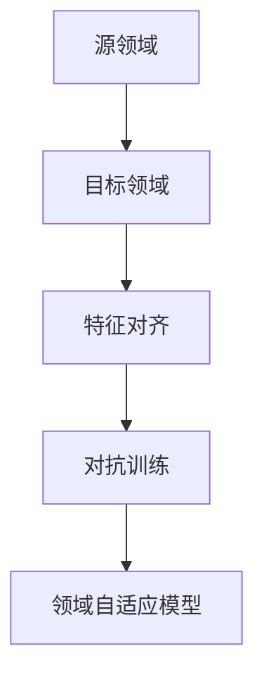
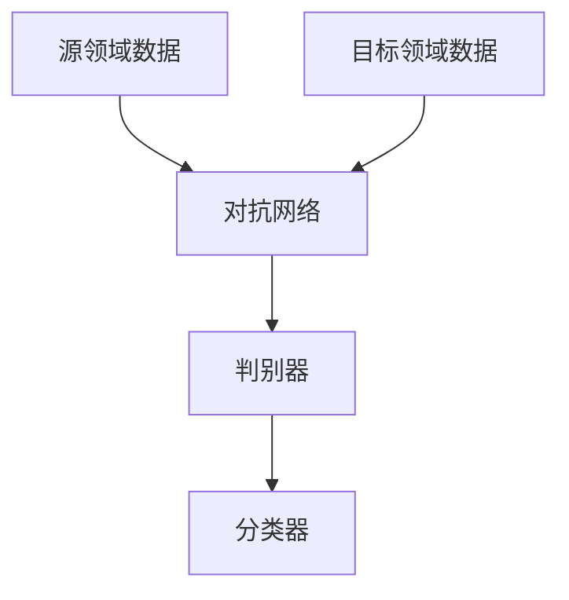
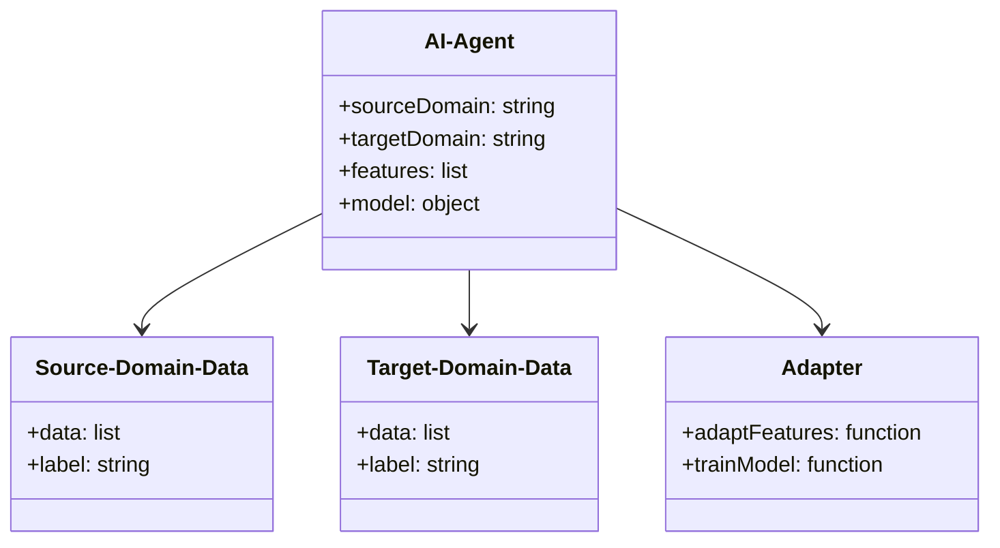
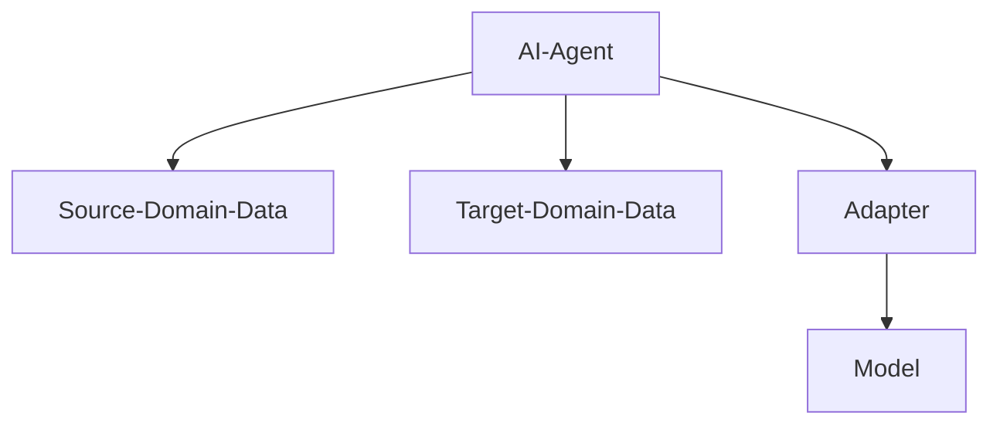
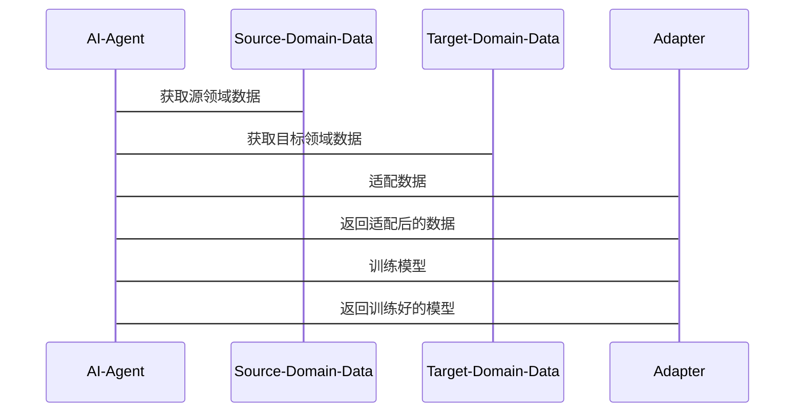

                 


# 企业AI Agent的领域自适应技术在跨行业知识迁移中的实践

## 关键词：领域自适应技术, 企业AI Agent, 跨行业知识迁移, 机器学习, AI Agent

## 摘要：  
企业AI Agent的领域自适应技术是一种通过跨行业知识迁移来提升AI Agent在不同领域中应用能力的关键技术。本文将从背景、概念、算法原理、系统设计到项目实战，全面阐述领域自适应技术的核心思想和实现方法，帮助读者深入理解并掌握这一技术。

---

# 第1章: 企业AI Agent的背景与概念

## 1.1 领域自适应技术的背景

### 1.1.1 企业AI Agent的发展现状  
随着人工智能技术的快速发展，企业AI Agent在各个行业的应用越来越广泛。然而，不同行业之间的数据格式、业务逻辑和用户需求存在显著差异，导致AI Agent在跨行业应用中面临知识迁移的难题。

### 1.1.2 领域自适应技术的提出背景  
领域自适应技术作为一种新兴的机器学习技术，旨在解决AI Agent在不同领域之间的知识迁移问题。通过领域自适应技术，AI Agent可以在不改变整体架构的情况下，快速适应新的行业需求。

### 1.1.3 跨行业知识迁移的必要性  
跨行业知识迁移能够降低企业AI Agent的开发成本，提高其在不同领域的适应能力。通过领域自适应技术，AI Agent可以快速掌握新领域的知识，提升企业的竞争力。

## 1.2 领域自适应技术的定义与特点

### 1.2.1 领域自适应技术的核心概念  
领域自适应技术是一种通过学习不同领域的特征，实现跨领域知识迁移的技术。其核心思想是通过特征对齐和对抗训练，使AI Agent能够在不同领域之间灵活切换。

### 1.2.2 领域自适应技术的关键特点  
1. **领域无关性**：能够在不同领域之间灵活切换。  
2. **知识复用性**：通过跨领域学习，提高知识利用率。  
3. **适应性**：快速适应新领域的任务需求。

### 1.2.3 领域自适应技术与传统迁移学习的区别  
| **对比维度** | **领域自适应技术** | **传统迁移学习** |  
|--------------|---------------------|-------------------|  
| 适用场景     | 跨行业知识迁移      | 单一领域迁移      |  
| 模型复杂度   | 较高                | 较低              |  
| 知识复用性   | 高                  | 一般              |  

## 1.3 企业AI Agent的应用场景

### 1.3.1 跨行业知识迁移的典型场景  
1. **金融行业**：在股票交易、风险管理等领域应用。  
2. **医疗行业**：在疾病诊断、药物研发等领域应用。  
3. **零售行业**：在客户推荐、库存管理等领域应用。  

### 1.3.2 企业AI Agent在不同行业的应用案例  
以金融行业为例，AI Agent可以通过领域自适应技术，快速掌握股票市场的波动规律，并将其应用于其他行业的投资决策中。

### 1.3.3 领域自适应技术在企业中的价值  
通过领域自适应技术，企业可以降低AI Agent的开发成本，提高其在不同领域的适应能力。

## 1.4 本章小结  
本章介绍了领域自适应技术的背景、定义、特点及其在企业中的应用场景。通过这些内容，读者可以理解领域自适应技术的重要性和实际应用价值。

---

# 第2章: 领域自适应技术的核心概念与联系

## 2.1 领域自适应技术的原理

### 2.1.1 领域自适应技术的核心概念  
领域自适应技术通过特征对齐和对抗训练，使AI Agent能够在不同领域之间灵活切换。

### 2.1.2 领域自适应技术的实现流程  
1. 数据预处理：对源领域和目标领域的数据进行清洗和归一化。  
2. 模型训练：通过对抗训练和特征对齐，使模型适应目标领域。  
3. 模型评估：通过在目标领域上进行验证，评估模型的性能。  

## 2.2 领域自适应技术与相关概念的对比

### 2.2.1 领域自适应技术与传统迁移学习的对比  
| **对比维度** | **领域自适应技术** | **传统迁移学习** |  
|--------------|---------------------|-------------------|  
| 适用场景     | 跨行业知识迁移      | 单一领域迁移      |  
| 模型复杂度   | 较高                | 较低              |  
| 知识复用性   | 高                  | 一般              |  

### 2.2.2 领域自适应技术与领域特定模型的对比  
| **对比维度** | **领域自适应技术** | **领域特定模型** |  
|--------------|---------------------|-------------------|  
| 适用场景     | 跨行业知识迁移      | 单一领域优化      |  
| 模型复杂度   | 较高                | 较低              |  
| 知识复用性   | 高                  | 一般              |  

### 2.2.3 领域自适应技术与多任务学习的对比  
| **对比维度** | **领域自适应技术** | **多任务学习** |  
|--------------|---------------------|----------------|  
| 适用场景     | 跨行业知识迁移      | 多任务同时处理    |  
| 模型复杂度   | 较高                | 较高            |  
| 知识复用性   | 高                  | 高              |  

## 2.3 领域自适应技术的ER实体关系图



---

# 第3章: 领域自适应技术的算法原理

## 3.1 领域自适应技术的核心算法

### 3.1.1 基于对抗训练的领域自适应算法



### 3.1.2 基于匹配分数的领域自适应算法  
匹配分数算法通过计算源领域和目标领域的特征相似性，实现领域自适应。

### 3.1.3 基于特征对齐的领域自适应算法  
特征对齐算法通过将源领域和目标领域的特征对齐，实现跨领域知识迁移。

## 3.2 领域自适应算法的数学模型

### 3.2.1 对抗训练的数学模型  
$$\min_{\theta} \max_{\phi} \mathbb{E}_{s}[f(x_s;\theta)] + \mathbb{E}_{t}[f(x_t;\theta)]$$  

### 3.2.2 特征对齐的数学模型  
$$\min_{\theta} \mathbb{E}_{s,t}[||f(x_s;\theta) - f(x_t;\theta)||^2]$$  

### 3.2.3 匹配分数的数学模型  
$$\text{Score}(x_s, x_t) = \frac{1}{d} \sum_{i=1}^{d} |x_s^i - x_t^i|$$  

## 3.3 领域自适应算法的实现步骤

### 3.3.1 数据预处理  
1. 数据清洗：去除噪声数据。  
2. 数据归一化：统一数据格式。  

### 3.3.2 模型训练  
1. 构建对抗网络。  
2. 训练判别器和分类器。  

### 3.3.3 模型评估  
1. 在目标领域上进行验证。  
2. 评估模型的性能。  

---

# 第4章: 领域自适应技术的系统分析与架构设计

## 4.1 系统分析

### 4.1.1 问题场景介绍  
AI Agent需要在不同领域之间进行知识迁移，实现跨领域应用。

## 4.2 系统设计

### 4.2.1 系统功能设计  


### 4.2.2 系统架构设计  


### 4.2.3 系统接口设计  
1. 数据接口：数据输入和输出接口。  
2. 模型接口：模型训练和预测接口。  

### 4.2.4 系统交互流程图  


## 4.3 本章小结  
本章从系统分析和架构设计的角度，详细介绍了领域自适应技术的实现过程。

---

# 第5章: 项目实战

## 5.1 环境配置

### 5.1.1 安装依赖  
```bash
pip install numpy
pip install matplotlib
pip install scikit-learn
```

## 5.2 核心代码实现

### 5.2.1 数据预处理  
```python
import numpy as np
def preprocess_data(data):
    # 数据清洗
    data_clean = data.dropna()
    # 数据归一化
    data_normalized = (data_clean - data_clean.mean()) / data_clean.std()
    return data_normalized
```

### 5.2.2 对抗网络实现  
```python
import tensorflow as tf
def build对抗网络(input_dim):
    input_layer = tf.keras.Input(shape=(input_dim,))
    hidden_layer = tf.keras.layers.Dense(64, activation='relu')(input_layer)
    output_layer = tf.keras.layers.Dense(1, activation='sigmoid')(hidden_layer)
    model = tf.keras.Model(inputs=input_layer, outputs=output_layer)
    return model
```

### 5.2.3 模型训练  
```python
model = build对抗网络(input_dim)
model.compile(optimizer='adam', loss='binary_crossentropy')
model.fit(x_train, y_train, epochs=100, batch_size=32)
```

## 5.3 案例分析

### 5.3.1 金融行业案例  
在金融行业中，AI Agent可以通过领域自适应技术，快速掌握股票市场的波动规律，并将其应用于其他行业的投资决策中。

### 5.3.2 医疗行业案例  
在医疗行业中，AI Agent可以通过领域自适应技术，快速掌握疾病的诊断规律，并将其应用于其他行业的健康管理中。

## 5.4 项目小结  
本章通过实际案例，详细介绍了领域自适应技术的实现过程和应用价值。

---

# 第6章: 最佳实践与小结

## 6.1 最佳实践 tips

### 6.1.1 数据预处理  
确保数据清洗和归一化工作到位，避免数据噪声对模型的影响。  

### 6.1.2 模型选择  
根据具体场景选择合适的模型，避免过度复杂的模型导致性能下降。  

### 6.1.3 交叉验证  
通过交叉验证评估模型的性能，确保模型在目标领域上的泛化能力。  

## 6.2 本章小结  
本章总结了领域自适应技术的核心思想和实现方法，并给出了实际应用中的注意事项和未来研究方向。

---

# 作者：AI天才研究院/AI Genius Institute & 禅与计算机程序设计艺术 /Zen And The Art of Computer Programming

---

通过以上内容，我们详细介绍了企业AI Agent的领域自适应技术在跨行业知识迁移中的实践。从背景、概念、算法原理到系统设计和项目实战，本文为读者提供了一个全面的视角，帮助其深入理解并掌握这一技术。

