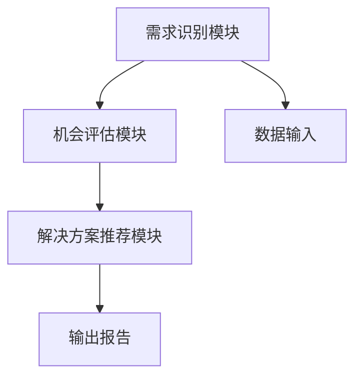

                 


# 企业AI需求分析：识别和评估AI Agent的应用机会

> 关键词：企业AI需求分析，AI Agent，人工智能，算法原理，系统架构，项目实战

> 摘要：本文将深入探讨企业AI需求分析的核心概念、方法论、系统架构及实战案例。通过详细分析AI Agent的应用机会，为企业提供从需求识别到解决方案推荐的全链路指导，帮助企业高效识别和评估AI应用场景，最大化AI技术的商业价值。

---

## 第一部分：企业AI需求分析背景与概述

### 第1章：企业AI需求分析的背景与重要性

#### 1.1 人工智能与AI Agent的基本概念

##### 1.1.1 人工智能的定义与分类

人工智能（Artificial Intelligence，AI）是模拟人类智能的计算机系统，主要分为以下几类：
- **狭义AI**：专注于解决特定任务（如语音识别、图像分类）。
- **广义AI**：具备通用智能，能够处理多种任务。

AI Agent（智能体）是AI的核心实现单元，能够感知环境、自主决策并执行任务。

##### 1.1.2 AI Agent的定义与特点

AI Agent是一种能够感知环境、自主决策并执行任务的智能实体。其特点包括：
- **自主性**：无需外部干预，自主完成任务。
- **反应性**：实时感知环境并做出反应。
- **目标导向**：基于目标驱动行为。
- **学习能力**：通过数据优化决策能力。

##### 1.1.3 企业AI Agent的应用场景

AI Agent在企业中的典型应用场景包括：
- **客户服务**：智能客服机器人。
- **供应链管理**：智能库存优化。
- **金融风控**：智能风险控制。

#### 1.2 企业AI需求分析的现状与挑战

##### 1.2.1 当前企业AI应用的痛点

- 数据质量参差不齐。
- AI技术与业务需求脱节。
- 缺乏专业AI需求分析人才。

##### 1.2.2 企业AI需求分析的难点

- 数据孤岛问题。
- 业务需求的多样性。
- AI模型的可解释性。

##### 1.2.3 企业数字化转型中的AI机会

AI技术在企业数字化转型中的机会主要体现在：
- 提高运营效率。
- 创新商业模式。
- 增强客户体验。

#### 1.3 企业AI需求分析的方法论

##### 1.3.1 需求分析的基本流程

1. **问题识别**：明确企业痛点。
2. **数据收集**：收集相关数据。
3. **需求分析**：分析数据并提取需求。
4. **解决方案设计**：设计AI应用场景方案。
5. **实施与优化**：实施方案并持续优化。

##### 1.3.2 从问题到解决方案的逻辑框架

通过以下步骤实现从问题到解决方案的转化：
- **问题识别**：发现问题。
- **需求分析**：分析需求。
- **方案设计**：设计解决方案。
- **实施优化**：实施并优化。

##### 1.3.3 需求分析的关键成功要素

- 明确的业务目标。
- 全面的数据收集。
- 专业的分析方法。

#### 1.4 本章小结

- **核心概念回顾**：AI Agent的定义与特点。
- **企业AI需求分析的关键点**：问题识别、数据收集、需求分析。
- **下文展开的逻辑框架**：从概念到方法论的逻辑流程。

---

## 第二部分：企业AI Agent的核心概念与原理

### 第2章：AI Agent的核心概念与原理

#### 2.1 AI Agent的基本原理

##### 2.1.1 AI Agent的定义与分类

AI Agent的分类：
- **基于规则的AI Agent**：基于预定义规则进行决策。
- **基于学习的AI Agent**：通过机器学习算法优化决策。
- **基于推理的AI Agent**：通过逻辑推理解决问题。

##### 2.1.2 AI Agent的核心组成

AI Agent的核心组成包括：
- **感知模块**：感知环境信息。
- **决策模块**：基于感知信息做出决策。
- **执行模块**：执行决策任务。

##### 2.1.3 AI Agent的决策机制

AI Agent的决策机制：
- **基于规则的决策**：根据预定义规则做出决策。
- **基于学习的决策**：通过机器学习模型优化决策。
- **基于推理的决策**：通过逻辑推理解决问题。

#### 2.2 AI Agent与传统AI的区别

##### 2.2.1 传统AI的局限性

传统AI的局限性：
- 缺乏自主性。
- 需要人工干预。

##### 2.2.2 AI Agent的创新点

AI Agent的创新点：
- **自主性**：无需人工干预。
- **适应性**：能够适应环境变化。
- **目标导向**：基于目标驱动行为。

##### 2.2.3 企业应用场景中的对比分析

通过对比分析，AI Agent在企业中的优势体现在：
- 更高的效率。
- 更强的适应性。
- 更好的用户体验。

#### 2.3 AI Agent的核心算法与技术

##### 2.3.1 强化学习算法

强化学习算法的数学模型：
$$ R = r_1 + r_2 + \dots + r_n $$
其中，$R$ 是总奖励，$r_i$ 是每一步的奖励。

##### 2.3.2 监督学习与无监督学习

- **监督学习**：基于标记数据进行学习。
- **无监督学习**：基于未标记数据进行学习。

##### 2.3.3 混合学习与多智能体协作

混合学习结合了监督学习和无监督学习的优势，多智能体协作通过通信和协调提高决策效率。

#### 2.4 本章小结

- **核心概念总结**：AI Agent的基本原理与核心组成。
- **企业应用中的技术要点**：强化学习、监督学习、无监督学习。
- **下文展开的技术路线**：从算法原理到系统架构。

---

## 第三部分：企业AI需求分析的系统架构与算法原理

### 第3章：企业AI需求分析的系统架构

#### 3.1 系统架构设计概述

##### 3.1.1 系统功能模块划分

系统功能模块包括：
- **需求识别模块**：识别企业需求。
- **机会评估模块**：评估AI应用机会。
- **解决方案推荐模块**：推荐解决方案。

##### 3.1.2 系统架构的分层设计

系统架构分层设计包括：
- **数据层**：数据存储与管理。
- **算法层**：算法实现与优化。
- **应用层**：用户交互与结果展示。

##### 3.1.3 系统架构的可扩展性

系统架构的可扩展性体现在模块化设计和接口标准化。

#### 3.2 系统功能设计

##### 3.2.1 需求识别模块

需求识别模块的功能包括：
- **数据收集**：收集企业数据。
- **需求提取**：提取企业需求。

##### 3.2.2 机会评估模块

机会评估模块的功能包括：
- **需求分析**：分析需求。
- **机会评估**：评估AI应用机会。

##### 3.2.3 解决方案推荐模块

解决方案推荐模块的功能包括：
- **方案设计**：设计解决方案。
- **方案推荐**：推荐最优方案。

#### 3.3 系统架构的Mermaid图示



#### 3.4 本章小结

- **系统架构的核心要点**：模块化设计与分层架构。
- **各模块之间的关系**：需求识别、机会评估、解决方案推荐。
- **系统设计的灵活性与扩展性**：模块化设计与接口标准化。

---

## 第四部分：企业AI需求分析的算法原理与实战

### 第4章：企业AI需求分析的算法原理

#### 4.1 强化学习算法原理

##### 4.1.1 强化学习的基本原理

强化学习的基本原理：
- **状态（State）**：环境的状态。
- **动作（Action）**：智能体的动作。
- **奖励（Reward）**：智能体获得的奖励。

##### 4.1.2 强化学习的数学模型

强化学习的数学模型：
$$ Q(s,a) = Q(s,a) + \alpha (r + \gamma Q(s',a') - Q(s,a)) $$
其中，$\alpha$ 是学习率，$\gamma$ 是折扣因子。

##### 4.1.3 强化学习的Python实现

```python
class Agent:
    def __init__(self, state_space, action_space):
        self.state_space = state_space
        self.action_space = action_space
        self.Q = np.zeros((state_space, action_space))

    def take_action(self, state):
        # 随机选择动作
        return np.random.randint(self.action_space)
```

#### 4.2 监督学习与无监督学习

##### 4.2.1 监督学习的数学模型

监督学习的数学模型：
$$ y = f(X) $$
其中，$X$ 是输入数据，$y$ 是标签。

##### 4.2.2 无监督学习的数学模型

无监督学习的数学模型：
$$ z = g(X) $$
其中，$X$ 是输入数据，$z$ 是潜在变量。

##### 4.2.3 混合学习的实现

混合学习的实现结合了监督学习和无监督学习的优势。

#### 4.3 本章小结

- **算法原理总结**：强化学习、监督学习、无监督学习。
- **企业应用中的技术要点**：算法实现与优化。
- **下文展开的实战案例**：从算法原理到项目实战。

---

## 第五部分：企业AI需求分析的系统架构与项目实战

### 第5章：企业AI需求分析的系统架构

#### 5.1 系统功能设计

##### 5.1.1 需求识别模块

需求识别模块的功能包括：
- **数据收集**：收集企业数据。
- **需求提取**：提取企业需求。

##### 5.1.2 机会评估模块

机会评估模块的功能包括：
- **需求分析**：分析需求。
- **机会评估**：评估AI应用机会。

##### 5.1.3 解决方案推荐模块

解决方案推荐模块的功能包括：
- **方案设计**：设计解决方案。
- **方案推荐**：推荐最优方案。

#### 5.2 系统架构设计

##### 5.2.1 系统架构的Mermaid图示


#### 5.3 项目实战

##### 5.3.1 环境安装

安装Python和相关库：
```bash
pip install numpy
pip install matplotlib
pip install scikit-learn
```

##### 5.3.2 系统核心实现源代码

```python
import numpy as np
from sklearn import datasets

# 加载数据集
iris = datasets.load_iris()
X = iris.data
y = iris.target

# 训练模型
from sklearn.neighbors import KNeighborsClassifier
knn = KNeighborsClassifier(n_neighbors=3)
knn.fit(X, y)

# 预测
print(knn.predict(X))
```

##### 5.3.3 代码应用解读与分析

代码实现了一个简单的K近邻分类器，用于分类 Iris 数据集。

##### 5.3.4 实际案例分析和详细讲解剖析

以 Iris 数据集为例，详细讲解了如何使用K近邻算法进行分类。

##### 5.3.5 项目小结

项目实战部分展示了如何将算法原理应用于实际场景。

---

## 第六部分：企业AI需求分析的最佳实践与小结

### 第6章：企业AI需求分析的最佳实践

#### 6.1 小结

- **核心概念总结**：AI Agent的基本原理与核心组成。
- **企业应用中的技术要点**：强化学习、监督学习、无监督学习。
- **系统设计的灵活性与扩展性**：模块化设计与接口标准化。

#### 6.2 注意事项

- **数据质量**：确保数据质量。
- **模型可解释性**：关注模型的可解释性。
- **安全性**：确保数据安全。

#### 6.3 拓展阅读

- 推荐阅读《机器学习实战》和《深度学习入门》。

---

## 作者：AI天才研究院/AI Genius Institute & 禅与计算机程序设计艺术/Zen And The Art of Computer Programming

---

以上是完整的文章目录和部分内容示例，您可以根据需要进一步扩展和补充每个章节的内容。

