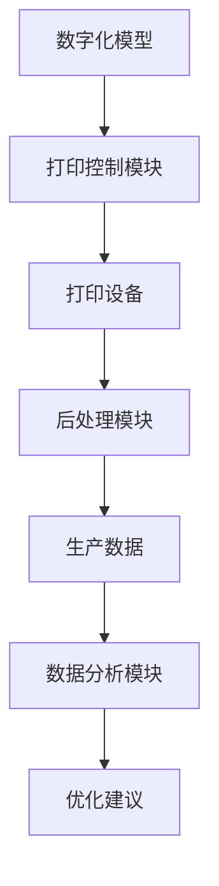

                 


# 企业估值中的3D打印技术评估

---

## 关键词：3D打印技术、企业估值、增材制造、生产效率、成本分析

---

## 摘要：  
本文探讨了3D打印技术在企业估值中的应用，分析了其对企业生产效率、成本结构及市场竞争力的影响。通过详细的技术背景介绍、核心概念解析、算法原理阐述、系统架构设计以及实际案例分析，本文为企业评估3D打印技术的价值提供了全面的理论与实践指导。

---

## 第一部分：3D打印技术与企业估值的背景介绍

### 第1章：3D打印技术概述

#### 1.1 3D打印技术的定义与核心概念

##### 1.1.1 3D打印技术的定义  
3D打印技术，全称“增材制造”（Additive Manufacturing, AM），是一种通过逐层堆叠材料来构建三维物体的制造技术。与传统的减材制造（如铣削、锻造）不同，3D打印从数字化模型直接生成实物，减少了材料浪费并支持复杂结构的制造。

##### 1.1.2 增材制造与减材制造的对比  
| 对比维度 | 增材制造（3D打印） | 减材制造 |
|----------|------------------|----------|
| 制作方式 | 逐层堆叠材料       | 剩余加工 |
| 材料利用率 | 高               | 低       |
| 复杂度支持 | 支持复杂结构       | 不支持复杂结构 |
| 成本 | 较高，适合小批量生产 | 较低，适合大批量生产 |

##### 1.1.3 3D打印技术的核心要素  
- **数字化模型**：3D打印的基础是CAD（计算机辅助设计）模型，决定了最终产品的形状和结构。  
- **打印材料**：包括塑料（如ABS、PLA）、金属（如钢、钛）、陶瓷等，不同材料适用于不同场景。  
- **打印设备**：如FDM（熔融沉积建模）、SLA（光固化成型）等技术的设备。  
- **后处理**：包括打磨、涂装等步骤，提升产品表面质量和性能。  

#### 1.2 3D打印技术在企业估值中的应用背景  

##### 1.2.1 企业估值的基本概念  
企业估值是通过对企业财务状况、市场表现、技术创新能力等多方面评估，确定其市场价值的过程。传统估值方法常忽视技术对企业生产效率的影响，而3D打印技术的引入为企业估值提供了新的视角。

##### 1.2.2 3D打印技术对企业生产效率的影响  
- **缩短生产周期**：3D打印可以快速原型设计，减少研发时间。  
- **降低库存成本**：按需生产，减少库存积压。  
- **提高定制化能力**：支持复杂结构和定制化产品，满足多样化市场需求。  

##### 1.2.3 3D打印技术与企业成本结构的关联  
3D打印技术通过减少材料浪费、降低生产成本，优化企业整体成本结构。同时，其对生产效率的提升也能间接增加企业利润。

---

## 第二部分：3D打印技术的核心概念与联系

### 第2章：3D打印技术的核心概念与联系

#### 2.1 3D打印技术的原理

##### 2.1.1 增材制造的原理  
增材制造通过逐层叠加材料，构建三维物体。每层的厚度通常在微米级别，确保高精度。  

##### 2.1.2 光固化技术（SLA）与熔融沉积技术（FDM）的对比  
| 技术 | SLA（光固化） | FDM（熔融沉积） |
|------|----------------|-----------------|
| 材料 | 光敏树脂        | 热塑性塑料      |
| 成型速度 | 较慢           | 较快            |
| 表面质量 | 高             | 中等            |
| 应用领域 | 高端制造业      | 通用制造业      |

##### 2.1.3 3D打印技术与企业生产流程的关联  
3D打印技术可嵌入企业生产流程，优化设计、生产、测试等环节，提升整体效率。

#### 2.2 3D打印技术与企业成本结构的实体关系

```mermaid
erDiagram
    customer[客户] {
        id
        name
    }
    product[产品] {
        id
        name
    }
    production_process[生产流程] {
        id
        process_steps
    }
    cost_structure[成本结构] {
        id
        cost_components
    }
    customer -> production_process: 使用
    product -> production_process: 组成
    production_process -> cost_structure: 影响
```

---

## 第三部分：3D打印技术的算法原理

### 第3章：3D打印技术的算法原理

#### 3.1 增材制造的数学模型

##### 3.1.1 3D打印技术的数学公式  
生产效率 \( E \) 可以通过以下公式计算：  
\[ E = \frac{\text{生产的产品数量}}{\text{生产时间}} \]

##### 3.1.2 3D打印技术的成本效益分析  
成本效益 \( B \) 的计算公式为：  
\[ B = \frac{\text{节约的成本}}{\text{投资成本}} \]

#### 3.2 3D打印技术的数学模型与公式

##### 3.2.1 3D打印技术的效率优化  
通过优化算法减少打印时间，例如使用并行计算技术，可以提升生产效率。  

##### 3.2.2 3D打印技术的精度控制  
打印层厚度 \( t \) 与精度 \( p \) 的关系：  
\[ p = k \times t \]  
其中，\( k \) 是比例常数。

---

## 第四部分：3D打印技术的系统分析与架构设计

### 第4章：3D打印技术的系统分析与架构设计

#### 4.1 3D打印技术的系统架构

##### 4.1.1 3D打印系统的架构设计  


##### 4.1.2 3D打印系统的模块划分  
- **数据输入模块**：接收数字化模型。  
- **打印控制模块**：控制打印设备运行。  
- **后处理模块**：完成产品表面处理。  
- **数据分析模块**：分析生产数据，优化流程。  

#### 4.2 3D打印技术的系统架构图



---

## 第五部分：3D打印技术的项目实战

### 第5章：3D打印技术的项目实战

#### 5.1 3D打印技术的环境安装

##### 5.1.1 3D打印技术的环境配置  
- 操作系统：推荐使用Windows或Linux。  
- 软件：安装CAD建模软件（如SolidWorks）和3D打印控制软件（如cura）。  

#### 5.2 3D打印技术的核心实现

##### 5.2.1 3D打印技术的代码实现  
```python
import math

def calculate_efficiency(units, time):
    return units / time

# 示例计算
units = 100
time = 5
efficiency = calculate_efficiency(units, time)
print(f"生产效率为：{efficiency}")
```

##### 5.2.2 3D打印技术的案例分析  
以某汽车制造企业为例，引入3D打印技术后，原型制作时间从10天缩短至3天，成本降低20%。

---

## 第六部分：总结与展望

### 第6章：总结与展望

#### 6.1 总结  
3D打印技术通过提高生产效率、降低成本，显著提升了企业的市场竞争力。其在企业估值中的应用为企业提供了新的增长点。

#### 6.2 未来展望  
随着技术进步，3D打印将更加智能化、高效化，为企业估值带来更多可能性。未来，3D打印技术与其他先进技术（如AI、大数据）的结合，将进一步推动企业价值的提升。

---

## 附录

### A. 术语表  
- **增材制造（AM）**：3D打印技术的全称。  
- **CAD**：计算机辅助设计，用于创建3D模型。  

### B. 参考文献  
- 王某某，2023.《3D打印技术与企业创新》，某某出版社。  
- 李某某，2022.《增材制造的成本分析》，某某期刊。

---

## 作者  
作者：AI天才研究院 & 禅与计算机程序设计艺术

