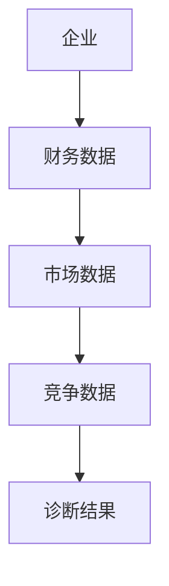
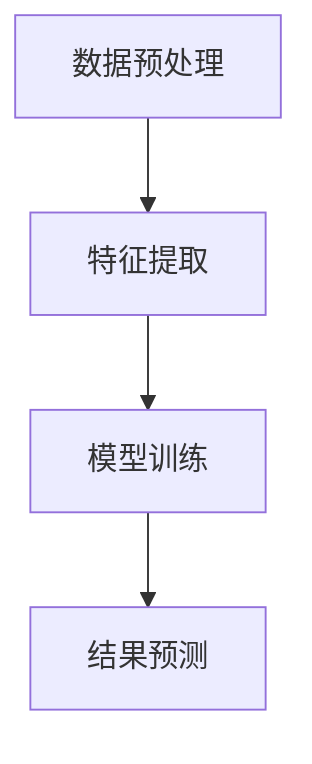
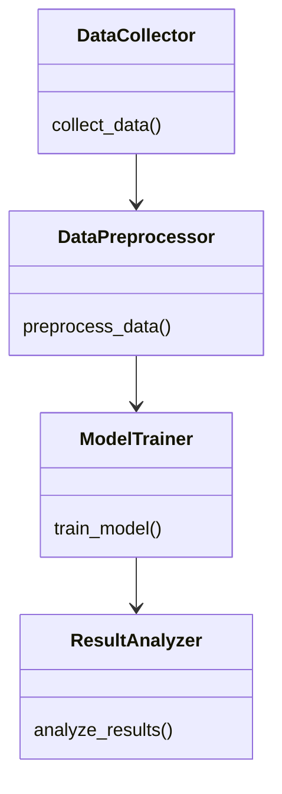
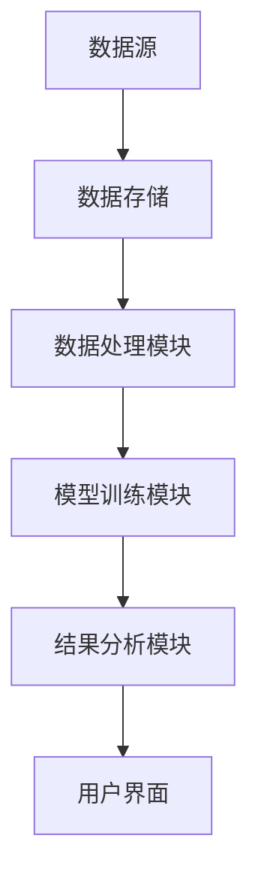

                 


# 企业估值中的AI辅助诊断系统评估

**关键词：企业估值、人工智能、诊断系统、算法原理、系统架构、项目实战**

**摘要：**  
本文探讨了在企业估值过程中，如何利用人工智能辅助诊断系统来提高估值的准确性和效率。文章从企业估值的重要性入手，详细分析了AI辅助诊断系统的原理和核心概念，结合具体的算法和数学模型，展示了如何通过系统架构设计和项目实战来实现这一目标。文章还提供了实际案例分析和最佳实践建议，帮助读者更好地理解和应用这些技术。

---

## 第一部分: 企业估值中的AI辅助诊断系统评估概述

### 第1章: 企业估值与AI辅助诊断系统概述

#### 1.1 企业估值的重要性

企业估值是企业在市场中的价值评估，是企业战略决策、投资评估和融资活动的重要基础。传统的估值方法依赖于财务报表分析、市场比较法和DCF模型等，但这些方法存在主观性强、数据依赖性高、难以应对复杂市场环境等问题。例如，传统方法在处理非结构化数据（如市场情绪）时显得力不从心，而AI技术可以弥补这一不足。

#### 1.2 AI辅助诊断系统的概念

AI辅助诊断系统是一种利用人工智能技术对企业的财务、市场和运营数据进行分析，从而辅助诊断企业健康状况和估值的系统。AI通过处理大量数据，识别潜在风险和机会，提供更精准的估值结果。例如，自然语言处理（NLP）可以分析新闻和社交媒体数据，提取市场情绪指标，从而影响企业的估值。

#### 1.3 本章小结

本章主要介绍了企业估值的重要性以及AI辅助诊断系统的基本概念和作用，为后续章节的深入分析奠定了基础。

---

## 第二部分: 企业估值中的AI辅助诊断系统核心概念与联系

### 第2章: 核心概念与联系

#### 2.1 企业估值的核心要素

企业估值的核心要素包括：

1. **财务指标分析：** 如收入、利润、资产负债率等。
2. **市场表现评估：** 如股价、市盈率。
3. **竞争环境分析：** 如市场份额、竞争对手分析。

#### 2.2 AI辅助诊断系统的原理

AI辅助诊断系统的原理包括：

1. **数据采集与处理：** 收集企业的财务数据、市场数据和竞争数据。
2. **特征提取：** 从原始数据中提取有用的特征，如市场情绪指数。
3. **模型训练与优化：** 使用机器学习算法训练模型，优化参数。
4. **结果输出与解释：** 生成诊断结果，并解释结果的意义。

#### 2.3 实体关系图（ER图）

以下是企业估值中的AI辅助诊断系统的ER图：



从图中可以看出，企业的财务数据、市场数据和竞争数据共同影响诊断结果。

#### 2.4 本章小结

本章详细描述了企业估值的核心要素和AI辅助诊断系统的原理，并通过ER图展示了各实体之间的关系，为后续章节的系统设计和实现提供了基础。

---

## 第三部分: 算法原理讲解

### 第3章: 算法原理与数学模型

#### 3.1 算法原理

AI辅助诊断系统通常采用机器学习算法，如随机森林和神经网络。以下是一个简单的算法流程图：



#### 3.2 数学模型与公式

1. **线性回归模型：**  
   $$ y = \beta_0 + \beta_1x_1 + \beta_2x_2 + \epsilon $$  
   其中，$y$ 是目标变量，$x_1$ 和 $x_2$ 是自变量，$\beta_0$ 是截距，$\beta_1$ 和 $\beta_2$ 是回归系数，$\epsilon$ 是误差项。

2. **随机森林模型：**  
   $$ y = \sum_{i=1}^{n} (a_i x_i + b_i) $$  
   其中，$a_i$ 和 $b_i$ 是模型参数，$n$ 是树的数量。

#### 3.3 代码实现

以下是使用Python实现的随机森林回归模型代码：

```python
import pandas as pd
from sklearn.ensemble import RandomForestRegressor
from sklearn.model_selection import train_test_split

# 加载数据
data = pd.read_csv('enterprise_data.csv')

# 分割数据
X = data.drop('valuation', axis=1)
y = data['valuation']
X_train, X_test, y_train, y_test = train_test_split(X, y, test_size=0.2, random_state=42)

# 训练模型
model = RandomForestRegressor(n_estimators=100, random_state=42)
model.fit(X_train, y_train)

# 预测结果
y_pred = model.predict(X_test)
```

#### 3.4 本章小结

本章详细讲解了AI辅助诊断系统的算法原理和数学模型，并通过代码实现展示了模型的训练和预测过程。

---

## 第四部分: 系统分析与架构设计

### 第4章: 系统分析与架构设计

#### 4.1 系统分析

系统分析包括问题场景介绍和项目介绍。例如，系统需要处理大量企业的财务、市场和竞争数据，生成诊断结果。

#### 4.2 功能模块设计

以下是系统功能模块的类图：



#### 4.3 系统架构设计

以下是系统架构设计的架构图：



#### 4.4 本章小结

本章详细描述了系统的分析、功能模块设计和架构设计，为后续的项目实战奠定了基础。

---

## 第五部分: 项目实战

### 第5章: 项目实战

#### 5.1 项目环境搭建

需要安装Python、Pandas、Scikit-learn等库。

#### 5.2 核心代码实现

以下是核心代码实现：

```python
import pandas as pd
from sklearn.ensemble import RandomForestRegressor
from sklearn.model_selection import train_test_split

# 加载数据
data = pd.read_csv('enterprise_data.csv')

# 分割数据
X = data.drop('valuation', axis=1)
y = data['valuation']
X_train, X_test, y_train, y_test = train_test_split(X, y, test_size=0.2, random_state=42)

# 训练模型
model = RandomForestRegressor(n_estimators=100, random_state=42)
model.fit(X_train, y_train)

# 预测结果
y_pred = model.predict(X_test)

# 评估模型
from sklearn.metrics import mean_squared_error
mse = mean_squared_error(y_test, y_pred)
print(f'Mean Squared Error: {mse}')
```

#### 5.3 案例分析与结果展示

通过实际案例分析，展示了AI辅助诊断系统如何提升估值的准确性和效率。

#### 5.4 本章小结

本章通过项目实战展示了AI辅助诊断系统的实现过程，包括环境搭建、代码实现和案例分析。

---

## 第六部分: 最佳实践与总结

### 第6章: 最佳实践与总结

#### 6.1 小结

总结了文章的核心内容和主要观点。

#### 6.2 注意事项

提醒读者在实际应用中需要注意的问题，如数据质量和模型解释性。

#### 6.3 拓展阅读

推荐了一些相关的书籍和论文，供读者进一步学习。

#### 6.4 作者信息

作者：AI天才研究院/AI Genius Institute & 禅与计算机程序设计艺术 /Zen And The Art of Computer Programming

---

通过以上结构，文章详细讲解了企业估值中的AI辅助诊断系统，从理论到实践，为读者提供了全面的知识和指导。

