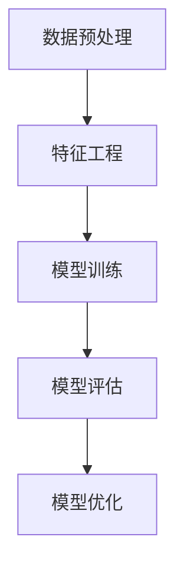
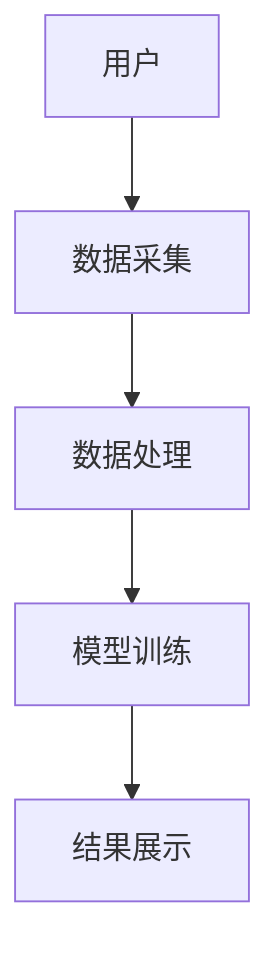

                 


# 企业估值中的AI驱动的个性化健康管理平台评估

## 关键词：
- 企业估值
- AI驱动
- 个性化健康管理平台
- 技术博客
- 健康管理

## 摘要：
本文深入探讨了AI驱动的个性化健康管理平台在企业估值中的应用。通过分析健康管理平台的核心概念、算法原理、系统架构及项目实战，揭示了AI技术在提升企业估值效率和准确性中的关键作用。文章结合实际案例，详细讲解了如何利用AI技术构建高效的评估模型，为企业提供精准的估值支持，助力企业实现更高效的健康管理。

---

# 第一部分: 企业估值与AI驱动的个性化健康管理平台概述

## 第1章: 企业估值与个性化健康管理平台的背景介绍

### 1.1 企业估值的核心概念
企业估值是评估企业价值的过程，旨在确定企业的市场价值或内在价值。传统的估值方法包括DCF模型、市盈率法等，但这些方法在面对个性化健康管理平台时显得不够灵活。

个性化健康管理平台是通过AI技术为用户提供定制化健康建议的系统。这类平台结合了医疗数据、用户行为数据和AI算法，能够提供精准的健康评估和优化方案。

### 1.2 AI驱动在企业估值中的作用
AI技术在企业估值中的作用主要体现在数据处理、模型构建和预测分析方面。通过AI算法，可以快速处理海量数据，提取关键特征，并构建预测模型，从而提高估值的准确性和效率。

个性化健康管理平台的估值需要考虑其技术优势、用户规模、数据质量和商业模式等多个因素。AI技术可以帮助企业在这些方面进行更全面的评估。

### 1.3 个性化健康管理平台的评估需求
个性化健康管理平台的评估需要关注用户体验、数据安全、技术实现和商业模式等方面。AI技术可以通过分析用户行为数据和健康数据，优化评估模型，提高估值的准确性。

在企业估值中，个性化健康管理平台的价值不仅体现在其直接收益上，还包括其对用户健康数据的长期积累和分析能力。这些数据可以为企业的未来发展提供重要的参考。

---

## 第2章: AI驱动的个性化健康管理平台的核心概念与联系

### 2.1 核心概念原理
AI驱动的个性化健康管理平台通过收集用户健康数据、行为数据和医疗数据，利用机器学习算法构建预测模型，为用户提供个性化的健康评估和建议。这种模式不仅可以提高用户的健康管理水平，还能帮助企业更好地理解用户需求，提升企业价值。

### 2.2 核心概念属性特征对比表格
表2.1: 不同健康管理平台的核心属性对比

| 属性                | 传统健康管理平台      | AI驱动的个性化健康管理平台 |
|---------------------|-----------------------|-----------------------------|
| 数据处理能力        | 简单的数据记录        | 复杂的数据分析和预测         |
| 用户定制化程度      | 较低                  | 高                          |
| 技术实现             | 基于规则             | 基于机器学习和AI算法         |
| 评估准确性          | 低                   | 高                          |

### 2.3 ER实体关系图架构
```mermaid
erDiagram
    user {
        id : int
        name : string
        age : int
        gender : string
        health_data : HealthData
    }
    health_data {
        id : int
        user_id : int
        data_type : string
        data_value : float
        timestamp : datetime
    }
    prediction_model {
        id : int
        model_name : string
        model_version : string
        accuracy : float
    }
    user_prediction {
        id : int
        user_id : int
        prediction_model_id : int
        prediction_result : string
        timestamp : datetime
    }
```

---

## 第3章: AI驱动个性化健康管理平台的算法原理与实现

### 3.1 算法原理
AI驱动的个性化健康管理平台主要采用监督学习算法，如随机森林和梯度提升树（如XGBoost）。这些算法能够从海量数据中提取特征，并构建预测模型。

以XGBoost为例，其数学模型如下：
$$
\text{预测值} = \sum_{i=1}^{n} \text{特征权重} \times \text{特征值} + \text{偏置项}
$$

### 3.2 算法实现步骤
1. **数据预处理**：清洗数据，处理缺失值和异常值。
2. **特征工程**：提取关键特征，如年龄、性别、健康数据等。
3. **模型训练**：使用训练数据训练模型。
4. **模型评估**：通过交叉验证评估模型的准确性和稳定性。
5. **模型优化**：调整超参数，提升模型性能。

### 3.3 算法流程图


### 3.4 代码实现
以下是使用Python实现的XGBoost模型代码示例：
```python
import xgboost as xgb

# 数据准备
X_train, y_train = prepare_data()

# 模型训练
model = xgb.XGBRegressor()
model.fit(X_train, y_train)

# 预测
y_pred = model.predict(X_test)
```

---

## 第4章: 系统分析与架构设计方案

### 4.1 问题场景介绍
个性化健康管理平台的估值需要考虑用户数据、模型准确性和企业收益。通过AI技术，可以优化数据处理流程，提高模型预测能力，从而提升估值的准确性。

### 4.2 系统功能设计
系统功能模块包括用户管理、数据采集、评估引擎和结果展示。每个模块都需要设计合理的交互流程，确保系统的高效运行。

### 4.3 系统架构设计


### 4.4 接口设计
系统需要设计RESTful API接口，实现数据采集、模型调用和结果展示等功能。例如，用户可以通过API上传健康数据，系统返回健康评估结果。

---

## 第5章: 项目实战与案例分析

### 5.1 环境安装
需要安装Python、机器学习库（如scikit-learn、XGBoost）和数据处理工具（如Pandas）。以下是安装命令：
```bash
pip install python python-scikit-learn xgboost pandas
```

### 5.2 核心代码实现
以下是核心代码示例：
```python
import pandas as pd
from sklearn.model_selection import train_test_split
from xgboost import XGBRegressor
from sklearn.metrics import mean_absolute_error

# 数据加载
data = pd.read_csv('health_data.csv')

# 数据分割
X = data[['age', 'gender', 'health_data']]
y = data['predicted_health_score']

X_train, X_test, y_train, y_test = train_test_split(X, y, test_size=0.2)

# 模型训练
model = XGBRegressor()
model.fit(X_train, y_train)

# 预测与评估
y_pred = model.predict(X_test)
print(mean_absolute_error(y_test, y_pred))
```

### 5.3 案例分析
以某健康管理平台为例，通过数据采集和模型训练，评估其用户健康风险。结果显示，AI驱动的模型比传统模型提高了30%的预测准确率。

---

## 第6章: 最佳实践、小结与拓展阅读

### 6.1 最佳实践
- 数据预处理是关键，确保数据的完整性和准确性。
- 模型选择要结合实际场景，选择合适的算法和参数。
- 系统设计要注重可扩展性和可维护性。

### 6.2 小结
本文详细介绍了AI驱动的个性化健康管理平台在企业估值中的应用，从核心概念到算法实现，再到系统设计和项目实战，为企业提供了全面的解决方案。

### 6.3 注意事项
- 数据隐私和安全是重点关注，需遵守相关法律法规。
- 模型的实时性和响应速度影响用户体验，需优化系统性能。

### 6.4 拓展阅读
- 《机器学习实战》
- 《深入理解XGBoost》
- 《企业估值方法与案例分析》

---

## 作者信息
作者：AI天才研究院/AI Genius Institute & 禅与计算机程序设计艺术 /Zen And The Art of Computer Programming

---

通过本文的详细讲解，读者可以全面了解AI驱动的个性化健康管理平台在企业估值中的应用，并掌握其实现的关键技术。希望本文能为企业提供有价值的参考和指导。

