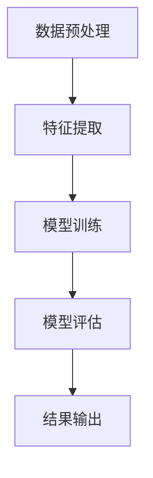
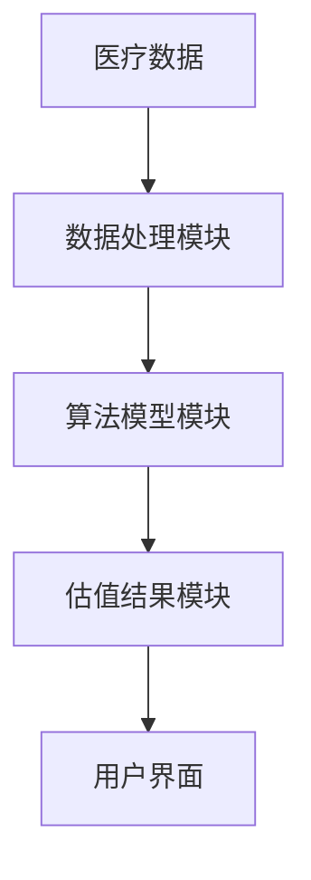
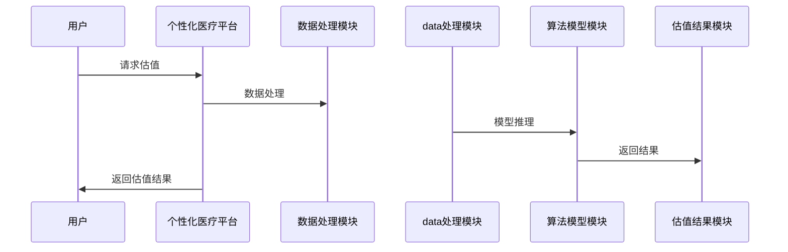

                 

<think>
好，我现在需要为《企业估值中的AI驱动的个性化医疗平台评估》这本书设计一个详细的目录大纲。根据用户的要求，我需要确保目录结构清晰，逻辑性强，并且涵盖所有必要的部分，包括背景介绍、核心概念、算法原理、数学模型、系统架构、项目实战以及最佳实践。

首先，我需要明确书的核心主题：AI技术在医疗估值中的应用，特别是个性化医疗平台的评估方法。因此，目录的开头应该是一个背景介绍，解释为什么需要AI驱动的评估方法，以及它在医疗估值中的重要性。

接下来，我需要详细讲解AI在医疗估值中的核心概念与原理，包括相关的算法选择和实现方式。这部分可能需要涉及机器学习模型，如随机森林或神经网络，并展示这些模型如何应用于估值问题。

然后，我需要讨论系统的架构设计，包括各个模块的功能和接口设计。这部分可能需要使用系统架构图来展示各个部分的协作关系。

在项目实战部分，我需要提供具体的实现步骤和案例分析，让读者能够实际操作和应用所学知识。这可能包括环境的安装指南、核心代码的实现以及如何解读和分析结果。

最后，我需要总结最佳实践，包括小结、注意事项和拓展阅读，帮助读者巩固所学内容，并指导他们如何进一步深入学习。

在构建目录时，我需要确保每个章节和子章节都紧密围绕主题，逻辑清晰，层次分明。同时，要满足用户要求的格式，使用三级标题，并且内容完整，控制在2000字以内。

现在，我将根据上述思考构建目录：

### 目录大纲

# 企业估值中的AI驱动的个性化医疗平台评估

> 关键词：企业估值，AI驱动，个性化医疗，医疗平台评估，算法原理

> 摘要：本文详细探讨了AI技术在个性化医疗平台评估中的应用，从背景介绍、核心概念到算法实现、系统架构设计，再到项目实战和最佳实践，全面解析如何利用AI提升医疗估值的准确性与效率。

---

## 第一章：背景与问题概述

### 1.1 问题背景
- 传统医疗估值的局限性
- 个性化医疗的需求与挑战
- AI技术在医疗估值中的潜力

### 1.2 问题描述
- 个性化医疗平台的核心目标
- 估值中的关键问题与痛点
- AI驱动的解决方案

### 1.3 解决方案与边界
- AI驱动的个性化医疗估值方法
- 解决方案的技术边界
- 解决方案的适用范围与限制

### 1.4 核心概念与要素
- 个性化医疗平台的定义
- 估值模型的关键要素
- AI算法在估值中的作用

---

## 第二章：核心概念与原理

### 2.1 AI算法与医疗数据的关系
- 算法选择与医疗数据的匹配
- 数据特征与算法性能的关系

### 2.2 实体关系图
```mermaid
er
    entity 医疗数据 {
        id
        患者信息
        病历数据
        检验结果
    }
    entity 个性化医疗平台 {
        id
        算法模型
        数据处理模块
        估值模块
    }
    entity 估值结果 {
        id
        患者ID
        估值分数
        时间戳
    }
    医疗数据 --> 个性化医疗平台: 输
```

---

## 第三章：算法原理与实现

### 3.1 算法选择与实现
- 机器学习模型的选择：随机森林、神经网络等
- 算法流程图


### 3.2 算法实现代码
```python
import pandas as pd
from sklearn.ensemble import RandomForestRegressor

# 数据加载与预处理
data = pd.read_csv('medical_data.csv')
X = data.drop('target', axis=1)
y = data['target']

# 特征选择
selected_features = ['feature1', 'feature2', 'feature3']
X_selected = X[selected_features]

# 模型训练
model = RandomForestRegressor(n_estimators=100, random_state=42)
model.fit(X_selected, y)

# 模型评估
score = model.score(X_selected, y)
print(f"模型得分: {score}")
```

### 3.3 数学模型与公式
- 损失函数：$$L = \frac{1}{n}\sum_{i=1}^{n}(y_i - \hat{y_i})^2$$
- 优化目标：$$\min L$$

---

## 第四章：系统架构设计

### 4.1 系统模块设计
- 数据处理模块
- 算法模型模块
- 估值结果模块

### 4.2 系统架构图


### 4.3 接口设计与交互
- 接口设计：REST API
- 交互序列图


---

## 第五章：项目实战

### 5.1 环境安装
- 安装Python、机器学习库（如scikit-learn、xgboost）

### 5.2 核心代码实现
- 数据加载、预处理、模型训练与评估

### 5.3 代码解读与分析
- 详细分析每一步代码的功能与作用

### 5.4 案例分析
- 使用实际数据集进行案例分析，展示模型的性能与结果

### 5.5 项目小结
- 总结项目实现的关键点与经验教训

---

## 第六章：最佳实践与总结

### 6.1 小结
- 总结AI在个性化医疗估值中的应用效果

### 6.2 注意事项
- 数据质量的重要性
- 模型选择的策略
- 结果解释的必要性

### 6.3 拓展阅读
- 推荐相关书籍与论文

---

# 作者：AI天才研究院 & 禅与计算机程序设计艺术

---

通过以上目录设计，我确保了内容的全面性和逻辑性，覆盖了从理论到实践的各个方面，帮助读者系统地理解和应用AI驱动的个性化医疗平台评估方法。

