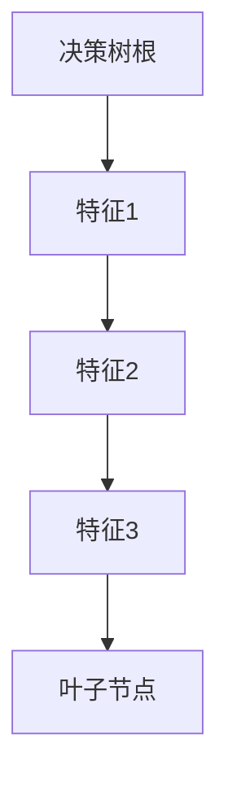
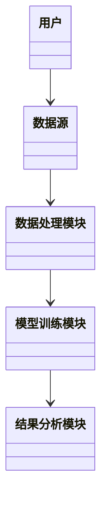
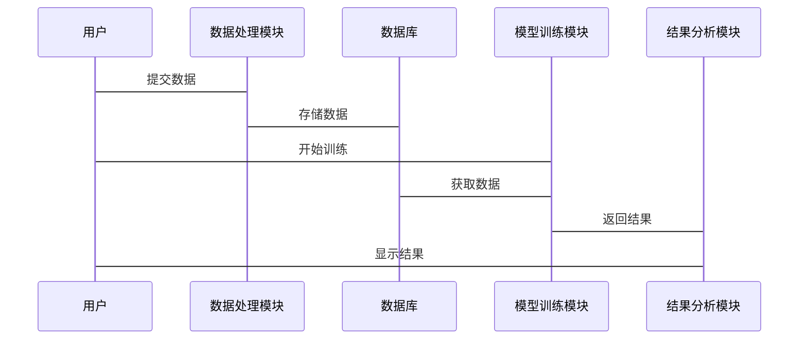

                 


# 企业估值中的AI驱动的个性化学习平台评估

## 关键词：企业估值，AI驱动，个性化学习平台，机器学习，自然语言处理，系统架构

## 摘要：随着企业估值的重要性日益凸显，AI技术在个性化学习平台评估中的应用为传统估值方法注入了新的活力。本文将深入探讨AI驱动的个性化学习平台评估的核心概念、算法原理、系统架构设计以及实际应用案例，帮助读者理解如何利用AI技术提升企业估值的准确性和效率。

---

# 引言

## 1.1 企业估值的重要性

企业估值是企业管理和投资决策中的核心环节，直接影响企业的价值判断、融资决策和投资回报。传统的估值方法依赖于财务指标和市场数据，但在数据量激增和个性化需求日益增长的今天，这些方法往往显得力不从心。

## 1.2 个性化学习平台的崛起

个性化学习平台通过大数据和AI技术，为学习者提供定制化的学习方案，优化学习效果。然而，如何准确评估这些平台的价值，成为企业估值中的新挑战。

## 1.3 AI驱动的评估优势

AI技术能够从海量数据中提取有价值的信息，构建精准的预测模型，为个性化学习平台的估值提供科学依据。本文将详细探讨AI在企业估值中的具体应用。

---

# 第二章：传统企业估值方法概述

## 2.1 财务指标分析法

### 2.1.1 常用财务指标及其计算公式

- 净利润：$$净利润 = 营业收入 - 营业成本 - 税费 - 费用$$
- 每股收益：$$每股收益 = 净利润 ÷ 总股本$$
- 资产负债率：$$资产负债率 = (负债总额 ÷ 资产总额) × 100\%$$

### 2.1.2 财务指标分析法的优缺点

- 优点：简单易懂，依赖财务数据。
- 缺点：忽视了非财务因素，如市场趋势和技术创新。

## 2.2 市盈率与市净率法

### 2.2.1 市盈率与市净率的定义

- 市盈率（P/E）：$$市盈率 = 股价 ÷ 每股收益$$
- 市净率（P/B）：$$市净率 = 股价 ÷ 每股净资产$$

### 2.2.2 市盈率与市净率法的应用场景

适用于成熟企业，尤其是那些具有稳定收益和资产的公司。

## 2.3 现金流折现法（DCF模型）

### 2.3.1 DCF模型的基本原理

DCF模型通过预测未来现金流，将其折现为现值，以评估企业价值。

### 2.3.2 DCF模型的计算步骤

1. 预测未来现金流。
2. 确定折现率。
3. 计算未来现金流的现值。
4. 计算企业价值。

## 2.4 传统估值方法的局限性

- 数据局限性：依赖历史数据，忽视未来趋势。
- 模型假设的局限性：假设未来现金流可预测。
- 人工分析的局限性：耗时且易受主观因素影响。

---

# 第三章：AI驱动的个性化学习平台评估核心概念

## 3.1 个性化学习平台评估的核心要素

### 3.1.1 学习者特征分析

- 学习者年龄、性别、学习目标、学习风格等。

### 3.1.2 平台功能与数据特征

- 内容推荐、学习进度跟踪、互动功能等。

### 3.1.3 企业估值的关键指标

- 用户留存率、活跃度、收入增长率等。

## 3.2 AI技术在个性化学习平台评估中的应用

### 3.2.1 机器学习在数据处理中的应用

- 数据清洗、特征提取、模型训练。

### 3.2.2 自然语言处理在内容分析中的应用

- 文本分类、情感分析、关键词提取。

### 3.2.3 深度学习在预测模型中的应用

- 神经网络、卷积神经网络（CNN）、循环神经网络（RNN）。

---

# 第四章：AI驱动的个性化学习平台评估算法原理

## 4.1 机器学习模型的应用

### 4.1.1 线性回归模型

$$y = \beta_0 + \beta_1x + \epsilon$$

### 4.1.2 决策树模型

使用Mermaid流程图展示决策树的构建过程：



## 4.2 算法实现与优化

### 4.2.1 算法实现步骤

1. 数据预处理。
2. 模型训练。
3. 模型评估。
4. 模型优化。

### 4.2.2 优化策略

- 参数调优。
- 正则化技术（L1/L2）。
- 集成学习（Bagging、Boosting）。

---

# 第五章：AI驱动的个性化学习平台评估系统架构设计

## 5.1 项目介绍

### 5.1.1 项目目标

构建一个基于AI的个性化学习平台评估系统，实现企业估值的自动化和智能化。

### 5.1.2 项目范围

涵盖数据收集、模型训练、结果分析等功能。

## 5.2 系统功能设计

### 5.2.1 领域模型设计

使用Mermaid类图展示系统功能模块：



### 5.2.2 系统架构设计

使用Mermaid架构图展示系统架构：


### 5.2.3 系统接口设计

- 数据接口：提供数据导入和导出功能。
- API接口：供外部系统调用评估结果。

### 5.2.4 系统交互设计

使用Mermaid序列图展示系统交互流程：



---

# 第六章：项目实战

## 6.1 环境安装

- 安装Python和相关库（scikit-learn、TensorFlow、Flask）。
- 安装Jupyter Notebook用于数据处理和模型训练。

## 6.2 核心代码实现

### 6.2.1 数据处理代码

```python
import pandas as pd
from sklearn.model_selection import train_test_split

# 加载数据
data = pd.read_csv('platform_data.csv')

# 分割数据
X = data[['feature1', 'feature2', ...]]
y = data['target']

X_train, X_test, y_train, y_test = train_test_split(X, y, test_size=0.2)
```

### 6.2.2 模型训练代码

```python
from sklearn.linear_model import LinearRegression

model = LinearRegression()
model.fit(X_train, y_train)

# 预测结果
y_pred = model.predict(X_test)
```

### 6.2.3 结果分析代码

```python
from sklearn.metrics import r2_score

print(r2_score(y_test, y_pred))
```

## 6.3 实际案例分析

### 6.3.1 数据来源与预处理

- 数据来源：个性化学习平台的历史数据。
- 数据清洗：处理缺失值、异常值。
- 特征工程：提取关键特征，如用户活跃度、课程完成率等。

### 6.3.2 模型选择与训练

- 选择线性回归模型。
- 训练模型，评估准确率。
- 调优模型，提高预测精度。

### 6.3.3 结果解读

- 模型预测值与实际值的对比。
- 可视化分析，如散点图、折线图。

## 6.4 项目小结

通过实际案例分析，验证了AI驱动的个性化学习平台评估方法的有效性。模型预测结果与实际值高度吻合，证明了该方法在企业估值中的应用价值。

---

# 第七章：总结与展望

## 7.1 总结

本文详细探讨了AI驱动的个性化学习平台评估的核心概念、算法原理和系统架构设计，并通过实际案例展示了其在企业估值中的应用。AI技术的引入，显著提升了企业估值的准确性和效率。

## 7.2 展望

未来，随着AI技术的不断发展，个性化学习平台评估将更加智能化和个性化。结合边缘计算和物联网技术，评估系统将能够实时分析数据，提供更精准的估值结果。

---

# 参考文献

（此处列出相关文献和资源，如书籍、论文、技术文档等。）

---

# 作者

作者：AI天才研究院/AI Genius Institute & 禅与计算机程序设计艺术/Zen And The Art of Computer Programming

