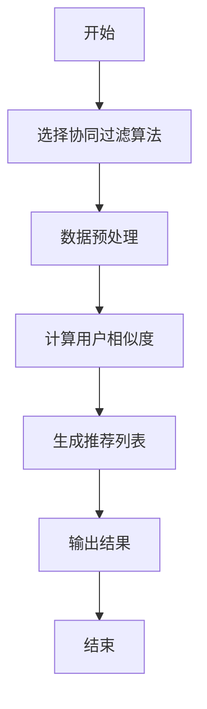
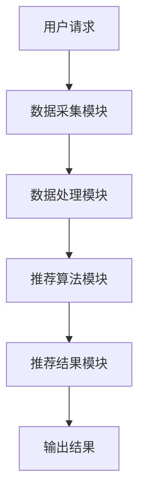

                 


# 企业估值中的AI驱动的个性化推荐系统评估

**关键词：企业估值、AI驱动、个性化推荐系统、推荐算法、企业价值评估**

**摘要：**  
本文探讨了如何利用AI技术中的个性化推荐系统来提升企业估值的准确性。通过分析推荐系统的核心概念、算法原理以及在企业估值中的具体应用，本文为企业估值提供了一种新的思路。文章从背景介绍、核心概念、算法原理、系统架构设计、项目实战到总结，详细阐述了AI驱动的个性化推荐系统在企业估值中的应用，旨在为企业估值提供更加智能化和个性化的解决方案。

---

## 第一部分: 企业估值与个性化推荐系统概述

### 第1章: 企业估值的背景与挑战

#### 1.1 传统企业估值方法的局限性
传统的企业估值方法主要依赖于财务指标分析、市场对标法和DCF模型等。这些方法在一定程度上能够提供企业的价值评估，但也存在以下问题：
- 数据依赖性强，难以处理非结构化数据。
- 无法实时动态调整，难以捕捉市场变化。
- 缺乏个性化，无法针对不同企业的特点进行定制化评估。

#### 1.2 个性化推荐在企业估值中的作用
个性化推荐系统能够通过分析企业的历史数据、市场行为和用户偏好，提供更加精准的企业价值评估。推荐系统能够帮助投资者更好地理解企业的潜在价值，尤其是在处理大量非结构化数据时，推荐系统的优势更加明显。

#### 1.3 企业估值的核心问题与解决思路
企业估值的核心问题是如何准确地将企业的财务数据、市场表现和潜在价值进行综合评估。个性化推荐系统通过整合多维度数据，利用机器学习算法，能够有效解决传统估值方法的局限性。

---

### 第2章: 个性化推荐系统的定义与特点

#### 2.1 个性化推荐的定义
个性化推荐是一种基于用户行为、偏好和特征，通过算法生成符合用户需求的内容或产品的技术。在企业估值中，个性化推荐系统可以根据企业的历史数据和市场表现，生成个性化的估值模型。

#### 2.2 推荐系统的分类与特点
推荐系统主要分为基于协同过滤、基于内容的推荐以及混合推荐模型。这些推荐系统在企业估值中的应用具有实时性、个性化和动态调整等特点。

#### 2.3 个性化推荐与企业估值的结合
个性化推荐系统通过分析企业的历史数据、市场对标和财务指标，生成个性化的估值模型，帮助投资者更准确地评估企业的价值。

---

## 第二部分: 核心概念与联系

### 第3章: 推荐系统的核心概念

#### 3.1 推荐系统的类型
- **基于协同过滤的推荐**：通过分析用户的行为和偏好，找到相似的用户群体，推荐相似的产品或服务。
- **基于内容的推荐**：通过分析产品的特征，找到与用户需求匹配的产品或服务。
- **混合推荐模型**：结合协同过滤和内容推荐的优势，提供更加精准的推荐结果。

#### 3.2 个性化推荐的关键属性对比
以下是不同推荐算法的对比表格：

| 推荐算法       | 基于协同过滤 | 基于内容的推荐 | 混合推荐模型 |
|----------------|--------------|----------------|------------|
| 优点           | 简单易实现     | 高准确性         | 结合两者优点 |
| 缺点           | 对稀疏数据敏感 | 需要大量特征数据 | 复杂度高     |
| 应用场景       | 用户行为分析   | 产品特征分析     | 综合场景     |

#### 3.3 推荐系统的ER实体关系图
以下是推荐系统的ER实体关系图：

```mermaid
erd
    企业表(企业ID, 企业名称, 行业, 成立时间, 财务指标)
    用户表(用户ID, 用户名称, 用户角色)
    推荐结果表(推荐ID, 企业ID, 用户ID, 估值结果, 推荐时间)
    关系：用户表-推荐结果表-企业表
```

---

## 第三部分: 算法原理与数学模型

### 第4章: 协同过滤算法原理

#### 4.1 协同过滤的数学模型
协同过滤算法通过计算用户之间的相似度，找到与目标用户相似的用户群体，推荐他们喜欢的产品或服务。相似度计算公式如下：

$$相似度 = \frac{\sum_{i=1}^{n} (r_{u_i} - \bar{r_u})(r_{v_i} - \bar{r_v})}{\sqrt{\sum_{i=1}^{n} (r_{u_i} - \bar{r_u})^2} \cdot \sqrt{\sum_{i=1}^{n} (r_{v_i} - \bar{r_v})^2}}$$

其中，$r_{u_i}$和$r_{v_i}$分别表示用户u和v在项目i上的评分，$\bar{r_u}$和$\bar{r_v}$分别表示用户u和v的平均评分。

#### 4.2 协同过滤的流程图
以下是协同过滤算法的流程图：



---

## 第四部分: 系统分析与架构设计

### 第5章: 企业估值推荐系统的架构设计

#### 5.1 系统功能设计
企业估值推荐系统的功能模块包括：
- 数据采集模块：采集企业的财务数据、市场数据和用户行为数据。
- 数据处理模块：对数据进行清洗、特征提取和数据增强。
- 推荐算法模块：实现协同过滤、内容推荐和混合推荐算法。
- 推荐结果模块：生成推荐结果并输出。

#### 5.2 系统架构设计
以下是系统的架构图：



#### 5.3 系统接口设计
系统的接口设计包括：
- 数据接口：与数据库和外部数据源对接。
- 推荐接口：提供推荐结果的API。
- 用户接口：提供用户交互界面。

---

## 第五部分: 项目实战

### 第6章: 个性化推荐系统的实现

#### 6.1 环境安装
推荐系统需要安装以下环境：
- Python 3.8+
- NumPy、Pandas、Scikit-learn等库。

#### 6.2 核心代码实现
以下是协同过滤算法的Python代码示例：

```python
import numpy as np
from sklearn.metrics.pairwise import cosine_similarity

# 示例数据矩阵
data_matrix = np.array([[4, 3, 0],
                         [2, 0, 5],
                         [1, 5, 3],
                         [0, 4, 6]])

# 计算相似度矩阵
similarity_matrix = cosine_similarity(data_matrix)
print(similarity_matrix)
```

#### 6.3 案例分析
以某科技公司为例，通过协同过滤算法，计算其与同行业公司的相似度，生成个性化的估值模型。

---

## 第六部分: 总结与展望

### 第7章: 总结

#### 7.1 本章小结
本文详细探讨了AI驱动的个性化推荐系统在企业估值中的应用，通过分析推荐系统的核心概念、算法原理和系统架构设计，为企业估值提供了一种新的思路。

#### 7.2 注意事项
在实际应用中，需要注意数据质量和模型的可解释性，确保推荐系统的准确性和可靠性。

#### 7.3 拓展阅读
建议读者进一步阅读相关领域的书籍和论文，深入理解推荐系统和企业估值的结合。

---

**作者：AI天才研究院/AI Genius Institute & 禅与计算机程序设计艺术 /Zen And The Art of Computer Programming**

