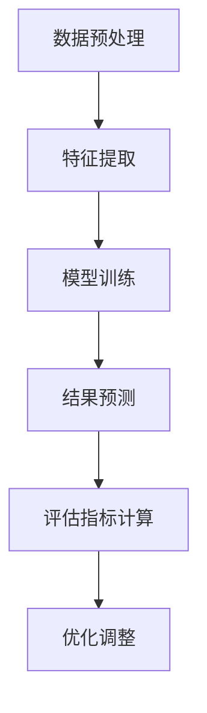
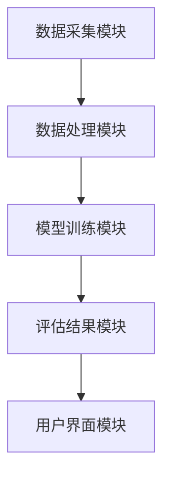

                 


# 企业估值中的AI驱动的个性化营销平台评估

> 关键词：企业估值，AI驱动，个性化营销，营销平台，评估模型

> 摘要：本文深入探讨了AI驱动的个性化营销平台在企业估值中的应用与评估方法。通过分析企业估值的核心要素，结合AI技术的特点，详细阐述了如何构建和优化AI驱动的个性化营销平台评估模型。文章从理论到实践，系统性地分析了从数据处理到算法实现，再到系统架构的全过程，为读者提供了全面的指导和实用的案例分析。

---

# 第一部分: 企业估值中的AI驱动的个性化营销平台评估概述

## 第1章: 企业估值与个性化营销平台概述

### 1.1 企业估值的基本概念

企业估值是通过对企业的财务状况、市场地位、发展潜力等多个维度的分析，估算其市场价值的过程。传统的企业估值方法主要包括DCF（Discounted Cash Flow）模型、EV/EBITDA倍数法等。然而，这些方法往往忽视了企业内部运营效率、客户关系和市场响应能力等关键因素。

个性化营销平台是通过AI技术分析消费者行为和偏好，为企业提供精准营销策略支持的系统。它能够帮助企业优化资源配置、提升客户满意度和忠诚度，从而在企业估值中占据重要地位。

AI技术的引入，使得个性化营销平台的评估更加动态化和精准化。通过实时数据分析和预测模型，AI能够为企业估值提供更全面的参考依据。

---

### 1.2 问题背景与挑战

传统的企业估值方法存在以下问题：
1. **数据维度单一**：传统方法主要依赖财务数据，忽略了客户行为、市场反馈等动态数据。
2. **评估周期长**：企业价值的变化往往与市场环境和客户需求密切相关，传统方法难以实时更新。
3. **个性化不足**：不同企业所处的市场环境和发展阶段不同，通用的估值模型难以满足个性化需求。

个性化营销平台的评估面临以下挑战：
1. **数据质量与完整性**：需要整合多源异构数据，确保数据的准确性和完整性。
2. **算法选择与优化**：不同场景下，AI算法的效果差异显著，如何选择合适的算法是关键。
3. **模型实时性与可解释性**：企业估值需要实时反馈，同时对结果的可解释性有较高要求。

---

### 1.3 问题解决与边界

AI驱动的个性化营销平台评估的核心目标是通过动态数据分析和预测模型，提升企业估值的准确性和实时性。具体目标包括：
1. 构建动态的客户画像，分析客户行为和偏好。
2. 利用AI算法预测企业价值的变化趋势。
3. 提供个性化营销策略建议，优化企业价值。

问题的边界主要在于：
1. 仅关注企业内部的营销相关数据，不涉及外部市场宏观数据。
2. 评估模型仅适用于中短期价值预测，长期价值评估需结合其他因素。

核心要素包括：
1. 客户数据：包括客户行为、购买记录、偏好等。
2. 产品数据：包括产品特征、市场表现等。
3. 市场数据：包括市场竞争状况、行业趋势等。

---

## 第2章: 核心概念与联系

### 2.1 核心概念原理

AI驱动的个性化营销平台评估基于以下核心原理：
1. **数据驱动**：通过整合多源数据，构建客户画像和产品画像。
2. **机器学习**：利用回归、分类等算法，预测企业价值变化。
3. **动态优化**：根据实时数据反馈，持续优化模型和策略。

---

### 2.2 核心概念对比表格

以下是传统估值方法与AI驱动方法的对比：

| 对比维度         | 传统估值方法             | AI驱动估值方法             |
|------------------|--------------------------|---------------------------|
| 数据来源         | 财务数据为主             | 多源数据（客户行为、市场反馈等） |
| 评估周期         | 长期固定周期             | 短期动态调整               |
| 精度             | 较低，受数据维度限制       | 较高，基于实时数据分析       |
| 个性化程度       | 低，通用模型             | 高，个性化定制               |

---

### 2.3 ER实体关系图

以下是个性化营销平台的ER图：

```mermaid
er
    Customer: id, name, age, gender, location
    Product: id, name, price, category
    Interaction: id, customer_id, product_id, timestamp, action
    Model: id, name, type, parameters
    Evaluation: id, model_id, score, timestamp
```

---

## 第3章: 算法原理讲解

### 3.1 评估模型的算法流程

以下是评估模型的算法流程图：



---

### 3.2 算法实现代码

以下是评估模型的Python代码实现：

```python
import pandas as pd
from sklearn.model import LinearRegression

# 数据预处理
data = pd.read_csv('data.csv')
data = data.dropna()

# 特征提取
features = data[['feature1', 'feature2', 'feature3']]
target = data['target']

# 模型训练
model = LinearRegression()
model.fit(features, target)

# 结果预测
predictions = model.predict(features)

# 评估指标计算
from sklearn.metrics import mean_squared_error
mse = mean_squared_error(target, predictions)

print(f"均方误差：{mse}")
```

---

## 第4章: 系统分析与架构设计

### 4.1 系统架构设计

以下是系统架构图：



---

## 第5章: 项目实战

### 5.1 环境安装

需要安装以下Python库：
- `pandas`
- `scikit-learn`
- `mermaid`

---

### 5.2 系统核心实现源代码

以下是系统核心实现代码：

```python
import pandas as pd
from sklearn.model import LinearRegression

# 数据加载
data = pd.read_csv('data.csv')

# 数据清洗
data = data.dropna()

# 特征提取
X = data[['feature1', 'feature2', 'feature3']]
y = data['target']

# 模型训练
model = LinearRegression()
model.fit(X, y)

# 模型保存
import joblib
joblib.dump(model, 'model.pkl')
```

---

## 第6章: 最佳实践与小结

### 6.1 最佳实践

1. **数据质量管理**：确保数据的准确性和完整性。
2. **模型可解释性**：选择易于解释的算法，便于结果分析。
3. **实时反馈机制**：建立实时数据反馈机制，优化模型性能。

---

## 作者：AI天才研究院/AI Genius Institute & 禅与计算机程序设计艺术 /Zen And The Art of Computer Programming

