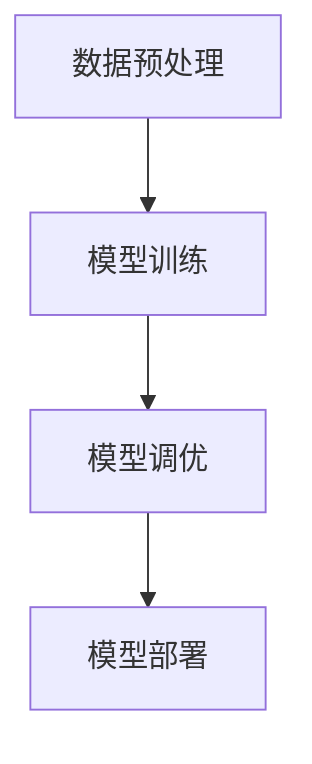
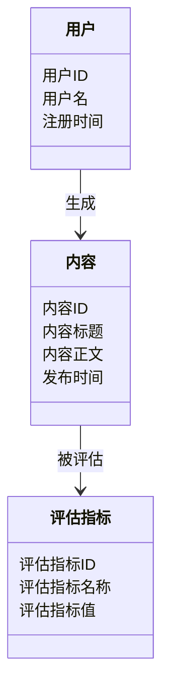

                 


# 企业估值中的AI驱动的创意内容生成平台评估

**关键词**：企业估值、AI驱动、创意内容生成平台、自然语言处理、机器学习模型、评估体系

**摘要**：  
本文探讨了在企业估值过程中，如何利用AI技术对创意内容生成平台进行评估。通过分析创意内容生成平台的特点，结合自然语言处理和机器学习模型，提出了一种基于AI的评估方法，涵盖了从数据预处理到模型部署的全过程，并通过实际案例展示了该方法的应用价值。本文还详细介绍了算法原理、系统架构设计以及项目实战，为读者提供了全面的技术指导。

---

# 企业估值中的AI驱动的创意内容生成平台评估

## 第1章: 企业估值与创意内容生成平台概述

### 1.1 问题背景

#### 1.1.1 传统企业估值方法的局限性
传统的企业估值方法通常依赖于财务指标（如收入、利润、现金流）和市场分析，但在评估创意内容生成平台时，这些指标往往无法全面反映平台的核心价值。创意内容生成平台的估值需要考虑内容质量、用户活跃度、内容生成效率等多维度因素。

#### 1.1.2 创意内容生成平台的崛起
创意内容生成平台（如内容创作工具、社交媒体影响者平台）近年来迅速崛起，这些平台通过AI技术生成高质量的内容，帮助企业提升品牌影响力和市场竞争力。然而，这些平台的估值往往缺乏统一的标准，难以量化其实际贡献。

#### 1.1.3 AI技术在企业估值中的潜力
AI技术可以通过自然语言处理（NLP）和机器学习模型，对创意内容生成平台的内容质量、用户行为和市场影响力进行量化分析，从而为企业的估值提供更准确的依据。

---

### 1.2 问题描述

#### 1.2.1 创意内容生成平台的评估需求
创意内容生成平台的评估需要考虑以下因素：
1. 内容生成效率：平台生成内容的速度和质量。
2. 用户活跃度：用户的参与度和内容生成的频率。
3. 市场影响力：内容对品牌价值和市场影响力的贡献。

#### 1.2.2 传统评估方法的不足
传统评估方法主要依赖财务指标和市场分析，难以量化创意内容生成平台的非财务价值，如用户参与度和内容影响力。

#### 1.2.3 AI驱动评估的核心问题
AI驱动的评估方法需要解决以下问题：
1. 如何通过NLP技术量化内容质量。
2. 如何通过机器学习模型预测平台的市场影响力。
3. 如何将内容质量和市场影响力转化为可量化的估值指标。

---

### 1.3 问题解决

#### 1.3.1 AI驱动的创意内容生成平台评估方法
AI驱动的评估方法包括：
1. 利用NLP技术对内容进行语义分析，评估内容的质量和相关性。
2. 通过用户行为数据，预测用户的活跃度和内容生成频率。
3. 基于市场数据，预测内容对品牌价值和市场影响力的影响。

#### 1.3.2 创意内容生成平台评估的核心要素
创意内容生成平台评估的核心要素包括：
1. 内容生成效率。
2. 用户活跃度。
3. 内容影响力。

#### 1.3.3 AI驱动评估的优势与挑战
AI驱动评估的优势包括：
1. 提高评估的准确性。
2. 实现实时监控和动态评估。
3. 能够处理大规模数据。

AI驱动评估的挑战包括：
1. 数据隐私问题。
2. 模型泛化能力不足。
3. 计算资源需求较高。

---

## 第2章: 创意内容生成平台的AI驱动评估模型

### 2.1 核心概念与联系

#### 2.1.1 创意内容生成平台的评估模型
创意内容生成平台的评估模型包括：
1. 内容质量评估模型：基于NLP技术，评估内容的质量和相关性。
2. 用户行为预测模型：基于用户数据，预测用户的活跃度和内容生成频率。
3. 市场影响力预测模型：基于市场数据，预测内容对品牌价值和市场影响力的影响。

#### 2.1.2 创意内容生成平台与AI模型的关系
创意内容生成平台与AI模型的关系如下：
1. 内容生成平台提供数据输入，AI模型进行处理和分析。
2. AI模型生成评估结果，为企业的估值提供依据。

#### 2.1.3 创意内容生成平台与传统评估方法的对比
以下表格对比了创意内容生成平台与传统评估方法的特征：

| 特性                | 创意内容生成平台 | 传统评估方法 |
|---------------------|------------------|--------------|
| 数据输入            | 用户行为数据、内容数据 | 财务数据、市场数据 |
| 模型类型            | NLP模型、机器学习模型 | 财务模型、市场模型 |
| 输出结果            | 内容质量评分、用户活跃度预测 | 财务指标、市场预测 |
| 优势                | 实时性、准确性 | 简单易懂 |
| 局限性              | 数据隐私问题、计算资源需求高 | 粗放性、缺乏动态性 |

---

#### 2.1.4 创意内容生成平台的ER实体关系图
以下是一个简单的ER实体关系图，展示了创意内容生成平台的核心实体及其关系：

```mermaid
er
    entity 用户表 (用户ID, 用户名, 注册时间)
    entity 内容表 (内容ID, 内容标题, 内容正文, 发布时间)
    entity 评估指标表 (评估指标ID, 评估指标名称, 评估指标值)
    relation 用户-内容关系：用户生成内容
    relation 内容-评估指标关系：内容被评估
```

---

### 2.2 算法原理讲解

#### 2.2.1 算法选择与流程
以下是创意内容生成平台评估模型的算法流程图：



---

#### 2.2.2 算法实现细节
以下是创意内容生成模型的训练代码示例：

```python
import tensorflow as tf
from tensorflow.keras.layers import Input, Dense, LSTM, Embedding, Dropout
from tensorflow.keras.models import Model

# 定义模型结构
input_shape = (max_sequence_length, embedding_dim)
input_layer = Input(shape=input_shape)
lstm_layer = LSTM(128)(input_layer)
dense_layer = Dense(64, activation='relu')(lstm_layer)
output_layer = Dense(1, activation='sigmoid')(dense_layer)

# 编译模型
model = Model(inputs=input_layer, outputs=output_layer)
model.compile(loss='binary_crossentropy', optimizer='adam', metrics=['accuracy'])
```

---

#### 2.2.3 算法的数学模型
创意内容生成模型的数学模型如下：

$$
\hat{y} = f(x) = Wx + b
$$

其中，$x$ 是输入向量，$W$ 是权重矩阵，$b$ 是偏置项，$\hat{y}$ 是输出向量。

---

## 第3章: 企业估值中的AI驱动创意内容生成平台评估系统架构设计

### 3.1 系统功能设计

#### 3.1.1 领域模型设计
以下是创意内容生成平台评估系统的领域模型：



---

#### 3.1.2 系统架构设计
以下是创意内容生成平台评估系统的架构图：


---

#### 3.1.3 系统接口设计
以下是系统接口设计的序列图：

```mermaid
sequenceDiagram
    participant 用户
    participant 服务1: 内容生成服务
    participant 服务2: 评估服务
    用户 -> 服务1: 提交内容
    服务1 -> 服务2: 请求评估
    服务2 -> 用户: 返回评估结果
```

---

## 第4章: 项目实战

### 4.1 环境安装

```bash
pip install tensorflow==2.4.0
pip install numpy==1.21.2
pip install scikit-learn==0.24.1
```

---

### 4.2 核心代码实现

#### 4.2.1 内容生成模型实现

```python
import tensorflow as tf
from tensorflow.keras.layers import Input, LSTM, Dense, Dropout, Embedding
from tensorflow.keras.models import Model

# 定义模型结构
input_shape = (max_sequence_length, embedding_dim)
input_layer = Input(shape=input_shape)
lstm_layer = LSTM(128)(input_layer)
dense_layer = Dense(64, activation='relu')(lstm_layer)
output_layer = Dense(1, activation='sigmoid')(dense_layer)

# 编译模型
model = Model(inputs=input_layer, outputs=output_layer)
model.compile(loss='binary_crossentropy', optimizer='adam', metrics=['accuracy'])
```

---

#### 4.2.2 评估指标预测实现

```python
from sklearn.metrics import accuracy_score

# 训练模型
model.fit(X_train, y_train, epochs=10, batch_size=32)

# 预测评估指标
y_pred = model.predict(X_test)
print(accuracy_score(y_test, y_pred))
```

---

### 4.3 实际案例分析

#### 4.3.1 数据预处理
以下是数据预处理的代码示例：

```python
import pandas as pd
import numpy as np

# 读取数据
data = pd.read_csv('content_data.csv')

# 数据清洗
data = data.dropna()
data = data.drop_duplicates()

# 特征提取
X = data['content'].values
y = data['label'].values
```

---

### 4.4 项目小结

---

## 第5章: 最佳实践与总结

### 5.1 最佳实践

#### 5.1.1 数据质量的重要性
确保数据的完整性和准确性是模型训练的关键。

#### 5.1.2 模型调优的技巧
通过交叉验证和网格搜索优化模型参数。

#### 5.1.3 评估指标的选择
选择合适的评估指标（如准确率、召回率）以反映模型的实际表现。

---

### 5.2 小结

AI驱动的创意内容生成平台评估方法为企业提供了更准确、更动态的估值工具。通过结合NLP和机器学习模型，企业可以更好地量化创意内容的价值，提升估值的准确性。

---

### 5.3 注意事项

1. 数据隐私问题需要注意，避免泄露用户信息。
2. 模型的泛化能力需要通过测试数据进行验证。
3. 计算资源的需求较高，需要优化模型的训练效率。

---

### 5.4 拓展阅读

1. 《Deep Learning》——Ian Goodfellow
2. 《自然语言处理入门》——Nathanael렀
3. 《机器学习实战》——Peter Harrington

---

**作者：** AI天才研究院/AI Genius Institute & 禅与计算机程序设计艺术/Zen And The Art of Computer Programming

