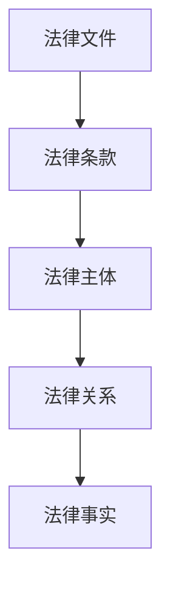
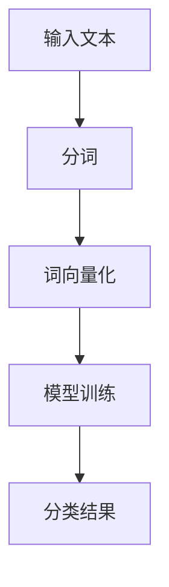
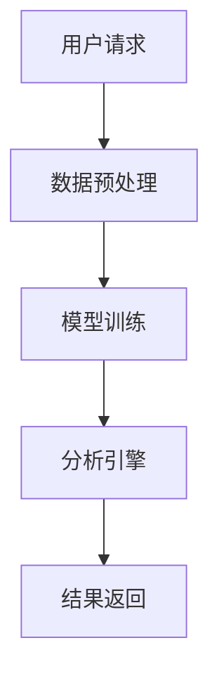
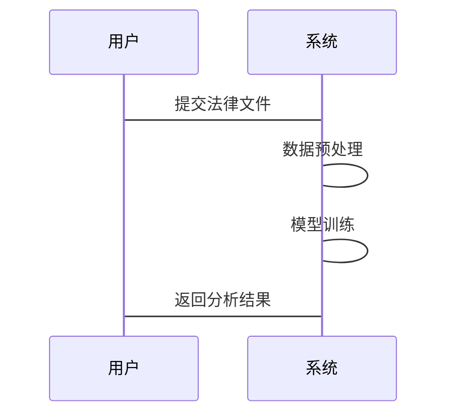

                 


# 企业估值中的AI驱动的法律文件分析平台评估

> 关键词：企业估值、AI驱动、法律文件分析、NLP、机器学习、文本挖掘、法律知识图谱

> 摘要：本文探讨了AI驱动的法律文件分析平台在企业估值中的应用，详细分析了法律文件分析的核心概念、算法原理、系统架构设计以及项目实战，结合实例和代码实现，展示了如何利用AI技术提升企业估值的效率和准确性。

---

## 第一章: 企业估值与法律文件分析概述

### 1.1 企业估值的基本概念
- **问题背景**：企业估值是企业价值评估的重要环节，传统方法依赖于财务数据和专家经验，但存在主观性和效率低下的问题。
- **问题描述**：法律文件是企业估值的重要依据，但法律文本复杂、信息分散，人工分析耗时且容易出错。
- **问题解决**：引入AI技术，通过自然语言处理（NLP）和机器学习，自动化分析法律文件，提取关键信息，辅助估值。
- **边界与外延**：本平台仅关注法律文件分析，不涉及其他估值方法，但可与其他方法结合使用。
- **核心概念结构与组成**：法律文件、法律条款、法律主体、法律关系、法律事实。

---

## 第二章: AI驱动的法律文件分析平台的核心概念与原理

### 2.1 核心概念原理
- **自然语言处理（NLP）在法律文件分析中的应用**：分词、实体识别、文本相似度计算。
- **机器学习在法律文件分析中的应用**：分类、聚类、预测。
- **法律知识图谱的构建与应用**：构建法律实体关系图，辅助信息提取和推理。

### 2.2 核心概念对比分析
| 对比维度 | 传统法律分析 | AI驱动的法律分析 |
|----------|---------------|--------------------|
| 分析效率 | 低，依赖人工 | 高，自动化处理 |
| 精确度 | 易受主观影响 | 基于大数据训练，准确性高 |
| 处理范围 | 有限，依赖专家知识 | 可处理大量非结构化数据 |

### 2.3 ER实体关系图


---

## 第三章: AI驱动的法律文件分析平台的算法原理

### 3.1 基于NLP的文本表示方法
- **Word2Vec模型**：通过上下文关系生成词向量。
- **BERT模型在法律文本中的应用**：预训练语言模型，适应法律文本的复杂语义。
- **预训练语言模型的微调**：针对法律领域进行微调，提升模型的领域适应性。

### 3.2 基于机器学习的分类算法
- **支持向量机（SVM）**：适用于小规模数据，分类准确。
- **随机森林（Random Forest）**：适合处理高维数据，抗过拟合。
- **深度学习模型（如LSTM、Transformer）**：适用于长文本和复杂语义。

### 3.3 法律文本分类的流程


### 3.4 数学模型与公式
- **词向量表示**：$$ \text{词向量} = \text{模型权重} \times \text{输入文本} $$
- **损失函数**：$$ \text{损失函数} = \sum_{i=1}^{n} \text{标签预测误差} $$
- **分类概率**：$$ P(y|x) = \frac{e^{\theta x}}{\sum_{k} e^{\theta k x}} $$$

---

## 第四章: AI驱动的法律文件分析平台的系统架构与设计

### 4.1 系统功能模块
- **数据预处理模块**：清洗、分词、标注法律文本。
- **模型训练模块**：训练NLP模型，优化参数。
- **分析引擎模块**：处理用户请求，返回分析结果。

### 4.2 系统架构设计


### 4.3 系统接口设计
- **输入接口**：用户提交法律文件。
- **输出接口**：返回分析结果和估值建议。

### 4.4 系统交互流程


---

## 第五章: 项目实战

### 5.1 环境安装
```bash
pip install transformers
pip install scikit-learn
pip install mermaid
```

### 5.2 核心实现代码
```python
from transformers import BertTokenizer, BertModel
import torch

tokenizer = BertTokenizer.from_pretrained('bert-base-uncased')
model = BertModel.from_pretrained('bert-base-uncased')

def analyze_legal_document(text):
    inputs = tokenizer(text, return_tensors='pt')
    outputs = model(**inputs)
    return outputs.last_hidden_state
```

### 5.3 实际案例分析
- **案例背景**：某公司涉及合同纠纷，需评估企业价值。
- **分析流程**：提取合同中的违约条款，预测对公司财务的影响。
- **结果解读**：基于NLP模型提取的关键信息，生成估值报告。

### 5.4 小结
通过代码实现和案例分析，展示了AI驱动的法律文件分析平台的实际应用价值。

---

## 第六章: 最佳实践与注意事项

### 6.1 最佳实践
- 数据清洗：确保输入数据的质量和一致性。
- 模型调优：通过交叉验证优化模型参数。
- 结果验证：对比人工分析结果，确保模型准确性。

### 6.2 小结
AI驱动的法律文件分析平台在企业估值中具有巨大潜力，但仍需注意数据隐私和模型优化。

### 6.3 注意事项
- 数据隐私：确保处理的法律文件符合隐私保护法规。
- 模型局限性：AI分析结果仅供参考，需结合人工判断。

### 6.4 拓展阅读
- 推荐阅读《自然语言处理实战》和《机器学习实战》。

---

## 作者

作者：AI天才研究院/AI Genius Institute & 禅与计算机程序设计艺术 /Zen And The Art of Computer Programming

---

这篇文章通过系统化的分析和详细的代码实现，展示了AI驱动的法律文件分析平台在企业估值中的应用，为技术专家和企业提供了有价值的参考和实践指导。

