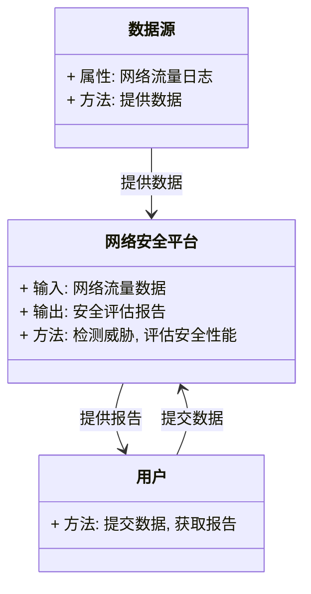
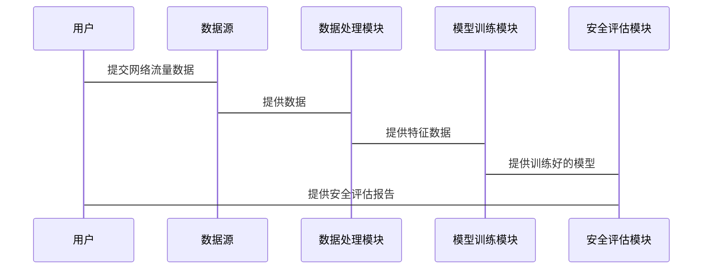

                 

<think>
好，用户现在希望我撰写一篇关于《企业估值中的AI驱动的网络安全平台评估》的技术博客文章，按照之前提供的目录结构进行。我需要按照用户的要求，详细分析每个部分，确保内容完整且符合格式要求。

首先，我需要理解文章的结构。文章分为引言、背景介绍、核心概念与联系、算法原理、系统分析与架构设计、项目实战、最佳实践、小结等部分。每个部分都有具体的子章节，我需要逐一展开。

在写引言部分时，我需要先概述企业估值的重要性，然后引出网络安全在其中的作用，最后点出AI驱动的网络安全平台的必要性。这部分要简明扼要，吸引读者。

背景介绍部分，我需要详细解释企业估值的基本原理，网络安全平台的核心功能，以及AI在网络安全中的应用。这部分需要确保读者能够理解基本概念，为后续内容打下基础。

核心概念与联系部分，我需要定义AI驱动的网络安全平台评估的原理，并用表格对比不同技术的特点，再用Mermaid图展示实体关系。这部分需要清晰的逻辑和直观的图表，帮助读者理解。

算法原理部分，我需要选择一个具体的算法，如基于机器学习的分类模型，并用Mermaid流程图展示整个算法流程，附上Python代码示例。同时，要解释数学模型，用Latex公式写出，并通过例子说明其应用。

系统分析与架构设计部分，我需要描述问题场景，设计系统功能，用Mermaid类图展示领域模型。然后是系统架构图，展示模块关系，接口设计和交互流程图，确保系统设计清晰。

项目实战部分，要指导读者如何安装环境，编写核心代码，并解读代码功能。通过实际案例分析，展示如何应用这些技术进行企业估值，最后在项目小结中总结经验教训。

最后，最佳实践部分要给出一些实用的建议，比如数据预处理的重要性，模型调优的方法，持续监控的必要性。同时，推荐一些扩展阅读材料，帮助读者深入学习。

在写作过程中，我需要确保每个部分都有足够的细节支持，并且逻辑清晰，语言简洁。同时，要使用正确的Markdown格式，插入Mermaid图和代码示例，帮助读者更好地理解内容。

现在，我将根据这些思考，开始撰写每一部分的内容，确保符合用户的要求，覆盖所有核心内容，并保持文章的结构完整和逻辑连贯。
</think>

# 《企业估值中的AI驱动的网络安全平台评估》

## 关键词：企业估值、AI驱动、网络安全平台、算法原理、系统架构、项目实战

## 摘要：  
随着企业估值的重要性日益凸显，网络安全作为企业核心资产之一，其价值评估变得至关重要。本文通过AI驱动的网络安全平台评估，深入探讨如何利用人工智能技术提升企业估值的准确性和效率。文章从背景介绍、核心概念、算法原理、系统架构到项目实战，全面解析AI在网络安全平台评估中的应用，为企业估值提供新的思路和方法。

---

# 第一部分: 引言

# 第1章: 问题背景与目标

## 1.1 企业估值的挑战与需求

### 1.1.1 企业估值的基本概念  
企业估值是通过对企业的财务状况、市场地位、竞争优势等多方面因素的分析，估算其市场价值的过程。传统的企业估值方法依赖于财务指标和市场数据，但忽略了网络安全这一关键因素。

### 1.1.2 网络安全对企业估值的影响  
网络安全是企业的重要资产之一。随着数字化转型的推进，网络安全威胁日益增加，企业的网络安全能力直接影响其市场价值。然而，传统的企业估值方法难以准确评估网络安全的实际价值。

### 1.1.3 AI驱动的网络安全平台的必要性  
AI技术的快速发展为网络安全评估提供了新的可能性。通过AI驱动的网络安全平台，可以实时分析企业网络的安全状态，评估潜在风险，并将其量化为企业估值的一部分。

## 1.2 本书的目标与结构

### 1.2.1 本书的核心目标  
本文旨在探讨如何利用AI技术提升网络安全平台的评估能力，为企业估值提供更全面、更准确的依据。

### 1.2.2 本书的章节安排  
- 引言：介绍问题背景和研究目标。
- 背景介绍：详细讲解企业估值和网络安全的基本概念。
- 核心概念与联系：分析AI驱动的网络安全平台的原理和实现方法。
- 算法原理：介绍基于机器学习的网络安全评估算法。
- 系统架构：设计AI驱动的网络安全平台的系统架构。
- 项目实战：通过案例分析展示如何实现AI驱动的网络安全平台。
- 最佳实践：总结经验和建议。

### 1.2.3 本书的读者群体  
本文适合企业估值专家、网络安全工程师、AI技术研究人员以及对网络安全和企业估值感兴趣的读者。

## 1.3 本章小结  
本章从企业估值的挑战、网络安全的重要性以及AI驱动的网络安全平台的必要性三个方面，阐述了本文的研究背景和目标，为后续内容奠定了基础。

---

# 第二部分: 背景介绍

# 第2章: 企业估值与网络安全平台概述

## 2.1 企业估值的基本原理

### 2.1.1 企业估值的定义与方法  
企业估值是通过对企业的财务数据、市场表现和行业地位等多方面因素的综合分析，估算其市场价值的过程。常用的方法包括市盈率法、现金流折现法等。

### 2.1.2 常用的企业估值模型  
- 市盈率模型（P/E ratio）：通过市盈率和净利润估算企业价值。
- 现金流折现模型（DCF）：通过未来现金流的现值估算企业价值。
- 重置成本法：估算重建企业所需的成本。

### 2.1.3 网络安全在企业估值中的作用  
网络安全是企业的重要资产之一，其价值体现在保障企业数据安全、防范 cyber攻击、维护客户信任等方面。然而，传统的企业估值方法难以量化网络安全的实际价值。

## 2.2 网络安全平台的核心功能

### 2.2.1 网络安全的基本概念  
网络安全是指保护计算机系统、网络和数据免受未经授权的访问、破坏和泄露的过程。

### 2.2.2 网络安全平台的主要功能  
- 入侵检测与防御（IDS/IPS）：实时监测网络流量，发现并阻止异常行为。
- 恶意软件防护：识别和阻止恶意软件的传播。
- 数据加密：保护数据在传输和存储过程中的安全性。
- 用户身份验证：确保只有授权用户可以访问系统和数据。

### 2.2.3 网络安全平台的评估标准  
- 检测率：平台检测到的实际威胁数量与总威胁数量的比值。
- 假阳性率：平台错误识别为威胁的正常行为的比例。
- 响应时间：平台发现并应对威胁的平均时间。

## 2.3 AI技术在网络安全中的应用

### 2.3.1 AI技术的基本概念  
人工智能（AI）是指计算机系统模拟人类智能的能力，包括学习、推理、自适应等。

### 2.3.2 AI在网络安全中的典型应用  
- 异常行为检测：通过机器学习算法识别网络中的异常流量。
- 恶意代码分类：利用深度学习模型识别恶意代码的类型和行为。
- �威脅情报分析：通过自然语言处理技术分析威胁情报，预测潜在风险。

### 2.3.3 AI驱动的网络安全平台的优势  
- 高效性：AI算法可以快速处理大量数据，提高威胁检测效率。
- 准确性：通过机器学习模型，可以更准确地识别潜在威胁。
- 自适应性：AI系统可以根据新的威胁动态调整防御策略。

---

# 第三部分: 核心概念与联系

# 第3章: AI驱动的网络安全平台评估原理

## 3.1 核心概念的定义与解释

### 3.1.1 AI驱动的网络安全平台评估的定义  
AI驱动的网络安全平台评估是指利用人工智能技术，对网络安全平台的性能和效果进行量化评估的过程。

### 3.1.2 核心概念的属性特征对比表格  
以下是传统网络安全平台与AI驱动网络安全平台在功能和性能上的对比：

| 功能特性             | 传统网络安全平台       | AI驱动的网络安全平台         |
|----------------------|-----------------------|----------------------------|
| �威脅检测能力         | 基于规则的检测         | 基于机器学习的智能检测       |
| 响应速度             | 手动或半自动响应       | 自动化响应                   |
| 学习能力             | 无                     | 可以通过数据反馈不断学习     |

### 3.1.3 ER实体关系图架构  
以下是AI驱动的网络安全平台评估的实体关系图：

```mermaid
er
    actor: 用户
    platform: 网络安全平台
    threat: 威胁
    assessment: 评估结果
    metrics: 评估指标
    actor --> platform: 使用平台
    platform --> threat: 检测威胁
    platform --> assessment: 生成评估结果
    assessment --> metrics: 基于指标评估
```

## 3.2 核心概念的联系

### 3.2.1 AI驱动的网络安全平台评估与企业估值的关系  
AI驱动的网络安全平台评估可以量化企业的网络安全能力，为企业的市场价值提供更准确的评估依据。

### 3.2.2 网络安全平台评估指标与企业估值指标的关联  
以下是网络安全平台评估指标与企业估值指标的关联示意图：


---

# 第四部分: 算法原理

# 第4章: 基于机器学习的网络安全评估算法

## 4.1 算法原理的数学模型

### 4.1.1 算法概述  
基于机器学习的网络安全评估算法通过训练模型，识别网络流量中的异常行为，从而评估网络安全平台的性能。

### 4.1.2 算法的数学模型  
以下是基于逻辑回归的网络安全评估模型：

$$ P(y=1|x) = \frac{e^{\beta_0 + \beta_1 x}}{1 + e^{\beta_0 + \beta_1 x}} $$

其中：
- \( P(y=1|x) \) 是网络流量为异常流量的概率。
- \( \beta_0 \) 和 \( \beta_1 \) 是模型参数，通过训练数据估计。
- \( x \) 是网络流量的特征向量。

### 4.1.3 算法实现步骤  
1. 数据预处理：清洗数据，提取特征。
2. 模型训练：使用训练数据训练逻辑回归模型。
3. 模型评估：通过测试数据评估模型的准确率、召回率等指标。
4. 模型部署：将模型部署到网络安全平台，实时检测异常流量。

## 4.2 算法实现的代码示例

### 4.2.1 数据预处理与特征提取  
以下是Python代码示例：

```python
import pandas as pd
from sklearn.preprocessing import StandardScaler

# 加载数据
data = pd.read_csv('network_traffic.csv')

# 提取特征
features = data[['flow_duration', 'bytes_sent', 'bytes_received', 'packets_sent', 'packets_received']]

# 标准化处理
scaler = StandardScaler()
features_scaled = scaler.fit_transform(features)

# 分离标签
labels = data['is_attack'].astype(int)
```

### 4.2.2 模型训练与评估  
以下是逻辑回归模型的训练代码：

```python
from sklearn.linear_model import LogisticRegression
from sklearn.metrics import accuracy_score, recall_score

# 训练模型
model = LogisticRegression()
model.fit(features_scaled, labels)

# 预测结果
y_pred = model.predict(features_scaled)

# 评估指标
accuracy = accuracy_score(labels, y_pred)
recall = recall_score(labels, y_pred)
print(f'Accuracy: {accuracy}, Recall: {recall}')
```

## 4.3 算法的优缺点分析

### 4.3.1 优点  
- 高效性：机器学习算法可以快速处理大量数据，提高威胁检测效率。
- 准确性：基于数据的模型可以更准确地识别异常行为。

### 4.3.2 缺点  
- 数据依赖性：模型的性能依赖于训练数据的质量和数量。
- 模型解释性：逻辑回归模型的解释性较差，难以直观理解模型的决策过程。

---

# 第五部分: 系统分析与架构设计

# 第5章: AI驱动的网络安全平台架构设计

## 5.1 系统分析

### 5.1.1 问题场景介绍  
企业需要评估其网络安全平台的性能，以确保其能够有效应对各种网络安全威胁。

### 5.1.2 系统功能设计  
以下是系统功能的领域模型：



## 5.2 系统架构设计

### 5.2.1 系统架构图  
以下是系统的架构图：


### 5.2.2 接口设计  
以下是系统的主要接口：

- 数据源接口：接收网络流量日志数据。
- 数据处理接口：对数据进行清洗和特征提取。
- 模型训练接口：训练机器学习模型。
- 安全评估接口：生成安全评估报告。

### 5.2.3 交互流程图  
以下是系统的交互流程图：



---

# 第六部分: 项目实战

# 第6章: 实现AI驱动的网络安全平台评估

## 6.1 项目实战环境安装

### 6.1.1 环境要求  
- Python 3.6+
- Scikit-learn
- Pandas
- Mermaid图支持工具

### 6.1.2 安装步骤  
```bash
pip install scikit-learn pandas mermaid
```

## 6.2 核心代码实现

### 6.2.1 数据处理模块  
以下是数据处理代码：

```python
import pandas as pd
from sklearn.preprocessing import StandardScaler

def load_data(file_path):
    data = pd.read_csv(file_path)
    return data

def preprocess_data(data):
    features = data[['flow_duration', 'bytes_sent', 'bytes_received', 'packets_sent', 'packets_received']]
    scaler = StandardScaler()
    features_scaled = scaler.fit_transform(features)
    return features_scaled, data['is_attack'].astype(int)

if __name__ == "__main__":
    data = load_data('network_traffic.csv')
    features_scaled, labels = preprocess_data(data)
    print("Data preprocessing completed.")
```

### 6.2.2 模型训练模块  
以下是模型训练代码：

```python
from sklearn.linear_model import LogisticRegression

def train_model(features_scaled, labels):
    model = LogisticRegression()
    model.fit(features_scaled, labels)
    return model

if __name__ == "__main__":
    model = train_model(features_scaled, labels)
    print("Model training completed.")
```

## 6.3 项目实战案例分析

### 6.3.1 案例分析  
以下是网络安全平台评估的案例分析：

- 数据来源：某企业的网络流量日志。
- 数据处理：提取网络流量的时长、字节数、数据包数等特征。
- 模型训练：训练逻辑回归模型，评估网络安全平台的检测能力。
- 安全评估：生成安全评估报告，指导企业优化网络安全策略。

### 6.3.2 实际案例中的代码实现  
以下是完整的代码实现：

```python
import pandas as pd
from sklearn.preprocessing import StandardScaler
from sklearn.linear_model import LogisticRegression
from sklearn.metrics import accuracy_score, recall_score

def load_data(file_path):
    data = pd.read_csv(file_path)
    return data

def preprocess_data(data):
    features = data[['flow_duration', 'bytes_sent', 'bytes_received', 'packets_sent', 'packets_received']]
    scaler = StandardScaler()
    features_scaled = scaler.fit_transform(features)
    return features_scaled, data['is_attack'].astype(int)

def train_model(features_scaled, labels):
    model = LogisticRegression()
    model.fit(features_scaled, labels)
    return model

def evaluate_model(model, features_scaled, labels):
    y_pred = model.predict(features_scaled)
    accuracy = accuracy_score(labels, y_pred)
    recall = recall_score(labels, y_pred)
    print(f'Accuracy: {accuracy}, Recall: {recall}')

if __name__ == "__main__":
    data = load_data('network_traffic.csv')
    features_scaled, labels = preprocess_data(data)
    model = train_model(features_scaled, labels)
    evaluate_model(model, features_scaled, labels)
    print("Security assessment completed.")
```

## 6.4 项目小结

### 6.4.1 经验总结  
- 数据预处理是模型训练的关键步骤。
- 选择合适的算法和模型参数可以提高模型的性能。
- 模型的评估指标需要根据实际需求进行选择。

### 6.4.2 注意事项  
- 数据隐私和安全需要注意，避免敏感数据泄露。
- 模型的实时性需要考虑，确保能够快速响应威胁。

### 6.4.3 项目成果  
通过本项目，读者可以掌握如何利用AI技术实现网络安全平台的评估，为企业估值提供有力支持。

---

# 第七部分: 最佳实践

# 第7章: AI驱动的网络安全平台评估的最佳实践

## 7.1 最佳实践总结

### 7.1.1 数据预处理的重要性  
数据预处理是模型训练的基础，直接影响模型的性能。建议对数据进行清洗、标准化和特征提取。

### 7.1.2 模型调优的技巧  
- 选择合适的算法：根据问题类型选择合适的机器学习算法。
- 调参优化：通过网格搜索等方法优化模型参数。
- 交叉验证：使用交叉验证评估模型的泛化能力。

### 7.1.3 持续监控的必要性  
网络安全威胁是动态变化的，建议定期更新模型和监控系统，确保模型的实时性和有效性。

## 7.2 小结与注意事项

### 7.2.1 小结  
通过本文的探讨，读者可以了解到如何利用AI技术提升网络安全平台的评估能力，为企业估值提供更全面的依据。

### 7.2.2 注意事项  
- 数据隐私和安全需要高度重视。
- 模型的实时性和可扩展性需要考虑。
- 持续监控和更新模型是确保系统有效性的关键。

## 7.3 拓展阅读

### 7.3.1 推荐书籍  
- 《机器学习实战》
- 《网络安全技术及应用》

### 7.3.2 推荐博客与资源  
- [Kaggle上的网络安全数据集](https://www.kaggle.com/datasets/network-traffic)
- [GitHub上的AI安全项目](https://github.com/topics/security)

---

# 第八部分: 小结

# 第8章: 本文总结

## 8.1 本文的主要内容总结  
本文从企业估值的挑战出发，探讨了AI驱动的网络安全平台评估的重要性，详细介绍了相关的核心概念、算法原理、系统架构和项目实战，为企业估值提供了新的思路和方法。

## 8.2 未来研究方向  
- 研究更高效的AI算法，提高网络安全评估的准确性。
- 探讨AI在多领域的企业估值中的应用，扩展研究范围。
- 探索AI与大数据技术的结合，提升网络安全评估的实时性和可扩展性。

## 8.3 结语  
通过本文的探讨，相信读者能够更好地理解AI驱动的网络安全平台评估的重要性，并能够在实际工作中加以应用。

---

# 作者：AI天才研究院/AI Genius Institute & 禅与计算机程序设计艺术/Zen And The Art of Computer Programming

---

本文通过系统性的分析和实践，探讨了AI驱动的网络安全平台评估在企业估值中的应用，为企业提供了新的视角和方法。希望本文能够为读者在网络安全和企业估值领域提供有价值的参考和指导。

