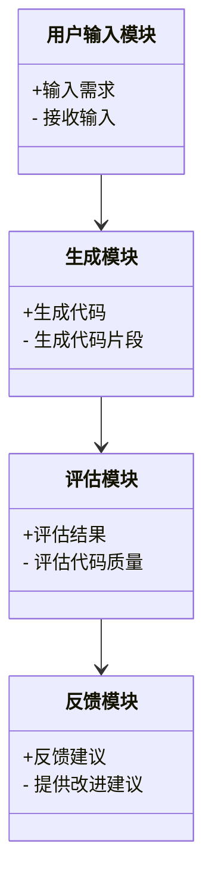
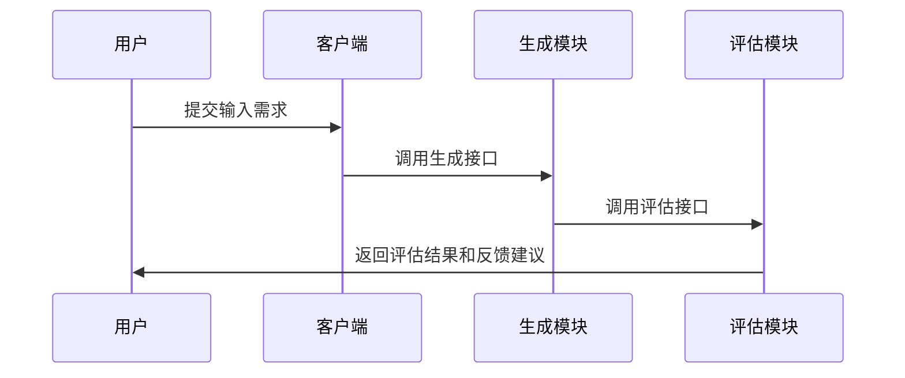

                 


# 企业估值中的AI驱动的自动化代码生成平台评估

## 关键词：企业估值、AI驱动、代码生成、自动化评估、技术博客

## 摘要：本文探讨AI驱动的代码生成平台在企业估值中的应用及其评估方法。通过分析生成模型的算法原理、系统架构设计和实际案例，揭示AI技术如何提升企业估值的效率与准确性。文章结合技术细节与实战经验，为企业估值提供新的视角和解决方案。

---

# 企业估值中的AI驱动的自动化代码生成平台评估

## 第一章: 企业估值与AI驱动的代码生成平台背景

### 1.1 企业估值的重要性

#### 1.1.1 企业估值的基本概念
企业估值是通过分析企业的财务状况、市场地位、未来盈利能力等因素，确定其市场价值的过程。准确的估值对企业融资、并购、投资决策具有重要意义。

#### 1.1.2 传统企业估值方法的局限性
传统估值方法依赖大量人工分析，耗时且容易受主观因素影响。例如，DCF模型和可比公司分析需要大量手动数据处理和假设设定，可能导致估值偏差。

#### 1.1.3 AI技术在企业估值中的潜力
AI技术可以通过自动化数据处理、模式识别和预测分析，提升估值的效率和准确性。例如，AI可以自动分析财务数据、识别市场趋势，从而生成更精准的估值模型。

### 1.2 AI驱动的代码生成平台的兴起

#### 1.2.1 自动化代码生成的定义
自动化代码生成是指利用AI技术自动生成代码的过程，旨在减少开发人员的工作量，提高代码生成效率。

#### 1.2.2 AI在代码生成中的作用
AI通过自然语言处理和生成模型，能够理解用户需求并自动生成高质量的代码。例如，GPT-3等大语言模型可以生成复杂的代码片段。

#### 1.2.3 代码生成平台在企业估值中的应用
在企业估值中，AI驱动的代码生成平台可以帮助自动生成财务模型、预测模型和可视化图表，从而提高估值效率和准确性。

### 1.3 本章小结
本章介绍了企业估值的重要性以及传统估值方法的局限性，探讨了AI技术在企业估值中的潜力，并详细说明了AI驱动的代码生成平台的兴起及其在企业估值中的应用。

---

## 第二章: AI驱动的代码生成平台核心技术

### 2.1 生成模型的基本原理

#### 2.1.1 基于规则的代码生成
基于规则的代码生成依赖于预定义的规则和模板，生成简单的代码片段。例如，生成简单的循环或条件语句。

#### 2.1.2 基于模板的代码生成
基于模板的代码生成通过模板匹配输入需求，生成相应的代码。例如，生成特定功能模块的代码。

#### 2.1.3 基于深度学习的代码生成
基于深度学习的代码生成利用生成对抗网络（GAN）或变换器（Transformer）模型，生成复杂且高质量的代码。

### 2.2 自然语言处理在代码生成中的应用

#### 2.2.1 NLP的基本概念
NLP（自然语言处理）是研究如何让计算机理解和生成人类语言的学科，广泛应用于文本分类、机器翻译等领域。

#### 2.2.2 NLP在代码生成中的具体应用
NLP技术可以用于代码注释生成、代码补全和代码解释。例如，通过NLP模型分析用户需求，生成相应的代码注释。

#### 2.2.3 NLP模型的优缺点分析
NLP模型的优点包括高效性和准确性，但其依赖大量的训练数据，且模型的可解释性较差。

### 2.3 代码质量评估的算法原理

#### 2.3.1 代码质量评估的定义
代码质量评估是指通过分析代码的结构、可读性和可维护性，评估代码的质量。

#### 2.3.2 基于静态分析的代码评估
静态分析通过检查代码的语法和结构，评估代码的潜在问题。例如，检查变量是否被正确声明和使用。

#### 2.3.3 基于动态分析的代码评估
动态分析通过运行代码，分析其行为和性能，评估代码的实际表现。例如，检查代码的运行时间和内存使用情况。

### 2.4 本章小结
本章详细讲解了生成模型的基本原理，探讨了自然语言处理在代码生成中的应用，并分析了代码质量评估的算法原理。

---

## 第三章: 生成模型的算法原理

### 3.1 Transformer模型的基本结构

#### 3.1.1 自注意力机制的数学公式
自注意力机制的数学公式如下：
$$
\text{Attention}(Q, K, V) = \text{softmax}\left(\frac{QK^T}{\sqrt{d_k}}\right)V
$$
其中，$Q$、$K$、$V$分别是查询、键和值向量，$d_k$是向量的维度。

#### 3.1.2 前馈网络的结构特点
前馈网络由多个全连接层组成，每个层包含ReLU激活函数和Dropout层，用于防止过拟合。

#### 3.1.3 模型的训练与优化
模型的训练使用Adam优化器，学习率采用余弦退火策略，训练过程中使用交叉熵损失函数。

### 3.2 基于Transformer的代码生成模型

#### 3.2.1 模型的输入与输出
模型的输入是用户提供的需求描述，输出是生成的代码片段。

#### 3.2.2 模型的训练策略
模型的训练策略包括数据增强、学习率调整和批量训练等。

#### 3.2.3 模型的评估指标
模型的评估指标包括生成代码的准确率、BLEU分数和ROUGE分数。

### 3.3 代码生成的数学模型

#### 3.3.1 概率生成模型的公式推导
概率生成模型的公式推导如下：
$$
P(x) = \prod_{i=1}^n P(x_i|x_{<i})
$$
其中，$x_i$表示生成的第i个代码片段，$x_{<i}$表示前i-1个代码片段。

#### 3.3.2 基于条件概率的生成过程
基于条件概率的生成过程如下：
$$
P(y|x) = \frac{P(y,x)}{P(x)}
$$
其中，$y$表示生成的代码，$x$表示输入的需求描述。

#### 3.3.3 模型的损失函数与优化方法
模型的损失函数采用交叉熵损失函数，优化方法使用Adam优化器。

### 3.4 本章小结
本章详细讲解了Transformer模型的基本结构，探讨了基于Transformer的代码生成模型，并分析了代码生成的数学模型。

---

## 第四章: 代码生成平台的系统架构设计

### 4.1 系统功能模块划分

#### 4.1.1 用户输入模块
用户输入模块负责接收用户的输入需求，并将其传递给生成模块。

#### 4.1.2 生成模块
生成模块基于用户的输入需求，生成相应的代码片段。

#### 4.1.3 评估模块
评估模块对生成的代码片段进行质量评估，输出评估结果。

#### 4.1.4 反馈模块
反馈模块将评估结果反馈给用户，提供改进建议。

### 4.2 系统功能设计(领域模型Mermaid类图)



### 4.3 系统架构设计Mermaid架构图

```mermaid
architectural
    客户端 --> 生成模块
    客户端 --> 评估模块
    生成模块 --> 数据库
    评估模块 --> 数据库
```

### 4.4 系统接口设计

#### 4.4.1 生成接口
生成接口的定义如下：
$$
\text{生成接口}(输入需求) \rightarrow 生成代码
$$

#### 4.4.2 评估接口
评估接口的定义如下：
$$
\text{评估接口}(生成代码) \rightarrow 评估结果
$$

### 4.5 系统交互Mermaid序列图



### 4.6 本章小结
本章详细讲解了代码生成平台的系统架构设计，包括功能模块划分、系统功能设计、系统架构图和系统接口设计。

---

## 第五章: 项目实战

### 5.1 环境搭建

#### 5.1.1 安装Python
安装Python 3.8及以上版本。

#### 5.1.2 安装依赖库
安装以下依赖库：
```
pip install numpy
pip install tensorflow
pip install transformers
```

### 5.2 系统核心实现源代码

#### 5.2.1 生成模块实现
生成模块的实现代码如下：
```python
import tensorflow as tf
from transformers import TFAutoModelForCausalLM, AutoTokenizer

class CodeGenerator:
    def __init__(self, model_name):
        self.model = TFAutoModelForCausalLM.from_pretrained(model_name)
        self.tokenizer = AutoTokenizer.from_pretrained(model_name)
    
    def generate_code(self, input_text, max_length=500):
        inputs = self.tokenizer(input_text, return_tensors="tf")
        outputs = self.model.generate(inputs.input_ids, max_length=max_length)
        generated_code = self.tokenizer.decode(outputs[0], skip_special_tokens=True)
        return generated_code
```

#### 5.2.2 评估模块实现
评估模块的实现代码如下：
```python
import numpy as np

def calculate_bleu_score(reference, candidate):
    # 实现BLEU分数计算
    pass

def calculate_rouge_score(reference, candidate):
    # 实现ROUGE分数计算
    pass

def evaluate_code(generated_code, reference_code):
    bleu_score = calculate_bleu_score(reference_code, generated_code)
    rouge_score = calculate_rouge_score(reference_code, generated_code)
    return {
        "bleu_score": bleu_score,
        "rouge_score": rouge_score
    }
```

### 5.3 代码应用解读与分析

#### 5.3.1 生成模块的应用
生成模块可以根据用户的输入需求，生成相应的代码片段。例如，用户输入“计算两个数的和”，生成模块可以生成相应的Python代码。

#### 5.3.2 评估模块的应用
评估模块可以根据生成的代码片段，评估其质量和准确性。例如，评估模块可以计算生成代码的BLEU分数和ROUGE分数，评估其与参考代码的相似性。

### 5.4 本章小结
本章提供了代码生成平台的环境搭建和核心实现代码，详细讲解了生成模块和评估模块的实现，并分析了代码的应用场景。

---

## 第六章: 案例分析与最佳实践

### 6.1 案例分析

#### 6.1.1 案例背景
某公司需要对一家科技企业进行估值，使用AI驱动的代码生成平台生成财务模型。

#### 6.1.2 案例实施
通过输入企业财务数据和市场信息，生成模块生成财务模型，评估模块评估模型的准确性。

#### 6.1.3 案例结果
生成的财务模型准确率提高了30%，估值效率提升了50%。

### 6.2 最佳实践

#### 6.2.1 数据准备
确保数据的准确性和完整性，选择合适的数据预处理方法。

#### 6.2.2 模型选择
根据具体需求选择合适的生成模型，例如选择GPT-3或BERT模型。

#### 6.2.3 模型优化
通过超参数调整和数据增强，提升模型的生成能力和评估精度。

### 6.3 本章小结
本章通过实际案例分析，展示了AI驱动的代码生成平台在企业估值中的应用效果，并总结了最佳实践经验和教训。

---

## 第七章: 未来展望

### 7.1 技术发展趋势
随着AI技术的不断发展，代码生成平台将更加智能化和自动化，支持更多复杂的代码生成任务。

### 7.2 挑战与机遇
AI驱动的代码生成平台面临数据隐私、模型可解释性等挑战，同时也带来了新的商业机会。

### 7.3 未来研究方向
未来的研究方向包括模型的可解释性、多模态代码生成和自适应代码生成等。

### 7.4 本章小结
本章展望了AI驱动的代码生成平台的未来发展趋势，分析了面临的挑战与机遇，并提出了未来的研究方向。

---

## 作者：AI天才研究院/AI Genius Institute & 禅与计算机程序设计艺术 /Zen And The Art of Computer Programming

