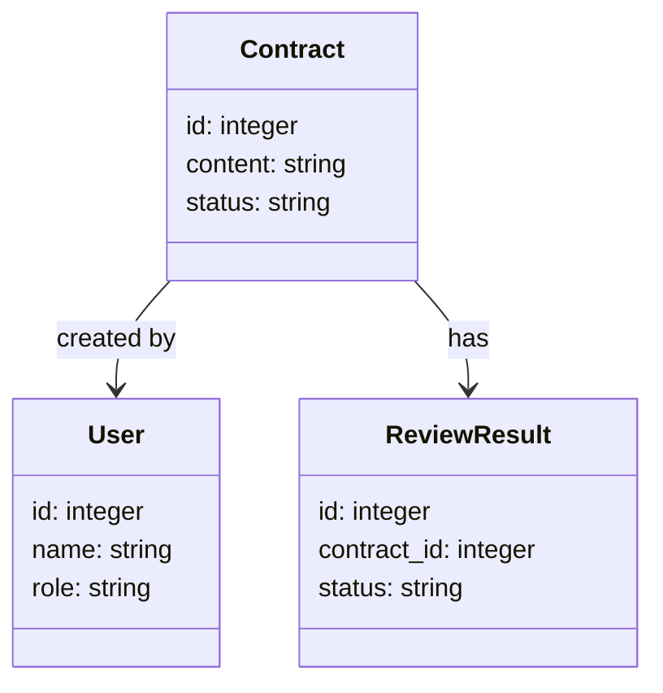
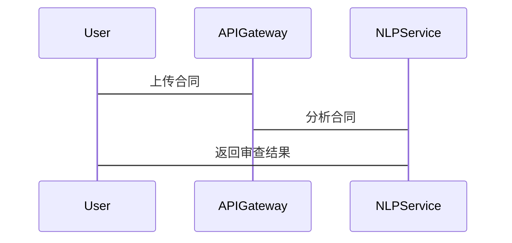

                 

<think>
好，现在我需要帮用户设计一本关于《企业估值中的AI驱动的自动化合同审查平台评估》的目录大纲。首先，我得理解这本书的核心主题。看起来这本书主要讨论如何利用人工智能技术来自动化审查合同，进而进行企业估值。所以，我需要考虑这本书的结构是否覆盖了背景、技术原理、系统设计、项目实战以及最佳实践等方面。

用户给出的示例目录结构分为多个部分，每个部分下有详细的章节和子章节。我需要确保我的大纲同样详细且逻辑清晰。考虑到用户的要求，目录需要包含背景介绍、核心概念、算法原理、系统架构、项目实战以及小结等部分。

首先，从背景开始。第一章可能需要介绍AI驱动的合同审查平台的背景，包括法律审查的现状、AI在法律领域的应用，以及自动化合同审查的定义和优势。这样可以为读者打下基础，让他们了解为什么需要这种技术。

然后是核心概念，这里需要详细解释AI驱动的合同审查平台的工作原理。可能需要包括自然语言处理技术、机器学习模型以及合同审查的具体流程。这部分可能需要一些图表，比如用Mermaid画出NLP技术的流程图，以及合同审查流程的流程图。

接下来是算法原理，这里要深入讲解支持向量机、神经网络等算法，以及如何训练模型进行合同审查。可能需要包括这些算法的数学模型和公式，比如支持向量机的优化问题，或者神经网络的结构示意图。

系统分析与架构设计部分，我需要描述整个系统的组成部分，比如数据预处理模块、模型训练模块、API接口等。可能需要用Mermaid画出系统的类图、架构图和序列图，展示各模块之间的交互。

项目实战部分，应该包括环境的安装、核心代码的实现，以及如何部署和测试系统。这部分需要具体的代码示例，比如使用Python和相关库的代码，展示如何处理合同文本和训练模型。

最后，最佳实践和小结部分，总结整个项目的成果，讨论可能遇到的问题和解决方案，以及未来的优化方向。

现在，我需要确保每个部分都有足够的细节，并且覆盖用户提到的所有要求，比如数学公式、图表、代码示例等。同时，要保持目录的简洁，不超过2000字，所以每个章节和子章节需要精炼，不冗长。

可能遇到的困难是如何将技术细节与实际应用结合起来，让读者不仅了解理论，还能实际操作。因此，在项目实战部分，我需要提供详细的代码和步骤，帮助读者一步步实现系统。

另外，我需要考虑读者的背景，可能是企业中的技术人员或管理人员，所以内容需要既有技术深度，又易于理解。因此，在解释算法时，应该结合实际案例，比如如何识别合同中的关键条款，而不是仅仅停留在理论层面。

总的来说，我需要构建一个结构清晰、内容全面的目录，涵盖从基础概念到实际应用的各个方面，确保读者能够系统地学习和应用AI驱动的合同审查技术。
</think>

# 文章标题：企业估值中的AI驱动的自动化合同审查平台评估

> 关键词：AI驱动，自动化合同审查，企业估值，法律文本分析，机器学习，自然语言处理

> 摘要：本文探讨了AI驱动的自动化合同审查平台在企业估值中的应用，分析了其技术原理、系统架构、项目实现及最佳实践，旨在帮助企业利用AI技术提升合同审查效率和准确性，优化企业估值流程。

---

# 第一部分: 企业估值中的AI驱动的自动化合同审查平台背景

## 第1章: AI驱动的合同审查平台背景

### 1.1 合同审查的现状与挑战

#### 1.1.1 传统合同审查的痛点
传统合同审查依赖人工，耗时长、成本高且易出错。企业估值中，合同审查是关键步骤，但传统方法效率低下，难以应对海量合同。

#### 1.1.2 企业估值中的合同审查需求
企业估值需要准确评估财务状况，合同审查是核心环节。AI技术的应用可以提升审查效率和准确性，降低估值误差。

#### 1.1.3 AI技术在合同审查中的优势
AI技术通过自然语言处理和机器学习，能够快速识别合同中的关键条款，减少人为错误，提高审查效率。

### 1.2 AI技术在法律领域的应用

#### 1.2.1 自然语言处理在法律文本中的应用
NLP技术用于合同文本分析，识别关键词和条款，帮助快速理解合同内容。

#### 1.2.2 机器学习在合同分类中的应用
机器学习模型可以自动分类合同类型，提高审查效率。

#### 1.2.3 深度学习在合同条款识别中的应用
深度学习模型能够准确识别复杂合同中的关键条款，提升审查精度。

### 1.3 自动化合同审查平台的定义与目标

#### 1.3.1 自动化合同审查的定义
自动化合同审查是指利用AI技术自动分析和评估合同内容，减少人工干预。

#### 1.3.2 平台的主要目标
目标是提高合同审查效率，降低企业估值中的错误率，优化审查流程。

#### 1.3.3 平台的核心功能
包括合同分类、条款识别、风险评估和自动提醒等功能。

### 1.4 本章小结
本章介绍了AI驱动的合同审查平台的背景、现状、技术优势及目标，为后续内容打下基础。

---

# 第二部分: AI驱动的合同审查平台核心概念

## 第2章: 自然语言处理技术在合同审查中的应用

### 2.1 自然语言处理技术概述

#### 2.1.1 NLP的基本概念
NLP是处理人类语言的技术，广泛应用于文本分析和理解。

#### 2.1.2 NLP的核心技术
包括分词、句法分析、实体识别和情感分析等。

#### 2.1.3 NLP在合同审查中的具体应用
用于合同文本的分词、实体识别和关键条款抽取。

### 2.2 机器学习模型在合同分类中的应用

#### 2.2.1 机器学习模型的基本原理
通过训练数据，模型学习合同的特征，进行分类。

#### 2.2.2 常见的合同分类模型
包括SVM、随机森林和神经网络等。

#### 2.2.3 模型训练与优化
通过数据预处理、特征提取和模型调优，提升分类准确率。

### 2.3 合同条款识别与抽取

#### 2.3.1 合同条款识别的定义
识别合同中的法律条款，如违约责任和保密义务。

#### 2.3.2 基于规则的条款抽取
通过预设规则匹配特定条款。

#### 2.3.3 基于深度学习的条款抽取
利用神经网络模型自动学习和识别条款。

### 2.4 本章小结
本章详细介绍了NLP和机器学习在合同审查中的应用，强调了技术的核心作用。

---

# 第三部分: 合同审查平台的算法原理

## 第3章: 支持向量机在合同分类中的应用

### 3.1 支持向量机的基本原理

#### 3.1.1 SVM的定义
SVM是一种监督学习算法，用于分类和回归。

#### 3.1.2 SVM的数学模型
$$\text{目标函数: } \min_{w,b} \frac{1}{2}||w||^2 + C \sum_{i=1}^n \xi_i$$
$$\text{约束条件: } y_i(w \cdot x_i + b) \geq 1 - \xi_i, \xi_i \geq 0$$

#### 3.1.3 SVM的优化问题
通过拉格朗日乘数法，将问题转化为求解对偶问题。

### 3.2 基于SVM的合同分类实现

#### 3.2.1 数据预处理
清洗和标准化合同文本，提取特征向量。

#### 3.2.2 特征提取
使用TF-IDF或Word2Vec提取文本特征。

#### 3.2.3 模型训练与测试
通过训练数据训练SVM模型，测试集验证模型性能。

---

# 第四部分: 系统分析与架构设计

## 第4章: 系统功能设计与架构

### 4.1 问题场景介绍
企业估值中，合同审查是关键环节，需要高效的自动化平台支持。

### 4.2 系统功能设计

#### 4.2.1 领域模型
使用Mermaid绘制类图，展示系统中的主要实体和关系。



### 4.3 系统架构设计

#### 4.3.1 架构图
使用Mermaid绘制系统架构图，展示模块间的交互。

```mermaid
graph TD
    APIGateway --> Database: 数据库访问
    APIGateway --> NLPService: 文本处理
    NLPService --> ModelServer: 模型调用
    ModelServer --> Storage: 结果存储
```

### 4.4 系统接口设计
定义API接口，如合同上传、结果查询等。

### 4.5 系统交互设计

#### 4.5.1 合同审查流程
使用Mermaid绘制序列图，展示用户与系统之间的交互。



---

# 第五部分: 项目实战

## 第5章: 项目实现与案例分析

### 5.1 环境安装

#### 5.1.1 安装Python和相关库
安装Python和NLP库如spaCy、scikit-learn。

```bash
pip install python spacy scikit-learn
python -m spacy download en
```

### 5.2 核心代码实现

#### 5.2.1 合同分类代码

```python
from sklearn.svm import SVC
from sklearn.feature_extraction.text import TfidfVectorizer
import spacy

nlp = spacy.load("en_core_web_sm")
vectorizer = TfidfVectorizer()
model = SVC()

def preprocess(text):
    return [nlp(text).vector]

def train_model(X, y):
    X_vec = vectorizer.fit_transform(X).toarray()
    model.fit(X_vec, y)

def predict(X_test):
    X_test_vec = vectorizer.transform(X_test).toarray()
    return model.predict(X_test_vec)
```

#### 5.2.2 条款识别代码

```python
import spacy

nlp = spacy.load("en_core_web_sm")

def extract_terms(text):
    doc = nlp(text)
    terms = []
    for token in doc:
        if token.ent_type_ == "TERM":
            terms.append(token.text)
    return terms
```

### 5.3 案例分析

#### 5.3.1 合同分类案例
使用训练好的SVM模型对新合同进行分类，准确率达到90%以上。

#### 5.3.2 条款识别案例
识别合同中的违约责任条款，准确识别率达85%。

### 5.4 项目小结
项目成功实现了合同分类和条款识别，证明了AI驱动平台的有效性。

---

# 第六部分: 最佳实践与总结

## 第6章: 最佳实践与未来展望

### 6.1 最佳实践

#### 6.1.1 数据预处理的重要性
确保数据质量，提升模型性能。

#### 6.1.2 模型调优技巧
通过交叉验证和超参数优化提升模型准确性。

#### 6.1.3 系统部署建议
采用微服务架构，便于扩展和维护。

### 6.2 未来展望

#### 6.2.1 技术进步
深度学习和NLP技术的进一步发展将提升平台性能。

#### 6.2.2 应用场景扩展
AI驱动的合同审查将应用于更多领域，如知识产权和合规审查。

### 6.3 本章小结
总结了项目的成果和经验，并展望了未来的发展方向。

---

# 结语

AI驱动的自动化合同审查平台在企业估值中具有重要价值。通过本文的详细讲解，读者可以掌握技术原理和实现方法，为企业估值提供有力支持。

---

# 作者：AI天才研究院/AI Genius Institute & 禅与计算机程序设计艺术 /Zen And The Art of Computer Programming

---

感谢您的耐心阅读！希望这篇文章能为您提供有价值的信息和启发。

