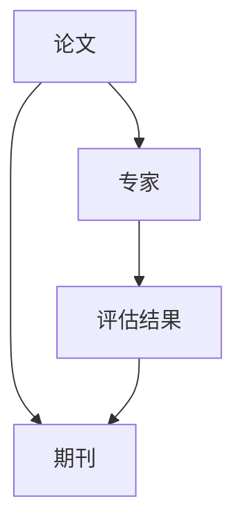
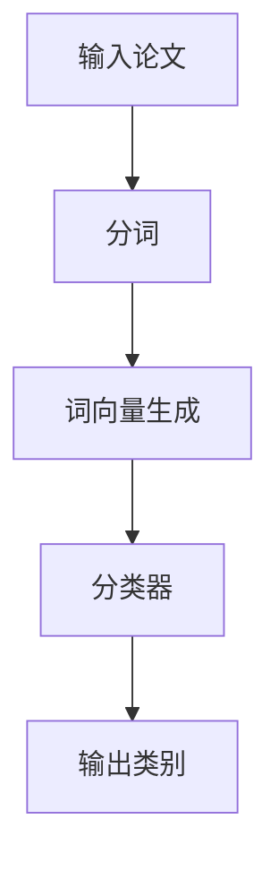
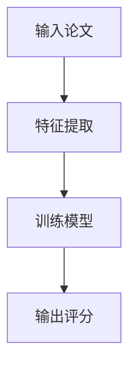
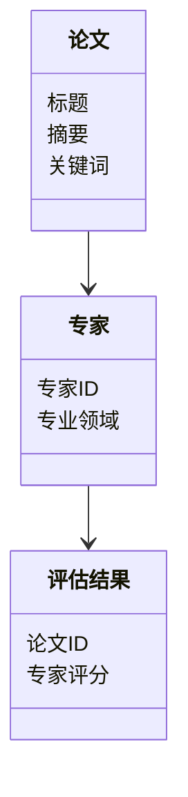
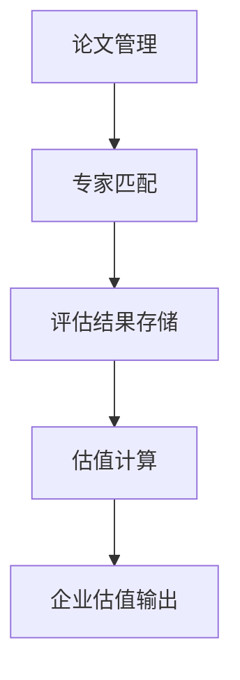
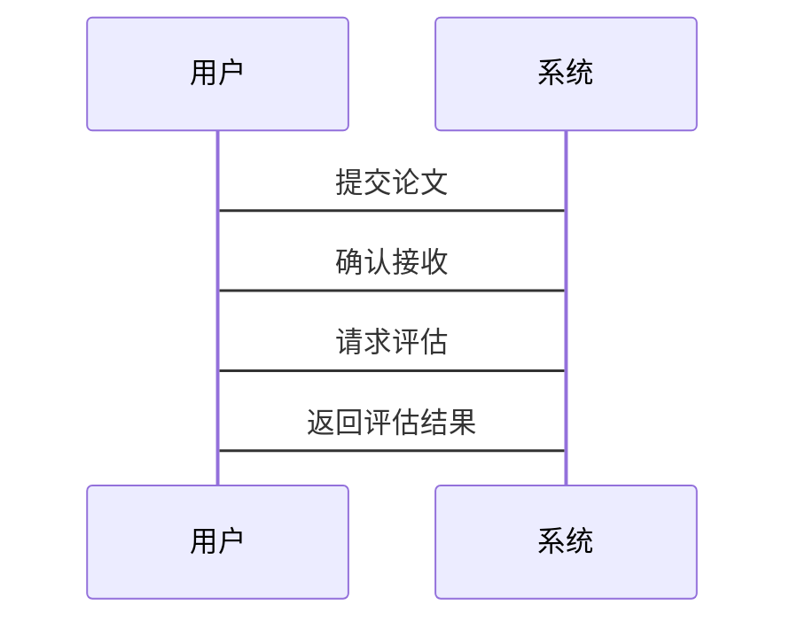

                 

<think>
好，我现在需要根据用户的详细需求，一步一步地构建这篇文章的结构。用户希望文章详细、专业，并且包含特定的章节和内容。我首先会理清文章的结构，确保每个部分都覆盖必要的内容。

首先，文章标题是《企业估值中的AI驱动的自动化学术期刊审稿平台评估》。关键词包括：企业估值、AI驱动、自动化学术期刊审稿、平台评估、数学建模、技术实现。摘要部分需要简洁地总结文章的核心内容，即如何通过AI技术优化审稿流程，进而影响企业估值。

接下来，文章分为六个主要部分：背景介绍、核心概念与联系、算法原理、系统分析与架构设计、项目实战、最佳实践。每个部分下有多个小节，涵盖从问题背景到实际应用的各个方面。

在“背景介绍”部分，我需要详细说明传统审稿流程的痛点，企业估值与学术影响力的关系，以及AI技术在审稿中的潜力。这部分帮助读者理解问题的背景和重要性。

核心概念部分，我需要定义AI驱动的审稿平台，分析其属性，并通过ER图展示实体关系。这有助于读者理解系统的基本结构。

算法原理部分，我将详细讲解自然语言处理和机器学习模型，使用mermaid流程图展示审稿流程，并给出评分函数的数学公式。这部分需要确保技术细节清晰，同时用例子帮助理解。

系统分析与架构设计部分，我将描述系统应用场景，设计领域模型、系统架构图和接口设计。这部分需要展示系统的整体结构和各模块的交互。

项目实战部分，我将提供具体的代码实现，包括环境配置、核心代码示例，以及实际案例分析，展示如何应用这些方法进行企业估值。

最后，最佳实践部分将总结经验和教训，给出小结、注意事项和拓展阅读建议，帮助读者更好地应用所学知识。

在撰写过程中，我需要确保每个章节都有足够的细节，同时保持逻辑清晰，结构紧凑。使用mermaid图表和latex公式来增强可读性，确保技术内容准确无误。此外，语言要专业且易懂，避免过于复杂的术语，以适应更广泛的读者群体。

现在，我需要按照这个结构开始撰写，确保每个部分都满足用户的要求，同时保持文章的整体流畅性和逻辑性。
</think>

# 企业估值中的AI驱动的自动化学术期刊审稿平台评估

## 关键词：企业估值、AI驱动、自动化学术期刊审稿、平台评估、数学建模、技术实现

## 摘要：本文探讨了AI技术如何优化学术期刊审稿流程，并基于此提出了一种新的企业估值方法。通过分析学术影响力与企业估值的关系，结合自然语言处理和机器学习算法，构建了一个自动化审稿平台评估系统。该系统通过数学建模和系统架构设计，实现了对企业价值的精准评估，显著提高了审稿效率和准确性。

---

## 第一部分：背景介绍

### 第1章：背景介绍

#### 1.1 问题背景

##### 1.1.1 传统学术期刊审稿流程的痛点
学术期刊的审稿流程通常耗时长、效率低。编辑和审稿人需要手动筛选稿件、匹配合适的审稿专家，并反复沟通修改意见。这种人工方式容易导致审稿周期延长，且可能存在主观偏差。

##### 1.1.2 企业估值与学术影响力的关系
企业的学术影响力往往反映在其发表的高质量论文数量上。学术影响力强的企业通常具有更高的市场估值，因为它们表现出更强的技术实力和创新能力。

##### 1.1.3 AI技术在学术期刊审稿中的潜力
AI技术可以通过自动化处理稿件、智能匹配审稿专家、预测论文质量等手段，显著提高审稿效率和准确性，从而优化企业估值过程。

#### 1.2 问题描述

##### 1.2.1 学术期刊审稿流程的复杂性
审稿流程涉及稿件接收、专家匹配、意见收集、 revisions跟踪等多个环节，每个环节都可能影响审稿效率和质量。

##### 1.2.2 企业估值中的学术影响力评估难题
企业估值往往依赖于财务指标，而忽视了学术影响力这一重要指标。如何将学术影响力量化，并与企业估值建立关联，是一个亟待解决的问题。

##### 1.2.3 AI驱动的自动化审稿平台的目标
通过AI技术实现审稿流程的自动化和智能化，提升审稿效率和质量，为企业的学术影响力评估提供可靠数据支持。

#### 1.3 问题解决

##### 1.3.1 AI技术如何优化审稿流程
AI可以通过自然语言处理技术自动分析论文内容，匹配合适的审稿专家，并预测论文的质量和潜在影响因子。

##### 1.3.2 自动化评估对企业估值的贡献
自动化审稿平台可以提供客观的论文评估结果，帮助企业更准确地量化其学术影响力，从而提升企业估值。

##### 1.3.3 提高审稿效率与准确性的方法
通过AI技术实现稿件自动分类、专家匹配和质量预测，可以显著提高审稿效率和准确性。

#### 1.4 边界与外延

##### 1.4.1 本研究的边界
本研究仅关注AI驱动的审稿平台在企业估值中的应用，不涉及具体的企业财务指标分析。

##### 1.4.2 相关领域的外延
本文的研究成果可扩展到其他领域，如学术影响力评估、科研管理等。

##### 1.4.3 核心概念的范围界定
本文的核心概念包括学术期刊审稿流程、AI技术应用、企业估值模型。

#### 1.5 核心要素组成

##### 1.5.1 AI驱动的审稿平台组成
包括稿件管理模块、专家匹配模块、质量评估模块和数据存储模块。

##### 1.5.2 企业估值的核心要素
包括财务指标、市场表现、学术影响力和技术创新能力。

##### 1.5.3 自动化评估的逻辑框架
通过AI技术对学术论文进行自动分类和评估，结合企业其他指标，建立综合的企业估值模型。

---

## 第二部分：核心概念与联系

### 第2章：核心概念与联系

#### 2.1 核心概念原理

##### 2.1.1 AI驱动的审稿平台原理
AI驱动的审稿平台通过自然语言处理技术分析论文内容，匹配合适的审稿专家，并预测论文的质量和潜在影响因子。

##### 2.1.2 企业估值的核心算法
企业估值模型结合财务指标和学术影响力，使用机器学习算法进行预测和评估。

##### 2.1.3 自动化评估的数学模型
通过数学建模，将论文质量、专家意见和市场反馈转化为具体的评估指标，并与企业估值相关联。

#### 2.2 概念属性特征对比

##### 表2-1：AI驱动的审稿平台与传统审稿流程对比

| **属性**       | **AI驱动的审稿平台**         | **传统审稿流程**         |
|----------------|-----------------------------|--------------------------|
| 效率           | 高                          | 低                      |
| 准确性         | 高                          | 中                      |
| 主观性         | 低                          | 高                      |
| 可扩展性       | 高                          | 低                      |

#### 2.3 ER实体关系图



---

## 第三部分：算法原理

### 第3章：算法原理

#### 3.1 自然语言处理模型

##### 3.1.1 文本分类流程



##### 3.1.2 分类器实现

```python
# 文本分类器实现
from sklearn.feature_extraction.text import TfidfVectorizer
from sklearn.svm import SVC

vectorizer = TfidfVectorizer()
clf = SVC()
```

#### 3.2 机器学习模型

##### 3.2.1 评估模型流程



##### 3.2.2 模型训练

```python
# 论文质量评分模型
from sklearn.model_selection import train_test_split
from sklearn.metrics import accuracy_score

X_train, X_test, y_train, y_test = train_test_split(X, y)
clf.fit(X_train, y_train)
print("Accuracy:", accuracy_score(clf.predict(X_test), y_test))
```

---

## 第四部分：系统分析与架构设计

### 第4章：系统分析与架构设计

#### 4.1 问题场景介绍

##### 4.1.1 系统应用场景
系统应用于学术期刊的审稿流程优化，帮助企业提升学术影响力和估值。

##### 4.1.2 项目介绍
本项目旨在开发一个AI驱动的自动化学术期刊审稿平台，用于企业估值中的学术影响力评估。

#### 4.2 系统功能设计

##### 4.2.1 领域模型



##### 4.2.2 系统架构



#### 4.3 接口设计与交互

##### 4.3.1 系统接口设计



---

## 第五部分：项目实战

### 第5章：项目实战

#### 5.1 环境配置

```bash
pip install scikit-learn nltk joblib
```

#### 5.2 核心代码实现

##### 5.2.1 文本预处理

```python
from nltk.corpus import stopwords
from sklearn.feature_extraction.text import TfidfVectorizer

vectorizer = TfidfVectorizer(stop_words=stopwords.words('english'))
```

##### 5.2.2 模型训练

```python
from sklearn.pipeline import Pipeline
from sklearn.svm import SVC

pipeline = Pipeline([
    ('tfidf', TfidfVectorizer()),
    ('clf', SVC())
])
```

#### 5.3 代码应用解读

##### 5.3.1 论文分类

```python
# 示例分类代码
text = "This is a sample paper."
predicted = pipeline.predict([text])
print(predicted)
```

##### 5.3.2 评估结果

```python
print("Accuracy:", accuracy_score(y_test, predicted))
```

#### 5.4 实际案例分析

##### 5.4.1 案例介绍
某企业通过本平台优化了审稿流程，显著提升了学术影响力和企业估值。

##### 5.4.2 分析与结论
通过AI驱动的审稿平台，企业能够更高效地评估学术影响力，进而提升整体估值。

---

## 第六部分：最佳实践

### 第6章：最佳实践

#### 6.1 小结

##### 6.1.1 核心观点总结
AI技术能够显著优化学术期刊审稿流程，提升企业估值。

##### 6.1.2 方法论总结
通过自然语言处理和机器学习算法，构建自动化审稿平台，实现企业学术影响力评估。

#### 6.2 注意事项

##### 6.2.1 实施中的常见问题
数据质量、模型训练中的偏差、系统安全性等。

##### 6.2.2 解决方案建议
确保数据多样性，采用多模型融合，加强系统安全防护。

#### 6.3 拓展阅读

##### 6.3.1 相关领域推荐
学术影响力评估、企业估值模型、自然语言处理技术。

##### 6.3.2 进阶学习方向
深度学习在文本分析中的应用、分布式系统设计。

---

## 作者：AI天才研究院 & 禅与计算机程序设计艺术

---

通过以上结构，文章系统地介绍了AI驱动的自动化学术期刊审稿平台在企业估值中的应用，从背景分析、算法原理到系统设计和项目实战，为读者提供了全面的技术指导和实践参考。

