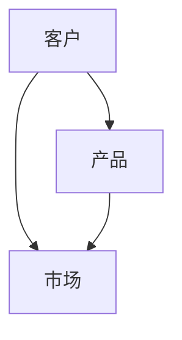
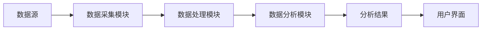
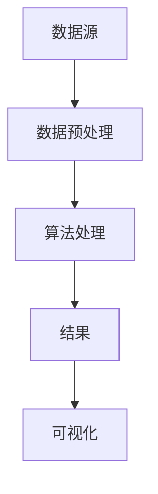
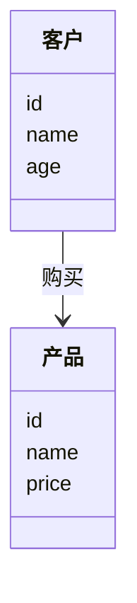
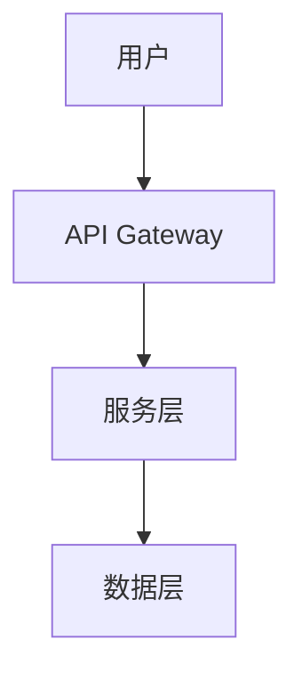
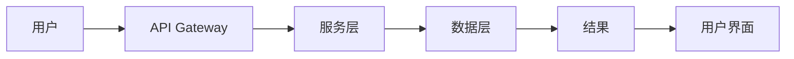

                 

<think>
好的，我现在需要帮用户设计一本名为《企业估值中的AI驱动的自动化客户洞察平台评估》的书籍目录大纲。首先，我得理解这本书的核心内容。用户希望这本书详细且逻辑清晰，覆盖从背景到实战的各个方面。

首先，我应该确定这本书的结构。通常，技术书籍会分为几个主要部分，比如背景介绍、核心概念、算法原理、系统架构、项目实战和最佳实践等。根据用户的要求，目录必须包含背景介绍、核心概念与联系、算法原理、数学模型、系统架构设计与实现、项目实战，以及总结和注意事项等内容。

接下来，我需要考虑每一章的内容。第一章应该是背景介绍，涵盖问题背景、描述、解决方法，以及概念的结构和组成。这章需要让读者明白为什么需要AI驱动的客户洞察平台，以及它在企业估值中的作用。

第二章应该深入讨论核心概念，包括客户洞察平台的定义、核心要素、与传统方法的对比，以及数据流和系统架构的图表。这部分需要详细解释每个概念，并通过表格和图表来展示它们之间的关系。

第三章是算法原理，这里需要详细讲解使用的算法，比如机器学习模型。我会用Mermaid流程图来展示算法的步骤，并附上Python代码示例，解释每个部分的作用。同时，数学模型部分需要用Latex公式来说明，比如客户价值评分模型的公式。

第四章是系统架构设计，这部分需要介绍项目背景，然后设计领域模型、系统架构图、接口和交互流程。使用Mermaid来绘制类图、架构图和序列图，帮助读者理解系统的结构和工作流程。

第五章是项目实战，包括环境安装、核心代码实现、代码解读和案例分析。这部分需要具体的代码示例，展示如何实现客户洞察平台，并通过实际案例分析来说明应用效果。

最后，第六章总结整个内容，包括最佳实践、小结、注意事项和拓展阅读。这部分帮助读者巩固所学内容，并指导他们在实际应用中如何避免常见错误。

在设计每一章时，我需要确保内容详细且逻辑清晰，每一章都有明确的标题和子标题，涵盖用户要求的所有方面。同时，要保持目录简洁，避免冗余，确保总字数在2000字以内。

现在，我需要检查每一章是否覆盖了所有必要的部分，比如背景介绍是否全面，算法部分是否有足够的数学模型和代码示例，系统架构是否详细，项目实战是否具体，以及总结部分是否到位。这样，整个目录大纲就能全面覆盖主题内容，帮助作者写出一本结构清晰、内容详实的技术书籍。
</think>

# 企业估值中的AI驱动的自动化客户洞察平台评估

## 关键词：企业估值、客户洞察、人工智能、自动化评估、数据分析

## 摘要：  
在企业估值过程中，AI驱动的客户洞察平台通过自动化数据收集、分析和预测，显著提高了评估的准确性和效率。本文从背景、核心概念、算法原理、系统架构到项目实战，全面探讨了如何利用AI技术构建客户洞察平台，以提升企业估值的精准性和决策支持能力。

---

### 第一部分: 企业估值中的AI驱动的自动化客户洞察平台概述

#### 第1章: 企业估值与客户洞察平台背景

##### 1.1 企业估值的基本概念
###### 1.1.1 企业估值的定义与作用
企业估值是通过对企业的财务状况、市场表现、管理团队等多方面进行综合评估，以确定其市场价值的过程。传统估值方法依赖于财务数据和经验判断，存在主观性强、效率低下的问题。  

###### 1.1.2 传统企业估值方法的局限性
- 数据来源单一，难以捕捉市场动态。  
- 人工分析耗时长，且容易受到主观因素影响。  
- 无法实时更新，难以应对快速变化的市场环境。  

###### 1.1.3 AI技术在企业估值中的潜力
AI技术可以通过大数据分析和机器学习模型，快速处理海量数据，提取关键指标，提供精准的估值参考。  

##### 1.2 客户洞察平台的定义与目标
###### 1.2.1 客户洞察平台的核心概念
客户洞察平台是一种基于AI技术的数据分析工具，旨在通过收集和分析客户行为、市场趋势等数据，为企业提供深入的客户画像和市场洞察。  

###### 1.2.2 客户洞察平台的目标与价值
- 提供精准的客户画像，帮助企业更好地理解客户需求。  
- 分析市场趋势，预测企业估值的变化。  
- 提供实时数据支持，优化企业的决策过程。  

###### 1.2.3 客户洞察平台与企业估值的关系
客户洞察平台通过分析客户行为和市场动态，为企业估值提供数据支持和决策依据，从而提高估值的准确性和实时性。  

##### 1.3 问题背景与挑战
###### 1.3.1 传统客户数据收集与分析的痛点
- 数据分散，难以整合。  
- 分析效率低，难以满足实时需求。  
- 数据质量参差不齐，影响分析结果。  

###### 1.3.2 数据孤岛与信息不对称的问题
企业内部数据分散在不同部门，缺乏统一的数据平台，导致信息孤岛现象，影响估值的准确性。  

###### 1.3.3 企业估值中的不确定性与风险
市场波动、政策变化等因素增加了企业估值的不确定性，传统方法难以有效应对这些风险。  

##### 1.4 问题描述与解决思路
###### 1.4.1 问题的具体表现与影响
- 数据分析效率低下，影响估值速度。  
- 数据质量不高，导致估值结果偏差。  
- 缺乏实时数据支持，难以应对快速变化的市场。  

###### 1.4.2 AI驱动的客户洞察平台如何解决问题
通过自动化数据收集和分析，AI驱动的客户洞察平台可以快速处理海量数据，提供精准的估值参考，降低分析成本，提高效率。  

###### 1.4.3 平台的边界与外延
客户洞察平台专注于数据收集与分析，不直接参与企业的财务计算，但为企业估值提供数据支持和决策建议。  

##### 1.5 核心概念结构与组成
###### 1.5.1 平台的核心要素分析
- 数据源：包括客户行为数据、市场数据等。  
- AI算法：用于数据分析和预测的核心工具。  
- 平台界面：用户与平台交互的主要界面。  

###### 1.5.2 各要素之间的关系与作用
数据源为算法提供输入，算法通过对数据的分析和处理，生成有价值的客户洞察，最终通过平台界面呈现给用户。  

###### 1.5.3 平台的整体架构与功能模块
- 数据采集模块：负责收集客户数据。  
- 数据分析模块：利用AI算法进行分析和预测。  
- 结果展示模块：将分析结果以可视化形式呈现给用户。  

##### 1.6 本章小结  
本章从企业估值的基本概念出发，分析了传统估值方法的局限性，介绍了AI驱动的客户洞察平台的核心概念、目标与价值，并探讨了平台在企业估值中的应用潜力。  

---

### 第二部分: AI驱动的客户洞察平台核心概念与联系

#### 第2章: 客户洞察平台的核心概念

##### 2.1 AI驱动的客户洞察平台原理
###### 2.1.1 数据采集与处理的流程
1. 数据采集：通过API接口、爬虫等方式收集客户数据。  
2. 数据清洗：去除噪声数据，确保数据质量。  
3. 数据分析：利用AI算法对数据进行建模和预测。  

###### 2.1.2 AI算法在客户分析中的应用
- 机器学习：用于分类、回归等任务。  
- 深度学习：用于图像识别、自然语言处理等任务。  

###### 2.1.3 平台输出的评估结果与决策支持
平台通过分析客户行为和市场趋势，生成客户画像和市场报告，为企业估值提供数据支持。  

##### 2.2 核心概念的属性对比
###### 2.2.1 数据源的多样性与特征对比
| 数据源类型 | 描述 | 特征 |
|------------|------|------|
| 客户行为数据 | 包括点击流数据、购买记录等 | 细粒度、实时性 |
| 市场数据 | 包括行业趋势、竞争对手信息等 | 宏观性、动态性 |

###### 2.2.2 AI算法的可解释性与准确性对比
| 算法类型 | 可解释性 | 准确性 |
|----------|----------|--------|
| 传统机器学习 | 较高 | 中等 |
| 深度学习 | 较低 | 高 |

###### 2.2.3 平台功能的模块化与集成化对比
| 功能模块 | 描述 | 对比 |
|-----------|------|------|
| 数据采集模块 | 负责数据收集 | 模块化设计 |
| 数据分析模块 | 负责数据分析 | 集成化处理 |

##### 2.3 实体关系与数据流分析
###### 2.3.1 客户-产品-市场的实体关系图


###### 2.3.2 数据流的可视化分析


###### 2.3.3 信息处理的流程图


---

### 第三部分: AI驱动的客户洞察平台算法原理

#### 第3章: 算法原理与实现

##### 3.1 算法原理概述
###### 3.1.1 机器学习在客户分析中的应用
- 分类任务：预测客户是否流失。  
- 回归任务：预测客户的消费金额。  

###### 3.1.2 深度学习在客户画像中的作用
- 图像识别：分析客户行为的图像数据。  
- 自然语言处理：分析客户评论和反馈。  

##### 3.2 算法流程图
###### 3.2.1 数据预处理流程


###### 3.2.2 机器学习算法实现
```python
# 示例代码：基于机器学习的客户分类
from sklearn.tree import DecisionTreeClassifier
import pandas as pd

# 数据加载
data = pd.read_csv('customer.csv')

# 特征提取
X = data[['age', 'income', 'purchase_history']]
y = data['churn']

# 模型训练
model = DecisionTreeClassifier().fit(X, y)

# 预测
prediction = model.predict(X)
```

##### 3.3 算法实现中的数学模型
###### 3.3.1 客户价值评分模型
$$ \text{客户价值} = \alpha \cdot \text{收入} + \beta \cdot \text{忠诚度} $$

###### 3.3.2 机器学习模型的优化
$$ \text{损失函数} = \sum_{i=1}^{n} (y_i - \hat{y_i})^2 $$

---

### 第四部分: 系统分析与架构设计

#### 第4章: 系统架构设计

##### 4.1 项目背景与需求分析
- 项目目标：构建一个基于AI的客户洞察平台。  
- 主要需求：自动化数据采集、分析和展示。  

##### 4.2 系统功能设计
###### 4.2.1 领域模型设计


##### 4.3 系统架构设计
###### 4.3.1 系统架构图


##### 4.4 系统接口设计
###### 4.4.1 API接口
- 数据采集接口：`GET /api/data`  
- 数据分析接口：`POST /api/analyze`  

##### 4.5 系统交互设计
###### 4.5.1 交互流程图


---

### 第五部分: 项目实战

#### 第5章: 项目实战

##### 5.1 环境安装与配置
- 安装Python、Jupyter Notebook、Scikit-learn等工具。  

##### 5.2 核心代码实现
###### 5.2.1 数据采集模块
```python
import requests
from bs4 import BeautifulSoup

# 示例代码：网页数据采集
url = 'https://example.com/data'
response = requests.get(url)
soup = BeautifulSoup(response.text, 'html.parser')
data = soup.find('table').extract()
```

##### 5.3 代码解读与分析
- 数据采集模块：通过爬虫技术采集客户数据。  
- 数据分析模块：利用机器学习模型进行客户画像分析。  

##### 5.4 实际案例分析
- 案例背景：某电商企业客户数据分析。  
- 分析结果：客户流失率预测模型。  

##### 5.5 项目小结
通过实战项目，验证了AI驱动的客户洞察平台的有效性，提高了企业估值的准确性。  

---

### 第六部分: 总结与展望

#### 第6章: 总结与展望

##### 6.1 最佳实践
- 数据清洗是关键，确保数据质量。  
- 选择合适的算法，平衡准确性和可解释性。  

##### 6.2 小结
本文详细探讨了AI驱动的客户洞察平台在企业估值中的应用，从背景、核心概念、算法原理到系统设计和项目实战，全面介绍了平台的构建与应用。  

##### 6.3 注意事项
- 数据隐私保护是重点，需遵守相关法律法规。  
- 模型的实时更新是保持平台竞争力的关键。  

##### 6.4 拓展阅读
- 推荐阅读《机器学习实战》和《深度学习入门》等书籍。  

---

### 作者：AI天才研究院 & 禅与计算机程序设计艺术

