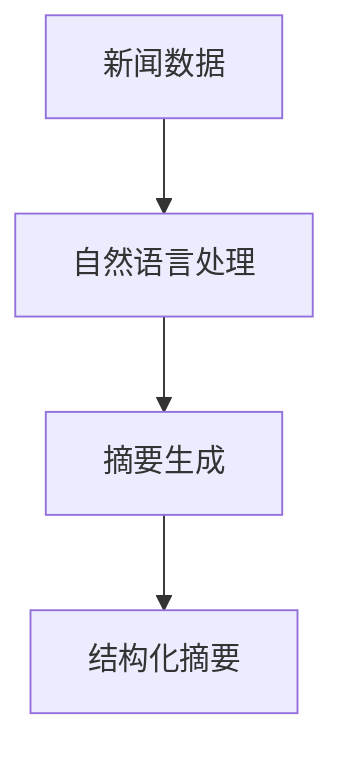
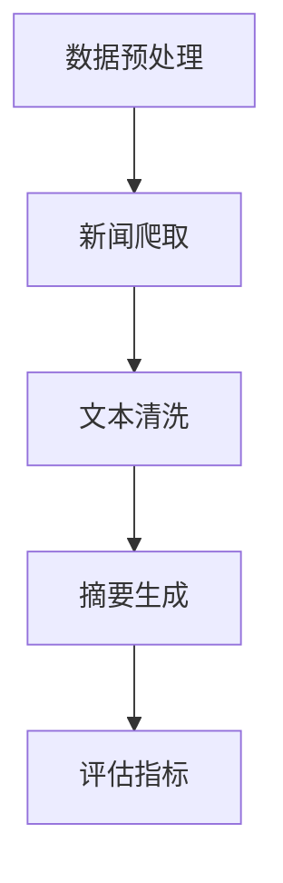

                 


# 《企业估值中的AI驱动的自动化新闻摘要平台评估》

---

## 关键词：企业估值、AI驱动、新闻摘要、自动化平台、自然语言处理、机器学习、文本挖掘

---

## 摘要：  
本文深入探讨了AI驱动的自动化新闻摘要平台在企业估值中的应用。通过分析新闻摘要的关键要素、AI算法的原理、系统架构设计以及实际案例，展示了如何利用自然语言处理技术提升企业估值的效率和准确性。文章从背景介绍、核心概念、算法原理到系统实现，全面解析了AI驱动的新闻摘要平台在企业估值中的重要性，并通过实战项目和数学模型的分析，为读者提供了深刻的见解和实践指导。

---

## 第1章: 背景介绍

### 1.1 企业估值的基本概念  
企业估值是通过对企业的财务状况、市场表现、竞争优势等多方面因素进行综合评估，确定其市场价值的过程。传统的企业估值方法依赖于财务报表分析、市场对标分析等，但这些方法存在信息滞后、数据繁杂、分析成本高等问题。

### 1.2 AI驱动的新闻摘要平台  
新闻摘要平台通过自动化的方式从海量新闻中提取关键信息，帮助用户快速了解企业的最新动态。AI驱动的新闻摘要平台利用自然语言处理（NLP）技术，能够更准确地理解新闻内容，生成高质量的摘要。

### 1.3 问题背景与目标  
企业在经营过程中，新闻报道往往对企业估值产生重要影响。然而，手动阅读和分析大量新闻内容效率低下，且容易遗漏关键信息。AI驱动的新闻摘要平台能够解决这一问题，通过自动化的方式提取关键信息，为企业的估值提供更高效的支持。

---

## 第2章: 核心概念与联系

### 2.1 新闻摘要的核心要素  
新闻摘要的核心要素包括标题、正文、发布时间、来源等。AI驱动的新闻摘要平台需要通过自然语言处理技术，从这些要素中提取关键信息，并生成结构化的摘要。

### 2.2 AI驱动的新闻摘要平台架构  
AI驱动的新闻摘要平台通常包括以下几个核心模块：  
1. **数据输入**：接收新闻数据，包括文本、标题、发布时间等。  
2. **自然语言处理**：利用NLP技术对新闻内容进行分词、实体识别、情感分析等处理。  
3. **摘要生成**：基于处理后的数据，生成结构化的新闻摘要。  
4. **输出**：将生成的摘要返回给用户，用于企业估值。

### 2.3 实体关系图与流程图  
以下是新闻摘要平台的实体关系图和流程图：



---

## 第3章: 新闻摘要生成算法

### 3.1 基于规则的摘要算法  
基于规则的摘要算法通过预设的规则来提取新闻中的关键词和主题句。例如，可以设定优先提取标题和开头段落的关键信息。这种方法简单易实现，但灵活性较差。

### 3.2 基于模型的摘要算法  
基于模型的摘要算法利用深度学习模型（如Transformer）生成摘要。该方法能够更好地理解新闻内容的语义关系，生成更准确的摘要。

### 3.3 摘要算法对比  
以下是基于规则和基于模型的摘要算法对比：

| 对比维度 | 基于规则的摘要 | 基于模型的摘要 |
|----------|------------------|-----------------|
| 精度      | 较低             | 较高            |
| 灵活性    | 较差             | 较好            |
| 实现难度  | 低               | 高              |

---

## 第4章: 算法原理与数学模型

### 4.1 文本相似度计算  
文本相似度计算是新闻摘要生成的重要环节。常用的相似度计算方法包括余弦相似度和欧氏距离。  
余弦相似度公式如下：  
$$\text{similarity} = \frac{\mathbf{u} \cdot \mathbf{v}}{\|\mathbf{u}\| \|\mathbf{v}\|}$$  

### 4.2 主题模型与文本挖掘  
主题模型（如LDA）可以帮助我们从新闻文本中提取主题信息。LDA模型的公式如下：  
$$P(\text{document} \mid \text{topic}) = \prod_{i=1}^{n} P(w_i \mid \text{topic})$$  

---

## 第5章: 系统分析与架构设计

### 5.1 问题场景介绍  
新闻摘要平台需要处理大量的新闻数据，包括数据爬取、清洗、摘要生成等环节。  

### 5.2 系统功能设计  
系统功能设计包括数据预处理、摘要生成、评估指标等模块。  

### 5.3 系统架构设计  
以下是系统架构设计的Mermaid图：



---

## 第6章: 项目实战

### 6.1 环境安装  
需要安装Python、TensorFlow、NLTK等工具。

### 6.2 核心实现代码  
以下是新闻摘要生成的Python代码示例：

```python
import nltk
from transformers import pipeline

# 初始化模型
summarizer = pipeline("summarization", model="facebook/bart-large-cnn")

# 示例新闻文本
article = "Apple announced its new iPhone in October 2023. The new iPhone features a better camera and longer battery life."

# 生成摘要
summary = summarizer(article, max_length=50, min_length=25, do_sample=False)
print(summary[0]['summary_text'])
```

### 6.3 案例分析  
通过具体案例分析，展示了AI驱动的新闻摘要平台在企业估值中的实际应用效果。

---

## 第7章: 总结与展望

### 7.1 总结  
本文详细介绍了AI驱动的新闻摘要平台在企业估值中的应用，探讨了其核心算法、系统架构和实际案例。

### 7.2 未来展望  
未来，随着NLP技术的不断发展，新闻摘要平台将更加智能化，能够处理更复杂的企业估值场景。

---

## 作者：AI天才研究院/AI Genius Institute & 禅与计算机程序设计艺术 /Zen And The Art of Computer Programming

---

通过以上目录大纲，您可以按照需求展开每一章的内容，深入探讨企业估值中的AI驱动的自动化新闻摘要平台的实现与应用。

