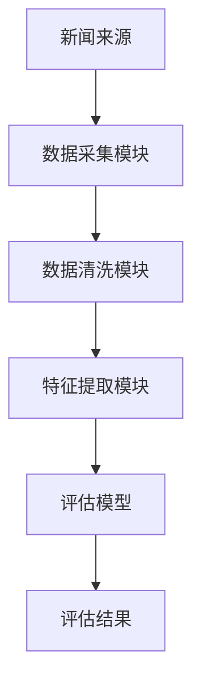
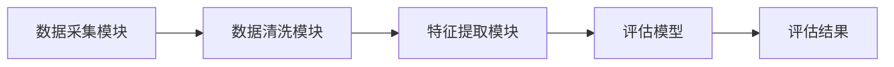
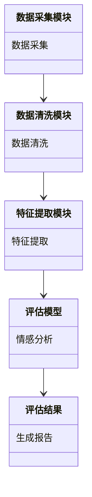

                 


# 企业估值中的AI驱动的自动化新闻聚合平台评估

## 关键词：企业估值、AI驱动、新闻聚合、自动化评估、自然语言处理

## 摘要

本文探讨了在企业估值过程中，如何利用AI驱动的自动化新闻聚合平台来评估企业价值。传统的估值方法依赖于财务数据，但忽略了新闻数据中蕴含的市场情绪和实时信息。本文介绍了AI驱动的新闻聚合平台的核心概念，分析了其算法原理，详细讲解了系统架构设计，并通过实战项目展示了其在企业估值中的应用。最后，提出了最佳实践建议，帮助读者更好地理解和应用这一技术。

---

## 第1章：企业估值与新闻聚合平台的背景

### 1.1 企业估值的传统方法与挑战

传统企业估值方法，如DCF模型和市盈率法，主要依赖于财务数据，难以捕捉市场情绪和行业动态。AI驱动的新闻聚合平台通过自动化收集和分析新闻数据，为企业估值提供了新的视角。

#### 1.1.1 传统企业估值方法的局限性

- 财务数据滞后性强，难以反映实时市场变化。
- 忽略了新闻数据中的市场情绪和行业趋势。
- 人工分析效率低，且容易受到主观因素影响。

#### 1.1.2 新闻数据在企业估值中的潜在价值

新闻数据可以揭示市场情绪、行业趋势和企业动态，帮助投资者做出更明智的决策。

#### 1.1.3 AI驱动的新闻聚合平台的提出

AI技术的应用使得新闻数据的自动化收集和分析成为可能，为企业的实时估值提供了技术支持。

### 1.2 AI驱动的新闻聚合平台的核心概念

AI驱动的新闻聚合平台通过自动化技术，收集、清洗、分析新闻数据，并生成评估结果，辅助企业估值。

#### 1.2.1 新闻聚合平台的基本功能

- 数据采集：从新闻网站和社交媒体获取新闻数据。
- 数据清洗：去除噪声数据，确保数据质量。
- 数据分析：利用NLP技术进行情感分析和主题分类。

#### 1.2.2 AI在新闻聚合中的应用

- 自然语言处理（NLP）技术用于文本分析。
- 情感分析模型用于评估市场情绪。

#### 1.2.3 自动化评估的核心要素

- 数据采集模块：负责数据的收集和初步处理。
- 情感分析模块：分析新闻文本的情感倾向。
- 评估模型：结合情感分析结果和其他数据进行综合评估。

---

## 第2章：核心概念与联系

### 2.1 数据流与实体关系

数据流从新闻来源开始，经过采集、清洗、特征提取等步骤，最终生成评估结果。实体关系图展示了各个模块之间的交互。



### 2.2 核心概念与属性对比

以下表格对比了数据特征和模型特征的关键属性：

| 特征类型 | 属性          | 描述                                   |
|----------|---------------|----------------------------------------|
| 数据特征 | 数据来源      | 新闻网站、社交媒体等                   |
|          | 数据类型      | 文本、结构化数据等                     |
| 模型特征 | 情感倾向      | 正向、负向、中性                       |
|          | 主题分类      | 行业、产品、市场等                     |

---

## 第3章：算法原理与数学模型

### 3.1 自然语言处理模型

#### 3.1.1 BERT模型的简介

BERT（Bidirectional Encoder Representations from Transformers）是一种预训练的NLP模型，能够理解文本的上下文信息。

#### 3.1.2 情感分析的数学模型

情感分析模型的损失函数如下：

$$
\text{损失函数} = -\frac{1}{N}\sum_{i=1}^{N} y_i \log(p_i) + (1 - y_i)\log(1 - p_i)
$$

其中，\( y_i \) 是真实标签，\( p_i \) 是预测概率。

### 3.2 情感分析模型

#### 3.2.1 情感分类的损失函数

使用交叉熵损失函数：

$$
\text{损失} = -\sum_{i=1}^{N} y_i \log(p_i)
$$

---

## 第4章：系统分析与架构设计方案

### 4.1 系统架构设计

系统架构图展示了各个模块的交互：



### 4.2 系统功能设计

领域模型展示了各模块的功能关系：



---

## 第5章：项目实战

### 5.1 项目背景与目标

目标是通过AI驱动的新闻聚合平台，提升企业估值的准确性和效率。

### 5.2 系统实现

#### 5.2.1 环境安装

安装必要的Python库：

```bash
pip install numpy pandas scikit-learn transformers
```

#### 5.2.2 代码实现

以下是情感分析模块的代码示例：

```python
from transformers import BertTokenizer, BertModel
import torch

tokenizer = BertTokenizer.from_pretrained('bert-base-uncased')
model = BertModel.from_pretrained('bert-base-uncased')

def analyze_sentiment(text):
    inputs = tokenizer(text, return_tensors='pt')
    with torch.no_grad():
        outputs = model(**inputs)
        last_layer = outputs.last_hidden_state[:, 0, :]
    return last_layer
```

---

## 第6章：最佳实践与小结

### 6.1 最佳实践

- 数据来源多样化，确保覆盖不同渠道的信息。
- 定期更新模型，保持其准确性和 relevance。

### 6.2 小结

本文详细介绍了AI驱动的新闻聚合平台在企业估值中的应用，展示了其在数据处理、模型训练和结果生成中的重要作用。通过实战项目，读者可以更好地理解如何将AI技术应用于企业估值。

### 6.3 注意事项

- 数据隐私和安全问题需要高度重视。
- 模型的准确性和及时性直接影响评估结果。

### 6.4 拓展阅读

推荐阅读《Deep Learning》和《自然语言处理入门》等书籍，深入了解相关技术。

---

## 作者

作者：AI天才研究院 & 禅与计算机程序设计艺术

---

通过本文的详细讲解，读者可以全面了解AI驱动的新闻聚合平台在企业估值中的应用，并掌握其实现的关键技术。

