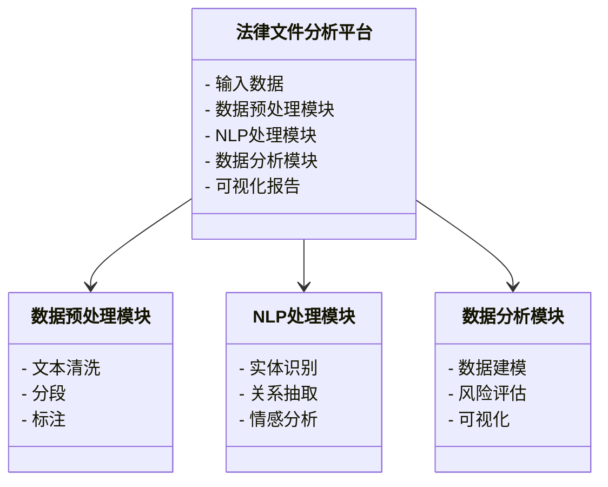

                 


# 企业估值中的AI驱动的自动化法律文件分析平台评估

> 关键词：企业估值，AI驱动，法律文件分析，自动化评估，NLP技术

> 摘要：本文探讨了AI驱动的自动化法律文件分析平台在企业估值中的应用。通过分析法律文件的关键条款和潜在风险，利用自然语言处理技术，企业可以更高效、准确地进行估值。本文从背景、技术原理、系统设计到项目实战，详细阐述了这一过程，并通过案例分析展示了其实际价值。

---

## 第一章：企业估值与法律文件分析的背景

### 1.1 企业估值的基本概念
企业估值是确定企业市场价值的过程，通常涉及财务数据、市场分析和法律文件评估。法律文件（如合同、财务报告）中的条款直接影响企业的财务状况和潜在风险。

### 1.2 法律文件分析的重要性
法律文件分析是企业估值的核心部分，涉及识别关键条款、潜在风险和合规性问题。传统方法依赖人工审查，效率低且容易出错。

### 1.3 AI驱动的法律文件分析的背景
AI技术的快速发展，特别是自然语言处理（NLP）的进步，为法律文件分析提供了新的可能性。通过自动化处理，企业可以更高效地完成估值工作。

---

## 第二章：AI驱动的法律文件分析平台的核心概念

### 2.1 法律文件分析的关键要素
- **法律术语识别**：识别关键术语（如违约条款、担保条款）。
- **文本相似度分析**：比较不同法律文件的相似性，识别潜在风险。
- **信息抽取**：从文本中提取结构化数据。

### 2.2 平台的功能模块
- **文本预处理**：清洗、分段和标注。
- **信息抽取**：识别实体和关系。
- **数据建模**：基于抽取的信息进行建模和分析。
- **结果可视化**：生成可视化报告。

### 2.3 平台的边界与外延
- **边界**：专注于法律文件分析，不涉及外部市场数据。
- **外延**：可扩展至合同管理、合规性监控等其他领域。

---

## 第三章：NLP技术在法律文件分析中的应用

### 3.1 词嵌入与文本表示
- 使用Word2Vec或BERT等模型进行词嵌入，捕捉文本语义。

### 3.2 文本分段与实体识别
- 利用分段算法将文本分割为句子或段落。
- 使用CRF或Transformer模型进行实体识别。

### 3.3 基于深度学习的语义理解
- 使用预训练模型（如BERT）进行上下文理解，提高分析准确性。

---

## 第四章：系统设计与架构

### 4.1 领域模型设计


### 4.2 系统架构设计
```mermaid
server
    file everlasting/flow-chart-1.svg
```

### 4.3 API设计
- 输入接口：接收法律文件内容。
- 输出接口：返回分析结果。

---

## 第五章：项目实战

### 5.1 环境安装
- 安装Python和相关库（如spaCy、Gensim、Matplotlib）。

### 5.2 核心代码实现
```python
import spacy
nlp = spacy.load("en_core_web_sm")
doc = nlp("This is a sample text for legal analysis.")
for token in doc:
    print(token.text, token.pos_, token.dep_)
```

### 5.3 实际案例分析
分析某公司财务报告中的风险条款，展示平台如何识别潜在风险。

---

## 第六章：案例分析与价值实现

### 6.1 实际案例分析
通过具体案例展示平台如何帮助企业在并购交易中识别法律风险。

### 6.2 平台的价值实现
- 提高效率：自动化处理大量法律文件。
- 增强准确性：基于AI的分析减少人为错误。
- 降低成本：减少对专业律师的依赖。

---

## 第七章：未来展望与挑战

### 7.1 技术发展趋势
- 多模态分析：结合图像和文本信息。
- 模型解释性：提高AI决策的透明度。

### 7.2 挑战与解决方案
- 数据隐私：采用加密技术保护数据。
- 模型泛化能力：通过迁移学习提升模型适应性。

---

## 作者

作者：AI天才研究院/AI Genius Institute & 禅与计算机程序设计艺术 /Zen And The Art of Computer Programming

---

通过以上结构，文章系统地介绍了AI驱动的法律文件分析平台在企业估值中的应用，从背景到技术实现，再到实际案例，为读者提供了全面的视角。

