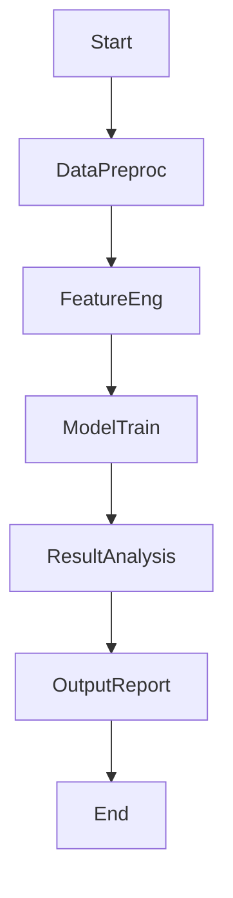

                 


# 企业估值中的AI驱动的自动化科学发现平台评估

## 关键词：企业估值, AI驱动, 自动化科学发现平台, 数据驱动, 机器学习模型

## 摘要：  
本文探讨了如何利用AI驱动的自动化科学发现平台优化企业估值过程。通过分析传统估值方法的局限性，结合数据科学和机器学习技术，构建了一个高效的自动化评估系统。该系统包括数据采集、特征提取、模型训练、结果分析和可视化等模块，旨在提升估值的准确性和效率。文章详细讲解了平台的核心概念、算法原理、系统架构，并通过实际案例展示了其应用效果，为企业的估值提供了新的思路和工具。

---

# 正文

## 第1章：企业估值背景与挑战

### 1.1 问题背景  
企业估值是企业战略决策、投资评估和资本运作中的核心环节。传统的估值方法依赖于财务指标分析、市场对标法和DCF模型等，但在数据量庞大、市场动态变化快的今天，这些方法存在以下问题：  
- 数据来源单一，难以覆盖多维度信息。  
- 模型假设过于简化，难以捕捉复杂市场波动。  
- 人工分析耗时长，难以快速响应市场变化。  

### 1.2 问题描述  
AI驱动的自动化科学发现平台通过整合多源数据、构建复杂模型，能够高效解决以下问题：  
- 数据清洗与特征提取的效率低下。  
- 模型选择与调优的试错成本高。  
- 结果解释性不足，难以满足业务需求。  

### 1.3 平台的边界与外延  
该平台专注于企业财务数据、市场数据和行业趋势的分析，边界包括：  
- 数据范围：企业财务报表、行业指数、市场情绪数据。  
- 功能范围：数据预处理、模型训练、估值结果生成与解释。  
- 外延：与其他企业管理系统（如ERP）的集成。  

---

## 第2章：AI驱动的自动化科学发现平台核心概念

### 2.1 核心概念解析  
- **数据驱动的科学发现**：通过数据挖掘和机器学习，发现隐藏在数据中的规律。  
- **自动化特征工程**：自动生成特征，提升模型性能。  
- **可解释性模型**：确保模型结果的可解释性，满足业务需求。  

### 2.2 核心要素组成  
- **数据采集模块**：从多源数据中提取相关信息。  
- **特征提取模块**：生成高价值特征，提升模型性能。  
- **模型训练模块**：选择并训练最优模型。  
- **结果分析模块**：解释模型结果并生成估值报告。  

---

## 第3章：算法原理与实现

### 3.1 算法流程  


### 3.2 数据预处理  
数据预处理是关键步骤，包括：  
- 数据清洗：处理缺失值、异常值。  
- 数据标准化：归一化处理。  
- 数据增强：增加数据多样性。  

### 3.3 特征提取  
使用主成分分析（PCA）提取特征：  
$$
\text{PCA}: X = X_{\text{中心化}} \cdot P
$$  
其中，$X$是数据矩阵，$P$是主成分矩阵。  

### 3.4 模型选择与训练  
选择随机森林或神经网络模型，进行交叉验证调参。  

### 3.5 模型解释性  
使用SHAP值解释模型预测结果：  
$$
\text{SHAP值} = \text{贡献度} = \text{预测值} - \text{基线值}
$$  

---

## 第4章：系统架构与实现

### 4.1 系统架构  
```mermaid
graph TD
    User --> API Gateway
    API Gateway --> DataLayer
    DataLayer --> FeatureLayer
    FeatureLayer --> ModelLayer
    ModelLayer --> ResultLayer
    ResultLayer --> User
```

### 4.2 接口设计  
- **数据接口**：提供数据上传和下载功能。  
- **模型接口**：支持模型训练和预测。  
- **报告接口**：生成可视化估值报告。  

---

## 第5章：项目实战与案例分析

### 5.1 环境搭建  
安装Python、机器学习库（如scikit-learn、XGBoost）和数据处理工具（如Pandas）。  

### 5.2 核心代码实现  
```python
import pandas as pd
from sklearn.ensemble import RandomForestRegressor
from sklearn.metrics import mean_absolute_error
from sklearn.model_selection import train_test_split
from sklearn.impute import SimpleImputer
from sklearn.pipeline import Pipeline
from sklearn.preprocessing import StandardScaler

# 数据加载与预处理
data = pd.read_csv('企业数据.csv')
X = data.drop('估值', axis=1)
y = data['估值']

# 管道化处理
pipeline = Pipeline([
    ('imputer', SimpleImputer(strategy='mean')),
    ('scaler', StandardScaler()),
    ('model', RandomForestRegressor(n_estimators=100, random_state=42))
])

# 数据分割
X_train, X_test, y_train, y_test = train_test_split(X, y, test_size=0.2, random_state=42)

# 模型训练
pipeline.fit(X_train, y_train)

# 模型预测
y_pred = pipeline.predict(X_test)

# 模型评估
mae = mean_absolute_error(y_test, y_pred)
print(f"MAE: {mae}")
```

### 5.3 案例分析  
以某科技公司为例，利用平台生成估值报告，分析其在不同市场环境下的估值变化。  

---

## 第6章：最佳实践与总结

### 6.1 小结  
- AI驱动的自动化科学发现平台显著提升了企业估值的效率和准确性。  
- 关键技术包括数据预处理、特征工程和可解释性模型。  

### 6.2 注意事项  
- 数据质量直接影响结果，需谨慎处理。  
- 模型解释性是业务应用的关键，需重点关注。  

### 6.3 拓展阅读  
- 《机器学习实战》  
- 《深度学习导论》  

---

# 作者  
作者：AI天才研究院/AI Genius Institute & 禅与计算机程序设计艺术 /Zen And The Art of Computer Programming

