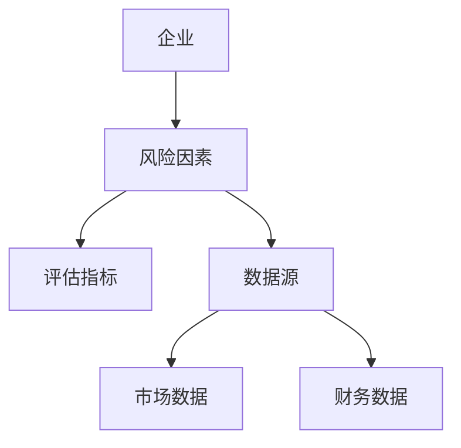
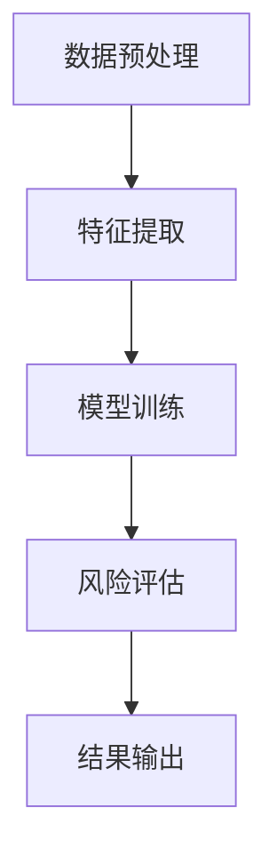
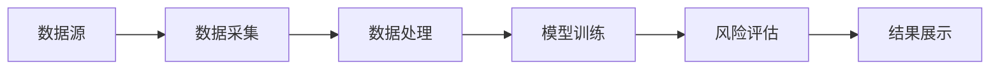
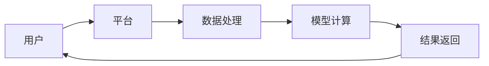

                 


# 企业估值中的AI驱动的自动化风险评估平台评估

> 关键词：企业估值，AI驱动，风险评估，自动化平台，金融风险管理

> 摘要：本文探讨了在企业估值过程中，如何利用人工智能技术构建自动化风险评估平台。通过分析传统方法的局限性，提出了一种基于AI的解决方案，详细阐述了其核心概念、算法原理、系统架构及实际应用案例。文章还提供了最佳实践和注意事项，帮助读者更好地理解和实施该平台。

---

# 1. 背景介绍

## 1.1 问题背景

### 1.1.1 传统企业估值方法的局限性
传统的企业估值方法依赖于财务报表分析、市场分析和行业研究，这些方法通常耗时且主观性强，难以捕捉市场变化和复杂风险因素。此外，传统方法难以处理海量数据，导致风险评估不够全面和及时。

### 1.1.2 风险评估在企业估值中的重要性
企业在经营过程中面临多种风险，如市场风险、信用风险和操作风险等。准确评估这些风险是制定合理估值和投资决策的关键。然而，传统方法难以量化和预测这些风险，导致估值结果不够准确。

### 1.1.3 AI技术在金融领域的应用潜力
人工智能（AI）技术在金融领域的应用日益广泛，尤其是在风险评估、欺诈检测和投资决策方面。AI可以通过大量数据训练模型，识别潜在风险并提供实时反馈，显著提高了风险评估的效率和准确性。

## 1.2 问题描述

### 1.2.1 企业估值中的主要风险因素
企业估值涉及多个风险因素，包括财务状况、市场环境、行业竞争和政策变化等。这些因素相互作用，增加了估值的复杂性。

### 1.2.2 风险评估的复杂性与不确定性
风险评估需要考虑多种变量和潜在的不确定性，传统方法难以全面捕捉这些因素，导致评估结果可能存在偏差。

### 1.2.3 自动化风险评估的需求与目标
随着金融市场的发展，企业估值需要更高的准确性和及时性。自动化风险评估平台能够实时处理大量数据，提供动态反馈，帮助企业做出更明智的决策。

## 1.3 问题解决方法

### 1.3.1 AI驱动的风险评估技术
AI技术可以通过机器学习和深度学习模型，从大量数据中提取特征，识别潜在风险，并预测未来风险趋势。

### 1.3.2 自动化平台的优势
自动化平台可以快速处理数据，提供实时反馈，减少人为误差，提高评估效率。

### 1.3.3 平台的适用场景与边界
该平台适用于企业估值、投资决策和风险管理等领域，但需要注意数据质量和模型的可解释性。

## 1.4 概念结构与核心要素

### 1.4.1 企业估值的核心要素
企业估值的核心要素包括财务数据、市场环境和行业竞争等。

### 1.4.2 风险评估的指标体系
常用的指标包括波动率、VaR（在险价值）和信用评分等。

### 1.4.3 自动化平台的组成与功能
自动化平台通常包括数据采集、模型训练、风险评估和结果展示等功能模块。

---

# 2. 核心概念与联系

## 2.1 自动化风险评估平台的定义
自动化风险评估平台是一种基于AI技术的系统，能够自动收集、分析和评估企业风险，提供实时反馈。

## 2.2 核心概念的属性对比

| 属性         | 实时性 | 准确性 | 可扩展性 | 可解释性 |
|--------------|--------|--------|----------|----------|
| 自动化平台     | 高     | 高     | 高        | 中        |
| 传统方法     | 低     | 中     | 低        | 高        |

## 2.3 ER实体关系图



---

# 3. 算法原理讲解

## 3.1 机器学习模型

### 3.1.1 线性回归
线性回归是一种简单回归模型，用于预测连续型变量。其数学公式为：
$$ y = \beta_0 + \beta_1x + \epsilon $$

### 3.1.2 支持向量机
支持向量机（SVM）用于分类和回归问题，适用于高维数据。其核心是通过找到最优超平面将数据分成两类。

### 3.1.3 随机森林
随机森林是一种基于决策树的集成学习方法，适用于分类和回归问题，具有高准确性和鲁棒性。

## 3.2 深度学习模型

### 3.2.1 神经网络
神经网络是一种模拟人脑的结构，通过多层感知器进行特征提取和分类。

### 3.2.2 循环神经网络
循环神经网络（RNN）适用于处理序列数据，如时间序列分析。

## 3.3 算法流程图



## 3.4 核心代码实现

```python
import pandas as pd
from sklearn.ensemble import RandomForestRegressor

# 数据加载与预处理
data = pd.read_csv('企业数据.csv')
X = data.drop('估值', axis=1)
y = data['估值']

# 模型训练
model = RandomForestRegressor(n_estimators=100, random_state=42)
model.fit(X, y)

# 风险评估
importances = model.feature_importances_
print("特征重要性：", importances)
```

---

# 4. 系统分析与架构设计

## 4.1 系统功能设计

### 4.1.1 数据采集模块
数据采集模块负责从企业财务报表、市场数据等来源获取数据。

### 4.1.2 模型训练模块
模型训练模块负责训练AI模型，提取特征并生成风险评估结果。

## 4.2 系统架构图



## 4.3 接口设计

### 4.3.1 API接口
平台提供API接口，允许其他系统调用风险评估结果。

### 4.3.2 数据接口
数据接口用于与企业数据库和市场数据源对接。

## 4.4 交互序列图



---

# 5. 项目实战

## 5.1 环境安装

```bash
pip install pandas scikit-learn matplotlib
```

## 5.2 核心代码实现

```python
import pandas as pd
from sklearn.ensemble import RandomForestRegressor

# 数据加载
data = pd.read_csv('企业数据.csv')

# 特征选择
X = data[['收入', '利润', '市场份额']]
y = data['估值']

# 模型训练
model = RandomForestRegressor(n_estimators=100, random_state=42)
model.fit(X, y)

# 预测与评估
importances = model.feature_importances_
print("特征重要性：", importances)
```

## 5.3 案例分析

以某科技公司为例，分析其财务数据和市场环境，利用平台生成风险评估报告，帮助企业做出更明智的估值决策。

---

# 6. 最佳实践与小结

## 6.1 最佳实践

### 6.1.1 数据质量
确保数据的完整性和准确性，避免模型偏差。

### 6.1.2 模型调优
通过交叉验证和超参数优化，提高模型准确性和稳定性。

## 6.2 注意事项

### 6.2.1 数据隐私
遵守数据隐私法规，保护用户数据安全。

### 6.2.2 模型解释性
确保模型的可解释性，方便用户理解和调整。

## 6.3 拓展阅读

### 6.3.1 推荐书籍
- 《Python机器学习实战》
- 《深入浅出：人工智能技术与应用》

### 6.3.2 技术博客
- [KDNuggets](https://www.kdnuggets.com/)
- [Towards Data Science](https://towardsdatascience.com/)

---

# 作者信息

作者：AI天才研究院/AI Genius Institute & 禅与计算机程序设计艺术/Zen And The Art of Computer Programming

