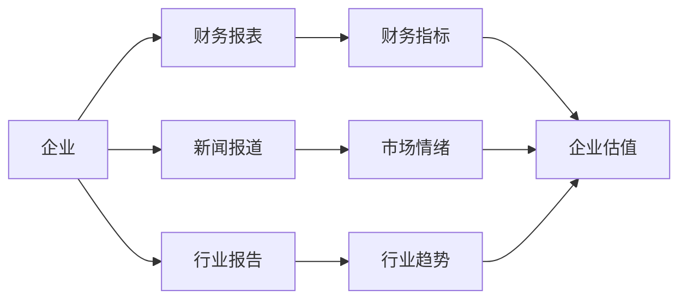
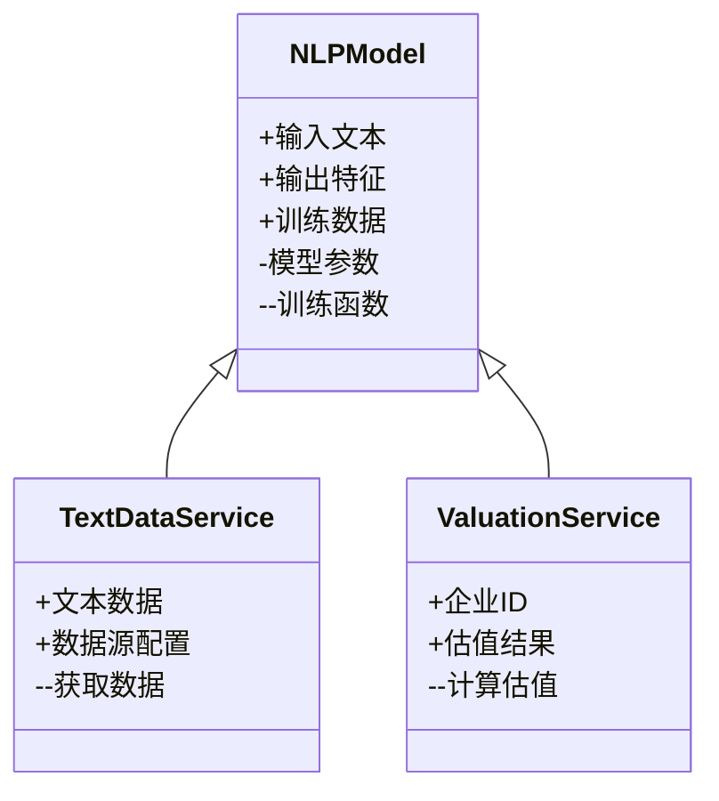

                 


# 企业估值中的AI驱动的自然语言理解平台评估

> 关键词：企业估值，人工智能，自然语言处理，文本分析，深度学习，企业价值评估

> 摘要：本文探讨了在企业估值过程中，如何利用AI驱动的自然语言理解（NLP）平台来提升评估的准确性和效率。通过分析NLP的核心概念、算法原理、系统架构及实际应用案例，本文旨在为读者提供一个全面的技术视角，展示如何将先进的NLP技术应用于复杂的金融领域。

---

# 正文

## 第一部分: 企业估值中的自然语言理解平台概述

### 第1章: 企业估值与AI驱动的NLP平台背景

#### 1.1 企业估值的传统方法与挑战

企业估值是金融领域中的核心任务之一，传统方法主要包括基于财务指标的DCF模型、市场乘数法等。然而，这些方法往往依赖于财务数据和市场数据，忽略了非结构化文本数据的价值。企业公开的新闻报道、行业报告、管理层发言等文本数据中蕴含了大量的隐含信息，这些信息对估值具有重要影响。

**问题背景：**
- **信息不对称**：市场参与者可能无法完全掌握企业的隐含信息，导致估值偏差。
- **数据维度不足**：传统估值方法依赖有限的财务数据，而文本数据能够提供更丰富的信息。
- **文本分析难度大**：非结构化文本难以直接用于量化分析。

**解决方法：**
AI驱动的NLP技术可以自动提取文本中的关键信息，将其转化为可量化的指标，从而丰富估值模型的数据来源，提升估值的准确性。

#### 1.2 问题背景与描述

企业估值中的文本数据主要包括以下几类：
- **财务报表**：企业公开的财务数据，如收入、利润、资产负债等。
- **新闻报道**：媒体对企业经营状况、市场动态的报道。
- **行业报告**：专业机构发布的行业分析报告。
- **管理层发言**：企业在财报电话会议中管理层的讲话。

这些文本数据中蕴含了企业的市场声誉、管理战略、行业趋势等重要信息，这些信息往往无法通过财务数据直接反映。

#### 1.3 问题解决与边界

**AI驱动的NLP平台**通过自然语言处理技术，可以将文本数据转化为可量化的特征，例如情感分析、关键词提取、主题建模等。这些特征可以作为传统估值模型的补充输入，从而提升估值的准确性。

**边界与外延：**
- **边界**：本文主要关注基于文本数据的企业估值问题，不涉及其他类型数据（如财务数据）的处理。
- **外延**：NLP技术在企业估值中的应用不仅限于文本数据，还可以结合其他数据源（如市场数据）进行综合分析。

---

### 第2章: 自然语言理解平台的核心概念与联系

#### 2.1 核心概念原理

**自然语言理解（NLP）**的目标是让计算机能够理解人类语言。在企业估值中，NLP的主要任务包括文本分类、情感分析、关键词提取、主题建模等。

**AI驱动的NLP平台**通过深度学习模型（如BERT、GPT等）处理文本数据，提取语义信息，并将其转化为可用于估值的特征。

#### 2.2 核心概念对比分析

以下是几种常见的NLP模型及其在企业估值中的表现对比：

| 模型类型       | 适用场景                     | 优缺点分析                                   |
|----------------|------------------------------|--------------------------------------------|
| 传统统计模型   | 关键词提取、主题建模         | 计算效率高，但效果受限于特征工程的质量       |
| 深度学习模型   | 情感分析、文本分类           | 效果更优，但需要大量标注数据和计算资源       |
| 增量学习模型   | 实时更新模型                 | 可动态适应市场变化，但训练成本较高           |

#### 2.3 实体关系架构图



---

## 第二部分: AI驱动的NLP平台评估算法原理

### 第3章: 基于NLP的企业估值模型

#### 3.1 模型训练与优化

**文本预处理**是NLP任务中的关键步骤，包括分词、去除停用词、向量化等。


**模型训练过程**如下：


**数学公式：**
- **余弦相似度**用于衡量两个文本的相似性：
  $$
  \cos\theta = \frac{\vec{A} \cdot \vec{B}}{|\vec{A}| |\vec{B}|}
  $$

---

## 第三部分: 系统分析与架构设计

### 第4章: 系统架构设计

#### 4.1 系统功能设计

**系统功能模块**包括：
- **数据采集**：从多种数据源（如新闻网站、行业报告）获取文本数据。
- **模型训练**：基于文本数据训练NLP模型。
- **评估分析**：将模型输出的特征用于企业估值。

**类图设计**：



---

## 第四部分: 项目实战

### 第5章: 项目实战与总结

#### 5.1 环境安装与配置

```bash
pip install numpy
pip install scikit-learn
pip install transformers
pip install mermaid
```

#### 5.2 核心代码实现

```python
from transformers import BertTokenizer, BertModel
import torch

# 初始化模型和分词器
tokenizer = BertTokenizer.from_pretrained('bert-base-uncased')
model = BertModel.from_pretrained('bert-base-uncased')

# 定义输入文本
text = "The company reported strong revenue growth in the first quarter."
inputs = tokenizer(text, return_tensors='pt')

# 前向传播
outputs = model(**inputs)
last_hidden_states = outputs.last_hidden_state
```

#### 5.3 实际案例分析

假设我们有某科技公司的新闻报道文本，我们可以提取文本中的情感倾向和关键词，将其用于估值模型的输入。

---

## 第五部分: 总结与展望

### 第6章: 总结与展望

#### 6.1 总结

本文详细介绍了AI驱动的NLP平台在企业估值中的应用，从背景、核心概念、算法原理到系统架构，均为读者提供了全面的技术视角。通过实际案例分析，展示了如何将NLP技术应用于金融领域，提升企业估值的效率和准确性。

#### 6.2 展望

未来，随着NLP技术的不断发展，我们可以期待更多创新的应用场景。例如，结合多模态数据（如图像、视频）进行更全面的企业分析。此外，如何在保证数据隐私的前提下，充分利用外部数据源进行企业估值，也是值得深入研究的方向。

---

## 第六部分: 最佳实践与注意事项

### 第7章: 最佳实践

#### 7.1 数据质量的重要性

在实际应用中，数据质量对模型性能的影响至关重要。建议在数据预处理阶段，增加对文本数据的清洗和增强（如数据增强技术）。

#### 7.2 模型调优与监控

定期监控模型的性能，并根据市场变化进行模型调优，可以确保模型的持续有效性。

#### 7.3 持续学习与更新

由于市场环境不断变化，建议采用增量学习方法，定期更新模型，以适应新的市场动态。

---

## 作者

作者：AI天才研究院/AI Genius Institute & 禅与计算机程序设计艺术 /Zen And The Art of Computer Programming

---

本文通过系统地分析AI驱动的NLP平台在企业估值中的应用，为读者提供了从理论到实践的全面指导。希望本文能够为金融领域的技术实践者提供有价值的参考，同时也欢迎各位读者在评论区分享您的观点和经验。

