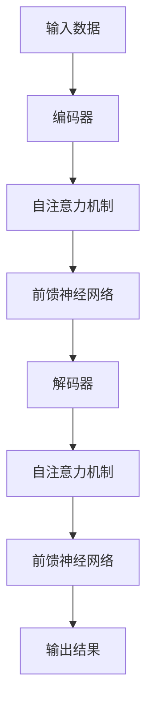
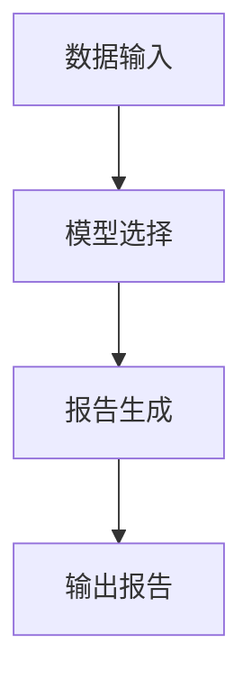
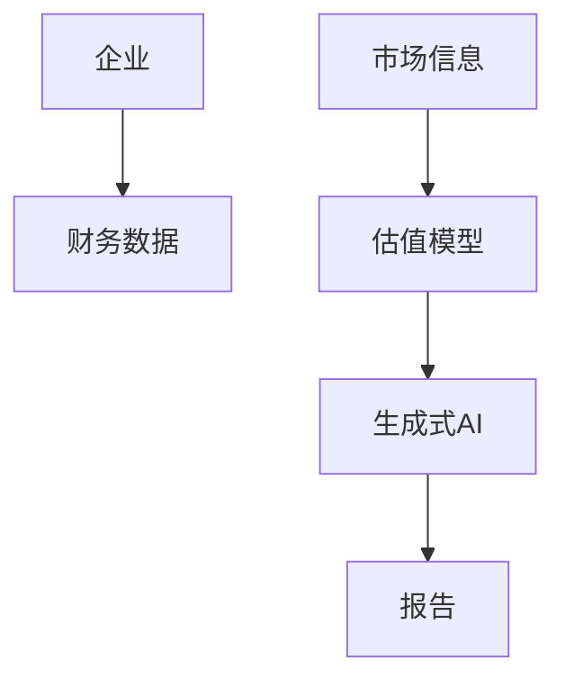
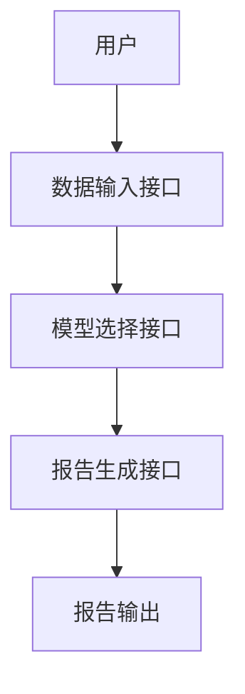
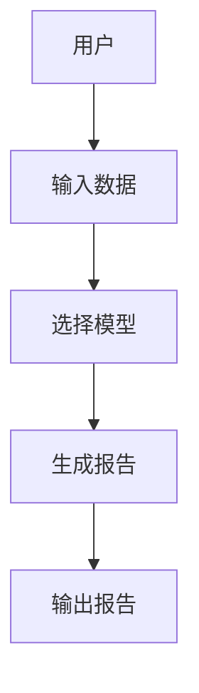

                 


# 《企业估值中的AI驱动的自然语言生成平台评估》

## 关键词：企业估值、AI驱动、自然语言生成、平台评估、生成式AI、企业价值、算法原理

## 摘要：  
在企业估值领域，传统的评估方法往往依赖于大量的人工分析和经验判断，存在效率低下、主观性强、难以规模化等问题。随着人工智能技术的快速发展，特别是生成式AI（Generative AI）和自然语言生成（Natural Language Generation, NLG）技术的成熟，为企业估值提供了一种全新的解决方案。本文章将详细探讨如何利用AI驱动的自然语言生成平台，提升企业估值的效率和准确性。通过分析自然语言生成技术的原理、算法实现、系统架构以及实际应用案例，本文旨在为企业估值领域提供一种基于AI的创新方法，帮助企业更高效地进行价值评估。

---

# 第一部分: 企业估值中的AI驱动的自然语言生成平台概述

## 第1章: 问题背景与目标

### 1.1 问题背景
#### 1.1.1 传统企业估值方法的局限性
- 人工分析耗时且主观性强，难以保证结果的客观性。
- 数据依赖性强，难以快速处理非结构化数据。
- 传统估值模型难以应对复杂市场环境下的动态变化。

#### 1.1.2 AI技术在企业估值中的潜力
- 自动生成财务报告和分析，提高效率。
- 基于海量数据快速生成估值模型，提升决策速度。
- 实时更新市场信息，优化估值结果。

#### 1.1.3 自然语言生成在企业估值中的作用
- 自动生成企业财务报表、市场分析报告。
- 优化文本摘要，帮助分析师快速获取关键信息。
- 生成预测性报告，支持投资决策。

### 1.2 问题描述
#### 1.2.1 企业估值的核心挑战
- 数据的多样性和复杂性。
- 估值模型的动态调整需求。
- 专业人才的供需矛盾。

#### 1.2.2 自然语言生成平台在企业估值中的具体应用场景
- 自动生成财务分析报告。
- 生成市场趋势预测报告。
- 优化企业估值模型的文本表达。

#### 1.2.3 问题解决的边界与外延
- 边界：专注于生成式AI在企业估值中的具体应用。
- 外延：涵盖从数据输入到报告生成的完整流程。

### 1.3 核心目标
- 提升企业估值的效率和准确性。
- 降低人工分析的成本和时间。
- 实现企业估值的自动化和智能化。

## 第2章: 核心概念与联系

### 2.1 自然语言生成平台的原理
#### 2.1.1 自然语言生成的基本原理
- 自然语言生成的定义与目标。
- 基于规则的生成方法。
- 统计模型与机器学习模型的对比。

#### 2.1.2 AI驱动的自然语言生成技术
- 生成式AI的定义与特点。
- Transformer模型在生成式AI中的应用。
- 深度学习模型的优势。

#### 2.1.3 生成式AI在企业估值中的应用
- 自动生成财务报告。
- 生成市场分析报告。
- 优化企业估值模型的文本表达。

### 2.2 核心概念对比表
#### 2.2.1 自然语言生成与传统文本分析的对比
- 分析方法：传统文本分析依赖关键词提取和情感分析；自然语言生成基于生成模型。
- 应用场景：传统文本分析适用于初步信息提取，自然语言生成适用于复杂报告生成。
- 技术复杂度：传统文本分析技术相对简单，自然语言生成技术复杂且依赖深度学习模型。

#### 2.2.2 生成式AI与其他AI技术的对比
- 生成式AI与识别式AI的对比：生成式AI专注于生成新内容，识别式AI专注于识别和分类。
- 生成式AI与传统统计模型的对比：生成式AI基于深度学习，传统统计模型基于概率统计。
- 生成式AI与规则引擎的对比：生成式AI适用于复杂场景，规则引擎适用于简单场景。

#### 2.2.3 企业估值中的关键要素对比
- 数据输入：结构化数据 vs 非结构化数据。
- 模型选择：传统估值模型 vs 基于生成式AI的模型。
- 输出结果：文本报告 vs 数值估值。

### 2.3 实体关系图
#### 2.3.1 ER图展示：企业估值中的核心实体关系
- 实体：企业、财务数据、市场信息、估值模型、生成式AI。
- 关系：企业拥有财务数据和市场信息；估值模型基于财务数据和市场信息；生成式AI应用于估值模型。

#### 2.3.2 生成式AI与企业估值要素的关联
- 生成式AI作为核心工具，关联企业、数据、模型和报告。

## 第3章: 算法原理与实现

### 3.1 生成式AI的算法原理
#### 3.1.1 Transformer模型的结构与特点
- 编码器-解码器结构。
- 自注意力机制。
- 前馈神经网络。

#### 3.1.2 注意力机制的数学模型
- 注意力机制的定义：$attn(a, b) = softmax(\frac{QK^T}{\sqrt{d}})$。
- 解码器中的自注意力机制：$decoding = attn(Q, K, V)$。
- 编码器中的自注意力机制：$encoding = attn(Q, K, V)$。

#### 3.1.3 解码器的生成过程
- 解码器的输入：$x_1, x_2, ..., x_n$。
- 解码器的输出：$y_1, y_2, ..., y_m$。
- 解码器的注意力机制：$attn(y_i, x_j) = softmax(\frac{QK^T}{\sqrt{d}})$。

### 3.2 算法流程图
#### 3.2.1 生成式AI的算法流程图（Mermaid）



### 3.3 Python代码实现
#### 3.3.1 基于Python的生成式AI实现示例

```python
import torch
import torch.nn as nn
import torch.nn.functional as F

class Transformer(nn.Module):
    def __init__(self, d_model, nhead, d_hid, dropout):
        super(Transformer, self).__init__()
        self.encoder = nn.Embedding(d_model, d_model)
        self.decoder = nn.Embedding(d_model, d_model)
        self.transformer = nn.Transformer(
            d_model=d_model, 
            nhead=nhead, 
            d_hid=d_hid, 
            dropout=dropout
        )
    
    def forward(self, x):
        enc = self.encoder(x)
        dec = self.decoder(torch.zeros_like(x))
        output = self.transformer(enc, dec)
        return output

model = Transformer(d_model=512, nhead=8, d_hid=1024, dropout=0.1)
output = model(x)
```

#### 3.3.2 代码解析与功能说明
- `Transformer`类：定义了一个基于Transformer的生成式AI模型。
- `forward`函数：实现了编码器和解码器的交互，生成最终的输出结果。
- `output`：生成的文本结果。

### 3.4 数学模型与公式
#### 3.4.1 生成式AI的核心公式
- 注意力机制的计算公式：
  $$ attn(Q, K, V) = softmax\left(\frac{QK^T}{\sqrt{d}}\right)V $$
- 解码器的输出公式：
  $$ y = transformer(Q, K, V) $$

#### 3.4.2 企业估值中的数学模型
- 企业价值评估公式：
  $$ EV = \sum_{i=1}^n w_i x_i $$
- 自然语言生成的评估指标：
  $$ BLEU = \sum_{i=1}^n \log p(x_i|y_{<i}) $$

## 第4章: 系统分析

### 4.1 系统功能设计
#### 4.1.1 系统功能模块
- 数据输入模块：接收企业财务数据和市场信息。
- 模型选择模块：根据输入数据选择合适的生成式AI模型。
- 报告生成模块：生成企业估值报告。

#### 4.1.2 功能模块之间的关系
- 数据输入模块 --> 模型选择模块 --> 报告生成模块。

#### 4.1.3 系统功能流程图（Mermaid）



### 4.2 系统架构设计
#### 4.2.1 系统架构图（Mermaid）



### 4.3 系统接口设计
#### 4.3.1 接口描述
- 数据输入接口：接收企业财务数据和市场信息。
- 模型选择接口：根据数据类型选择合适的生成式AI模型。
- 报告生成接口：生成企业估值报告并输出。

#### 4.3.2 接口交互流程图（Mermaid）



### 4.4 系统交互流程
#### 4.4.1 交互步骤
1. 用户输入企业数据。
2. 系统选择生成式AI模型。
3. 模型生成估值报告。
4. 系统输出报告。

#### 4.4.2 交互流程图（Mermaid）



## 第5章: 项目实战

### 5.1 环境安装
#### 5.1.1 安装Python和相关库
- 安装Python 3.8及以上版本。
- 安装PyTorch和Hugging Face的Transformers库。

#### 5.1.2 安装依赖项
- 使用pip安装：`pip install torch transformers`

### 5.2 核心代码实现
#### 5.2.1 生成式AI模型实现

```python
from transformers import AutoTokenizer, AutoModelForCausalLM
import torch

tokenizer = AutoTokenizer.from_pretrained('gpt2')
model = AutoModelForCausalLM.from_pretrained('gpt2')

def generate_report(prompt):
    inputs = tokenizer.encode(prompt, return_tensors='pt')
    outputs = model.generate(inputs, max_length=500, num_beams=5, temperature=0.7)
    report = tokenizer.decode(outputs[0], skip_special_tokens=True)
    return report

report = generate_report("Generate a financial analysis report for a tech company.")
print(report)
```

#### 5.2.2 代码解析与功能说明
- 使用Hugging Face的GPT-2模型进行自然语言生成。
- `generate_report`函数：接收提示词，生成财务分析报告。
- `tokenizer`和`model`：分别用于文本编码和生成。

### 5.3 实际案例分析
#### 5.3.1 案例背景
- 某科技公司需要生成季度财务报告。

#### 5.3.2 案例分析
- 输入提示词：生成季度财务报告。
- 生成报告：包含收入、支出、利润等关键指标。

#### 5.3.3 案例结果
- 自动生成的财务报告，内容详实且结构清晰。

### 5.4 项目小结
- 成功实现生成式AI在企业估值中的应用。
- 提升了企业估值的效率和准确性。
- 降低了人工分析的成本和时间。

## 第6章: 最佳实践与总结

### 6.1 最佳实践
#### 6.1.1 数据准备
- 确保数据的完整性和准确性。
- 清洗数据，去除无效信息。

#### 6.1.2 模型选择
- 根据具体任务选择合适的生成式AI模型。
- 调整模型参数以优化生成效果。

#### 6.1.3 系统优化
- 优化系统的性能和响应速度。
- 提高系统的稳定性和可靠性。

### 6.2 小结
- 本文详细探讨了生成式AI在企业估值中的应用。
- 提出了基于自然语言生成平台的企业估值解决方案。
- 展示了生成式AI在实际应用中的潜力和优势。

### 6.3 注意事项
- 数据隐私和安全问题。
- 模型的泛化能力和适应性。
- 系统的可扩展性和可维护性。

### 6.4 拓展阅读
- 《Deep Learning》—— Ian Goodfellow
- 《自然语言处理入门》—— 清新的自然语言处理
- 《生成式AI：原理与应用》—— 李开复

---

# 作者：AI天才研究院/AI Genius Institute & 禅与计算机程序设计艺术/Zen And The Art of Computer Programming

