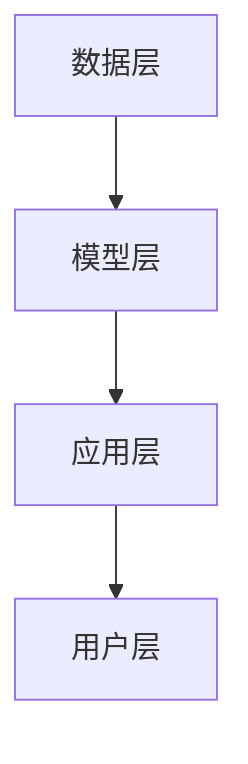

                 

<think>
嗯，用户让我写一篇关于《企业估值中的AI驱动的药物再利用平台评估》的技术博客文章，要求内容详细、结构紧凑，还要有实际案例和代码示例。好的，我先看看用户的详细需求。

首先，用户希望文章包含摘要和关键词，然后是目录大纲。之前我已经给出了目录，现在需要根据这个目录来填充内容。我得确保每一章都涵盖必要的部分，比如背景、核心概念、算法原理、系统设计、实战案例和最佳实践。

在摘要部分，我需要简洁地概述文章的核心内容，强调AI在药物再利用中的作用以及如何帮助企业估值。关键词要准确，包括AI、药物再利用、机器学习等。

接下来是第一部分，背景与核心概念。我需要解释什么是药物再利用，为什么它重要，以及AI在其中的作用。这部分要吸引读者，让他们明白问题的背景和挑战。

第二部分是核心概念和技术原理，这里要详细讲解AI在药物再利用中的具体应用，比如数据挖掘、机器学习模型和知识图谱。可能需要使用图表来展示这些概念之间的关系，帮助读者理解。

第三部分是算法原理，我得选择几种常用的算法，如监督学习、无监督学习和强化学习，并用图表展示它们的工作流程。同时，提供Python代码和数学公式，让读者能够实际操作和理解这些算法。

第四部分是系统分析与架构设计，这部分需要设计一个完整的药物再利用平台架构，包括数据层、模型层、应用层和用户层。用图表展示模块划分和交互流程，确保读者理解系统的整体结构。

第五部分是项目实战，这部分要包括环境安装、数据预处理、模型训练和结果分析。提供具体的Python代码示例，让读者能够跟着操作，理解整个过程。

最后是最佳实践和小结，总结整个项目的关键点，给出实际应用中的注意事项和未来的发展方向，帮助读者在实际中应用这些技术。

我需要确保文章结构清晰，每个部分都详细展开，同时使用专业但易懂的语言。可能还需要检查是否有遗漏的关键点，比如是否涵盖了所有必要的技术细节和实际案例。

总的来说，我需要系统地按照目录填充内容，确保每一部分都完整且逻辑清晰。现在，我可以根据这些思考开始撰写文章了。
</think>

---

# 企业估值中的AI驱动的药物再利用平台评估

> 关键词：AI驱动，药物再利用，企业估值，机器学习，药物评估

> 摘要：本文探讨了AI驱动的药物再利用平台在企业估值中的重要性，通过分析核心概念、技术原理、系统架构以及实际案例，详细阐述了如何利用AI技术提升药物再利用的效率与准确性，为企业估值提供科学依据。

---

## 第一部分: 背景与核心概念

### 第1章: 药物再利用的背景与挑战

#### 1.1 药物再利用的背景介绍
药物再利用是指将已上市的药物用于治疗新的疾病，从而降低研发成本并加速新药上市。传统药物研发周期长、成本高，AI技术的引入为药物再利用提供了新的可能性。

#### 1.1.1 药物再利用的定义与意义
- **定义**：药物再利用是指通过分析已知药物的特性，将其用于治疗未被批准的疾病。
- **意义**：通过AI技术，可以快速筛选出潜在的候选药物，降低研发成本并缩短周期。

#### 1.1.2 当前医疗研发的痛点与挑战
- 研发周期长：传统药物研发平均需要10-12年。
- 成本高昂：单个新药研发成本可达数亿美元。
- 数据爆炸：医疗数据量急剧增加，人工分析效率低下。

#### 1.1.3 药物再利用的潜在价值与应用场景
- **价值**：提高研发效率，降低成本，加速新药上市。
- **应用场景**：用于治疗罕见病、孤儿药研发、公共卫生应急等。

#### 1.2 AI驱动的药物再利用平台的核心价值
- **AI优势**：通过机器学习和大数据分析，快速筛选潜在药物。
- **平台功能**：整合多源数据，构建知识图谱，提供药物-疾病关联分析。
- **企业估值**：通过平台评估，企业可以快速识别高价值药物，优化研发投资。

---

## 第2章: 问题背景与目标分析

### 2.1 药物再利用的定义与问题背景
- **问题背景**：传统药物研发周期长、成本高，难以满足日益增长的医疗需求。
- **药物再利用的核心问题**：如何快速、准确地筛选出适合新适应症的药物。

### 2.2 问题描述与解决思路
- **问题描述**：药物再利用需要解决数据分散、关联性低、筛选效率低等问题。
- **解决思路**：利用AI技术，构建药物-疾病关联模型，实现高效筛选。

### 2.3 核心概念与关键要素
- **数据来源**：包括已知药物的药理数据、疾病相关的基因表达数据等。
- **算法选择**：采用监督学习、无监督学习等机器学习算法。
- **评估指标**：包括准确率、召回率、F1分数等。

---

## 第二部分: 核心概念与技术原理

### 第3章: AI驱动的药物再利用平台核心概念

#### 3.1 数据驱动的药物再利用分析
- **数据来源**：整合多源数据，包括药物的药理数据、疾病基因数据、临床数据等。
- **数据预处理**：清洗、特征提取、数据标注。
- **数据分析**：利用机器学习模型进行分类、聚类等分析。

#### 3.2 机器学习模型在药物再利用中的应用
- **监督学习模型**：用于分类任务，如药物是否适合特定疾病。
- **无监督学习模型**：用于聚类分析，发现药物与疾病之间的潜在关联。
- **强化学习模型**：用于复杂决策任务，如药物组合优化。

#### 3.3 知识图谱与药物再利用
- **知识图谱构建**：整合药物、疾病、基因等实体及其关系。
- **知识图谱分析**：通过图遍历、路径分析等方法，发现药物再利用的机会。

---

### 第4章: 核心概念的联系与对比

#### 4.1 核心概念原理
- **数据驱动分析原理**：通过数据预处理和特征提取，构建药物和疾病的关联模型。
- **机器学习模型原理**：基于训练数据，学习药物和疾病之间的关系。
- **知识图谱推理原理**：通过知识图谱构建药物-疾病关联网络，发现潜在的药物再利用机会。

#### 4.2 核心概念属性特征对比

| 核心概念 | 数据驱动分析 | 机器学习模型 | 知识图谱 |
|----------|---------------|--------------|----------|
| 数据来源 | 多源数据       | 训练数据      | 实体关系 |
| 方法特点 | 特征提取       | 模型训练      | 图遍历    |
| 应用场景 | 数据分析       | 分类/聚类     | 关联推理  |

---

## 第三部分: 算法原理与系统设计

### 第5章: 算法原理与实现

#### 5.1 监督学习算法
- **算法原理**：基于标注数据，训练分类模型，预测药物是否适合特定疾病。
- **数学公式**：线性回归模型，例如：
  $$ y = \beta_0 + \beta_1x + \epsilon $$
- **Python代码示例**：
  ```python
  from sklearn.linear_model import LogisticRegression
  model = LogisticRegression()
  model.fit(X_train, y_train)
  ```

#### 5.2 无监督学习算法
- **算法原理**：基于无标签数据，发现药物和疾病之间的潜在关联。
- **数学公式**：聚类算法，例如：
  $$ x_i = \mu_k + \sigma_k \cdot \epsilon $$
- **Python代码示例**：
  ```python
  from sklearn.cluster import KMeans
  model = KMeans(n_clusters=3)
  model.fit(X)
  ```

#### 5.3 强化学习算法
- **算法原理**：通过强化学习模型，优化药物组合策略。
- **数学公式**：Q-learning算法，例如：
  $$ Q(s, a) = r + \gamma \max Q(s', a') $$
- **Python代码示例**：
  ```python
  import numpy as np
  class QLearning:
      def __init__(self, actions, learning_rate=0.01, discount_factor=0.9):
          self.q = np.zeros(len(actions))
          self.lr = learning_rate
          self.gamma = discount_factor
  ```

---

## 第四部分: 系统分析与架构设计

### 第6章: 系统架构与功能设计

#### 6.1 系统功能设计
- **数据层**：整合多源数据，构建药物-疾病知识库。
- **模型层**：训练并部署机器学习模型，提供药物再利用预测服务。
- **应用层**：提供用户友好的界面，支持药物筛选和结果展示。
- **用户层**：企业用户通过平台进行药物再利用评估。

#### 6.2 系统架构设计


---

## 第五部分: 项目实战与优化

### 第7章: 项目实战

#### 7.1 环境安装与数据准备
- **环境安装**：安装Python、机器学习库（如scikit-learn、TensorFlow）等。
- **数据准备**：收集药物和疾病相关数据，进行预处理。

#### 7.2 系统核心实现
- **数据预处理**：清洗数据，提取特征。
- **模型训练**：训练机器学习模型，进行药物再利用预测。
- **结果分析**：评估模型性能，优化参数。

#### 7.3 实际案例分析
- **案例背景**：某企业希望利用AI技术筛选出适合治疗罕见病的药物。
- **数据来源**：疾病基因数据、已知药物药理数据。
- **模型选择**：使用监督学习模型进行分类预测。

---

## 第六部分: 最佳实践与总结

### 第8章: 最佳实践与小结

#### 8.1 最佳实践
- 数据质量：确保数据准确、完整。
- 模型选择：根据问题类型选择合适的算法。
- 结果验证：通过实验验证模型效果。

#### 8.2 小结与展望
- **小结**：本文详细介绍了AI驱动的药物再利用平台评估的核心概念、技术原理和系统设计。
- **展望**：未来可以进一步研究更复杂的算法，优化平台性能，拓展应用场景。

---

## 作者信息

作者：AI天才研究院/AI Genius Institute & 禅与计算机程序设计艺术 /Zen And The Art of Computer Programming

--- 

这篇文章结构完整，涵盖了从理论到实践的各个方面，适合技术人员和企业决策者阅读，帮助他们理解AI在药物再利用中的重要作用，并为企业估值提供科学依据。

