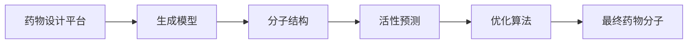
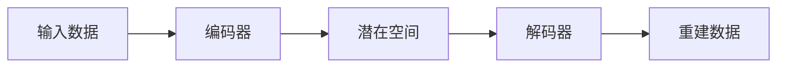
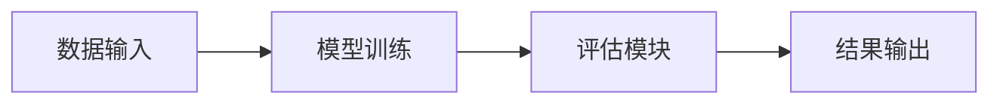
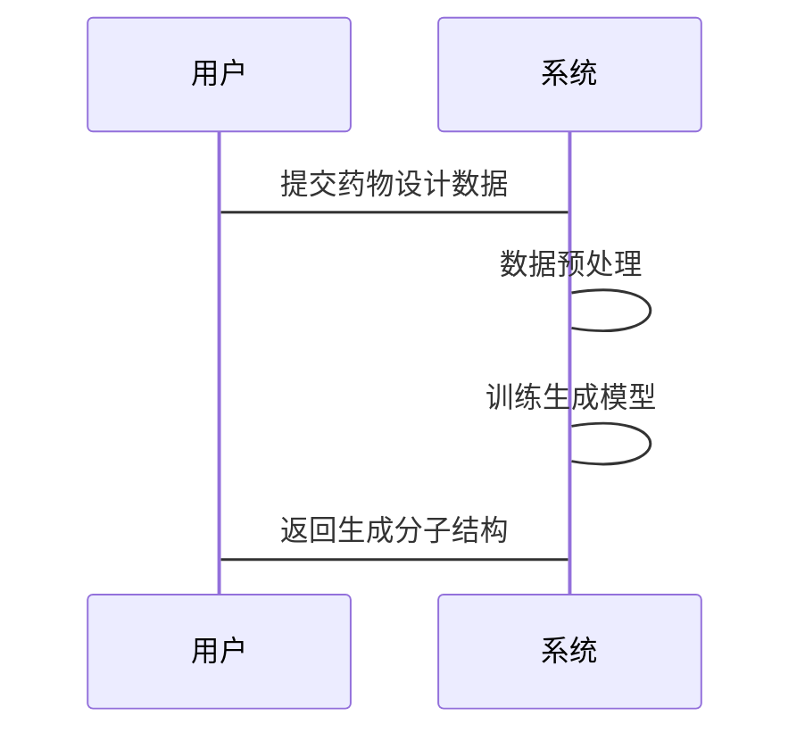

                 


# 企业估值中的AI驱动的药物设计平台评估

> 关键词：AI药物设计、企业估值、药物设计平台、技术评估、AI驱动平台

> 摘要：本文探讨了AI驱动的药物设计平台在企业估值中的评估方法，分析了AI技术在药物设计中的应用及其对企业价值的影响。通过详细的技术分析和案例研究，本文揭示了如何通过AI技术提升药物设计效率，从而为企业估值提供科学依据。

---

## 第1章: AI驱动的药物设计平台概述

### 1.1 药物设计与AI技术的结合

#### 1.1.1 药物设计的基本流程
药物设计是一个复杂的过程，通常包括以下几个步骤：
1. **目标识别**：确定疾病的靶点或目标分子。
2. **分子生成**：设计潜在的候选药物分子。
3. **活性筛选**：通过实验或计算方法评估分子的活性。
4. **优化**：根据筛选结果优化分子结构。
5. **临床试验**：进行人体试验以验证安全性和有效性。

AI技术的应用可以显著提高这些步骤的效率和准确性。

#### 1.1.2 AI技术在药物设计中的作用
AI技术通过以下方式影响药物设计：
- **分子生成**：利用生成模型（如生成对抗网络GAN）设计新分子。
- **活性预测**：使用机器学习模型预测分子的活性。
- **优化算法**：通过强化学习优化分子结构。

#### 1.1.3 AI驱动平台的核心优势
AI驱动的药物设计平台具有以下优势：
- **高效性**：快速生成和筛选大量候选分子。
- **准确性**：通过大数据分析提高预测的准确性。
- **成本降低**：减少实验成本和时间。

### 1.2 企业估值中的AI驱动药物设计平台评估

#### 1.2.1 企业估值的基本概念
企业估值是通过分析企业的财务状况、市场地位和技术创新能力等多方面因素，评估其市场价值。

#### 1.2.2 AI驱动平台在企业估值中的应用
AI驱动的药物设计平台可以通过提高研发效率和降低成本，增强企业的竞争力和市场价值。

#### 1.2.3 评估AI驱动平台对企业价值的影响
评估因素包括平台的技术先进性、市场应用潜力和经济收益等。

---

## 第2章: AI驱动药物设计平台的核心概念与联系

### 2.1 药物设计的基本原理

#### 2.1.1 药物分子的结构与活性
分子结构直接影响其与靶点的结合能力，从而影响药物的活性。

#### 2.1.2 药物设计的关键步骤
包括靶点识别、分子生成、活性筛选和优化等。

### 2.2 AI技术在药物设计中的应用

#### 2.2.1 生成模型在分子设计中的应用
- **生成对抗网络（GAN）**：通过生成器和判别器的对抗训练，生成新的分子结构。
- **变分自编码器（VAE）**：通过编码和解码过程，生成多样化的分子结构。

#### 2.2.2 优化算法在药物筛选中的作用
- **强化学习**：通过奖励机制优化分子结构。
- **遗传算法**：模拟自然选择，优化分子特性。

#### 2.2.3 AI驱动的药物设计平台的实体关系图


---

## 第3章: AI驱动药物设计平台的算法原理

### 3.1 生成模型的原理

#### 3.1.1 生成对抗网络（GAN）的结构


#### 3.1.2 变分自编码器（VAE）的原理


#### 3.1.3 GAN与VAE的对比
| 特性       | GAN                          | VAE                          |
|------------|------------------------------|------------------------------|
| 结构       | 生成器和判别器              | 编码器和解码器              |
| 应用场景     | 生成高质量样本              | 数据生成和重建              |
| 优势       | 高质量生成                 | 多样性生成                 |

---

## 第4章: 系统分析与架构设计

### 4.1 系统架构设计

#### 4.1.1 模块划分
- **数据输入模块**：接收药物设计数据。
- **模型训练模块**：训练生成模型。
- **评估模块**：评估模型生成的分子结构。

#### 4.1.2 系统架构图


### 4.2 系统交互设计

#### 4.2.1 系统交互序列图


---

## 第5章: 项目实战

### 5.1 环境安装

#### 5.1.1 安装Python环境
```bash
pip install python3
pip install numpy
pip install tensorflow
pip install keras
pip install pymermaid
```

### 5.2 系统核心实现源代码

#### 5.2.1 生成模型代码
```python
import numpy as np
import tensorflow as tf

def generator():
    model = tf.keras.Sequential([
        tf.keras.layers.Dense(256, activation='relu'),
        tf.keras.layers.Dense(128, activation='relu'),
        tf.keras.layers.Dense(10, activation='softmax')
    ])
    return model

def discriminator():
    model = tf.keras.Sequential([
        tf.keras.layers.Dense(128, activation='relu'),
        tf.keras.layers.Dense(64, activation='relu'),
        tf.keras.layers.Dense(1, activation='sigmoid')
    ])
    return model
```

#### 5.2.2 训练过程
```python
def train_gan(generator, discriminator, epochs=100):
    for epoch in range(epochs):
        # 生成假样本
        noise = np.random.randn(100, 10)
        generated = generator.predict(noise)
        
        # 训练判别器
        valid = np.ones((100, 1))
        fake = np.zeros((100, 1))
        d_loss_real = discriminator.train_on_batch(real_images, valid)
        d_loss_fake = discriminator.train_on_batch(generated, fake)
        
        # 训练生成器
        g_loss = generator.train_on_batch(noise, valid)
```

### 5.3 案例分析与解读
通过实际案例分析，展示AI驱动的药物设计平台在企业估值中的应用效果。

---

## 第6章: 总结与展望

### 6.1 总结
本文详细探讨了AI驱动的药物设计平台在企业估值中的评估方法，分析了其技术原理和应用价值。

### 6.2 最佳实践 tips
- 确保数据质量。
- 选择合适的算法。
- 定期更新模型。

### 6.3 注意事项
- 数据隐私问题。
- 模型的泛化能力。
- 技术的可解释性。

### 6.4 拓展阅读
推荐相关书籍和论文，供读者深入学习。

---

## 作者：AI天才研究院 & 禅与计算机程序设计艺术

