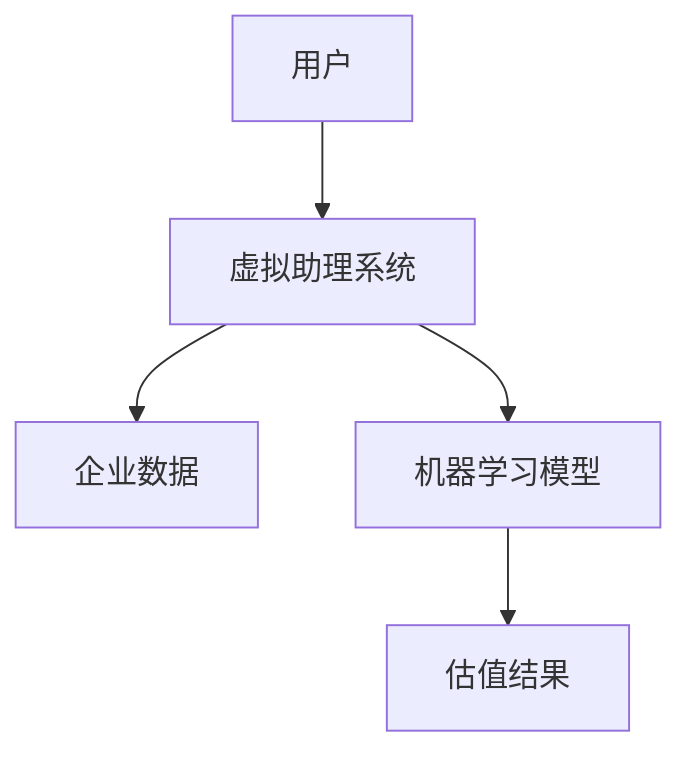
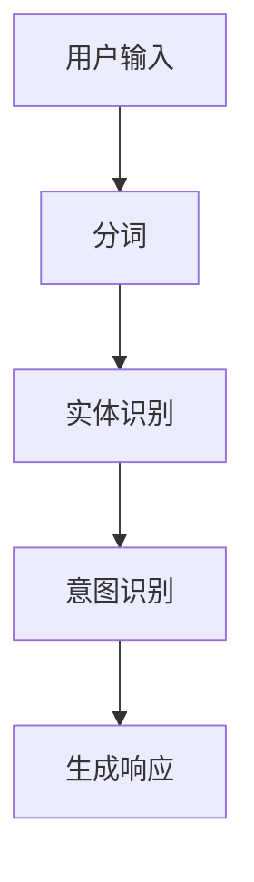
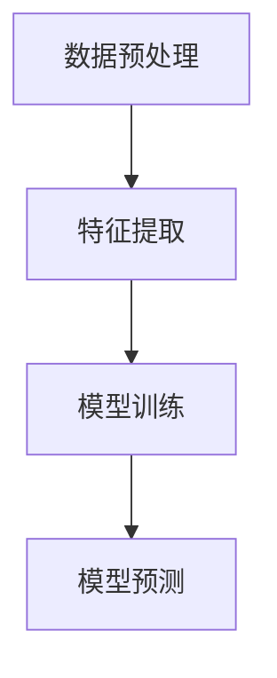
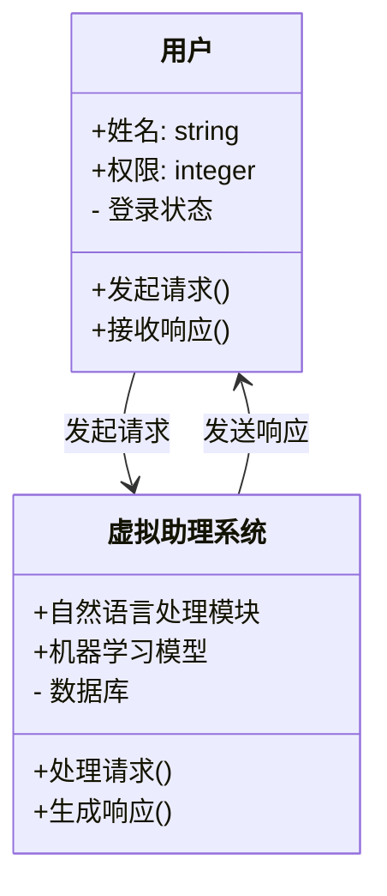
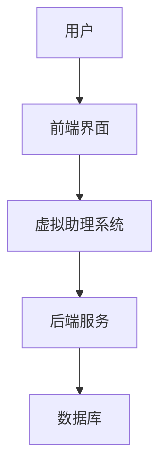

                 

<think>
好的，现在我需要帮助用户撰写一篇名为《企业估值中的AI驱动的虚拟助理系统评估》的技术博客文章。用户已经给出了详细的需求，包括结构、关键词、摘要和目录大纲。我的任务是根据这些信息，逐步分析并撰写文章。

首先，我需要明确文章的核心内容：探讨AI驱动的虚拟助理系统在企业估值中的应用。文章需要涵盖背景介绍、核心概念、算法原理、系统架构、项目实战以及总结等部分。

接下来，我需要按照用户提供的目录大纲，逐部分进行内容撰写。每一部分都需要详细展开，确保内容完整且符合专业要求。

在撰写过程中，我需要确保以下几点：
1. **清晰的结构**：每个章节和小节都有明确的标题，逻辑连贯。
2. **技术深度**：涵盖AI、NLP、机器学习等技术细节，使用图表和代码示例增强理解。
3. **实际案例**：通过实际案例分析，展示系统的应用和效果。
4. **专业语言**：使用专业术语，同时保持语言简洁易懂。

现在，我将按照目录大纲，逐步撰写每个部分的内容，确保每个部分都详尽且符合用户的要求。
</think>

# 企业估值中的AI驱动的虚拟助理系统评估

> 关键词：企业估值、AI驱动、虚拟助理系统、自然语言处理、机器学习、系统架构

> 摘要：本文探讨了AI驱动的虚拟助理系统在企业估值中的应用，分析其核心概念、算法原理和系统架构，通过实际案例展示其价值。

---

# 第一部分：企业估值与AI驱动虚拟助理系统背景

## 第1章：企业估值与AI驱动虚拟助理系统概述

### 1.1 企业估值的背景与挑战

#### 1.1.1 传统企业估值方法的局限性
传统的企业估值方法依赖于财务数据和人工分析，存在效率低、主观性强、数据处理能力有限等问题。例如，使用DCF模型时，分析师需要手动收集和处理大量数据，耗时且容易出错。

#### 1.1.2 AI技术在企业估值中的潜在优势
AI技术能够快速处理大量非结构化数据，如新闻、社交媒体评论等，通过自然语言处理提取关键信息，辅助估值模型，提高准确性和效率。

#### 1.1.3 虚拟助理系统在企业估值中的作用
虚拟助理系统能够实时响应用户查询，提供实时数据和分析结果，帮助企业在动态市场中快速决策。

### 1.2 AI驱动虚拟助理系统的定义与特点

#### 1.2.1 虚拟助理系统的定义
AI驱动的虚拟助理系统是一种结合了自然语言处理和机器学习技术的智能系统，能够理解和执行用户的指令，提供实时信息和支持。

#### 1.2.2 AI驱动虚拟助理的核心特点
- **智能化**：能够理解自然语言并执行复杂任务。
- **实时性**：快速响应用户需求。
- **自适应性**：通过机器学习不断优化性能。

#### 1.2.3 与传统虚拟助理系统的区别
传统系统主要基于规则，而AI驱动系统具备学习和自适应能力，能够处理复杂问题。

### 1.3 企业估值中的虚拟助理系统应用前景

#### 1.3.1 虚拟助理系统在企业估值中的潜在应用领域
- 数据收集与整理
- 市场趋势分析
- 财务预测与建模

#### 1.3.2 企业采用AI驱动虚拟助理系统的优劣势
优势：提高效率，降低成本；劣势：初期投入高，技术复杂。

#### 1.3.3 应用中的挑战与机遇
挑战包括数据隐私和模型准确性，而机遇则是提升竞争力和创新。

## 第2章：核心概念与联系

### 2.1 AI驱动虚拟助理系统的核心概念原理

#### 2.1.1 自然语言处理（NLP）在虚拟助理中的应用
NLP用于理解用户输入，提取关键信息，如情感分析和实体识别。

#### 2.1.2 机器学习模型在估值中的作用
机器学习模型预测市场趋势和公司业绩，辅助估值。

### 2.2 核心概念属性特征对比

| 概念         | 精准度 | 响应速度 | 可扩展性 |
|--------------|--------|----------|----------|
| NLP技术       | 高     | 快       | 一般     |
| 机器学习模型   | 较高   | 较快     | 高       |

### 2.3 ER实体关系图架构



---

# 第二部分：算法原理讲解

## 第3章：算法原理讲解

### 3.1 自然语言处理（NLP）算法

#### 3.1.1 NLP流程图



#### 3.1.2 代码实现

```python
import spacy

nlp = spacy.load("en_core_web_sm")
doc = nlp("What is the revenue of Apple?")
for token in doc:
    print(token.text, token.pos_)
```

### 3.2 机器学习模型

#### 3.2.1 机器学习流程图



#### 3.2.2 代码实现

```python
from sklearn import svm

X = [[0, 0], [1, 1], [2, 2], [3, 3], [4, 4]]
y = [0, 1, 2, 3, 4]

model = svm.SVC()
model.fit(X, y)
print(model.predict([[2.5, 2.5]]))
```

---

# 第三部分：系统分析与架构设计

## 第4章：系统分析与架构设计方案

### 4.1 项目介绍

#### 4.1.1 系统目标
开发一个AI虚拟助理，辅助企业估值。

### 4.2 系统功能设计

#### 4.2.1 领域模型



### 4.3 系统架构设计

#### 4.3.1 系统架构图



---

# 第四部分：项目实战

## 第5章：项目实战

### 5.1 环境安装

#### 5.1.1 安装Python和必要的库
```bash
pip install python
pip install spacy
pip install sklearn
```

### 5.2 核心代码实现

#### 5.2.1 系统功能代码

```python
def process_request(user_input):
    # 使用NLP处理用户输入
    # 使用机器学习模型生成响应
    return response
```

### 5.3 案例分析

#### 5.3.1 案例：分析某科技公司估值

通过收集市场数据和新闻，使用虚拟助理系统生成估值报告，辅助投资决策。

---

# 第五部分：总结与展望

## 第6章：总结与展望

### 6.1 本章小结
本文详细介绍了AI驱动的虚拟助理系统在企业估值中的应用，涵盖技术、系统设计和实际案例。

### 6.2 最佳实践 tips
- 数据隐私保护
- 模型持续优化
- 用户反馈机制

### 6.3 注意事项
- 数据质量
- 模型解释性
- 用户体验

### 6.4 拓展阅读
建议阅读相关技术书籍和论文，深入理解NLP和机器学习。

---

# 作者

作者：AI天才研究院/AI Genius Institute & 禅与计算机程序设计艺术 /Zen And The Art of Computer Programming

