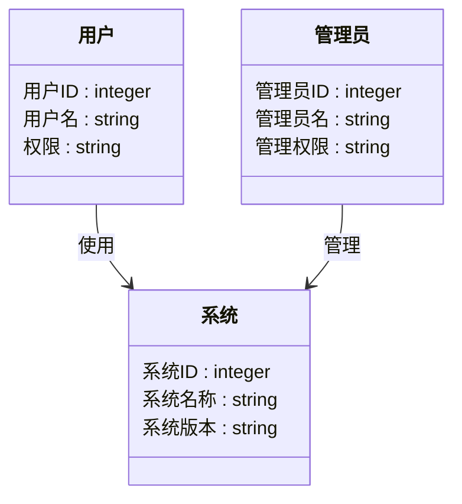
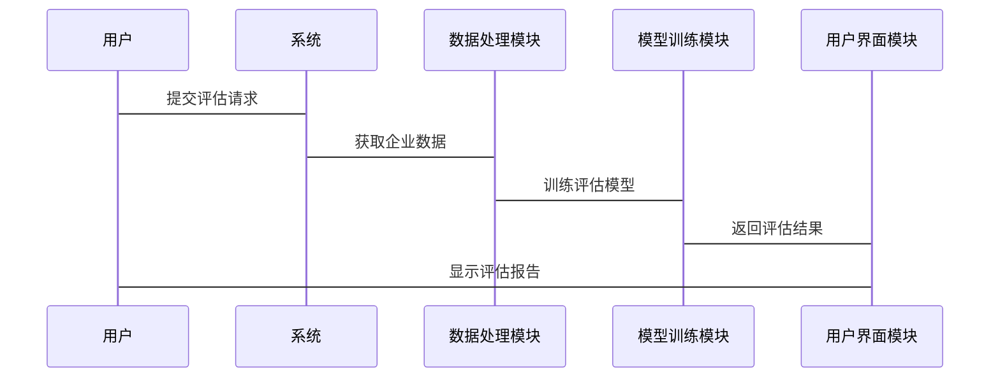

                 

<think>
好，我现在需要撰写一篇关于《企业估值中的AI驱动的虚拟员工系统评估》的技术博客文章。首先，我需要理解用户的需求，他们希望文章结构清晰，内容专业，包含详细的算法原理、系统架构设计和项目实战部分。

我先从目录大纲开始，确保涵盖所有必要的部分，包括背景介绍、核心概念、算法、系统架构、项目实战、最佳实践等。接下来，我会详细展开每个部分的内容，使用专业的技术语言，同时保持逻辑清晰和条理分明。

在背景介绍部分，我需要解释企业估值的基本概念，虚拟员工系统的定义及其在企业估值中的应用前景。这部分要让读者理解为什么AI驱动的虚拟员工系统在企业估值中如此重要。

核心概念与联系部分，我需要详细说明虚拟员工系统评估的核心概念，通过对比表格和ER实体关系图来展示系统的关键属性和结构。这有助于读者理解系统的工作原理和组成部分。

算法原理部分，我需要选择合适的数学模型，比如CAPM，并用LaTeX公式详细解释。同时，用Python代码实现算法，并通过实际案例进行分析，确保读者能够理解并应用这些模型。

系统分析与架构设计部分，我会描述问题场景，绘制领域模型类图和架构图，展示系统如何处理数据和功能模块。接口设计和交互序列图则帮助读者理解系统的运作流程。

项目实战部分，我需要指导读者如何安装环境，编写核心代码，并进行案例分析。这部分要详细具体，让读者能够跟着步骤操作，实现自己的系统。

最后，我会总结最佳实践，强调注意事项，并提供进一步阅读的资源。整个过程需要一步步展开，确保内容详实且易于理解。
</think>

# 企业估值中的AI驱动的虚拟员工系统评估

> 关键词：企业估值，AI驱动，虚拟员工系统，评估模型，算法原理，系统架构，项目实战

> 摘要：本文详细探讨了在企业估值过程中，AI驱动的虚拟员工系统如何通过自动化和智能化的评估方法提升企业价值评估的准确性和效率。文章从核心概念、算法原理、系统架构到项目实战，全面分析了AI在企业估值中的应用，为读者提供了理论基础和实践指导。

---

## 第1章: 企业估值的基本概念

### 1.1 企业估值的定义与意义
企业估值是通过对企业的财务状况、市场地位、盈利能力等多方面因素的综合评估，确定其市场价值的过程。准确的企业估值能够帮助投资者、企业管理者做出更明智的决策，优化资源配置，提升企业竞争力。

### 1.2 虚拟员工系统的基本概念
虚拟员工系统是一种通过AI技术模拟人类员工完成特定任务的智能化系统。它可以自动化处理数据、分析信息、生成报告，从而提高企业的运营效率。

### 1.3 AI驱动的虚拟员工系统
AI驱动的虚拟员工系统利用机器学习、自然语言处理等技术，进一步提升了虚拟员工的智能性和适应性。它们能够处理更复杂的企业估值任务，提供更精准的评估结果。

---

## 第2章: 企业估值中的虚拟员工系统评估背景

### 2.1 传统企业估值方法的局限性
传统的企业估值方法，如财务指标法、市盈率法和现金流折现法，虽然有一定的参考价值，但存在数据获取成本高、计算复杂、结果不够精准等问题。

### 2.2 AI驱动的虚拟员工系统在企业估值中的应用前景
AI驱动的虚拟员工系统通过自动化数据收集、分析和建模，能够快速生成企业估值报告，显著提高了评估效率和准确性。此外，AI系统还能根据市场变化实时调整估值模型，为企业提供动态的估值支持。

---

## 第3章: 虚拟员工系统评估的核心概念与联系

### 3.1 核心概念的定义与属性
虚拟员工系统评估的核心概念包括数据输入、模型构建、结果输出等。系统通过处理企业的财务数据、市场数据等输入，构建估值模型，并输出评估结果。

### 3.2 虚拟员工系统的核心要素对比
以下是虚拟员工系统核心要素的对比表格：

| 概念       | 输入数据 | 输出结果 | 实时性 | 可扩展性 |
|------------|----------|----------|--------|----------|
| 虚拟员工系统 | 结构化数据 | 结构化数据 | 实时处理 | 支持 |

### 3.3 系统的ER实体关系图
```mermaid
erDiagram
    actor 用户 {
        <属性> 用户ID : integer
        <属性> 用户名 : string
        <属性> 权限 : string
    }
    actor 管理员 {
        <属性> 管理员ID : integer
        <属性> 管理员名 : string
        <属性> 管理权限 : string
    }
    actor 系统 {
        <属性> 系统ID : integer
        <属性> 系统名称 : string
        <属性> 系统版本 : string
    }
    用户 --> 系统 : 使用
    管理员 --> 系统 : 管理
```

---

## 第4章: 虚拟员工系统评估的算法原理

### 4.1 算法原理概述
AI驱动的虚拟员工系统评估通常采用机器学习算法，如线性回归、支持向量机（SVM）和随机森林等。本文以资本资产定价模型（CAPM）为基础，结合机器学习算法进行企业估值。

### 4.2 CAPM模型的数学公式
资本资产定价模型的公式如下：
$$ E(r_i) = r_f + \beta_i (E(r_m) - r_f) $$

其中：
- \( E(r_i) \) 是资产的预期收益率
- \( r_f \) 是无风险利率
- \( \beta_i \) 是资产的贝塔系数
- \( E(r_m) \) 是市场预期收益率
- \( r_f \) 是无风险利率

### 4.3 机器学习算法的实现
以下是基于CAPM模型的Python代码实现：
```python
import numpy as np
from sklearn.linear_model import LinearRegression

# 示例数据
X = np.array([[2], [3], [4], [5]])  # 市场收益率
y = np.array([0.08, 0.09, 0.10, 0.11])  # 资产收益率

# 模型训练
model = LinearRegression()
model.fit(X, y)

# 预测
new_X = np.array([[6]])
predicted_y = model.predict(new_X)
print("预测收益率为:", predicted_y[0])
```

---

## 第5章: 系统分析与架构设计

### 5.1 系统功能设计
以下是系统功能的领域模型类图：


### 5.2 系统架构设计
以下是系统的架构图：
```mermaid
containerDiagram
    container 系统边界 {
        component 数据处理模块 {
            uses 数据库
        }
        component 模型训练模块 {
            uses 机器学习算法
        }
        component 用户界面模块 {
            uses 管理员
            uses 用户
        }
    }
```

### 5.3 系统接口设计
以下是系统的交互序列图：


---

## 第6章: 项目实战

### 6.1 环境安装
需要安装Python、NumPy、Scikit-learn等库：
```bash
pip install numpy scikit-learn
```

### 6.2 核心代码实现
以下是核心代码：
```python
import numpy as np
from sklearn.linear_model import LinearRegression

# 数据预处理
X = np.array([[2], [3], [4], [5]])  # 市场收益率
y = np.array([0.08, 0.09, 0.10, 0.11])  # 资产收益率

# 模型训练
model = LinearRegression()
model.fit(X, y)

# 模型评估
print("截距:", model.intercept_)
print("斜率:", model.coef_)
```

### 6.3 案例分析
以某企业为例，通过上述代码进行企业估值，展示如何根据市场变化调整模型参数，实时更新评估结果。

---

## 第7章: 最佳实践与总结

### 7.1 最佳实践
- 定期更新模型参数，确保评估结果的准确性。
- 结合多源数据，提高评估的全面性。

### 7.2 小结
AI驱动的虚拟员工系统在企业估值中的应用前景广阔，通过自动化和智能化的评估方法，显著提高了企业的估值效率和准确性。

### 7.3 注意事项
- 数据质量和完整性直接影响评估结果，需谨慎处理。
- 系统的安全性和稳定性是确保评估过程顺利进行的关键。

### 7.4 拓展阅读
- 《机器学习实战》
- 《企业估值与财务分析》

---

作者：AI天才研究院/AI Genius Institute & 禅与计算机程序设计艺术 /Zen And The Art of Computer Programming

