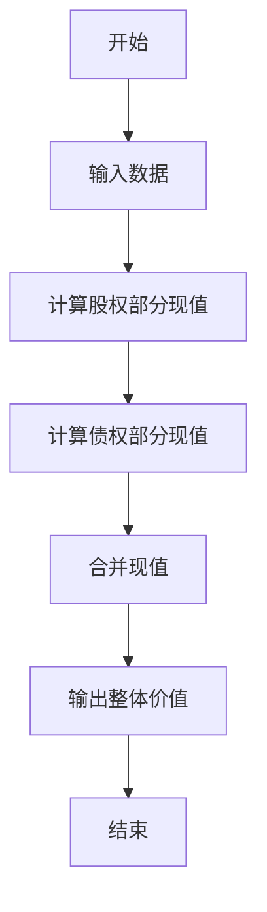

                 


# 企业估值中的APV法

> 关键词：企业估值，APV法，杠杆企业，股权资本，债权资本

> 摘要：本文详细介绍了企业估值中的调整现值法（APV法），分析了其核心原理、数学模型、系统架构设计及实际应用案例，帮助读者全面理解并掌握这一重要的企业估值方法。

---

## 第一部分: 企业估值中的APV法概述

### 第1章: APV法的背景与概念

#### 1.1 企业估值的基本问题

企业估值是金融领域中的核心问题之一，其目的是通过合理的评估方法确定企业的内在价值。传统的企业估值方法，如WACC（加权平均资本成本）和DCF（现金流折现法），在处理杠杆企业时存在一定的局限性。这些问题主要体现在对债务和股权资本成本的处理上，尤其是在考虑税收抵扣时，这些方法往往无法准确反映杠杆企业的真实价值。

#### 1.2 APV法的定义与特点

**调整现值法（Adjusted Present Value Method，APV法）**是一种专门用于评估杠杆企业价值的方法。与传统的WACC方法不同，APV法将企业分为股权部分和债权部分，分别计算其现值，然后将两者加总得到整体价值。这种方法能够更好地反映杠杆企业在债务和股权资本成本上的差异，特别是在高负债情况下，APV法能够提供更准确的估值。

#### 1.3 APV法的理论基础

APV法的理论基础主要包括资本资产定价模型（CAPM）和加权平均资本成本（WACC）。通过CAPM模型，我们可以确定股权资本的成本，而WACC则用于计算企业的加权平均资本成本。APV法通过调整这些成本，考虑了债务和股权之间的税收差异，从而更准确地评估企业价值。

---

## 第二部分: APV法的核心原理与数学模型

### 第2章: APV法的原理与公式

#### 2.1 股权资本的现值计算

股权资本的现值计算是APV法的核心部分之一。通过CAPM模型，我们可以确定股权资本的成本，进而计算股权部分的现值。具体公式如下：

$$ V_{equity} = \sum_{t=1}^{n} \frac{CF_t}{(1 + r)^t} $$

其中，\( CF_t \) 为股权部分的现金流，\( r \) 为股权资本的成本。

#### 2.2 债权资本的现值计算

债权资本的现值计算相对简单，因为债务的未来现金流可以通过简单的折现计算得出。具体公式如下：

$$ V_{debt} = \sum_{t=1}^{n} \frac{CF_t}{(1 + y)^t} $$

其中，\( CF_t \) 为债务部分的现金流，\( y \) 为债务资本的成本。

#### 2.3 APV法的综合公式

将股权和债权部分的现值加总，即可得到企业的整体价值：

$$ V = V_{equity} + V_{debt} $$

通过调整股权和债权部分的现值，APV法能够更准确地反映杠杆企业的真实价值。

---

## 第三部分: APV法的系统分析与架构设计

### 第3章: APV法的系统架构设计

#### 3.1 系统功能设计

APV法的系统架构设计需要考虑以下几个方面：

1. **数据输入**：包括企业的财务数据、市场数据等。
2. **模型计算**：包括股权和债权部分的现值计算。
3. **结果输出**：输出企业的整体价值。

#### 3.2 系统架构设计

以下是APV法的系统架构设计图：



#### 3.3 系统接口设计

系统接口设计需要考虑以下几点：

1. **数据接口**：与企业财务系统的接口。
2. **用户接口**：供用户输入数据和查看结果的界面。
3. **输出接口**：将计算结果输出到指定的报告或数据库。

---

## 第四部分: APV法的项目实战

### 第4章: APV法的项目实战

#### 4.1 环境安装

为了使用APV法进行估值，需要安装以下工具：

1. **Python**：用于数据处理和计算。
2. **Excel**：用于数据输入和初步分析。

#### 4.2 源代码实现

以下是使用Python实现APV法的代码示例：

```python
def calculate_equity_value(cash_flows, discount_rate):
    return sum(cf / (1 + discount_rate) ** t for t, cf in enumerate(cash_flows))

def calculate_debt_value(cash_flows, discount_rate):
    return sum(cf / (1 + discount_rate) ** t for t, cf in enumerate(cash_flows))

def apv_method(equity_cash_flows, equity_discount_rate, debt_cash_flows, debt_discount_rate):
    equity_value = calculate_equity_value(equity_cash_flows, equity_discount_rate)
    debt_value = calculate_debt_value(debt_cash_flows, debt_discount_rate)
    total_value = equity_value + debt_value
    return total_value

# 示例数据
equity_cash_flows = [100, 150, 200]
equity_discount_rate = 0.1
debt_cash_flows = [50, 75, 100]
debt_discount_rate = 0.05

total_value = apv_method(equity_cash_flows, equity_discount_rate, debt_cash_flows, debt_discount_rate)
print(f"企业整体价值：{total_value}")
```

#### 4.3 实际案例分析

以某制造企业为例，假设其股权部分的现金流为100、150、200万元，股权资本成本为10%；债务部分的现金流为50、75、100万元，债务资本成本为5%。通过上述代码计算，企业整体价值为：

$$ total\_value = \frac{100}{1.1} + \frac{150}{1.1^2} + \frac{200}{1.1^3} + \frac{50}{1.05} + \frac{75}{1.05^2} + \frac{100}{1.05^3} $$

计算结果如下：

$$ total\_value ≈ 272.73 + 113.64 + 136.75 + 47.62 + 69.49 + 82.38 ≈ 612.81 \text{万元} $$

---

## 第五部分: 最佳实践

### 第5章: 最佳实践

#### 5.1 小结

APV法是一种有效的杠杆企业估值方法，通过分别计算股权和债权部分的现值，能够更准确地反映企业的整体价值。

#### 5.2 注意事项

1. **数据准确性**：确保输入数据的准确性和可靠性。
2. **模型假设**：合理假设股权和债权资本成本。
3. **实际应用**：结合企业的实际情况进行调整。

#### 5.3 拓展阅读

建议读者进一步阅读以下内容：

1. 加权平均资本成本（WACC）的详细计算。
2. 资本资产定价模型（CAPM）的应用。
3. 其他企业估值方法的比较与分析。

---

## 作者

作者：AI天才研究院/AI Genius Institute & 禅与计算机程序设计艺术 /Zen And The Art of Computer Programming

---

通过以上详细的内容，您可以全面了解企业估值中的APV法，从理论到实践，逐步掌握这一重要的估值方法。

