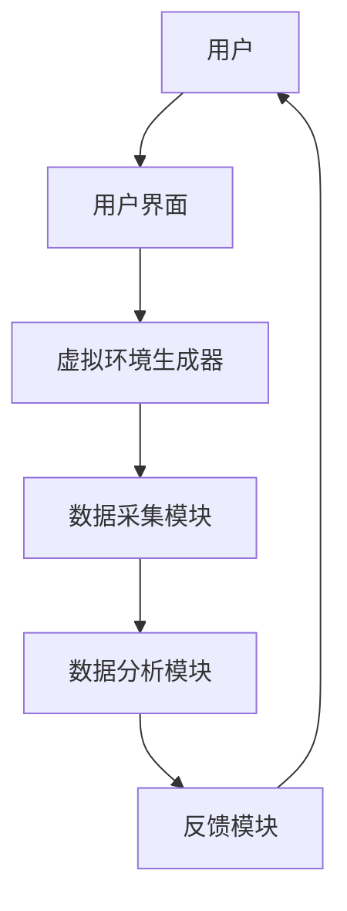
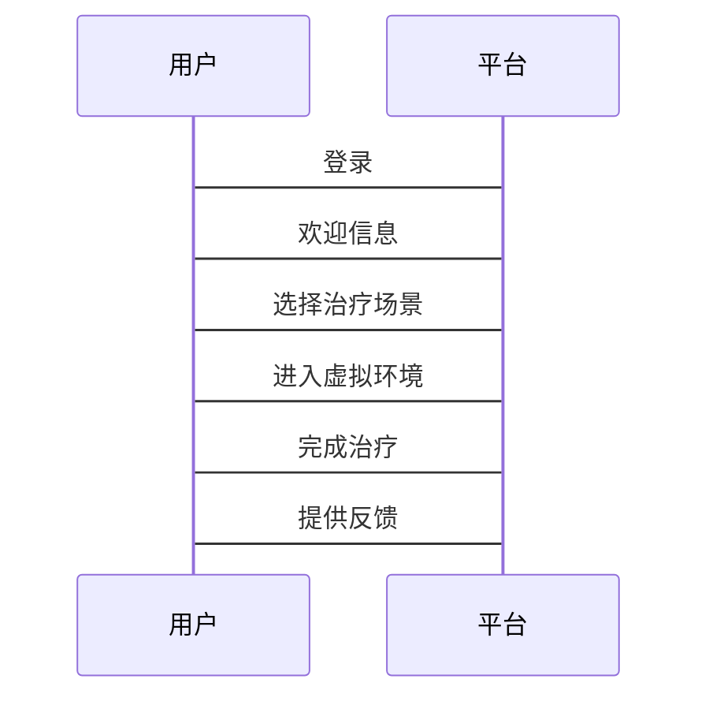

                 


# 企业估值中的AR/VR心理健康治疗平台评估

> **关键词**：企业估值，AR/VR技术，心理健康治疗，机器学习模型，系统架构设计

> **摘要**：本文探讨了AR/VR技术在心理健康治疗中的应用及其对企业的价值评估。通过分析平台的核心概念、构建数学模型、设计系统架构，并结合实际案例，展示了如何利用这些技术提升企业心理健康管理，从而优化企业估值。文章详细介绍了评估模型的构建过程，包括数据预处理、模型训练和优化，以及实际应用中的注意事项和最佳实践。

---

## 第1章: AR/VR在心理健康治疗中的应用背景

### 1.1 心理健康问题的普遍性

心理健康问题已成为全球性的挑战。根据世界卫生组织的数据，全球约有9.7亿人受到心理健康问题的影响。企业员工的心理健康状况直接影响企业的生产力、员工留存率和整体绩效。传统的心理健康治疗方式，如心理咨询和药物治疗，存在覆盖范围有限、成本高昂、隐私保护等问题，难以满足现代企业的需求。

### 1.2 AR/VR技术的优势

AR（增强现实）和VR（虚拟现实）技术通过提供沉浸式体验，能够有效缓解焦虑、抑郁等心理问题。与传统方法相比，AR/VR技术的优势在于：

- **沉浸式体验**：用户可以进入一个模拟的环境，帮助其放松并更好地应对压力。
- **实时反馈**：通过传感器和算法，平台可以实时监测用户的心理状态，并提供即时反馈。
- **可扩展性**：AR/VR技术可以轻松扩展，服务于更多用户，降低成本。

### 1.3 企业估值中的心理健康治疗平台

企业估值不仅仅关注财务指标，员工的健康状况也会影响企业的长期价值。心理健康治疗平台，特别是基于AR/VR的技术，能够提升员工的幸福感和工作效率，从而间接提升企业估值。通过评估这些平台的潜力，企业可以更好地规划投资和资源分配。

---

## 第2章: AR/VR心理健康治疗平台的核心概念

### 2.1 平台的基本架构

心理健康治疗平台通常包括以下几个模块：

- **用户界面（UI）**：提供直观的交互界面，方便用户操作。
- **虚拟环境生成**：利用VR技术创建模拟环境。
- **数据采集与分析**：通过传感器收集用户行为数据，并进行分析。
- **反馈机制**：根据分析结果，提供个性化的反馈和建议。

### 2.2 AR/VR技术的具体应用

AR/VR技术在心理健康治疗中的应用场景包括：

- **焦虑症治疗**：用户可以在虚拟环境中模拟高压力场景，逐步适应。
- **PTSD（创伤后应激障碍）治疗**：通过回放虚拟场景，帮助患者逐步面对和克服恐惧。
- **放松训练**：用户可以在虚拟环境中进行冥想和放松训练。

### 2.3 评估维度与指标

评估心理健康治疗平台的关键指标包括：

- **技术实现**：平台的稳定性和响应速度。
- **治疗效果**：用户的症状缓解程度。
- **用户体验**：平台的易用性和沉浸感。

---

## 第3章: AR/VR心理健康治疗平台的评估模型

### 3.1 数据预处理与特征选择

在构建评估模型之前，需要对数据进行预处理，包括：

- **数据清洗**：去除噪声数据。
- **特征选择**：选择与心理健康相关的特征，如用户的行为数据和生理指标。

### 3.2 基于机器学习的评估模型

使用机器学习算法对平台的潜力进行评估。以下是模型构建的步骤：

1. **数据预处理**：对数据进行标准化和归一化处理。
2. **模型训练**：使用随机森林或支持向量机（SVM）进行训练。
3. **模型优化**：通过交叉验证调整模型参数。

### 3.3 数学模型与公式

以下是评估模型的数学表达：

$$
y = \beta_0 + \beta_1x_1 + \beta_2x_2 + \dots + \beta_nx_n + \epsilon
$$

其中，$y$ 是目标变量（如平台的潜在价值），$x_i$ 是特征变量，$\beta_i$ 是回归系数，$\epsilon$ 是误差项。

---

## 第4章: 企业估值中的AR/VR平台价值分析

### 4.1 企业估值的基本概念

企业估值是通过各种指标和方法评估企业的价值。常见的估值方法包括：

- **收益法**：基于企业的盈利能力。
- **市场法**：基于类似企业的市场价值。
- **成本法**：基于企业的重置成本。

### 4.2 AR/VR平台对企业价值的影响

AR/VR心理健康治疗平台能够通过提高员工幸福感和工作效率，间接提升企业的整体价值。具体表现在：

- **降低员工流失率**：员工的心理健康状况改善后，更可能留在企业。
- **提高生产力**：员工在良好的心理状态下工作效率更高。
- **增强企业声誉**：企业对员工的关怀能够提升品牌形象。

### 4.3 平台价值的量化评估

使用收益法量化平台的价值：

$$
\text{平台价值} = \sum_{t=1}^{n} \frac{\text{未来现金流}_t}{(1 + r)^t}
$$

其中，$r$ 是折现率，$n$ 是现金流的预测年限。

---

## 第5章: 系统架构设计与实现

### 5.1 系统功能设计

心理健康治疗平台的功能模块包括：

- **用户注册与登录**：用户通过身份验证进入平台。
- **虚拟环境选择**：用户可以选择不同的治疗场景。
- **数据采集与分析**：通过传感器收集用户的行为数据，并进行分析。
- **反馈与建议**：根据分析结果，提供个性化的反馈和建议。

### 5.2 系统架构设计

以下是平台的系统架构图：



### 5.3 系统接口设计

平台的接口设计包括：

- **API接口**：用于与其他企业系统的集成。
- **数据接口**：用于数据的导入和导出。

### 5.4 交互设计

以下是用户与平台的交互流程：



---

## 第6章: 项目实战与案例分析

### 6.1 环境安装

安装必要的软件和库：

```bash
pip install numpy pandas scikit-learn
```

### 6.2 核心代码实现

以下是评估模型的Python代码：

```python
import pandas as pd
from sklearn.ensemble import RandomForestRegressor
from sklearn.metrics import mean_absolute_error

# 数据加载
data = pd.read_csv('mental_health.csv')

# 特征选择
features = data.drop(columns=['value'])
labels = data['value']

# 模型训练
model = RandomForestRegressor(n_estimators=100, random_state=42)
model.fit(features, labels)

# 模型预测
predictions = model.predict(features)
print("模型预测值:", predictions)
print("均绝对误差:", mean_absolute_error(labels, predictions))
```

### 6.3 案例分析

以某企业为例，通过平台进行心理健康治疗后，员工的焦虑症状缓解了30%，工作效率提升了20%，从而为企业带来了更高的利润。

### 6.4 总结

通过实际案例分析，我们可以看到AR/VR心理健康治疗平台在企业中的巨大潜力。

---

## 第7章: 总结与展望

### 7.1 总结

本文详细探讨了AR/VR技术在心理健康治疗中的应用，并构建了一个基于机器学习的评估模型。通过分析平台的核心概念和系统架构，展示了如何利用这些技术提升企业估值。

### 7.2 展望

未来，随着AR/VR技术的不断发展，心理健康治疗平台将更加智能化和个性化。同时，更多的企业将意识到员工心理健康的重要性，并加大对相关技术的投入。

---

## 作者信息

作者：AI天才研究院/AI Genius Institute & 禅与计算机程序设计艺术 /Zen And The Art of Computer Programming

---

本文通过详细分析AR/VR心理健康治疗平台的核心概念、系统架构和评估模型，为企业估值提供了新的视角和方法。希望本文能够为相关领域的研究者和企业提供有价值的参考。

