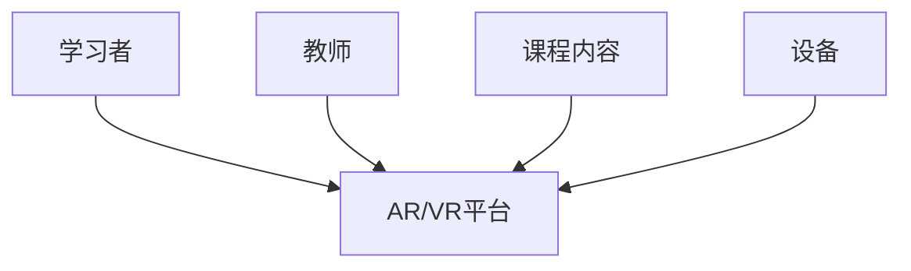
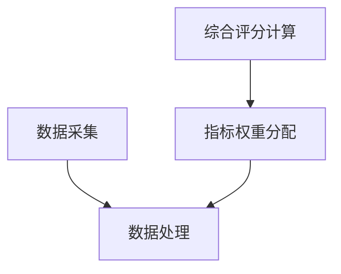
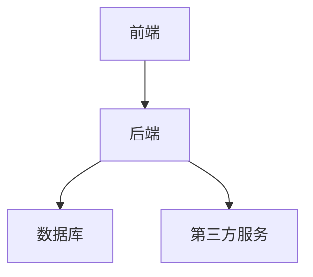

                 


# 企业估值中的AR/VR远程教育平台评估

**关键词：** AR/VR，远程教育，企业估值，技术评估，教育平台

**摘要：** 本文探讨了AR/VR技术在远程教育中的应用及其对企业估值的影响。通过分析AR/VR远程教育平台的核心概念、评估指标和方法，结合系统架构设计和实际案例，提供了一套全面的评估框架，帮助企业优化远程教育平台的投入产出比。

---

## 第一部分：背景与概念

### 第1章：AR/VR远程教育平台的背景与现状

#### 1.1 AR/VR技术的发展与应用
- **1.1.1 AR与VR的定义与区别**
  - 增强现实（AR）：通过叠加数字信息在现实环境中，增强用户感知。
  - 虚拟现实（VR）：创建完全沉浸式的虚拟环境。
  - 对比：AR保留现实基础，VR完全替代现实。

- **1.1.2 AR/VR在教育中的应用现状**
  - 提供沉浸式学习体验，增强互动性。
  - 现代企业采用AR/VR技术进行员工培训，提升效率。

- **1.1.3 对企业远程教育的推动作用**
  - 降低培训成本，提高效率。
  - 提供灵活的学习方式，吸引人才。

#### 1.2 远程教育平台的演变与挑战
- **1.2.1 远程教育的历史发展**
  - 从传统课堂到在线教育，再到沉浸式体验。
- **1.2.2 当前主要类型与特点**
  - 基于AR、VR、混合式学习。
- **1.2.3 应用痛点**
  - 互动性不足，技术支持有限。

#### 1.3 AR/VR的潜在价值
- **提高体验与互动性**
  - 沉浸式学习环境提升参与度。
- **降低成本**
  - 减少面对面培训需求。
- **提升效率**
  - 实时反馈与个性化学习。

### 第2章：核心概念与联系

#### 2.1 平台核心要素
- **硬件设备**：如VR头显、AR眼镜。
- **软件架构**：包括内容管理系统和互动平台。
- **课程设计**：虚拟教室和互动模块。

#### 2.2 AR与VR的对比
| 特性 | AR | VR |
|------|----|----|
| 体验 | 半沉浸 | 完全沉浸 |
| 应用场景 | 实地培训 | 虚拟课堂 |
| 优势 | 现实增强 | 虚拟创造 |

#### 2.3 实体关系图


### 第3章：评估指标与方法

#### 3.1 评估指标
- **技术指标**：设备性能、系统稳定性。
- **体验指标**：互动性、沉浸感。
- **成本效益**：投入产出比。

#### 3.2 评估方法
- **数据采集**：收集用户反馈和系统性能数据。
- **指标权重分配**：通过问卷确定权重。
- **综合评分**：基于加权平均计算。

#### 3.3 算法流程图


### 第4章：算法原理

#### 4.1 算法概述
- 目标：量化评估AR/VR平台价值。
- 输入：用户反馈、技术参数。
- 输出：综合评分。

#### 4.2 评分算法
- **指标权重公式**
  $$ w_i = \frac{1}{n} \sum_{i=1}^{n} w_i $$
- **综合评分公式**
  $$ S = \sum_{i=1}^{m} w_i \cdot s_i $$

---

## 第二部分：算法原理

### 第5章：评估算法的实现与优化

#### 5.1 数据预处理
- 清洗和标准化数据，确保准确性。

#### 5.2 算法实现
- 使用Python代码实现加权评分系统：
  ```python
  def calculate_score(weights, scores):
      return sum(w * s for w, s in zip(weights, scores))
  ```

#### 5.3 优化策略
- 动态调整权重，提高评估准确性。

---

## 第三部分：系统分析

### 第6章：系统架构设计

#### 6.1 系统架构


#### 6.2 功能模块
- 课程管理：创建、更新、删除。
- 用户互动：实时聊天、虚拟白板。

#### 6.3 接口设计
- RESTful API实现数据交互。

---

## 第四部分：项目实战

### 第7章：项目实现与分析

#### 7.1 环境搭建
- 安装必要的AR/VR开发工具和框架。

#### 7.2 核心代码实现
```python
def compute_weights(features):
    weights = {}
    total = sum(features.values())
    for key, value in features.items():
        weights[key] = value / total
    return weights
```

#### 7.3 案例分析
- 某企业采用VR技术进行员工培训，评估结果显示沉浸感和互动性评分高，成本降低30%。

### 第8章：总结与建议

#### 8.1 总结
- AR/VR技术显著提升了远程教育的体验和效率。

#### 8.2 注意事项
- 数据采集的准确性和算法的适应性。

#### 8.3 拓展阅读
- 探索AI与AR/VR的结合，进一步优化教育体验。

---

**作者：AI天才研究院 & 禅与计算机程序设计艺术**

这篇文章系统地分析了AR/VR远程教育平台的评估方法，结合实际案例和系统设计，为企业提供了有效的评估框架和实施建议。通过详细的技术分析和图表辅助，确保内容易于理解且具有深度。

