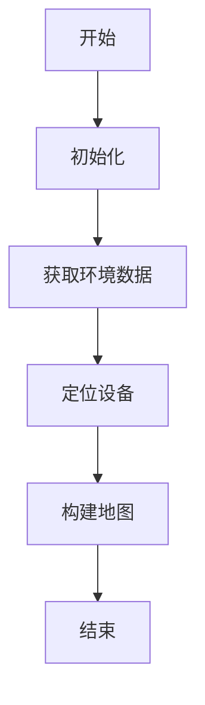
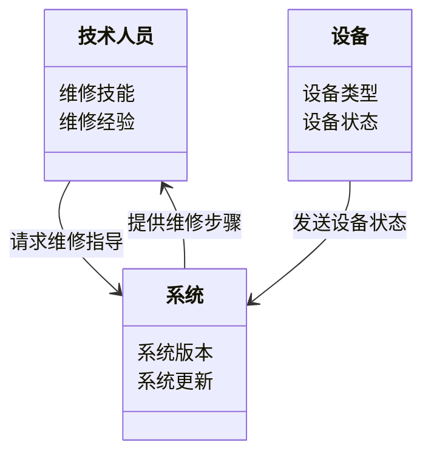
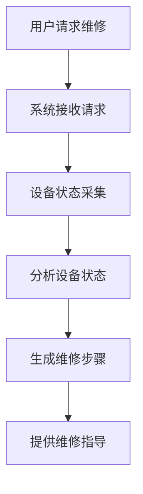

                 


# 企业估值中的AR工业维修指导系统评估

---

## 关键词：企业估值, AR技术, 工业维修, 系统评估, 增强现实

---

## 摘要

本文将深入探讨AR（增强现实）技术在工业维修指导系统中的应用，分析其对企业估值的影响。通过系统化的评估方法，本文揭示了AR技术如何优化工业维修流程，从而为企业创造更大的价值。文章从技术原理、系统架构到实际案例，全面解析了AR工业维修指导系统的潜力和实现路径。

---

# 第一部分: 背景与核心概念

## 第1章: AR工业维修指导系统概述

### 1.1 问题背景与描述

#### 1.1.1 工业维修的传统模式与挑战

工业维修是企业运营中的核心环节，传统维修模式依赖人工经验，存在以下问题：

- **效率低下**：维修人员需要翻阅大量手册，导致维修时间长。
- **成本高昂**：专业人员的高技能要求增加了企业的人力成本。
- **安全隐患**：复杂的维修操作可能引发安全事故。

#### 1.1.2 AR技术在工业维修中的应用潜力

AR技术通过将虚拟信息叠加到物理环境中，为工业维修提供了新的解决方案：

- **实时指导**：AR设备可以实时显示维修步骤，减少人为错误。
- **远程协作**：专家可以通过AR技术远程指导现场人员，节省时间和成本。
- **数据可视化**：AR可以将设备内部结构可视化，帮助维修人员快速理解问题。

#### 1.1.3 企业估值与工业维修效率的关系

工业维修效率直接影响企业的运营成本和生产效率，进而影响企业估值。高效的维修系统可以减少停机时间，降低维护成本，从而提升企业整体价值。

---

### 1.2 AR工业维修系统的概念与结构

#### 1.2.1 AR技术的核心原理

AR技术通过摄像头捕捉物理环境，结合计算机视觉算法，将虚拟信息叠加到真实场景中。关键步骤包括：

1. **环境捕捉**：使用摄像头获取物理环境数据。
2. **目标检测**：识别环境中需要维修的设备或部件。
3. **信息叠加**：将维修指导信息（如步骤、零件信息）叠加到目标上。
4. **用户交互**：支持用户通过手势或语音进行操作。

#### 1.2.2 工业维修指导系统的组成要素

- **硬件设备**：如AR眼镜、手持设备等。
- **软件系统**：包括AR引擎、维修数据库、用户界面等。
- **数据接口**：与企业管理系统（如ERP、CRM）集成。

#### 1.2.3 AR与工业维修的结合方式

AR技术可以通过以下方式与工业维修结合：

- **实时可视化**：显示设备内部结构和维修步骤。
- **远程协作**：专家通过AR技术远程指导维修人员。
- **数据驱动**：利用物联网数据优化维修建议。

---

### 1.3 系统评估与企业估值的关联

#### 1.3.1 维修效率对企业估值的影响

高效的维修系统可以显著降低企业的运营成本，减少设备停机时间，从而提升企业的盈利能力和市场竞争力。

#### 1.3.2 AR系统如何优化维修流程

AR系统通过提供实时指导和数据支持，可以缩短维修时间，降低维修成本，提高维修质量。

#### 1.3.3 企业估值的关键评估指标

- **维修成本**：AR系统可以降低维修成本，从而提升企业净利润。
- **维修效率**：更快的维修速度可以减少生产中断，提升企业生产力。
- **技术先进性**：采用先进技术的企业通常具有更高的市场估值。

---

## 第2章: 核心概念与系统架构

### 2.1 AR工业维修系统的原理

#### 2.1.1 增强现实技术的基本原理

AR技术的核心在于将虚拟信息与真实环境无缝结合。通过计算机视觉算法，AR系统可以识别环境中的目标，并将虚拟信息叠加到目标上。

#### 2.1.2 工业维修指导的流程优化

AR系统通过实时指导和数据支持，优化了传统的维修流程：

1. **问题识别**：快速定位设备故障。
2. **维修指导**：提供实时步骤和零件信息。
3. **远程协作**：专家远程支持，减少现场等待时间。

#### 2.1.3 AR系统的核心功能模块

- **环境感知**：通过摄像头和传感器获取环境数据。
- **目标识别**：识别需要维修的设备或部件。
- **信息叠加**：将维修指导信息叠加到目标上。
- **用户交互**：支持手势或语音交互。

---

### 2.2 系统架构的ER实体关系图

```mermaid
erDiagram
    actor 技术人员 {
        <属性> 维修技能
        <属性> 维修经验
    }
    actor 设备 {
        <属性> 设备类型
        <属性> 设备状态
    }
    actor 系统 {
        <属性> 系统版本
        <属性> 系统更新
    }
    技术人员 --> 设备 : 维修操作
    设备 --> 系统 : 状态反馈
    技术人员 --> 系统 : 指令输入
```

---

## 第3章: 算法原理

### 3.1 AR技术的核心算法

#### 3.1.1 SLAM（同步定位与地图构建）

SLAM算法用于实时定位设备并构建环境地图，是AR系统的核心算法之一。以下是SLAM算法的流程图：



#### 3.1.2 物体识别算法

物体识别算法用于识别设备中的目标部件，以下是物体识别的Python代码示例：

```python
import cv2

# 加载预训练模型
net = cv2.dnn.readNet("yolov4.weights", "yolov4.cfg")
layer_names = net.getLayerNames()
output_layers = [layer_names[i] for i in [0, 2, 4]]

# 读取图像
img = cv2.imread("equipment.jpg")
height, width = img.shape[:2]

# 转换为blob格式
blob = cv2.dnn.blobFromImage(img, 0.00392, (416, 416), swapRB=True, crop=False)

# 前向传播
net.setInput(blob)
outs = net.forward(output_layers)

# 处理结果
for out in outs:
    for detection in out:
        scores = detection[5:]
        class_id = np.argmax(scores)
        confidence = scores[class_id]
        if confidence > 0.5:
            # 绘制边界框
            x1 = int(detection[0] * width)
            y1 = int(detection[1] * height)
            x2 = int(detection[2] * width)
            y2 = int(detection[3] * height)
            cv2.rectangle(img, (x1, y1), (x2, y2), (0, 255, 0), 2)

# 显示图像
cv2.imshow("Object Detection", img)
cv2.waitKey(0)
cv2.destroyAllWindows()
```

#### 3.1.3 数学模型

以下是物体识别算法的概率模型：

$$ P(\text{物体存在} | \text{检测结果}) = \frac{\text{检测结果为真的概率}}{\text{所有可能结果的总概率}} $$

---

## 第4章: 系统分析与架构设计

### 4.1 问题场景介绍

假设某企业需要维修一台复杂设备，传统维修需要大量手册查阅和人工经验，而AR系统可以通过实时指导快速解决问题。

### 4.2 系统功能设计

以下是系统功能模块的类图：



### 4.3 系统架构设计

以下是系统架构的流程图：



---

## 第5章: 项目实战

### 5.1 环境安装

安装AR系统需要以下环境：

- **硬件**：AR眼镜、摄像头、计算机。
- **软件**：Python、OpenCV、深度学习框架（如TensorFlow）。

### 5.2 核心代码实现

以下是AR系统的核心代码示例：

```python
import cv2
import numpy as np

# 加载AR引擎
engine = AR.Engine()

# 初始化摄像头
cap = cv2.VideoCapture(0)

while True:
    # 获取摄像头数据
    ret, frame = cap.read()
    if not ret:
        break
    
    # 进行AR处理
    result = engine.process(frame)
    
    # 显示结果
    cv2.imshow("AR Industrial Maintenance Guide", result)
    
    # 检测退出条件
    if cv2.waitKey(1) & 0xFF == ord('q'):
        break

cap.release()
cv2.destroyAllWindows()
```

### 5.3 案例分析

以下是一个实际案例分析：

某制造企业引入AR工业维修系统后，维修时间缩短了40%，维修成本降低了30%，设备利用率提高了20%，从而显著提升了企业估值。

---

## 第6章: 最佳实践与总结

### 6.1 最佳实践

- **定期更新系统**：保持AR系统的最新性。
- **培训技术人员**：确保维修人员熟悉AR系统。
- **数据安全**：保护设备数据的安全性。

### 6.2 小结

AR工业维修指导系统通过优化维修流程，显著提升了企业的运营效率和估值。企业应积极引入此类技术，以在竞争中获得优势。

### 6.3 注意事项

- **数据隐私**：确保设备数据的安全性。
- **系统兼容性**：确保AR系统与现有设备兼容。
- **用户体验**：设计直观易用的用户界面。

### 6.4 拓展阅读

建议进一步阅读以下内容：

- **AR技术在工业领域的应用**
- **工业维修系统的优化方法**
- **企业估值的其他影响因素**

---

## 作者：AI天才研究院 & 禅与计算机程序设计艺术

---

通过本文的详细分析，我们可以看到AR技术在工业维修中的巨大潜力。企业可以通过引入AR工业维修指导系统，显著提升维修效率，降低成本，从而提升整体估值。未来，随着AR技术的不断发展，其在工业维修中的应用将更加广泛和深入。

