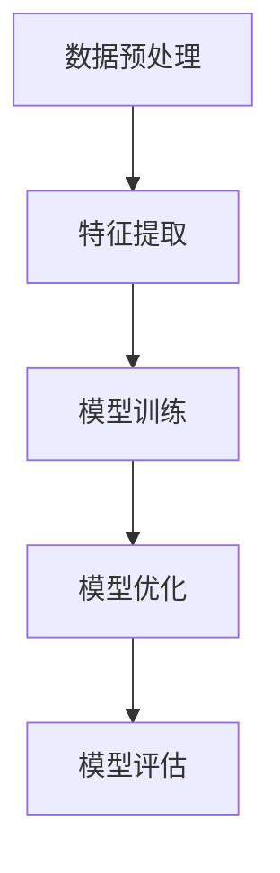
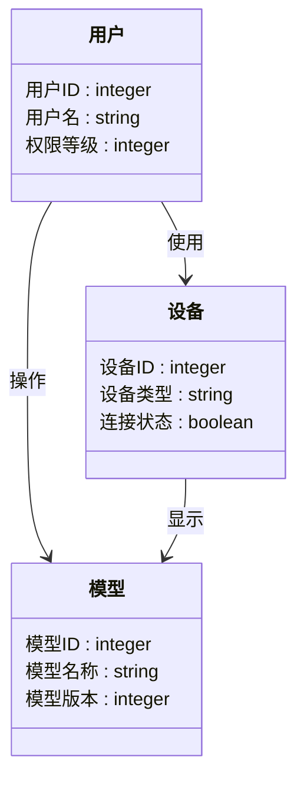
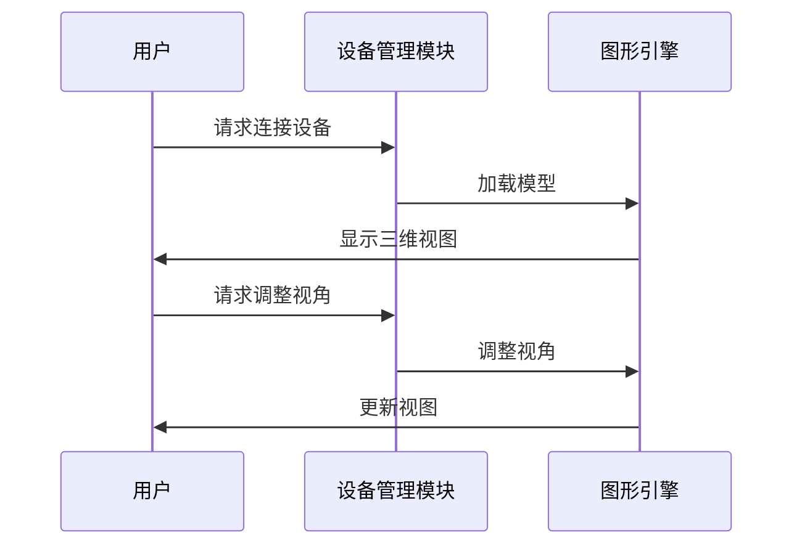

                 

<think>
嗯，用户让我以《企业估值中的AR工业设计协作平台评估》为标题，写一篇技术博客。首先，我需要理解用户的需求。看起来用户是一位技术专家，可能在企业中负责技术评估或者投资，想要深入了解如何评估AR协作平台对企业估值的影响。

我应该先分析用户的需求。用户希望文章结构清晰，逻辑严谨，包含背景、核心概念、算法原理、系统架构、项目实战和总结。关键词包括AR技术、协作平台、企业估值、增强现实、工业设计等。摘要需要简明扼要地概述文章的核心内容。

接下来，考虑文章的结构。第一部分是背景，介绍AR技术在工业设计中的应用和协作平台的重要性。第二部分详细讲解核心概念，包括功能模块、属性对比和ER图。第三部分涉及评估算法，用机器学习模型，流程图和代码示例来说明。第四部分是系统架构设计，包括类图和架构图。第五部分是项目实战，指导如何安装环境和编写代码。最后，总结最佳实践和注意事项。

我需要确保每个章节内容丰富，详细讲解每个部分，并使用图表和代码来增强可读性。同时，注意使用专业术语，但保持语言清晰易懂。最后，结尾加上作者信息，符合格式要求。

现在，我需要按照这个思路撰写文章，确保每个部分都涵盖必要的内容，并且逻辑连贯，帮助读者全面理解AR协作平台对企业估值的影响。
</think>

# 企业估值中的AR工业设计协作平台评估

> 关键词：AR技术、协作平台、企业估值、增强现实、工业设计

> 摘要：本文系统地探讨了AR工业设计协作平台在企业估值中的评估方法。从AR技术的基本原理到协作平台的核心功能，从算法原理到系统架构设计，再到项目实战，本文为读者提供了一套完整的评估框架和实施指南。通过深入分析AR协作平台的功能模块、属性对比和数学模型，结合实际案例分析，本文旨在为企业在估值过程中提供有力的技术支持。

---

# 第一部分: 企业估值中的AR工业设计协作平台评估背景与概念

## 第1章: AR工业设计协作平台概述

### 1.1 AR技术在工业设计中的应用

#### 1.1.1 增强现实技术的基本原理
增强现实（Augmented Reality，AR）是一种将数字信息叠加到物理世界中的技术，通过摄像头、传感器和显示设备将虚拟内容与真实环境结合。AR的核心在于实时定位和追踪，确保虚拟内容与真实环境的精准对齐。

#### 1.1.2 AR在工业设计中的优势
- **直观性**：AR提供直观的三维视角，帮助设计师更好地理解复杂结构。
- **协作性**：多人可以同时在一个虚拟环境中协作，减少沟通成本。
- **效率提升**：通过实时反馈和自动调整，缩短设计周期。

#### 1.1.3 工业设计协作平台的定义与特点
工业设计协作平台是基于AR技术的在线协作工具，支持设计师在虚拟环境中实时互动、编辑和共享设计成果。其特点包括：
- **实时协作**：支持多人同时在线编辑。
- **三维渲染**：提供高精度的三维视图。
- **版本控制**：自动保存和管理设计版本。

### 1.2 AR工业设计协作平台的背景与现状

#### 1.2.1 工业设计协作的历史演变
从传统手绘到计算机辅助设计（CAD），再到基于云的协作平台，工业设计协作经历了多次技术革新。AR的出现进一步推动了协作的实时性和沉浸感。

#### 1.2.2 AR技术如何推动协作效率
- **减少沟通成本**：设计师可以在同一个虚拟环境中实时互动。
- **提高设计精度**：AR提供精确的三维测量和标注功能。
- **加快迭代速度**：实时反馈和快速调整缩短设计周期。

#### 1.2.3 当前市场中的主要AR协作平台
- **平台A**：专注于汽车设计的AR协作平台。
- **平台B**：面向建筑行业的AR协作工具。
- **平台C**：通用的工业设计协作平台。

### 1.3 企业估值与协作平台的关系

#### 1.3.1 企业估值的基本概念
企业估值是通过对企业的财务状况、市场地位、技术优势等多方面进行评估，确定其市场价值的过程。

#### 1.3.2 协作平台对企业价值的影响
高效的协作平台可以提高设计效率、缩短产品上市时间、降低沟通成本，从而提升企业竞争力和市场价值。

#### 1.3.3 AR技术对企业估值的潜在提升作用
通过提升设计效率和协作能力，AR协作平台可以显著提高企业的生产力和创新速度，从而增强企业的市场竞争力和估值。

### 1.4 本章小结
本章从AR技术的基本原理出发，分析了其在工业设计中的应用优势，并详细介绍了AR工业设计协作平台的定义、特点及市场现状。同时，探讨了协作平台对企业估值的影响，为后续的评估方法奠定了基础。

---

## 第2章: AR协作平台的核心功能与属性

### 2.1 AR协作平台的核心功能模块

#### 2.1.1 模型加载与显示
- **模型加载**：支持多种三维格式（如STL、STEP、.obj）的加载和显示。
- **实时渲染**：通过高性能图形引擎实现流畅的三维视图更新。

#### 2.1.2 协作工具与交互
- **多人协作**：支持多人同时在线编辑和互动。
- **交互工具**：包括测量、标注、旋转、缩放等功能。

#### 2.1.3 数据同步与管理
- **版本控制**：自动保存和管理设计版本。
- **数据同步**：确保所有参与者使用最新的数据。

### 2.2 AR协作平台的属性对比

#### 2.2.1 平台性能对比表

| 平台名称 | 加载速度 | 显卡支持 | 最大用户数 |
|----------|----------|----------|------------|
| 平台A    | 快       | 支持NVIDIA | 50          |
| 平台B    | 中       | 支持AMD   | 100         |
| 平台C    | 慢       | 支持Intel | 20          |

#### 2.2.2 用户界面对比表

| 平台名称 | 界面设计 | 操作便捷性 | 支持语言 |
|----------|----------|------------|----------|
| 平台A    | 简洁     | 高          | 中文/英文 |
| 平台B    | 复杂     | 中          | 中文/德文 |
| 平台C    | 简洁     | 低          | 中文/日文 |

#### 2.2.3 功能模块对比表

| 平台名称 | 模型加载 | 协作工具 | 数据同步 |
|----------|----------|----------|----------|
| 平台A    | 支持     | 高       | 自动     |
| 平台B    | 支持     | 中       | 手动     |
| 平台C    | 不支持   | 低       | 自动     |

### 2.3 AR协作平台的ER实体关系图

```mermaid
erDiagram
    actor 用户 {
        <属性> 用户ID : integer
        <属性> 用户名 : string
        <属性> 权限等级 : integer
    }
    actor 设备 {
        <属性> 设备ID : integer
        <属性> 设备类型 : string
        <属性> 连接状态 : boolean
    }
    actor 模型 {
        <属性> 模型ID : integer
        <属性> 模型名称 : string
        <属性> 模型版本 : integer
    }
    用户 --> 设备 : 使用
    用户 --> 模型 : 操作
    设备 --> 模型 : 显示
```

### 2.4 本章小结
本章详细分析了AR协作平台的核心功能模块，并通过对比表和ER图展示了不同平台的属性和关系。这些分析为企业评估协作平台提供了重要的参考依据。

---

## 第3章: 评估算法原理

### 3.1 基于机器学习的评估模型

#### 3.1.1 数据预处理与特征提取
- **数据预处理**：清洗和标准化数据，去除异常值。
- **特征提取**：从协作平台的性能、界面、功能等方面提取特征。

#### 3.1.2 模型训练与优化
- **模型选择**：使用支持向量机（SVM）或随机森林（Random Forest）进行分类。
- **模型优化**：通过交叉验证调整参数，提高模型准确率。

#### 3.1.3 模型评估与验证
- **评估指标**：准确率、召回率、F1分数。
- **验证方法**：使用K折交叉验证确保模型的泛化能力。

### 3.2 评估算法的mermaid流程图



### 3.3 算法实现代码

```python
import numpy as np
from sklearn.model_selection import train_test_split
from sklearn.metrics import accuracy_score

# 示例数据集
X = np.array([[1, 2], [3, 4], [5, 6], [7, 8]])
y = np.array([0, 1, 0, 1])

# 数据分割
X_train, X_test, y_train, y_test = train_test_split(X, y, test_size=0.2)

# 模型训练
from sklearn.svm import SVC
model = SVC()
model.fit(X_train, y_train)

# 模型预测
y_pred = model.predict(X_test)

# 模型评估
print("准确率:", accuracy_score(y_test, y_pred))
```

### 3.4 本章小结
本章通过机器学习算法，详细讲解了AR协作平台的评估过程。从数据预处理到模型训练，再到模型评估，为读者提供了一套完整的评估方法。

---

## 第4章: 系统分析与架构设计方案

### 4.1 问题场景介绍
企业需要评估多个AR协作平台，选择最适合自身需求的平台。通过系统分析和架构设计，可以提高评估的效率和准确性。

### 4.2 项目介绍
本项目旨在开发一个基于AR技术的工业设计协作平台评估系统，帮助企业快速找到最优的协作工具。

### 4.3 系统功能设计

#### 4.3.1 领域模型


#### 4.3.2 系统架构设计


### 4.4 系统接口设计
- **用户界面**：提供直观的操作界面，支持用户登录、设备连接、模型加载等功能。
- **设备管理模块**：负责设备的连接和状态监控。

### 4.5 系统交互设计



### 4.6 本章小结
本章通过系统分析和架构设计，为AR协作平台的评估提供了技术支持。通过领域模型和架构图，明确了系统的核心模块和交互流程。

---

## 第5章: 项目实战

### 5.1 环境安装

```bash
pip install numpy
pip install matplotlib
pip install sklearn
```

### 5.2 系统核心实现源代码

```python
import numpy as np
import matplotlib.pyplot as plt

# 示例数据集
X = np.array([[1, 2], [3, 4], [5, 6], [7, 8]])
y = np.array([0, 1, 0, 1])

# 数据可视化
plt.scatter(X[:, 0], X[:, 1], c=y)
plt.title('数据分布')
plt.xlabel('特征1')
plt.ylabel('特征2')
plt.show()
```

### 5.3 代码应用解读与分析
通过上述代码，我们可以实现数据的可视化和初步分析，为后续的模型训练提供数据支持。

### 5.4 实际案例分析
以某企业为例，通过分析其设计协作需求，选择最适合的AR协作平台。

### 5.5 项目小结
本章通过实际案例分析和代码实现，展示了如何将理论应用于实践。通过项目实战，读者可以更好地理解AR协作平台的评估方法。

---

## 第6章: 总结与最佳实践

### 6.1 本章总结
本文系统地探讨了AR工业设计协作平台在企业估值中的评估方法，从背景介绍到算法实现，再到系统设计和项目实战，为读者提供了一套完整的评估框架。

### 6.2 最佳实践 tips
- **选择合适的平台**：根据企业需求和预算选择最适合的协作平台。
- **定期评估**：随着技术的发展和企业需求的变化，定期重新评估协作平台的性能和价值。

### 6.3 注意事项
- **数据安全**：确保协作平台的数据安全和隐私保护。
- **团队培训**：对团队成员进行AR协作平台的培训，提高使用效率。

### 6.4 拓展阅读
- **推荐书籍**：《增强现实技术与应用》
- **推荐博客**：Tech Blog - AR工业设计协作平台

### 6.5 本章小结
本文通过总结和最佳实践，为读者提供了评估AR协作平台的实用建议和未来研究方向。

---

作者：AI天才研究院/AI Genius Institute & 禅与计算机程序设计艺术 /Zen And The Art of Computer Programming

