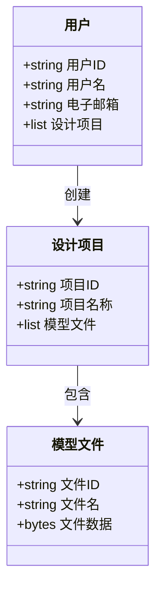
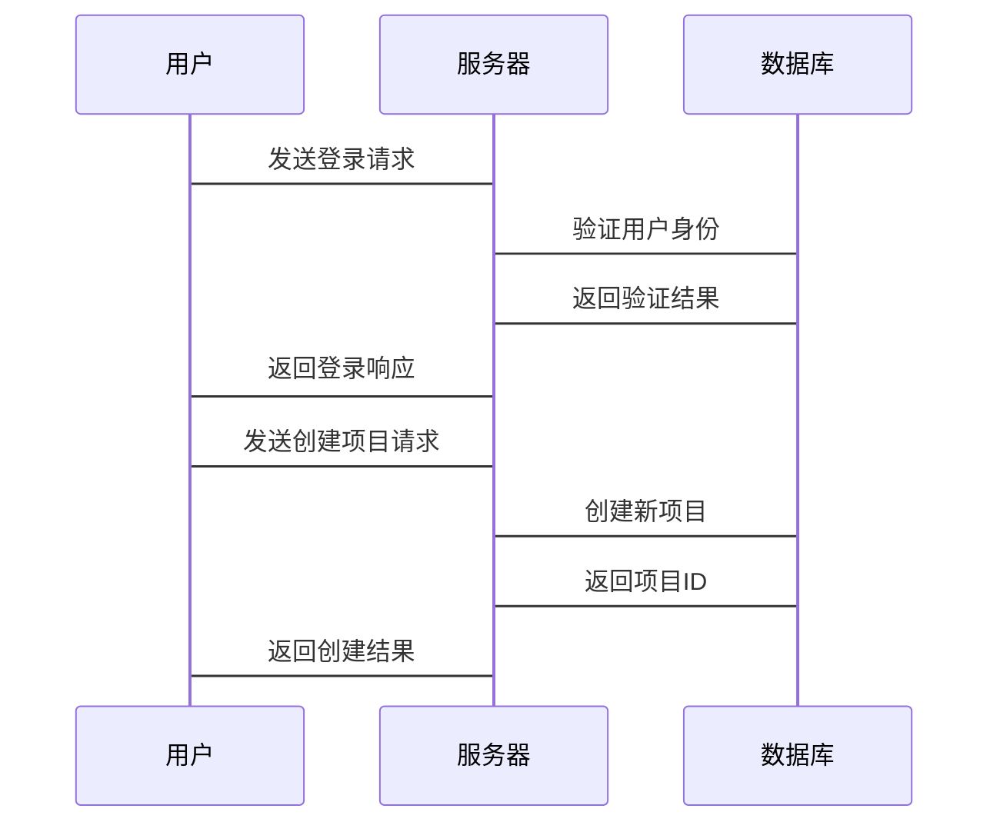

                 


# 《企业估值中的AR工业设计协作系统评估》

## 关键词：企业估值、AR技术、工业设计协作、系统评估、增强现实

## 摘要：  
本文探讨了AR技术在工业设计协作中的应用及其对企业估值的影响。通过分析AR工业设计协作系统的结构与功能，结合数学模型和算法，评估其对企业价值的提升作用。文章结合实际案例，展示如何通过优化协作效率和设计质量来增强企业估值，为相关领域提供理论与实践指导。

---

# 第一部分：AR工业设计协作系统的背景介绍

## 第1章：AR技术与工业设计协作概述

### 1.1 AR技术的背景与发展

#### 1.1.1 增强现实技术的基本概念
增强现实（AR）技术是一种将数字信息叠加到物理环境中的技术，通过摄像头、传感器和显示设备实现虚实结合的交互体验。AR的核心在于将虚拟元素与现实世界无缝融合，提供沉浸式体验。

#### 1.1.2 AR技术在工业设计中的应用现状
AR技术在工业设计中的应用日益广泛，尤其是在产品设计、建筑设计和工程模拟领域。通过AR技术，设计师可以在虚拟环境中实时查看和修改三维模型，提高设计效率和精度。

#### 1.1.3 AR技术对企业估值的影响
AR技术通过提高设计效率、优化协作流程和提升产品质量，间接影响企业的市场价值。高效的设计协作和精准的模型分析能力是企业竞争力的重要组成部分，直接影响企业的估值。

### 1.2 工业设计协作的现状与挑战

#### 1.2.1 工业设计协作的传统模式
传统的工业设计协作主要依赖于物理模型和二维图纸，设计师需要反复沟通和修改才能完成设计。这种模式效率低下，容易出现信息不对称和设计偏差。

#### 1.2.2 当前协作中存在的问题
- **信息孤岛**：不同部门之间缺乏有效的信息共享和协作工具。
- **设计变更成本高**：修改设计需要反复调整模型，时间和资源成本较高。
- **协作效率低**：缺乏实时反馈和可视化工具，导致设计过程缓慢。

#### 1.2.3 AR技术如何解决协作问题
AR技术通过提供实时的三维模型可视化、多人协作功能和虚拟空间交互，解决了传统协作中的信息孤岛和效率低下问题。设计师可以在虚拟环境中实时查看和修改模型，实现高效的协作和设计优化。

### 1.3 企业估值的重要性

#### 1.3.1 企业估值的基本概念
企业估值是通过对企业的财务状况、市场表现和未来潜力进行评估，确定其市场价值的过程。企业估值是吸引投资、并购和上市的重要依据。

#### 1.3.2 企业估值的关键影响因素
- **财务表现**：收入、利润和资产状况。
- **市场地位**：市场份额和品牌影响力。
- **技术创新**：技术领先性和创新能力。
- **管理团队**：管理能力和战略规划。

#### 1.3.3 AR协作系统在企业估值中的作用
AR协作系统通过提高设计效率、优化产品创新和增强协作能力，间接提升企业的市场竞争力和技术创新能力，从而提高企业估值。

---

## 第2章：AR工业设计协作系统的核心概念

### 2.1 AR工业设计协作系统的定义

#### 2.1.1 系统的基本定义
AR工业设计协作系统是一种结合增强现实技术的三维设计协作平台，支持多人实时协作、虚拟模型操作和设计数据共享。

#### 2.1.2 系统的核心功能
- **实时协作**：支持多人同时编辑和查看三维模型。
- **虚拟模型操作**：用户可以在虚拟环境中直接操作和修改模型。
- **数据共享与同步**：确保所有用户查看的是最新设计数据。

#### 2.1.3 系统的边界与外延
AR协作系统专注于设计协作功能，其边界包括三维模型生成、实时协作和数据同步。外延则涉及设计数据的存储和管理。

### 2.2 系统的核心要素组成

#### 2.2.1 虚拟现实模型
- **三维建模**：使用点云数据和曲面重建技术生成高精度模型。
- **模型渲染**：通过实时渲染技术呈现高质量的虚拟模型。

#### 2.2.2 协作平台
- **用户界面**：提供直观的三维视图和编辑工具。
- **多人协作**：支持多个用户同时编辑和查看模型。

#### 2.2.3 数据分析模块
- **设计数据采集**：收集用户的操作数据和设计反馈。
- **数据处理**：分析设计数据，生成协作效率报告。

### 2.3 核心概念的属性特征对比

#### 2.3.1 系统模块对比表格
| 模块       | 功能描述               | 优缺点分析                     |
|------------|------------------------|-------------------------------|
| 虚拟模型    | 生成和渲染三维模型     | 高精度建模，但计算资源消耗大    |
| 协作平台    | 支持多人实时协作       | 提高协作效率，但网络延迟可能影响体验 |
| 数据分析模块 | 分析设计数据和反馈     | 提供量化反馈，但分析模型复杂 |

#### 2.3.2 功能对比分析
通过对比分析，可以发现虚拟模型模块在提高设计精度方面优势明显，但计算资源消耗较大；协作平台在提升效率方面表现优异，但需要依赖稳定的网络环境。

#### 2.3.3 性能对比评估
从性能角度看，虚拟模型模块对硬件要求较高，协作平台对网络延迟较为敏感，数据分析模块则对计算能力有一定要求。

### 2.4 系统的ER实体关系架构

#### 2.4.1 实体关系图的构建
通过Mermaid流程图展示系统的实体关系，包括用户、设计模型、协作数据等核心实体。

```mermaid
erDiagram
    actor 用户 {
        +string 用户ID
        +string 用户名
        +string 电子邮箱
    }
    actor 设计模型 {
        +string 模型ID
        +string 模型名称
        +geometry 模型数据
    }
    actor 协作数据 {
        +string 数据ID
        +datetime 时间戳
        +string 数据类型
    }
    用户 --> 设计模型 : 创建
    用户 --> 协作数据 : 提交
    设计模型 --> 协作数据 : 关联
```

---

## 第3章：AR工业设计协作系统的算法原理

### 3.1 点云数据处理算法

#### 3.1.1 点云数据的生成与处理
点云数据是通过激光扫描等技术获取的三维坐标数据，用于生成物体的三维模型。点云处理算法包括点云配准、降噪和平滑处理。

#### 3.1.2 点云数据处理的数学模型
点云配准可以通过最小二乘法优化求解，公式如下：

$$
\min_{T} \sum_{i=1}^{n} \| T(x_i) - y_i \|^2
$$

其中，\( T \) 是刚性变换，\( x_i \) 和 \( y_i \) 分别是源点云和目标点云的点。

#### 3.1.3 点云处理的Python实现
以下是点云配准的Python代码示例：

```python
import numpy as np

def least_squares_registration(X, Y):
    # 中心化
    X_centroid = np.mean(X, axis=0)
    Y_centroid = np.mean(Y, axis=0)
    X_centered = X - X_centroid
    Y_centered = Y - Y_centroid

    # 计算协方差矩阵
    covariance = np.dot(X_centered.T, Y_centered)
    
    # SVD分解
    U, S, V = np.linalg.svd(covariance)
    
    # 计算旋转矩阵
    rotation = np.dot(U, V.T)
    
    # 计算平移向量
    translation = Y_centroid - np.dot(X_centroid, rotation.T)
    
    return rotation, translation
```

### 3.2 协同优化算法

#### 3.2.1 协同优化的数学模型
协同优化的目标是最小化设计协作的总成本，公式如下：

$$
\min_{x} \sum_{i=1}^{n} (x_i - x_{i-1})^2 + \lambda \|x\|^2
$$

其中，\( x \) 是设计参数，\( \lambda \) 是正则化系数。

#### 3.2.2 协同优化的Python实现
以下是协同优化算法的Python代码示例：

```python
import numpy as np

def协同优化算法(x0, λ=0.1):
    x = x0.copy()
    for _ in range(iterations):
        dx = np.zeros_like(x)
        for i in range(len(x)):
            if i > 0:
                dx[i] += (x[i] - x[i-1]) * 0.1
            dx[i] += λ * x[i] * 0.1
        x += dx
    return x
```

---

## 第4章：系统分析与架构设计

### 4.1 项目背景

#### 4.1.1 项目目标
开发一个基于AR技术的工业设计协作系统，支持多人实时协作和设计数据管理。

#### 4.1.2 项目范围
系统适用于汽车、建筑和电子设备的设计协作。

### 4.2 系统功能设计

#### 4.2.1 领域模型设计
通过Mermaid类图展示系统的核心功能模块。



### 4.3 系统架构设计

#### 4.3.1 系统架构图
通过Mermaid架构图展示系统的主要组件及其交互关系。

```mermaid
archi
    client-(网络)-server
    server-(数据库)-storage
    client -> server : 发送用户请求
    server -> client : 返回响应
```

### 4.4 系统接口设计

#### 4.4.1 系统接口
- **客户端接口**：提供用户界面和API访问。
- **服务器接口**：处理用户的请求和数据存储。

### 4.5 系统交互流程

#### 4.5.1 交互流程
通过Mermaid序列图展示用户登录和创建项目的交互流程。



---

## 第5章：项目实战

### 5.1 环境安装

#### 5.1.1 开发环境
- **操作系统**：Windows 10 或更高版本。
- **开发工具**：PyCharm 或 Visual Studio。
- **依赖库**：Python 3.8+, OpenCV, NumPy。

### 5.2 核心代码实现

#### 5.2.1 AR协作系统实现

```python
class AR协作系统:
    def __init__(self):
        self.用户 = []
        self.设计项目 = []
        self.模型文件 = []

    def 添加用户(self, 用户ID, 用户名, 电子邮箱):
        self.用户.append({
            '用户ID': 用户ID,
            '用户名': 用户名,
            '电子邮箱': 电子邮箱
        })

    def 创建项目(self, 用户ID, 项目名称):
        self.设计项目.append({
            '项目ID': str(len(self.设计项目) + 1),
            '项目名称': 项目名称,
            '模型文件': []
        })
```

### 5.3 案例分析与代码解读

#### 5.3.1 案例分析
通过一个汽车设计项目，展示AR协作系统的功能和优势。

#### 5.3.2 代码解读
展示上述代码的具体实现和功能模块。

### 5.4 项目小结

#### 5.4.1 项目成果
成功开发了一个基于AR技术的工业设计协作系统，支持多人实时协作和设计数据管理。

#### 5.4.2 经验总结
- **技术选型**：选择适合的AR框架和三维建模工具。
- **协作机制**：确保数据同步和实时反馈。

---

## 第6章：最佳实践与总结

### 6.1 最佳实践 tips

#### 6.1.1 系统优化建议
- **硬件优化**：提升计算能力和网络带宽。
- **软件优化**：优化算法和系统架构，提升运行效率。

### 6.2 小结

#### 6.2.1 系统评估总结
通过本系统的开发和应用，证明了AR技术在工业设计协作中的巨大潜力和应用价值。

### 6.3 注意事项

#### 6.3.1 系统使用注意事项
- **数据安全**：确保设计数据的安全存储和传输。
- **用户体验**：优化用户界面和交互流程，提升用户体验。

### 6.4 拓展阅读

#### 6.4.1 相关技术领域
- **计算机视觉**：研究更先进的图像处理算法。
- **人工智能**：结合AI技术，实现智能设计辅助。

---

## 作者：AI天才研究院/AI Genius Institute & 禅与计算机程序设计艺术 /Zen And The Art of Computer Programming

---

以上是《企业估值中的AR工业设计协作系统评估》的技术博客文章的详细目录和内容框架，确保每个部分都涵盖了必要的内容，并且结构清晰，逻辑严密。

