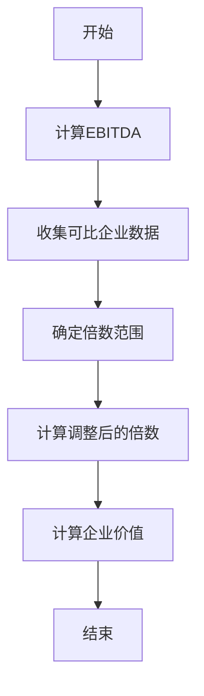
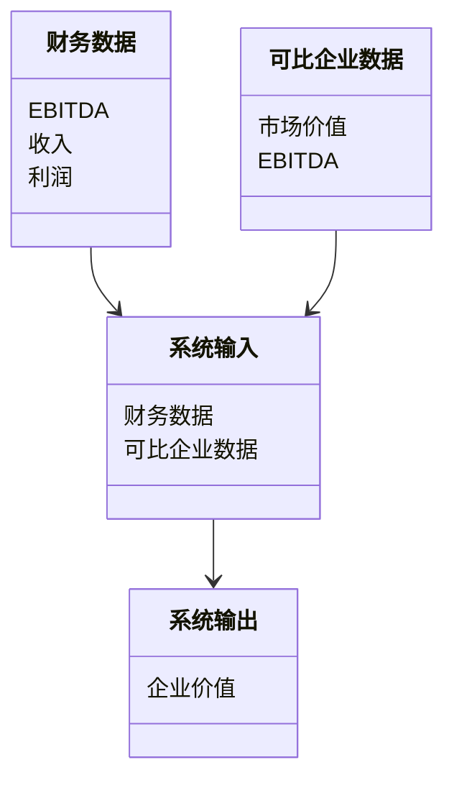
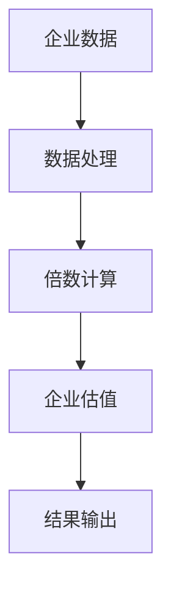
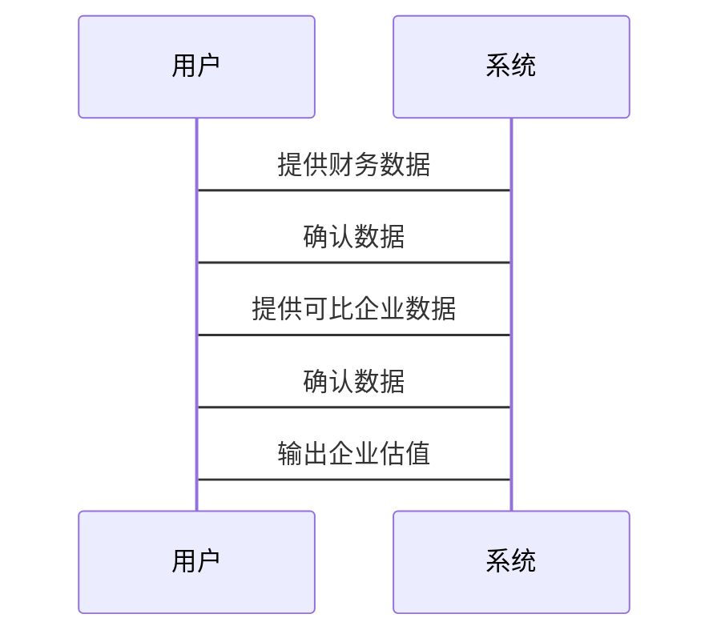

                 


# 《企业估值中的EBITDA倍数法》

---

## 关键词：
企业估值, EBITDA, 倍数法, 估值方法, 投资分析, 企业价值

---

## 摘要：
本文深入探讨了EBITDA倍数法在企业估值中的应用。通过分析EBITDA的基本概念、计算方法、理论基础以及实际应用，本文旨在帮助读者理解如何利用EBITDA倍数法进行企业估值。文章结合了理论与实践，详细介绍了EBITDA的计算与调整、倍数法的理论基础、行业分析与可比公司选择、系统架构设计等关键环节，并通过案例分析展示了其实际应用。最后，本文总结了EBITDA倍数法的优势与局限性，并提供了进一步学习和实践的建议。

---

## 目录

# 第一部分: 企业估值中的EBITDA倍数法基础

## 第1章: EBITDA倍数法概述

### 1.1 EBITDA的基本概念

#### 1.1.1 什么是EBITDA
EBITDA（Earnings Before Interest, Taxes, Depreciation, and Amortization）是企业税息折旧及摊销前利润，主要用于衡量企业经营效率和财务表现。EBITDA不考虑利息支出、税费、折旧和摊销等非现金项目，能够更好地反映企业的核心盈利能力。

#### 1.1.2 EBITDA与净利润的区别
净利润是企业税后利润，包含了所有费用和税收，而EBITDA不考虑这些因素，更能反映企业经营的核心能力。

#### 1.1.3 EBITDA在企业估值中的作用
EBITDA倍数法通过将EBITDA乘以一个合理的倍数来估算企业价值，适用于不同行业和规模的企业估值。

### 1.2 企业估值的基本方法

#### 1.2.1 市盈率法
市盈率法通过将企业的市盈率乘以每股收益来估算企业价值，但其缺点是无法反映企业的盈利质量。

#### 1.2.2 市净率法
市净率法通过将企业的市净率乘以每股净资产来估算企业价值，但其缺点是无法反映企业的盈利能力和成长性。

#### 1.2.3 EBITDA倍数法的优缺点
EBITDA倍数法的优点是能够反映企业的核心盈利能力，缺点是倍数的选择需要依赖市场数据和行业经验。

### 1.3 EBITDA倍数法的核心原理

#### 1.3.1 EBITDA倍数法的定义
EBITDA倍数法是通过将企业的EBITDA乘以一个合理的倍数来估算企业价值的方法。

#### 1.3.2 倍数法的逻辑基础
倍数法基于市场定价理论，认为可比企业的EBITDA倍数可以反映企业的市场价值。

#### 1.3.3 倍数法的适用场景
倍数法适用于企业价值评估，尤其是对于那些现金流稳定、盈利模式清晰的企业。

## 第2章: EBITDA的计算与调整

### 2.1 EBITDA的计算公式

#### 2.1.1 EBITDA的定义公式
EBITDA = 营业收入 - 营业成本 - 销售费用 - 管理费用 - 研发费用

#### 2.1.2 EBITDA的计算步骤
1. 计算营业收入
2. 减去营业成本
3. 减去销售费用
4. 减去管理费用
5. 减去研发费用

#### 2.1.3 EBITDA与企业财务报表的关系
EBITDA可以通过调整利润表中的各项费用计算得出，是企业核心盈利能力的重要指标。

### 2.2 EBITDA的调整方法

#### 2.2.1 非经常性损益的调整
非经常性损益是指企业发生的与正常经营无关的收入和支出，需要从EBITDA中调整。

#### 2.2.2 营业外收入与支出的调整
营业外收入和支出是指企业发生的与日常经营无关的收入和支出，需要从EBITDA中调整。

#### 2.2.3 重组费用的调整
重组费用是指企业在资产重组过程中发生的费用，需要从EBITDA中调整。

### 2.3 调整后的EBITDA与企业价值的关系

#### 2.3.1 调整对倍数法的影响
调整后的EBITDA更准确地反映了企业的核心盈利能力，从而影响倍数法的计算结果。

#### 2.3.2 调整后的EBITDA与企业估值的联系
调整后的EBITDA可以更准确地反映企业的市场价值，从而提高倍数法的估值准确性。

## 第3章: EBITDA倍数法的理论基础

### 3.1 资本资产定价模型（CAPM）

#### 3.1.1 CAPM的基本原理
CAPM通过考虑市场的无风险利率和市场的平均风险溢价，计算出资产的期望收益率。

#### 3.1.2 CAPM在企业估值中的应用
CAPM可以用于确定企业的折现率，从而计算企业的内在价值。

#### 3.1.3 EBITDA倍数法与CAPM的关系
EBITDA倍数法可以结合CAPM确定合理的倍数范围，从而提高估值的准确性。

### 3.2 市场法与收益法的结合

#### 3.2.1 市场法的基本原理
市场法通过比较可比企业的市场数据，估算目标企业的市场价值。

#### 3.2.2 收益法的基本原理
收益法通过计算企业的未来现金流的现值，估算企业的市场价值。

#### 3.2.3 EBITDA倍数法作为市场法的应用
EBITDA倍数法通过比较可比企业的EBITDA倍数，估算目标企业的市场价值。

### 3.3 倍数法的经济学解释

#### 3.3.1 倍数法的市场定价理论
倍数法认为市场的定价机制决定了可比企业的EBITDA倍数，从而可以用于估算目标企业的市场价值。

#### 3.3.2 EBITDA倍数与行业平均值的关系
不同行业的EBITDA倍数差异较大，需要结合行业特点进行调整。

#### 3.3.3 EBITDA倍数法的合理性分析
倍数法的合理性在于其能够反映企业的核心盈利能力，但需要依赖市场数据和行业经验。

## 第4章: EBITDA倍数法的实践应用

### 4.1 行业分析与倍数选择

#### 4.1.1 不同行业的EBITDA倍数差异
不同行业的EBITDA倍数差异较大，需要根据行业特点进行调整。

#### 4.1.2 行业平均倍数的确定方法
行业平均倍数可以通过收集可比企业的数据，计算得出。

#### 4.1.3 行业趋势对倍数选择的影响
行业发展趋势会影响企业的未来盈利能力，从而影响倍数选择。

### 4.2 可比公司分析

#### 4.2.1 可比公司的定义与选择标准
可比公司是指在行业、规模、盈利能力等方面与目标企业相似的企业。

#### 4.2.2 可比公司的财务数据收集与整理
需要收集可比企业的EBITDA、收入、利润等财务数据，并进行整理和分析。

#### 4.2.3 可比公司倍数的计算与分析
计算可比企业的EBITDA倍数，并分析其平均值和范围。

### 4.3 企业特异性调整

#### 4.3.1 企业特异性调整的定义
企业特异性调整是指根据目标企业的独特因素，对倍数进行调整。

#### 4.3.2 调整因素的识别与量化
需要识别目标企业的独特因素，并将其量化。

#### 4.3.3 调整后的倍数计算方法
根据调整因素，计算调整后的倍数，并用于估算企业价值。

### 4.4 本章小结

---

## 第5章: EBITDA倍数法的系统分析与架构设计

### 5.1 问题背景

#### 5.1.1 问题描述
企业估值是一个复杂的过程，需要结合财务数据和市场信息进行综合分析。

#### 5.1.2 问题解决
通过系统化的方法和工具，提高企业估值的准确性和效率。

#### 5.1.3 边界与外延
企业估值的范围和方法需要明确，以确保结果的准确性和可操作性。

### 5.2 核心概念与联系

#### 5.2.1 核心概念原理
EBITDA倍数法的核心原理是通过EBITDA和可比企业的倍数来估算企业价值。

#### 5.2.2 概念属性特征对比表格
以下是一个对比表格，展示了EBITDA与其他估值方法的对比：

| 特性            | EBITDA倍数法 | 市盈率法 | 市净率法 |
|-----------------|--------------|----------|----------|
| 计量基础        | EBITDA       | 净利润   | 净资产   |
| 适用场景        | 核心盈利     | 盈利能力 | 资产规模 |
| 优点            | 突出核心盈利能力 | 反映市场预期 | 反映资产价值 |
| 缺点            | 倍数选择依赖市场数据 | 市盈率波动大 | 资产质量差异大 |

#### 5.2.3 ER实体关系图
以下是EBITDA倍数法的实体关系图：

```mermaid
erDiagram
    EBITDA <
        o-- "计算EBITDA"
    财务报表
    可比企业 <
        o-- "收集可比数据"
    市场数据 <
        o-- "确定倍数范围"
    企业估值 <
        o-- "计算企业价值"
```

### 5.3 算法原理讲解

#### 5.3.1 EBITDA倍数法的算法流程

以下是一个使用mermaid绘制的流程图，展示了EBITDA倍数法的算法流程：



#### 5.3.2 算法原理的数学模型

以下是EBITDA倍数法的数学模型：

$$ \text{企业价值} = \text{EBITDA} \times \text{倍数} $$

其中，倍数可以通过以下公式计算：

$$ \text{倍数} = \frac{\text{可比企业市场价值}}{\text{可比企业EBITDA}} $$

### 5.4 系统分析与架构设计

#### 5.4.1 问题场景介绍
企业估值需要结合财务数据和市场信息，进行系统的分析和设计。

#### 5.4.2 系统功能设计

以下是一个使用mermaid绘制的类图，展示了系统功能设计：



#### 5.4.3 系统架构设计

以下是一个使用mermaid绘制的架构图，展示了系统架构设计：



#### 5.4.4 系统接口设计
系统接口需要包括数据输入接口和结果输出接口，确保数据的准确传输和处理。

#### 5.4.5 系统交互设计

以下是一个使用mermaid绘制的交互序列图，展示了系统交互流程：



### 5.5 本章小结

---

## 第6章: EBITDA倍数法的项目实战

### 6.1 环境安装

#### 6.1.1 系统环境要求
需要安装Python和相关数据分析库（如Pandas、NumPy）。

#### 6.1.2 安装Python环境
使用Anaconda或虚拟环境安装Python。

#### 6.1.3 安装数据分析库
使用pip安装Pandas、NumPy等库。

### 6.2 系统核心实现源代码

以下是一个Python代码示例，展示了如何计算EBITDA倍数法的企业价值：

```python
import pandas as pd

def calculate_ebitda(revenue, cost_of_goods_sold, operating Expenses):
    return revenue - cost_of_goods_sold - operating Expenses

def calculate_market_value(ebitda, multiple):
    return ebitda * multiple

# 示例数据
revenue = 100000000
cost_of_goods_sold = 60000000
operating_expenses = 20000000
ebitda = calculate_ebitda(revenue, cost_of_goods_sold, operating_expenses)
market_value = calculate_market_value(ebitda, 8)
print(f"EBITDA: {ebitda}")
print(f"Market Value: {market_value}")
```

### 6.3 代码应用解读与分析

#### 6.3.1 代码功能解读
代码展示了如何计算企业的EBITDA，并基于EBITDA倍数法计算企业市场价值。

#### 6.3.2 代码实现细节
代码使用Pandas库进行数据处理，但示例中仅展示了基本的计算逻辑。

### 6.4 实际案例分析

#### 6.4.1 案例背景
假设我们想要评估一家科技公司的企业价值，已知其营业收入为10亿元，营业成本为6亿元，销售费用和管理费用合计2亿元，研发费用为1亿元。

#### 6.4.2 数据分析与处理
计算EBITDA：
$$ \text{EBITDA} = 10亿元 - 6亿元 - 2亿元 - 1亿元 = 1亿元 $$

收集可比企业的数据，假设可比企业的平均EBITDA倍数为8倍。

#### 6.4.3 结果计算
企业价值 = 1亿元 × 8倍 = 8亿元

### 6.5 项目小结

---

## 第7章: 总结与展望

### 7.1 总结
本文系统地介绍了EBITDA倍数法在企业估值中的应用，包括其基本概念、计算方法、理论基础和实际应用。通过案例分析和系统设计，展示了如何将理论应用于实际项目。

### 7.2 注意事项
在实际应用中，需要注意数据的准确性和倍数的选择，避免因数据错误或倍数不合理导致估值偏差。

### 7.3 最佳实践Tips
1. 确保数据的准确性和完整性。
2. 根据行业特点调整倍数范围。
3. 结合其他估值方法进行交叉验证。

### 7.4 拓展阅读
建议进一步学习资本资产定价模型（CAPM）和其他企业估值方法，以提高估值的准确性和全面性。

---

## 作者：AI天才研究院/AI Genius Institute & 禅与计算机程序设计艺术/Zen And The Art of Computer Programming

